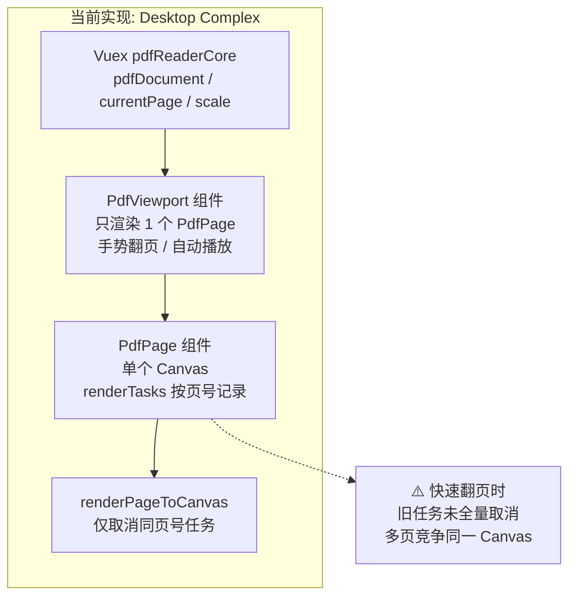
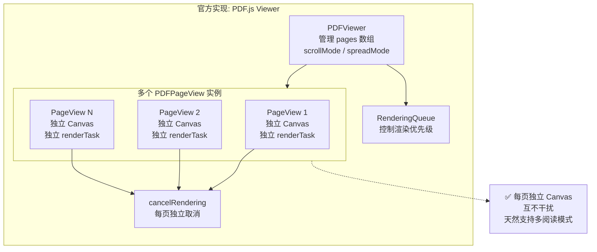
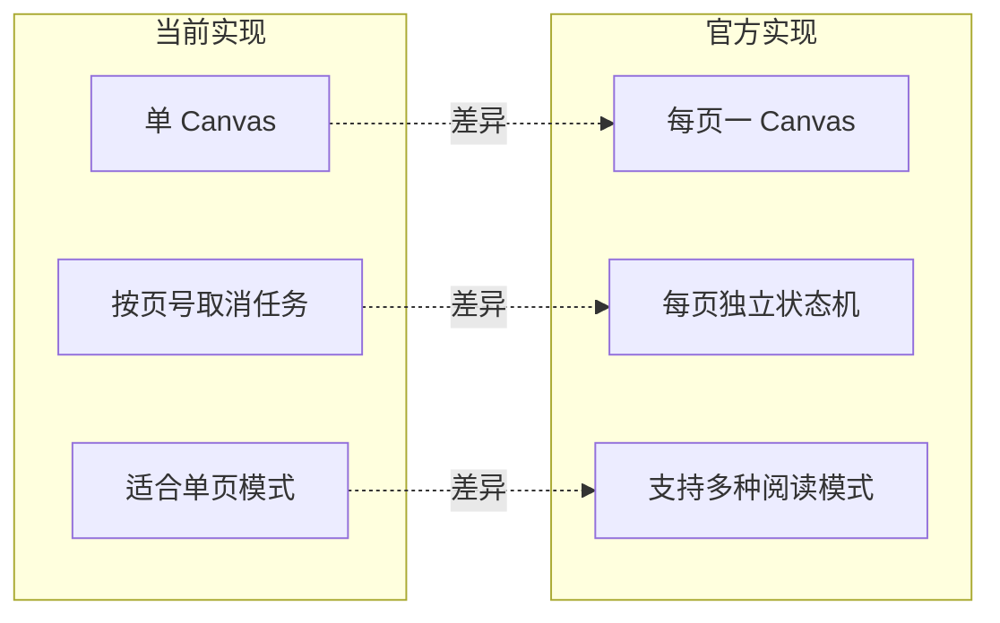

## 页面渲染结构对比：当前实现 vs 官方 pdf.js Viewer

> 版本说明：本文基于 `examples/web-vue2/src/components/pdf` 与 `web/` 目录的源码整理。

本文梳理当前 Vue2 版 PDF 组件与官方 pdf.js Viewer 在「页面渲染结构」上的差异，作为后续重构和扩展阅读模式的参考。

---

## 一、当前 Desktop Complex 实现结构

**相关文件**

- `examples/web-vue2/src/components/pdf/core/pdf-utils.js`
- `examples/web-vue2/src/components/pdf/core/store/index.js`（Vuex：`pdfReaderCore`）
- `examples/web-vue2/src/components/pdf/desktop/complex/components/pdfReaderCore/index.vue`（`PdfViewport`）
- `examples/web-vue2/src/components/pdf/desktop/complex/components/pdfReaderCore/components/PdfPage.vue`（`PdfPage`）

**结构概览**

- Vuex 模块 `pdfReaderCore`
  - 状态：`pdfDocument`、`currentPage`、`scale`、`baselineScale` 等
  - 行为：`loadDocument`、`getPage`、`goToPage`、`nextPage`、`prevPage`、`setScale` 等
- `PdfViewport`
  - 作为容器组件，**只渲染一个 `<PdfPage>` 子组件**：
    - `:page-number="page"`（来自 Store 的 `currentPage`）
    - `:scale="scale"`
  - 负责：
    - 文档加载、计算适配缩放（`fitPageOnce`）
    - 手势翻页、自动播放（基于 `nextPageAction` / `prevPageAction`）
- `PdfPage`
  - 内部只有 **一个 `<canvas>`**，通过 `pageNumber` prop 复用同一个画布展示不同页。
  - data：`renderTasks`（以 `pageNumber` 为 key 的任务表）、`viewport`、`layers` 等。
  - 关键方法：
    - `renderPage()`：调用核心工具 `renderPageToCanvas`，并在完成后处理注释层等。
    - 生命周期：`mounted` 首次渲染；`watch pageNumber/scale` 重新渲染。
- 核心渲染工具 `renderPageToCanvas`
  - 入参：`getPage`、`tasks`、`pageNumber`、`canvas`、`scale`、`renderOptions`。
  - 逻辑：
    1. 先调用内部 `cancelRenderTask({ tasks, pageNumber })`：**只取消同一页号对应任务**。
    2. `getPage(pageNumber)`，计算 viewport；结合 `devicePixelRatio` 和 `maxCanvasPixels` 决定实际渲染分辨率与 `transform`。
    3. 调整 canvas 物理尺寸（`width/height`）和 CSS 尺寸（`style.width/height`）。
    4. 调用 `page.render(renderContext)`，记录到 `tasks[pageNumber]`，并在 finally 中清理对应项。

**关键特性总结**

- 架构上属于「**单 Canvas + 全局 currentPage**」模式：
  - DOM 中始终只有一个 `<PdfPage>` 与一个 `<canvas>`；
  - 通过修改 Vuex `currentPage` 来驱动展示哪一页。
- 对「单页/幻灯片模式」非常友好：
  - 手势左右滑、自动播放等体验简单直接。

---

## 二、官方 pdf.js Viewer 渲染结构

**相关文件（web/）**

- `web/pdf_page_view.js`：`PDFPageView`（单页视图）
- `web/pdf_viewer.js`：`PDFViewer`（多页容器与阅读模式）
- `web/pdf_rendering_queue.js`：渲染队列（`RenderingQueue`）

**Page 级：PDFPageView（单页视图）**

- 每一页有 **独立的 DOM 与 Canvas**：
  - `div` 容器（`this.div`）
  - `canvas`（`this.canvas`）
  - 各种 layer：text / annotation / xfa / struct tree 等
- 状态管理：
  - `this.renderTask`：当前页的 `pdfPage.render(...)` 任务
  - `this.renderingState`：`RenderingStates.INITIAL / RUNNING / PAUSED / FINISHED`
- 关键方法：
  - `draw()`：开始新一轮渲染前，会检查 `renderingState`，必要时先 `reset()`，再创建新的 `renderTask`。
  - `cancelRendering(options)`：
    - 若存在 `this.renderTask`，则调用 `this.renderTask.cancel(...)` 并清空引用；
    - 根据参数决定是否保留或销毁各类 layer；
  - `update(...)`：缩放/旋转更新时，根据渲染状态选择 CSS 变换或重绘，并在需要时主动 `cancelRendering()`。

**Viewer 级：PDFViewer（多页容器 + 阅读模式）**

- 管理一个 `pages[]: PDFPageView[]` 数组：
  - 每个元素对应文档中的一页；
  - 负责对它们调用 `draw()` 或 `update()`。
- 阅读模式相关：
  - `scrollMode`（滚动模式）：
    - `VERTICAL`：默认纵向滚动，所有页按列排布。
    - `HORIZONTAL`：横向滚动。
    - `WRAPPED`：多列包装。
    - `PAGE`：单页模式（一次只在 DOM 中挂载当前页或当前 spread）。
  - `spreadMode`（跨页模式）：
    - `NONE`：单页。
    - `ODD` / `EVEN`：双页展开，从奇/偶页开始配对。
  - `_updateScrollMode(pageNumber)` / `_updateSpreadMode(pageNumber)`：
    - 根据当前模式调整 DOM 中哪些 `pageView.div` 出现，以及它们如何分组为 `
`。
    - PAGE 模式下，会通过 `#ensurePageViewVisible()` **只把当前页（或一组）挂到 DOM**。
- 渲染队列 `RenderingQueue`：
  - 根据视口中可见的页列表，选出高优先级页，调用其 `draw()`；
  - 避免大量页同时渲染造成卡顿。

**关键特性总结**

- 架构是「**多 PageView + 每页一 Canvas + 每页自管理渲染状态**」。
- 阅读模式仅改变：
  - DOM 中挂载哪些 `pageView.div`；
  - 它们的排布方式（纵向/横向/多列/单双页）。
- 稳定性依赖：
  - 每页在开始新渲染前会先 `cancelRendering()` 或 `reset()`；
  - 渲染队列限制同时在跑的渲染任务数量。

---

## 三、当前实现 vs 官方实现：核心差异

1. **Canvas 使用模式**
   - 当前 Desktop Complex：
     - 一个 `PdfPage` 组件，内部只有一个 `<canvas>`，随着 `pageNumber` 的变化复用这个 canvas 展示不同页。
   - 官方 Viewer：
     - 每个 `PDFPageView` 都有自己的 `<canvas>`，不同页的渲染互不干扰。

2. **渲染任务的管理方式**
   - 当前：
     - `renderPageToCanvas` 的 `tasks` 参数是「按页号」记录任务：`tasks[pageNumber] = renderTask`。
     - 每次渲染前只调用 `cancelRenderTask({ pageNumber })`，**仅取消同一页号的旧任务**。
     - 在 Desktop Complex 下，由于同一个 canvas 被用于展示不同页，快速翻页时会出现：
       - 页 1 的 renderTask 还在跑，页 2、3... 的 renderTask 已经启动；
       - 多个 `page.render()` 同时在同一个 canvas 上竞争，导致「错页、倒转、背景未完全绘制」等现象。
   - 官方：
     - 每个 `PDFPageView` 自己持有 `this.renderTask`，并有完整的 `cancelRendering()` / `reset()`：
       - 在更新缩放、切换模式或滚动时，必要时会先取消旧 renderTask，再开始新渲染；
     - 因为「**一页一 canvas**」，即使快速滚动或切换模式，各页之间也不会在同一个 canvas 上互相覆盖。

3. **阅读模式扩展能力**
   - 当前 Desktop Complex：
     - 架构天然适合「单页/幻灯片模式」：一屏一个页面、手势左右切换、自动播放。
     - 若要实现「连续滚动多页同时可见」或「双页展开」，在单 canvas 架构下会比较别扭：
       - 同一 canvas 无法同时表示多个物理位置不同的页面块。
   - 官方 Viewer：
     - 通过 `scrollMode` / `spreadMode` 只是按不同方式组合/摆放多个 `PDFPageView`；
     - 多页同时可见（连续滚动 / 双页模式）都是天然支持的。

---

## 四、针对当前实现的改造建议（与本次讨论相关）

1. **修复快速翻页时的渲染竞态问题**
   - 在当前 Desktop Complex（单 canvas）架构下，最关键的一步是：
     - 在 `PdfPage.renderPage()` 开头，先对当前组件内记录的所有渲染任务做一次统一取消：
       - 调用 `cancelAllRenderTasks({ tasks: this.renderTasks })`；
       - （可选）再调用 `this.cleanup()` 清空旧画面。
   - 这样可以保证：
     - 在任意一次新的渲染启动前，这个 canvas 上不会再有旧的 renderTask 在跑；
     - 避免多个页的渲染结果互相覆盖，从而稳定页面内容与背景的呈现。

2. **未来若要扩展多阅读模式的方向**
   - 保留当前 Desktop Complex 作为「单页/播放模式」的实现：
     - 继续打磨手势翻页与自动播放体验；
     - 强调「一屏一页」的场景。
   - 若需要官方那样的「连续滚动、多列、双页展开」：
     - 建议新增一套「多 PageView + 每页一 Canvas」的 Viewer 组件：
       - `v-for` 渲染多个 `<PdfPage :page-number="n" />`，每页一个 canvas；
       - 上层组件管理 `scrollMode` / `spreadMode` 与虚拟滚动窗口；
       - 充分复用现有 Vuex 模块与 `renderPageToCanvas` 工具。

---

## 五、Mermaid 结构图

> 下图用 mermaid 形式对比当前 Desktop Complex 与官方 PDF.js Viewer 的结构。

### 当前 Desktop Complex 实现

### 官方 PDF.js Viewer 实现

### 核心差异对比

