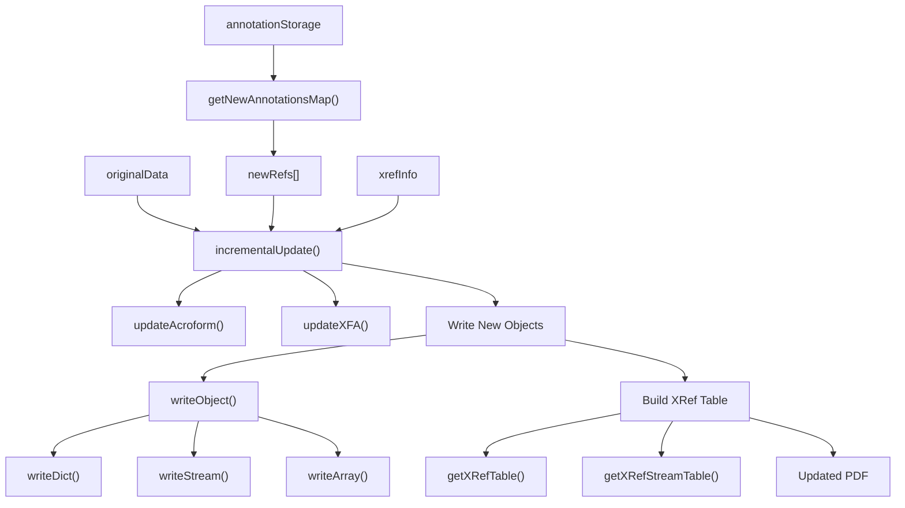
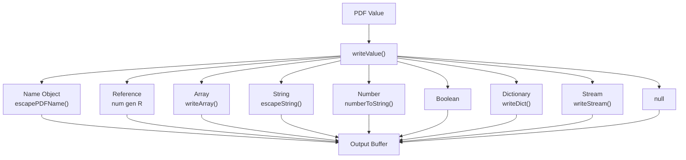
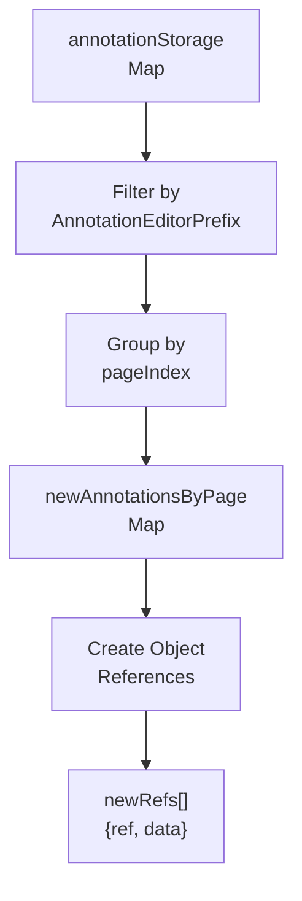
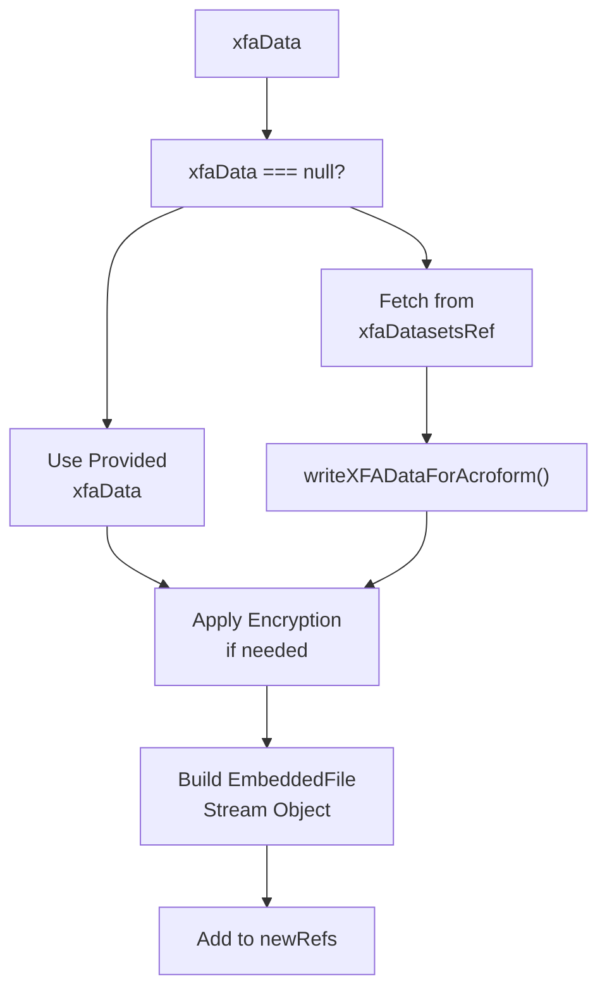
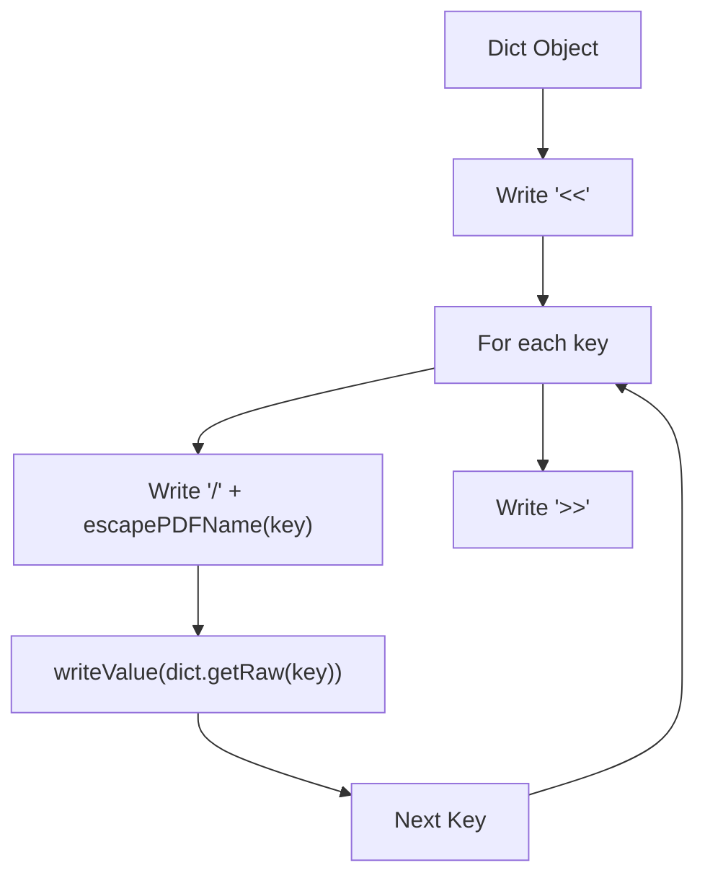
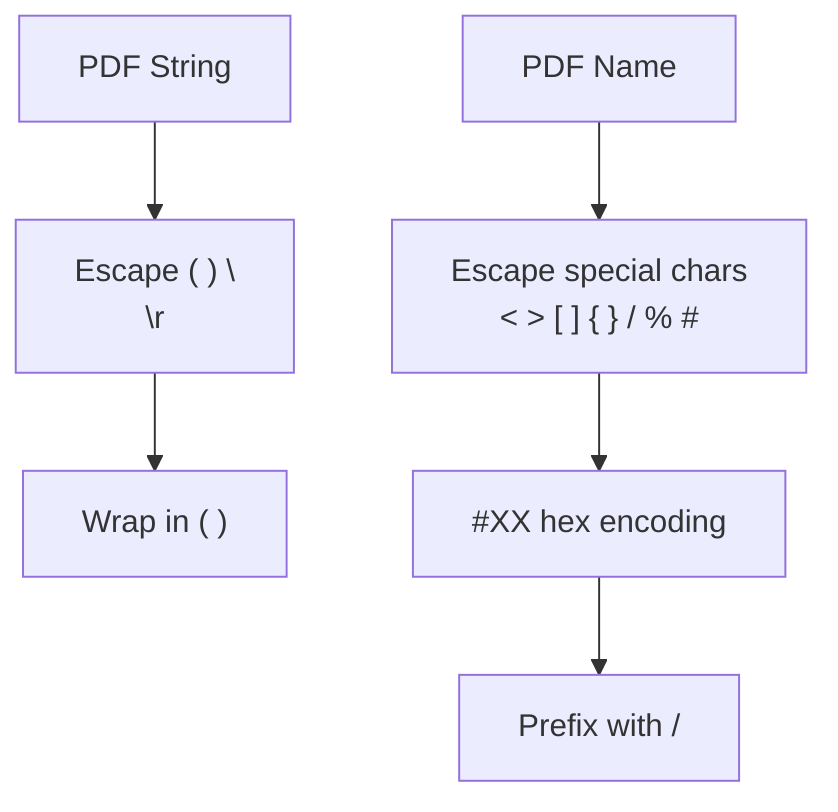
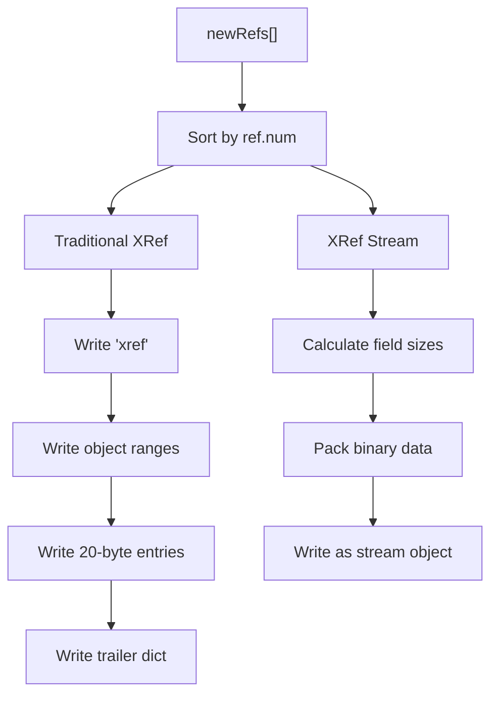
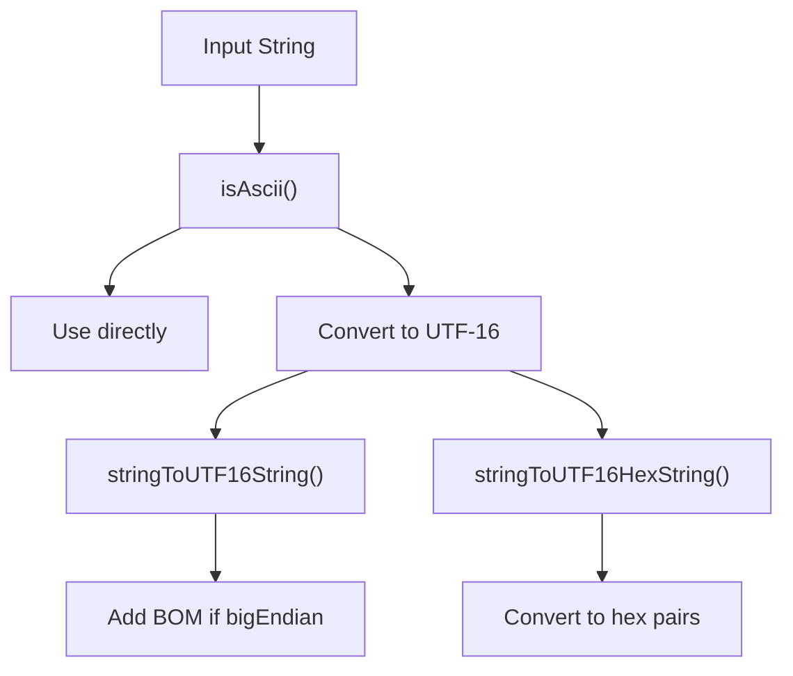

# Document Modification

> **Relevant source files**
> * [src/core/core_utils.js](https://github.com/Mr-xzq/pdf.js-4.4.168/blob/19fbc899/src/core/core_utils.js)
> * [src/core/file_spec.js](https://github.com/Mr-xzq/pdf.js-4.4.168/blob/19fbc899/src/core/file_spec.js)
> * [src/core/writer.js](https://github.com/Mr-xzq/pdf.js-4.4.168/blob/19fbc899/src/core/writer.js)
> * [test/chromium/test-telemetry.js](https://github.com/Mr-xzq/pdf.js-4.4.168/blob/19fbc899/test/chromium/test-telemetry.js)
> * [test/pdfs/issue18030.pdf](https://github.com/Mr-xzq/pdf.js-4.4.168/blob/19fbc899/test/pdfs/issue18030.pdf)
> * [test/stats/statcmp.js](https://github.com/Mr-xzq/pdf.js-4.4.168/blob/19fbc899/test/stats/statcmp.js)
> * [test/unit/core_utils_spec.js](https://github.com/Mr-xzq/pdf.js-4.4.168/blob/19fbc899/test/unit/core_utils_spec.js)
> * [test/unit/writer_spec.js](https://github.com/Mr-xzq/pdf.js-4.4.168/blob/19fbc899/test/unit/writer_spec.js)

This document covers PDF.js's capabilities for modifying PDF documents through incremental updates. The system enables adding new annotations, updating form data, and making other document changes while preserving the original PDF structure.

For information about annotation creation and editing interfaces, see [Annotation Editor System](/Mr-xzq/pdf.js-4.4.168/4-annotation-editor-system). For details about XFA form processing, see [XFA Forms Processing](/Mr-xzq/pdf.js-4.4.168/2.6-xfa-forms-processing).

## Purpose and Scope

PDF.js implements document modification through an incremental update mechanism that appends new or modified objects to the end of a PDF file. This approach preserves the original document content while enabling:

* Addition and modification of annotations
* Updates to form field values (both AcroForm and XFA)
* Embedding of new content streams
* Management of cross-reference tables for modified objects

The system is primarily exposed through the `incrementalUpdate` function and supporting utilities for PDF object serialization.

## Core Architecture

### Incremental Update Process

Sources: [src/core/writer.js L403-L477](https://github.com/Mr-xzq/pdf.js-4.4.168/blob/19fbc899/src/core/writer.js#L403-L477)

 [src/core/core_utils.js L595-L614](https://github.com/Mr-xzq/pdf.js-4.4.168/blob/19fbc899/src/core/core_utils.js#L595-L614)

### Object Serialization Pipeline

Sources: [src/core/writer.js L129-L154](https://github.com/Mr-xzq/pdf.js-4.4.168/blob/19fbc899/src/core/writer.js#L129-L154)

 [src/core/core_utils.js L287-L325](https://github.com/Mr-xzq/pdf.js-4.4.168/blob/19fbc899/src/core/core_utils.js#L287-L325)

 [src/core/core_utils.js L327-L338](https://github.com/Mr-xzq/pdf.js-4.4.168/blob/19fbc899/src/core/core_utils.js#L327-L338)

## Key Components

### IncrementalUpdate Function

The `incrementalUpdate` function serves as the main entry point for PDF modifications:

| Parameter | Type | Purpose |
| --- | --- | --- |
| `originalData` | Uint8Array | Original PDF file bytes |
| `xrefInfo` | Object | Cross-reference metadata |
| `newRefs` | Array | New/modified objects to write |
| `xref` | XRef | Cross-reference table for object resolution |
| `hasXfa` | boolean | Whether document contains XFA forms |
| `xfaDatasetsRef` | Ref | Reference to XFA datasets object |
| `needAppearances` | boolean | Whether to set NeedAppearances flag |
| `acroFormRef` | Ref | Reference to AcroForm dictionary |
| `useXrefStream` | boolean | Whether to use XRef streams vs tables |

Sources: [src/core/writer.js L403-L477](https://github.com/Mr-xzq/pdf.js-4.4.168/blob/19fbc899/src/core/writer.js#L403-L477)

### Annotation Processing

New annotations are extracted from the annotation storage and prepared for serialization:

Sources: [src/core/core_utils.js L595-L614](https://github.com/Mr-xzq/pdf.js-4.4.168/blob/19fbc899/src/core/core_utils.js#L595-L614)

### XFA Form Updates

For documents containing XFA forms, the system can update the XFA datasets:

Sources: [src/core/writer.js L260-L281](https://github.com/Mr-xzq/pdf.js-4.4.168/blob/19fbc899/src/core/writer.js#L260-L281)

 [src/core/writer.js L189-L217](https://github.com/Mr-xzq/pdf.js-4.4.168/blob/19fbc899/src/core/writer.js#L189-L217)

## PDF Object Serialization

### Dictionary Serialization

The `writeDict` function handles PDF dictionary objects:

Sources: [src/core/writer.js L43-L50](https://github.com/Mr-xzq/pdf.js-4.4.168/blob/19fbc899/src/core/writer.js#L43-L50)

### Stream Compression

The system automatically compresses stream data when beneficial:

| Condition | Action |
| --- | --- |
| `bytes.length >= 256` | Apply deflate compression |
| Already has `FlateDecode` filter | Recompress if beneficial |
| Compression fails | Use original data |
| Transform present | Apply encryption after compression |

Sources: [src/core/writer.js L52-L113](https://github.com/Mr-xzq/pdf.js-4.4.168/blob/19fbc899/src/core/writer.js#L52-L113)

### String and Name Escaping

PDF strings and names require special character escaping:

Sources: [src/core/core_utils.js L287-L325](https://github.com/Mr-xzq/pdf.js-4.4.168/blob/19fbc899/src/core/core_utils.js#L287-L325)

 [src/core/core_utils.js L327-L338](https://github.com/Mr-xzq/pdf.js-4.4.168/blob/19fbc899/src/core/core_utils.js#L327-L338)

## Cross-Reference Management

### XRef Table Generation

The system supports both traditional xref tables and xref streams:

Sources: [src/core/writer.js L283-L313](https://github.com/Mr-xzq/pdf.js-4.4.168/blob/19fbc899/src/core/writer.js#L283-L313)

 [src/core/writer.js L327-L371](https://github.com/Mr-xzq/pdf.js-4.4.168/blob/19fbc899/src/core/writer.js#L327-L371)

### Object Reference Tracking

The system maintains object reference information for incremental updates:

| Field | Type | Purpose |
| --- | --- | --- |
| `ref.num` | number | Object number |
| `ref.gen` | number | Generation number |
| `data` | string | Serialized object data |
| `offset` | number | Byte offset in file |

Sources: [src/core/writer.js L283-L313](https://github.com/Mr-xzq/pdf.js-4.4.168/blob/19fbc899/src/core/writer.js#L283-L313)

## Utility Functions

### Text Encoding

PDF.js provides utilities for proper text encoding in PDF format:

Sources: [src/core/core_utils.js L616-L618](https://github.com/Mr-xzq/pdf.js-4.4.168/blob/19fbc899/src/core/core_utils.js#L616-L618)

 [src/core/core_utils.js L620-L630](https://github.com/Mr-xzq/pdf.js-4.4.168/blob/19fbc899/src/core/core_utils.js#L620-L630)

 [src/core/core_utils.js L632-L645](https://github.com/Mr-xzq/pdf.js-4.4.168/blob/19fbc899/src/core/core_utils.js#L632-L645)

### Number Formatting

The `numberToString` function optimizes PDF number representation:

| Input | Output | Reasoning |
| --- | --- | --- |
| `42` | `"42"` | Integer values |
| `1.0` | `"1"` | Remove unnecessary decimals |
| `1.23001` | `"1.23"` | Round to 2 decimal places |
| `1.234` | `"1.23"` | Truncate excess precision |

Sources: [src/core/core_utils.js L578-L593](https://github.com/Mr-xzq/pdf.js-4.4.168/blob/19fbc899/src/core/core_utils.js#L578-L593)

## Error Handling and Validation

The document modification system includes several validation mechanisms:

* **Object type validation** - Ensures proper PDF object types before serialization
* **Encryption support** - Applies encryption transforms when required
* **Size optimization** - Automatically compresses streams when beneficial
* **Reference integrity** - Maintains proper cross-reference relationships

Sources: [src/core/writer.js L30-L41](https://github.com/Mr-xzq/pdf.js-4.4.168/blob/19fbc899/src/core/writer.js#L30-L41)

 [src/core/writer.js L100-L103](https://github.com/Mr-xzq/pdf.js-4.4.168/blob/19fbc899/src/core/writer.js#L100-L103)

## Integration Points

The document modification system integrates with several other PDF.js components:

* **Annotation Editor System** - Receives new annotations for serialization
* **XFA Forms Processing** - Updates XML form data
* **Security and Encryption** - Applies encryption to modified content
* **File I/O Systems** - Produces final PDF output for download or saving

This system provides the foundation for PDF.js's interactive document editing capabilities while maintaining compatibility with PDF standards and preserving document integrity.

Sources: [src/core/writer.js L1-L479](https://github.com/Mr-xzq/pdf.js-4.4.168/blob/19fbc899/src/core/writer.js#L1-L479)

 [src/core/core_utils.js L595-L709](https://github.com/Mr-xzq/pdf.js-4.4.168/blob/19fbc899/src/core/core_utils.js#L595-L709)