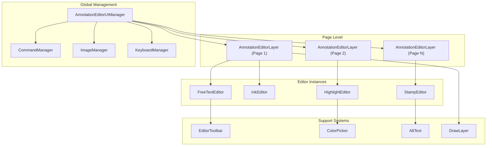
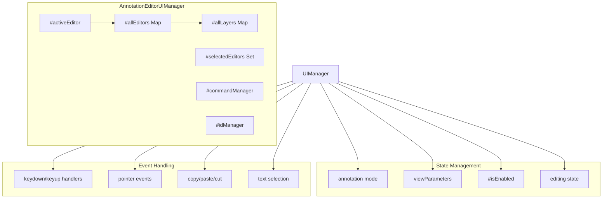
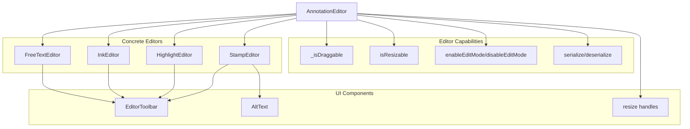
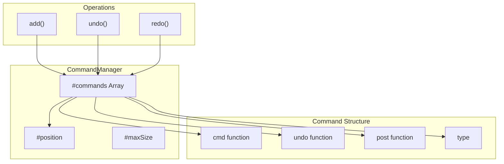
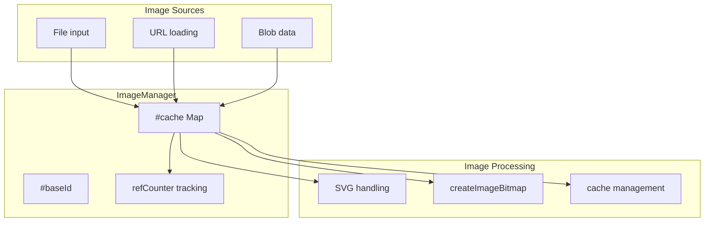

# Annotation Editor System

> **Relevant source files**
> * [l10n/en-US/viewer.ftl](https://github.com/Mr-xzq/pdf.js-4.4.168/blob/19fbc899/l10n/en-US/viewer.ftl)
> * [src/display/draw_layer.js](https://github.com/Mr-xzq/pdf.js-4.4.168/blob/19fbc899/src/display/draw_layer.js)
> * [src/display/editor/alt_text.js](https://github.com/Mr-xzq/pdf.js-4.4.168/blob/19fbc899/src/display/editor/alt_text.js)
> * [src/display/editor/annotation_editor_layer.js](https://github.com/Mr-xzq/pdf.js-4.4.168/blob/19fbc899/src/display/editor/annotation_editor_layer.js)
> * [src/display/editor/color_picker.js](https://github.com/Mr-xzq/pdf.js-4.4.168/blob/19fbc899/src/display/editor/color_picker.js)
> * [src/display/editor/editor.js](https://github.com/Mr-xzq/pdf.js-4.4.168/blob/19fbc899/src/display/editor/editor.js)
> * [src/display/editor/freetext.js](https://github.com/Mr-xzq/pdf.js-4.4.168/blob/19fbc899/src/display/editor/freetext.js)
> * [src/display/editor/highlight.js](https://github.com/Mr-xzq/pdf.js-4.4.168/blob/19fbc899/src/display/editor/highlight.js)
> * [src/display/editor/ink.js](https://github.com/Mr-xzq/pdf.js-4.4.168/blob/19fbc899/src/display/editor/ink.js)
> * [src/display/editor/outliner.js](https://github.com/Mr-xzq/pdf.js-4.4.168/blob/19fbc899/src/display/editor/outliner.js)
> * [src/display/editor/stamp.js](https://github.com/Mr-xzq/pdf.js-4.4.168/blob/19fbc899/src/display/editor/stamp.js)
> * [src/display/editor/toolbar.js](https://github.com/Mr-xzq/pdf.js-4.4.168/blob/19fbc899/src/display/editor/toolbar.js)
> * [src/display/editor/tools.js](https://github.com/Mr-xzq/pdf.js-4.4.168/blob/19fbc899/src/display/editor/tools.js)
> * [test/draw_layer_test.css](https://github.com/Mr-xzq/pdf.js-4.4.168/blob/19fbc899/test/draw_layer_test.css)
> * [test/integration/highlight_editor_spec.mjs](https://github.com/Mr-xzq/pdf.js-4.4.168/blob/19fbc899/test/integration/highlight_editor_spec.mjs)
> * [test/pdfs/issue16278.pdf](https://github.com/Mr-xzq/pdf.js-4.4.168/blob/19fbc899/test/pdfs/issue16278.pdf)
> * [web/alt_text_manager.js](https://github.com/Mr-xzq/pdf.js-4.4.168/blob/19fbc899/web/alt_text_manager.js)
> * [web/annotation_editor_layer_builder.css](https://github.com/Mr-xzq/pdf.js-4.4.168/blob/19fbc899/web/annotation_editor_layer_builder.css)
> * [web/annotation_editor_layer_builder.js](https://github.com/Mr-xzq/pdf.js-4.4.168/blob/19fbc899/web/annotation_editor_layer_builder.js)
> * [web/draw_layer_builder.css](https://github.com/Mr-xzq/pdf.js-4.4.168/blob/19fbc899/web/draw_layer_builder.css)

The Annotation Editor System provides interactive annotation creation and editing capabilities for PDF documents. This system allows users to create, modify, and manage different types of annotations including text, drawings, highlights, and image stamps directly on PDF pages. It handles user interactions, rendering, persistence, and provides features like undo/redo, keyboard navigation, and accessibility support.

For information about the broader PDF rendering and display system, see [Core PDF Processing Engine](/Mr-xzq/pdf.js-4.4.168/2-core-pdf-processing-engine). For details about the web viewer application that integrates this editor system, see [Web Viewer Application](/Mr-xzq/pdf.js-4.4.168/3-web-viewer-application).

## System Architecture

The Annotation Editor System follows a hierarchical architecture with a central UI manager coordinating multiple page-level editor layers, each managing individual editor instances.

### Core Architecture Overview



Sources: [src/display/editor/tools.js L536-L848](https://github.com/Mr-xzq/pdf.js-4.4.168/blob/19fbc899/src/display/editor/tools.js#L536-L848)

 [src/display/editor/annotation_editor_layer.js L57-L126](https://github.com/Mr-xzq/pdf.js-4.4.168/blob/19fbc899/src/display/editor/annotation_editor_layer.js#L57-L126)

 [src/display/editor/editor.js L42-L178](https://github.com/Mr-xzq/pdf.js-4.4.168/blob/19fbc899/src/display/editor/editor.js#L42-L178)

### UI Manager Relationships



Sources: [src/display/editor/tools.js L536-L817](https://github.com/Mr-xzq/pdf.js-4.4.168/blob/19fbc899/src/display/editor/tools.js#L536-L817)

 [src/display/editor/tools.js L1169-L1209](https://github.com/Mr-xzq/pdf.js-4.4.168/blob/19fbc899/src/display/editor/tools.js#L1169-L1209)

## Editor Types and Hierarchy

The system supports four main types of annotation editors, each inheriting from the base `AnnotationEditor` class.

### Editor Type Architecture



Sources: [src/display/editor/editor.js L42-L178](https://github.com/Mr-xzq/pdf.js-4.4.168/blob/19fbc899/src/display/editor/editor.js#L42-L178)

 [src/display/editor/freetext.js L40-L148](https://github.com/Mr-xzq/pdf.js-4.4.168/blob/19fbc899/src/display/editor/freetext.js#L40-L148)

 [src/display/editor/ink.js L29-L84](https://github.com/Mr-xzq/pdf.js-4.4.168/blob/19fbc899/src/display/editor/ink.js#L29-L84)

 [src/display/editor/highlight.js L31-L125](https://github.com/Mr-xzq/pdf.js-4.4.168/blob/19fbc899/src/display/editor/highlight.js#L31-L125)

 [src/display/editor/stamp.js L24-L55](https://github.com/Mr-xzq/pdf.js-4.4.168/blob/19fbc899/src/display/editor/stamp.js#L24-L55)

### Editor Types and Capabilities

| Editor Type | Purpose | Key Features | File Location |
| --- | --- | --- | --- |
| `FreeTextEditor` | Text annotations | Font size, color, content editing | [src/display/editor/freetext.js](https://github.com/Mr-xzq/pdf.js-4.4.168/blob/19fbc899/src/display/editor/freetext.js) |
| `InkEditor` | Drawing/sketching | Stroke thickness, color, opacity, paths | [src/display/editor/ink.js](https://github.com/Mr-xzq/pdf.js-4.4.168/blob/19fbc899/src/display/editor/ink.js) |
| `HighlightEditor` | Text highlighting | Color selection, text selection, outlines | [src/display/editor/highlight.js](https://github.com/Mr-xzq/pdf.js-4.4.168/blob/19fbc899/src/display/editor/highlight.js) |
| `StampEditor` | Image stamps | Image loading, resizing, alt text | [src/display/editor/stamp.js](https://github.com/Mr-xzq/pdf.js-4.4.168/blob/19fbc899/src/display/editor/stamp.js) |

## Core Management Systems

### Command Management and Undo/Redo

The `CommandManager` class provides undo/redo functionality for all editor operations.



Sources: [src/display/editor/tools.js L239-L374](https://github.com/Mr-xzq/pdf.js-4.4.168/blob/19fbc899/src/display/editor/tools.js#L239-L374)

### Image Management

The `ImageManager` handles caching and lifecycle management of images used in stamp editors.



Sources: [src/display/editor/tools.js L86-L231](https://github.com/Mr-xzq/pdf.js-4.4.168/blob/19fbc899/src/display/editor/tools.js#L86-L231)

## Editor Lifecycle and State Management

### Editor Creation and Management Flow

```

```

Sources: [src/display/editor/annotation_editor_layer.js L666-L682](https://github.com/Mr-xzq/pdf.js-4.4.168/blob/19fbc899/src/display/editor/annotation_editor_layer.js#L666-L682)

 [src/display/editor/editor.js L325-L327](https://github.com/Mr-xzq/pdf.js-4.4.168/blob/19fbc899/src/display/editor/editor.js#L325-L327)

 [src/display/editor/tools.js L1026-L1034](https://github.com/Mr-xzq/pdf.js-4.4.168/blob/19fbc899/src/display/editor/tools.js#L1026-L1034)

### Editor State Transitions

```

```

Sources: [src/display/editor/editor.js L292-L356](https://github.com/Mr-xzq/pdf.js-4.4.168/blob/19fbc899/src/display/editor/editor.js#L292-L356)

 [src/display/editor/annotation_editor_layer.js L506-L525](https://github.com/Mr-xzq/pdf.js-4.4.168/blob/19fbc899/src/display/editor/annotation_editor_layer.js#L506-L525)

## User Interface Components

### Editor Toolbar System

Each editor can display a toolbar with relevant controls like delete, color picker, and editor-specific options.

```

```

Sources: [src/display/editor/toolbar.js L18-L61](https://github.com/Mr-xzq/pdf.js-4.4.168/blob/19fbc899/src/display/editor/toolbar.js#L18-L61)

 [src/display/editor/color_picker.js L20-L44](https://github.com/Mr-xzq/pdf.js-4.4.168/blob/19fbc899/src/display/editor/color_picker.js#L20-L44)

### Keyboard and Accessibility Support

The system provides comprehensive keyboard navigation and accessibility features.

```

```

Sources: [src/display/editor/tools.js L380-L465](https://github.com/Mr-xzq/pdf.js-4.4.168/blob/19fbc899/src/display/editor/tools.js#L380-L465)

 [src/display/editor/tools.js L640-L771](https://github.com/Mr-xzq/pdf.js-4.4.168/blob/19fbc899/src/display/editor/tools.js#L640-L771)

## Integration with PDF.js Architecture

The Annotation Editor System integrates with several other PDF.js systems:

### System Integration Points

| Integration Point | Purpose | Key Files |
| --- | --- | --- |
| `AnnotationStorage` | Persistence of annotation data | [src/display/editor/tools.js L1026-L1034](https://github.com/Mr-xzq/pdf.js-4.4.168/blob/19fbc899/src/display/editor/tools.js#L1026-L1034) |
| `DrawLayer` | SVG rendering for highlights | [src/display/draw_layer.js](https://github.com/Mr-xzq/pdf.js-4.4.168/blob/19fbc899/src/display/draw_layer.js) |
| `TextLayer` | Text selection for highlights | [src/display/editor/annotation_editor_layer.js L362-L417](https://github.com/Mr-xzq/pdf.js-4.4.168/blob/19fbc899/src/display/editor/annotation_editor_layer.js#L362-L417) |
| `EventBus` | Application-wide event communication | [src/display/editor/tools.js L789-L793](https://github.com/Mr-xzq/pdf.js-4.4.168/blob/19fbc899/src/display/editor/tools.js#L789-L793) |
| `PageViewport` | Coordinate transformations | [src/display/editor/editor.js L161-L170](https://github.com/Mr-xzq/pdf.js-4.4.168/blob/19fbc899/src/display/editor/editor.js#L161-L170) |

### Builder Integration

The `AnnotationEditorLayerBuilder` connects the editor system to the web viewer:

```

```

Sources: [web/annotation_editor_layer_builder.js L42-L121](https://github.com/Mr-xzq/pdf.js-4.4.168/blob/19fbc899/web/annotation_editor_layer_builder.js#L42-L121)

This architecture provides a flexible, extensible system for PDF annotation editing while maintaining clean separation between different types of editors and supporting systems.