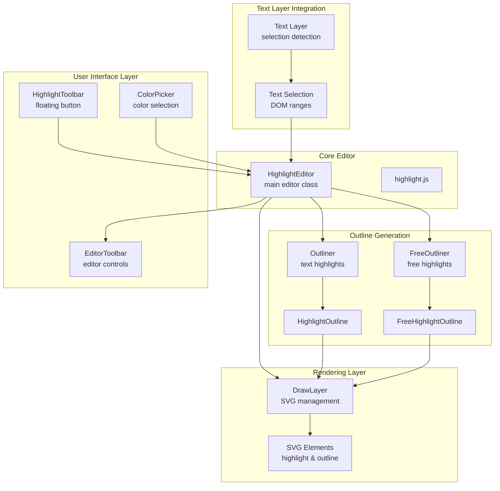
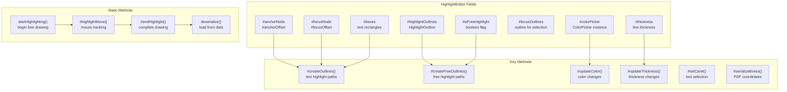
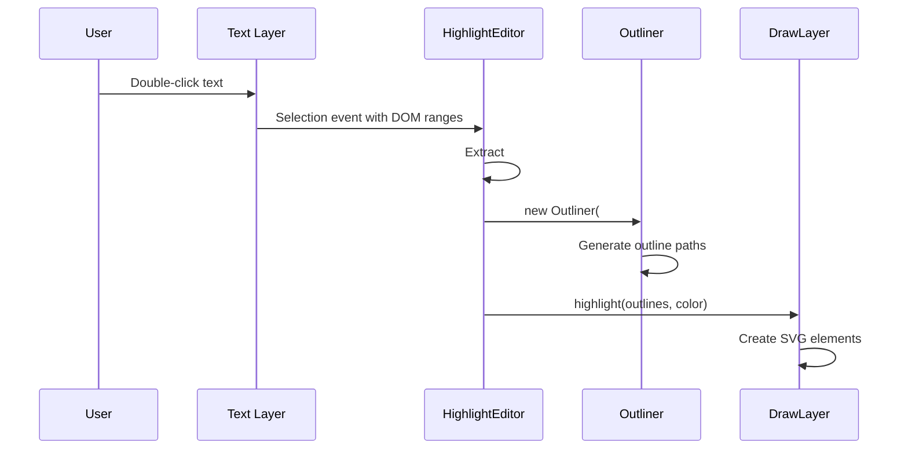
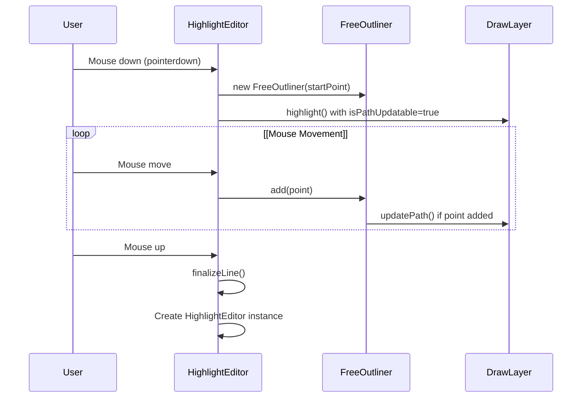
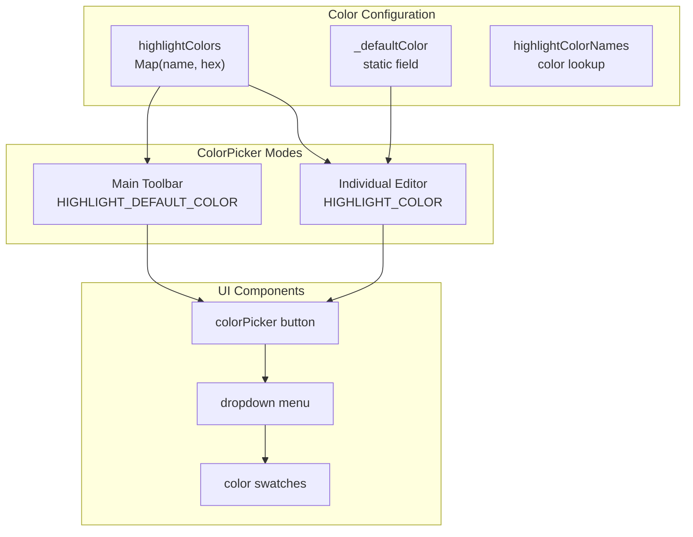
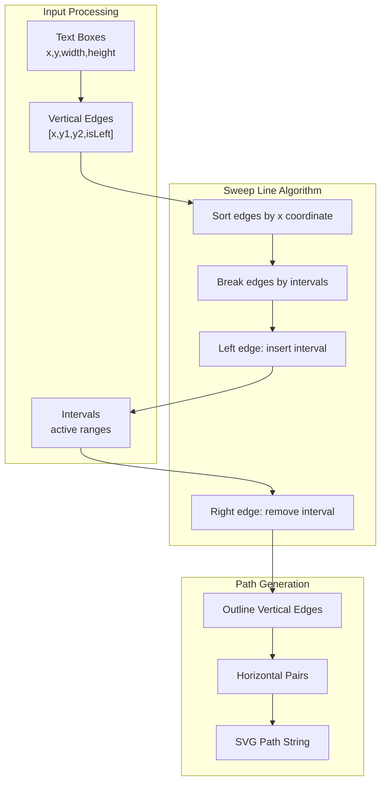
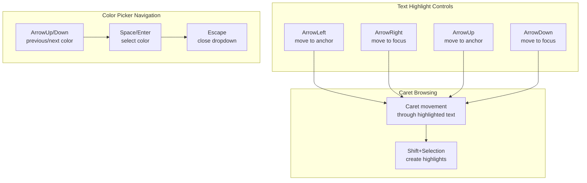
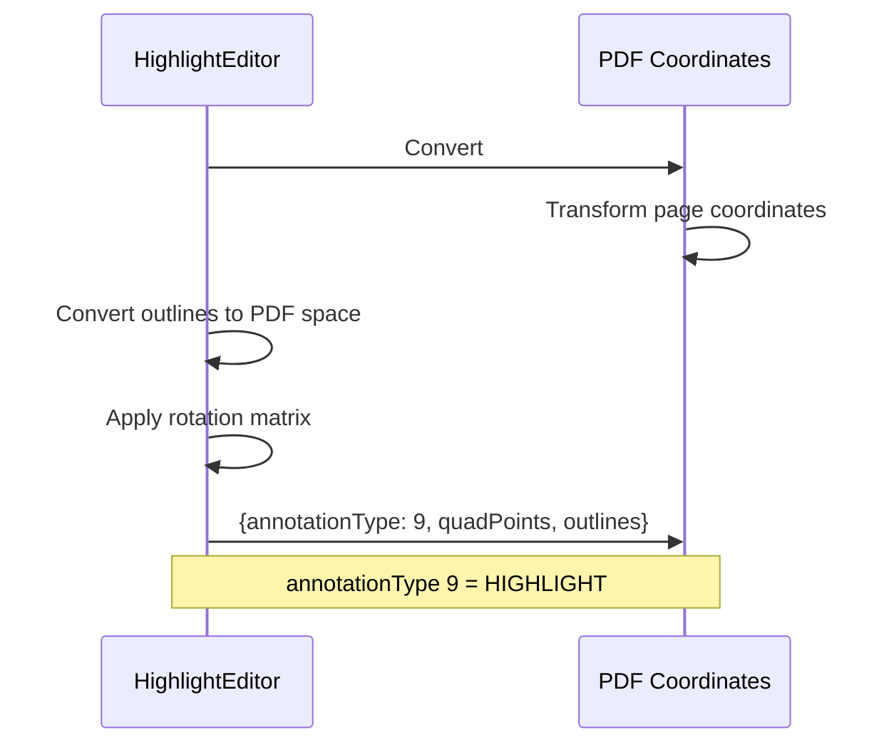

# Highlight Editor

> **Relevant source files**
> * [l10n/en-US/viewer.ftl](https://github.com/Mr-xzq/pdf.js-4.4.168/blob/19fbc899/l10n/en-US/viewer.ftl)
> * [src/display/draw_layer.js](https://github.com/Mr-xzq/pdf.js-4.4.168/blob/19fbc899/src/display/draw_layer.js)
> * [src/display/editor/alt_text.js](https://github.com/Mr-xzq/pdf.js-4.4.168/blob/19fbc899/src/display/editor/alt_text.js)
> * [src/display/editor/color_picker.js](https://github.com/Mr-xzq/pdf.js-4.4.168/blob/19fbc899/src/display/editor/color_picker.js)
> * [src/display/editor/highlight.js](https://github.com/Mr-xzq/pdf.js-4.4.168/blob/19fbc899/src/display/editor/highlight.js)
> * [src/display/editor/outliner.js](https://github.com/Mr-xzq/pdf.js-4.4.168/blob/19fbc899/src/display/editor/outliner.js)
> * [src/display/editor/toolbar.js](https://github.com/Mr-xzq/pdf.js-4.4.168/blob/19fbc899/src/display/editor/toolbar.js)
> * [test/draw_layer_test.css](https://github.com/Mr-xzq/pdf.js-4.4.168/blob/19fbc899/test/draw_layer_test.css)
> * [test/integration/highlight_editor_spec.mjs](https://github.com/Mr-xzq/pdf.js-4.4.168/blob/19fbc899/test/integration/highlight_editor_spec.mjs)
> * [web/draw_layer_builder.css](https://github.com/Mr-xzq/pdf.js-4.4.168/blob/19fbc899/web/draw_layer_builder.css)

The Highlight Editor provides interactive text highlighting functionality within PDF documents, supporting both text-bound highlights (following PDF text selection) and free-form highlights (hand-drawn shapes). This system handles color selection, outline generation, SVG rendering, and user interaction patterns for creating, editing, and managing highlight annotations.

For information about the broader annotation editor framework, see [Editor Architecture](/Mr-xzq/pdf.js-4.4.168/4.1-editor-architecture). For details about other annotation types, see [Annotation and Form Handling](/Mr-xzq/pdf.js-4.4.168/3.4-annotation-and-form-handling).

## Architecture Overview

The Highlight Editor consists of several interconnected components that handle different aspects of the highlighting workflow:

**Sources:** [src/display/editor/highlight.js L1-L831](https://github.com/Mr-xzq/pdf.js-4.4.168/blob/19fbc899/src/display/editor/highlight.js#L1-L831)

 [src/display/editor/toolbar.js L148-L235](https://github.com/Mr-xzq/pdf.js-4.4.168/blob/19fbc899/src/display/editor/toolbar.js#L148-L235)

 [src/display/editor/outliner.js L1-L850](https://github.com/Mr-xzq/pdf.js-4.4.168/blob/19fbc899/src/display/editor/outliner.js#L1-L850)

 [src/display/draw_layer.js L24-L245](https://github.com/Mr-xzq/pdf.js-4.4.168/blob/19fbc899/src/display/draw_layer.js#L24-L245)

## HighlightEditor Class Structure

The `HighlightEditor` class serves as the central coordinator for all highlighting functionality:

**Sources:** [src/display/editor/highlight.js L31-L125](https://github.com/Mr-xzq/pdf.js-4.4.168/blob/19fbc899/src/display/editor/highlight.js#L31-L125)

 [src/display/editor/highlight.js L697-L770](https://github.com/Mr-xzq/pdf.js-4.4.168/blob/19fbc899/src/display/editor/highlight.js#L697-L770)

 [src/display/editor/highlight.js L772-L828](https://github.com/Mr-xzq/pdf.js-4.4.168/blob/19fbc899/src/display/editor/highlight.js#L772-L828)

## Text vs Free Highlights

The system supports two distinct highlighting modes with different creation and rendering approaches:

| Feature | Text Highlights | Free Highlights |
| --- | --- | --- |
| **Creation** | Double-click on text | Mouse drag drawing |
| **Anchor Points** | `#anchorNode`, `#focusNode` | Mouse coordinates |
| **Outliner** | `Outliner` class | `FreeOutliner` class |
| **Movement** | Not draggable | Not draggable |
| **Shape** | Follows text layout | Arbitrary path |
| **Thickness** | Fixed | Configurable |

### Text Highlight Creation

Text highlights are created by detecting text selections and converting them to highlight boxes:

### Free Highlight Creation

Free highlights are created through mouse drawing with real-time path updates:

**Sources:** [src/display/editor/highlight.js L151-L175](https://github.com/Mr-xzq/pdf.js-4.4.168/blob/19fbc899/src/display/editor/highlight.js#L151-L175)

 [src/display/editor/highlight.js L697-L770](https://github.com/Mr-xzq/pdf.js-4.4.168/blob/19fbc899/src/display/editor/highlight.js#L697-L770)

 [src/display/editor/outliner.js L18-L262](https://github.com/Mr-xzq/pdf.js-4.4.168/blob/19fbc899/src/display/editor/outliner.js#L18-L262)

 [src/display/editor/outliner.js L346-L849](https://github.com/Mr-xzq/pdf.js-4.4.168/blob/19fbc899/src/display/editor/outliner.js#L346-L849)

## Color Management System

The color picker provides both individual editor controls and global default settings:

Color changes trigger command-pattern updates for undo/redo support:

```mermaid
sequenceDiagram
  participant ColorPicker
  participant HighlightEditor
  participant DrawLayer
  participant UIManager

  ColorPicker->>HighlightEditor: ​
  HighlightEditor->>HighlightEditor: Create undo/redo commands
  HighlightEditor->>DrawLayer: changeColor(
  HighlightEditor->>UIManager: updateUI(this)
  HighlightEditor->>HighlightEditor: _reportTelemetry(color_changed)
```

**Sources:** [src/display/editor/color_picker.js L69-L84](https://github.com/Mr-xzq/pdf.js-4.4.168/blob/19fbc899/src/display/editor/color_picker.js#L69-L84)

 [src/display/editor/highlight.js L320-L344](https://github.com/Mr-xzq/pdf.js-4.4.168/blob/19fbc899/src/display/editor/highlight.js#L320-L344)

 [src/display/editor/highlight.js L250-L266](https://github.com/Mr-xzq/pdf.js-4.4.168/blob/19fbc899/src/display/editor/highlight.js#L250-L266)

## Outline Generation and Rendering

The outline generation system converts highlight areas into SVG paths using sweep line algorithms:

The `DrawLayer` manages SVG elements with proper layering and CSS class management:

| SVG Element | Purpose | CSS Classes |
| --- | --- | --- |
| `svg.highlight` | Main highlight shape | `.highlight`, `.free` (if applicable) |
| `svg.highlightOutline` | Selection outline | `.highlightOutline`, `.selected`, `.hovered` |
| `clipPath` | Editor clipping | Used by editor div |
| `path` | Shape definition | Referenced by `use` elements |

**Sources:** [src/display/editor/outliner.js L88-L176](https://github.com/Mr-xzq/pdf.js-4.4.168/blob/19fbc899/src/display/editor/outliner.js#L88-L176)

 [src/display/draw_layer.js L89-L120](https://github.com/Mr-xzq/pdf.js-4.4.168/blob/19fbc899/src/display/draw_layer.js#L89-L120)

 [src/display/draw_layer.js L122-L175](https://github.com/Mr-xzq/pdf.js-4.4.168/blob/19fbc899/src/display/draw_layer.js#L122-L175)

 [web/draw_layer_builder.css L41-L111](https://github.com/Mr-xzq/pdf.js-4.4.168/blob/19fbc899/web/draw_layer_builder.css#L41-L111)

## User Interaction Patterns

The highlight editor supports comprehensive keyboard and mouse interactions:

### Keyboard Navigation

### Mouse Interactions

| Interaction | Text Highlights | Free Highlights |
| --- | --- | --- |
| **Double-click** | Create from selection | N/A |
| **Click + drag** | N/A | Draw highlight path |
| **Single click** | Select existing highlight | Select existing highlight |
| **Hover** | Show outline | Show outline |
| **Click outside** | Deselect | Deselect |

**Sources:** [src/display/editor/highlight.js L88-L100](https://github.com/Mr-xzq/pdf.js-4.4.168/blob/19fbc899/src/display/editor/highlight.js#L88-L100)

 [src/display/editor/highlight.js L597-L625](https://github.com/Mr-xzq/pdf.js-4.4.168/blob/19fbc899/src/display/editor/highlight.js#L597-L625)

 [test/integration/highlight_editor_spec.mjs L665-L721](https://github.com/Mr-xzq/pdf.js-4.4.168/blob/19fbc899/test/integration/highlight_editor_spec.mjs#L665-L721)

 [test/integration/highlight_editor_spec.mjs L991-L1169](https://github.com/Mr-xzq/pdf.js-4.4.168/blob/19fbc899/test/integration/highlight_editor_spec.mjs#L991-L1169)

## Serialization and Data Flow

Highlights are serialized to PDF annotation format with coordinate transformation:

The serialization includes:

| Field | Type | Purpose |
| --- | --- | --- |
| `annotationType` | Number | Always 9 for highlights |
| `color` | Array | RGB values [r,g,b] |
| `opacity` | Number | Transparency level |
| `thickness` | Number | Line thickness for free highlights |
| `quadPoints` | Float32Array | Text boxes in PDF coordinates |
| `outlines` | Array | SVG path data for rendering |
| `rect` | Array | Bounding rectangle |
| `rotation` | Number | Page rotation angle |

**Sources:** [src/display/editor/highlight.js L801-L823](https://github.com/Mr-xzq/pdf.js-4.4.168/blob/19fbc899/src/display/editor/highlight.js#L801-L823)

 [src/display/editor/highlight.js L669-L691](https://github.com/Mr-xzq/pdf.js-4.4.168/blob/19fbc899/src/display/editor/highlight.js#L669-L691)

 [src/display/editor/highlight.js L693-L695](https://github.com/Mr-xzq/pdf.js-4.4.168/blob/19fbc899/src/display/editor/highlight.js#L693-L695)

 [src/display/editor/highlight.js L772-L799](https://github.com/Mr-xzq/pdf.js-4.4.168/blob/19fbc899/src/display/editor/highlight.js#L772-L799)