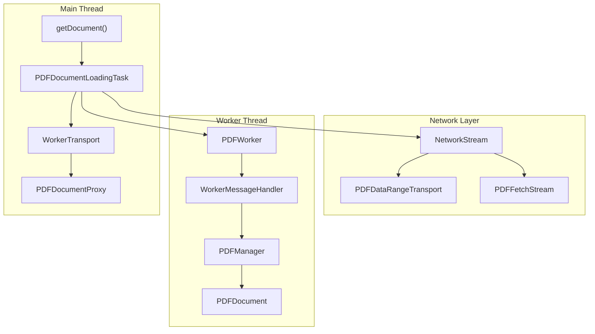
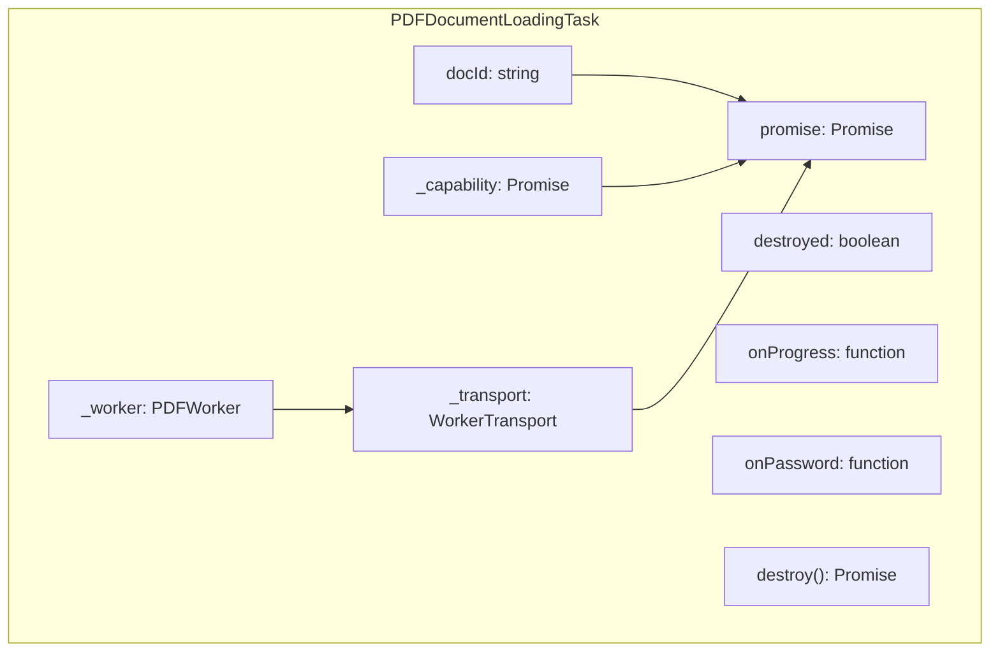
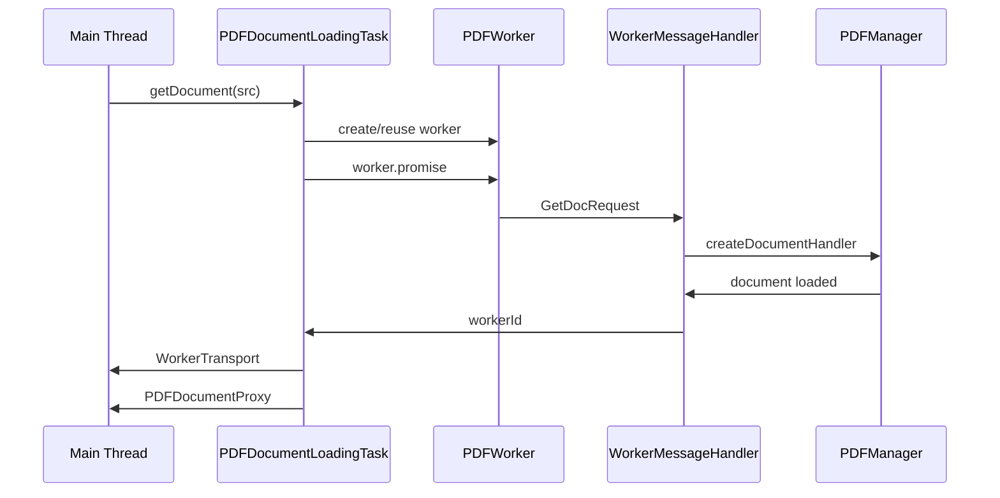
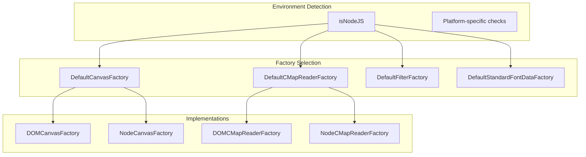

# Document Loading and API

> **Relevant source files**
> * [src/core/annotation.js](https://github.com/Mr-xzq/pdf.js-4.4.168/blob/19fbc899/src/core/annotation.js)
> * [src/core/catalog.js](https://github.com/Mr-xzq/pdf.js-4.4.168/blob/19fbc899/src/core/catalog.js)
> * [src/core/document.js](https://github.com/Mr-xzq/pdf.js-4.4.168/blob/19fbc899/src/core/document.js)
> * [src/core/evaluator.js](https://github.com/Mr-xzq/pdf.js-4.4.168/blob/19fbc899/src/core/evaluator.js)
> * [src/core/fonts.js](https://github.com/Mr-xzq/pdf.js-4.4.168/blob/19fbc899/src/core/fonts.js)
> * [src/core/worker.js](https://github.com/Mr-xzq/pdf.js-4.4.168/blob/19fbc899/src/core/worker.js)
> * [src/display/annotation_layer.js](https://github.com/Mr-xzq/pdf.js-4.4.168/blob/19fbc899/src/display/annotation_layer.js)
> * [src/display/api.js](https://github.com/Mr-xzq/pdf.js-4.4.168/blob/19fbc899/src/display/api.js)
> * [src/display/base_factory.js](https://github.com/Mr-xzq/pdf.js-4.4.168/blob/19fbc899/src/display/base_factory.js)
> * [src/display/canvas.js](https://github.com/Mr-xzq/pdf.js-4.4.168/blob/19fbc899/src/display/canvas.js)
> * [src/display/display_utils.js](https://github.com/Mr-xzq/pdf.js-4.4.168/blob/19fbc899/src/display/display_utils.js)
> * [src/display/node_utils.js](https://github.com/Mr-xzq/pdf.js-4.4.168/blob/19fbc899/src/display/node_utils.js)
> * [src/pdf.js](https://github.com/Mr-xzq/pdf.js-4.4.168/blob/19fbc899/src/pdf.js)
> * [src/shared/util.js](https://github.com/Mr-xzq/pdf.js-4.4.168/blob/19fbc899/src/shared/util.js)
> * [test/annotation_layer_builder_overrides.css](https://github.com/Mr-xzq/pdf.js-4.4.168/blob/19fbc899/test/annotation_layer_builder_overrides.css)
> * [test/pdfs/.gitignore](https://github.com/Mr-xzq/pdf.js-4.4.168/blob/19fbc899/test/pdfs/.gitignore)
> * [test/test_manifest.json](https://github.com/Mr-xzq/pdf.js-4.4.168/blob/19fbc899/test/test_manifest.json)
> * [test/unit/annotation_spec.js](https://github.com/Mr-xzq/pdf.js-4.4.168/blob/19fbc899/test/unit/annotation_spec.js)
> * [test/unit/api_spec.js](https://github.com/Mr-xzq/pdf.js-4.4.168/blob/19fbc899/test/unit/api_spec.js)
> * [test/unit/clitests_helper.js](https://github.com/Mr-xzq/pdf.js-4.4.168/blob/19fbc899/test/unit/clitests_helper.js)
> * [test/unit/display_utils_spec.js](https://github.com/Mr-xzq/pdf.js-4.4.168/blob/19fbc899/test/unit/display_utils_spec.js)
> * [test/unit/util_spec.js](https://github.com/Mr-xzq/pdf.js-4.4.168/blob/19fbc899/test/unit/util_spec.js)
> * [web/annotation_layer_builder.css](https://github.com/Mr-xzq/pdf.js-4.4.168/blob/19fbc899/web/annotation_layer_builder.css)

This document covers the PDF.js document loading system and its public API. This includes the main `getDocument` function, document loading tasks, transport mechanisms, and the proxy objects that provide access to PDF document data. This system serves as the primary entry point for loading and interacting with PDF documents in PDF.js.

For information about content stream processing after document loading, see [Content Stream Processing](/Mr-xzq/pdf.js-4.4.168/2.2-content-stream-processing). For details about the web viewer application that uses this API, see [Application Architecture](/Mr-xzq/pdf.js-4.4.168/3.1-application-architecture).

## Overview

The document loading system in PDF.js provides a unified interface for loading PDF documents from various sources (URLs, TypedArrays, ArrayBuffers) and presents them through a consistent API. The system handles network requests, worker thread coordination, progress reporting, and error handling while abstracting away the complexity of PDF parsing from the end user.

The main entry point `getDocument()` returns a `PDFDocumentLoadingTask` that manages the loading process and eventually resolves to a `PDFDocumentProxy` object that provides access to the document's pages, metadata, and other properties.

Sources: [src/display/api.js L232-L477](https://github.com/Mr-xzq/pdf.js-4.4.168/blob/19fbc899/src/display/api.js#L232-L477)

 [src/core/worker.js L72-L117](https://github.com/Mr-xzq/pdf.js-4.4.168/blob/19fbc899/src/core/worker.js#L72-L117)

 [src/core/document.js L79-L122](https://github.com/Mr-xzq/pdf.js-4.4.168/blob/19fbc899/src/core/document.js#L79-L122)

## Document Loading Flow



**Document Loading Flow Diagram**

The loading process begins with `getDocument()` creating a `PDFDocumentLoadingTask` that coordinates between the main thread, worker thread, and network layer to produce a `PDFDocumentProxy`.

Sources: [src/display/api.js L232-L477](https://github.com/Mr-xzq/pdf.js-4.4.168/blob/19fbc899/src/display/api.js#L232-L477)

 [src/core/worker.js L89-L91](https://github.com/Mr-xzq/pdf.js-4.4.168/blob/19fbc899/src/core/worker.js#L89-L91)

 [src/display/transport_stream.js](https://github.com/Mr-xzq/pdf.js-4.4.168/blob/19fbc899/src/display/transport_stream.js)

## Main API Entry Points

### getDocument Function

The `getDocument()` function is the primary entry point for loading PDF documents. It accepts various input types and returns a `PDFDocumentLoadingTask`:

```javascript
function getDocument(src: string | URL | TypedArray | DocumentInitParameters): PDFDocumentLoadingTask
```

The function handles URL strings, URL objects, TypedArrays, ArrayBuffers, and parameter objects containing configuration options like authentication headers, password protection, and worker settings.

Sources: [src/display/api.js L232-L239](https://github.com/Mr-xzq/pdf.js-4.4.168/blob/19fbc899/src/display/api.js#L232-L239)

 [src/display/api.js L479-L503](https://github.com/Mr-xzq/pdf.js-4.4.168/blob/19fbc899/src/display/api.js#L479-L503)

 [src/display/api.js L505-L538](https://github.com/Mr-xzq/pdf.js-4.4.168/blob/19fbc899/src/display/api.js#L505-L538)

### DocumentInitParameters

The loading system accepts comprehensive configuration through `DocumentInitParameters`, including:

* **Data Sources**: `url`, `data` (TypedArray/ArrayBuffer)
* **Authentication**: `httpHeaders`, `withCredentials`, `password`
* **Network Options**: `rangeChunkSize`, `disableRange`, `disableStream`, `disableAutoFetch`
* **Processing Options**: `cMapUrl`, `standardFontDataUrl`, `useSystemFonts`, `enableXfa`
* **Performance**: `maxImageSize`, `isEvalSupported`, `canvasMaxAreaInBytes`
* **Environment**: `ownerDocument`, `canvasFactory`, `worker`

Sources: [src/display/api.js L112-L218](https://github.com/Mr-xzq/pdf.js-4.4.168/blob/19fbc899/src/display/api.js#L112-L218)

## Core Loading Classes

### PDFDocumentLoadingTask



**PDFDocumentLoadingTask Class Structure**

The `PDFDocumentLoadingTask` manages the entire loading lifecycle, providing progress callbacks, password handling, and cleanup through its `destroy()` method.

Sources: [src/display/api.js L561-L631](https://github.com/Mr-xzq/pdf.js-4.4.168/blob/19fbc899/src/display/api.js#L561-L631)

### PDFDocumentProxy

The `PDFDocumentProxy` serves as the main interface to a loaded PDF document, providing access to:

* **Document Properties**: `numPages`, `fingerprints`, `info`, `metadata`
* **Page Access**: `getPage()`, `getPageIndex()`, `getPageLabels()`
* **Content Extraction**: `getOutline()`, `getAttachments()`, `getJavaScript()`
* **Form Handling**: `getFieldObjects()`, `hasJSActions()`
* **Cleanup**: `destroy()`, `cleanup()`

Sources: [src/display/api.js L752-L1120](https://github.com/Mr-xzq/pdf.js-4.4.168/blob/19fbc899/src/display/api.js#L752-L1120)

### PDFDataRangeTransport

For custom loading scenarios, `PDFDataRangeTransport` provides an abstract base class for implementing range request functionality:

```python
class PDFDataRangeTransport {
  constructor(length: number, initialData: Uint8Array, progressiveDone?: boolean)
  requestDataRange(begin: number, end: number): void
  addRangeListener(listener: function): void
  addProgressListener(listener: function): void
}
```

Sources: [src/display/api.js L640-L747](https://github.com/Mr-xzq/pdf.js-4.4.168/blob/19fbc899/src/display/api.js#L640-L747)

## Worker Communication Pattern



**Worker Communication Sequence**

The loading process involves message passing between the main thread and worker thread, with the `WorkerMessageHandler` coordinating PDF parsing and the `WorkerTransport` managing ongoing communication.

Sources: [src/display/api.js L393-L476](https://github.com/Mr-xzq/pdf.js-4.4.168/blob/19fbc899/src/display/api.js#L393-L476)

 [src/core/worker.js L72-L117](https://github.com/Mr-xzq/pdf.js-4.4.168/blob/19fbc899/src/core/worker.js#L72-L117)

 [src/core/worker.js L94-L220](https://github.com/Mr-xzq/pdf.js-4.4.168/blob/19fbc899/src/core/worker.js#L94-L220)

## Network Stream Abstraction

The loading system abstracts different network transport mechanisms through a unified stream interface:

### Stream Type Selection

The system automatically selects the appropriate stream implementation based on the environment and input:

* **PDFFetchStream**: For URLs in environments supporting Fetch API
* **PDFNetworkStream**: For URLs using XMLHttpRequest fallback
* **PDFNodeStream**: For Node.js environments with file system access
* **PDFDataTransportStream**: For custom range transport implementations

Sources: [src/display/api.js L421-L441](https://github.com/Mr-xzq/pdf.js-4.4.168/blob/19fbc899/src/display/api.js#L421-L441)

 [src/display/api.js L408-L452](https://github.com/Mr-xzq/pdf.js-4.4.168/blob/19fbc899/src/display/api.js#L408-L452)

### Range Request Support

The system supports progressive loading through range requests when:

* The server supports partial content requests
* `disableRange` is not set to `true`
* A `rangeChunkSize` is specified (default 65536 bytes)

Sources: [src/display/api.js L76](https://github.com/Mr-xzq/pdf.js-4.4.168/blob/19fbc899/src/display/api.js#L76-L76)

 [src/display/api.js L248-L253](https://github.com/Mr-xzq/pdf.js-4.4.168/blob/19fbc899/src/display/api.js#L248-L253)

## Factory Pattern Implementation



**Factory Pattern for Environment Abstraction**

The loading system uses factory classes to abstract platform differences between browser and Node.js environments, automatically selecting appropriate implementations for canvas creation, font loading, and resource fetching.

Sources: [src/display/api.js L80-L95](https://github.com/Mr-xzq/pdf.js-4.4.168/blob/19fbc899/src/display/api.js#L80-L95)

 [src/display/api.js L312-L316](https://github.com/Mr-xzq/pdf.js-4.4.168/blob/19fbc899/src/display/api.js#L312-L316)

 [src/display/api.js L328-L340](https://github.com/Mr-xzq/pdf.js-4.4.168/blob/19fbc899/src/display/api.js#L328-L340)

## Error Handling and Progress Reporting

### Exception Types

The loading system provides specific exception types for different failure scenarios:

* **InvalidPDFException**: Malformed or corrupted PDF structure
* **MissingPDFException**: File not found or network errors
* **PasswordException**: Password-protected documents requiring authentication
* **UnexpectedResponseException**: Network response errors

Sources: [src/shared/util.js L700-L750](https://github.com/Mr-xzq/pdf.js-4.4.168/blob/19fbc899/src/shared/util.js#L700-L750)

 [src/display/api.js L272-L282](https://github.com/Mr-xzq/pdf.js-4.4.168/blob/19fbc899/src/display/api.js#L272-L282)

### Progress Monitoring

Loading progress is reported through the `onProgress` callback with `OnProgressParameters`:

```
interface OnProgressParameters {
  loaded: number;  // Bytes loaded so far
  total: number;   // Total bytes in document (if known)
}
```

Sources: [src/display/api.js L551-L554](https://github.com/Mr-xzq/pdf.js-4.4.168/blob/19fbc899/src/display/api.js#L551-L554)

 [src/display/api.js L590-L595](https://github.com/Mr-xzq/pdf.js-4.4.168/blob/19fbc899/src/display/api.js#L590-L595)

## Integration Points

The document loading system integrates with several other PDF.js subsystems:

* **Content Processing**: Loaded documents are processed by the `PartialEvaluator` system
* **Worker Management**: Global worker options control worker lifecycle and reuse
* **Font Loading**: Factory classes handle font data fetching and processing
* **Security**: Password handling and permission flag processing

The system is designed to be the stable, high-level interface that shields applications from the complexity of PDF parsing while providing comprehensive control over the loading process.

Sources: [src/display/api.js L342-L353](https://github.com/Mr-xzq/pdf.js-4.4.168/blob/19fbc899/src/display/api.js#L342-L353)

 [src/display/api.js L355-L392](https://github.com/Mr-xzq/pdf.js-4.4.168/blob/19fbc899/src/display/api.js#L355-L392)

 [src/display/worker_options.js](https://github.com/Mr-xzq/pdf.js-4.4.168/blob/19fbc899/src/display/worker_options.js)