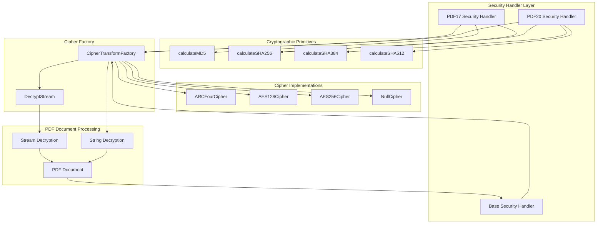
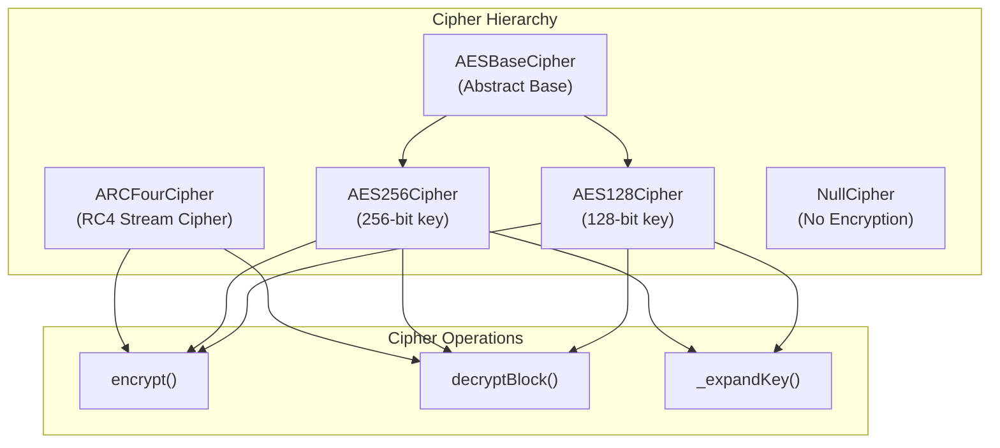
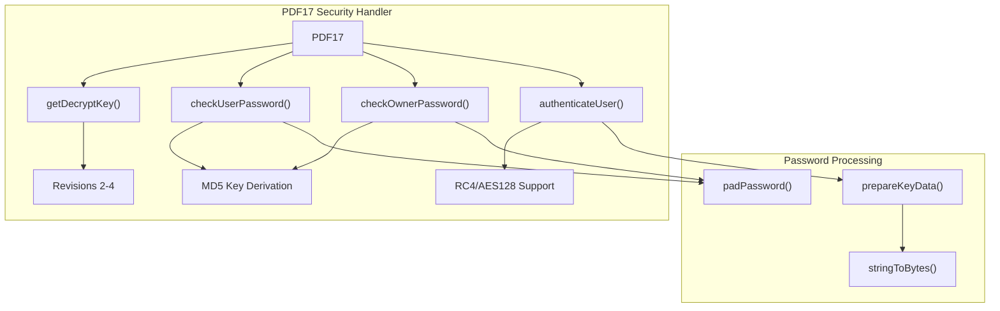
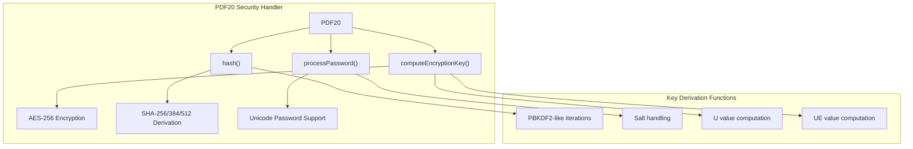
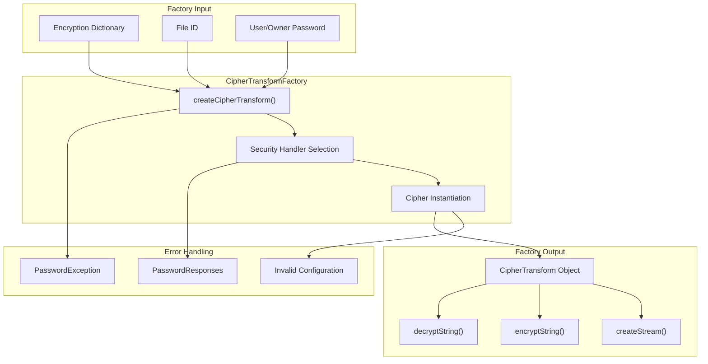
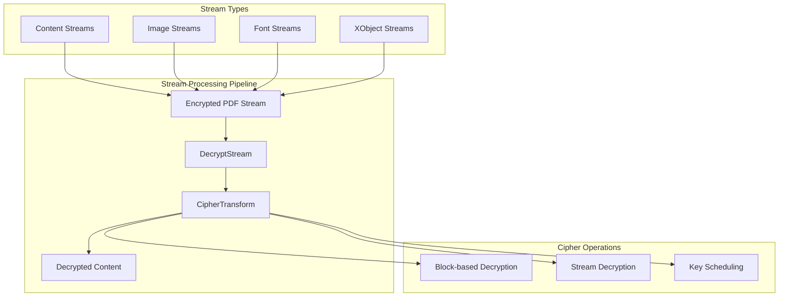

# Security and Encryption

> **Relevant source files**
> * [src/core/cff_parser.js](https://github.com/Mr-xzq/pdf.js-4.4.168/blob/19fbc899/src/core/cff_parser.js)
> * [src/core/crypto.js](https://github.com/Mr-xzq/pdf.js-4.4.168/blob/19fbc899/src/core/crypto.js)
> * [test/integration-boot.mjs](https://github.com/Mr-xzq/pdf.js-4.4.168/blob/19fbc899/test/integration-boot.mjs)
> * [test/integration/text_layer_spec.mjs](https://github.com/Mr-xzq/pdf.js-4.4.168/blob/19fbc899/test/integration/text_layer_spec.mjs)
> * [test/integration/viewer_spec.mjs](https://github.com/Mr-xzq/pdf.js-4.4.168/blob/19fbc899/test/integration/viewer_spec.mjs)
> * [test/unit/cff_parser_spec.js](https://github.com/Mr-xzq/pdf.js-4.4.168/blob/19fbc899/test/unit/cff_parser_spec.js)
> * [test/unit/crypto_spec.js](https://github.com/Mr-xzq/pdf.js-4.4.168/blob/19fbc899/test/unit/crypto_spec.js)
> * [test/unit/evaluator_spec.js](https://github.com/Mr-xzq/pdf.js-4.4.168/blob/19fbc899/test/unit/evaluator_spec.js)
> * [test/unit/function_spec.js](https://github.com/Mr-xzq/pdf.js-4.4.168/blob/19fbc899/test/unit/function_spec.js)
> * [test/unit/murmurhash3_spec.js](https://github.com/Mr-xzq/pdf.js-4.4.168/blob/19fbc899/test/unit/murmurhash3_spec.js)
> * [test/unit/network_spec.js](https://github.com/Mr-xzq/pdf.js-4.4.168/blob/19fbc899/test/unit/network_spec.js)
> * [test/unit/stream_spec.js](https://github.com/Mr-xzq/pdf.js-4.4.168/blob/19fbc899/test/unit/stream_spec.js)
> * [test/unit/testreporter.js](https://github.com/Mr-xzq/pdf.js-4.4.168/blob/19fbc899/test/unit/testreporter.js)
> * [test/unit/type1_parser_spec.js](https://github.com/Mr-xzq/pdf.js-4.4.168/blob/19fbc899/test/unit/type1_parser_spec.js)

This document covers PDF.js's security and encryption systems, including cryptographic algorithm implementations, PDF security handlers, and encryption/decryption mechanisms. This system handles password-protected PDFs, implements various cipher algorithms, and manages security transformations during PDF processing.

For information about PDF content processing and parsing, see [Core PDF Processing Engine](/Mr-xzq/pdf.js-4.4.168/2-core-pdf-processing-engine).

## PDF Security Architecture

PDF.js implements a comprehensive security system that supports multiple encryption standards and security handlers. The system is built around cipher factories, security handlers, and cryptographic primitives.

Sources: [src/core/crypto.js L1-L1754](https://github.com/Mr-xzq/pdf.js-4.4.168/blob/19fbc899/src/core/crypto.js#L1-L1754)

 [src/core/decrypt_stream.js](https://github.com/Mr-xzq/pdf.js-4.4.168/blob/19fbc899/src/core/decrypt_stream.js)

## Cryptographic Algorithm Implementations

PDF.js includes pure JavaScript implementations of standard cryptographic algorithms used in PDF encryption.

### Hash Functions

The system implements MD5 and SHA family hash functions for password verification and key derivation:

| Algorithm | Function | Usage |
| --- | --- | --- |
| MD5 | `calculateMD5` | Legacy PDF security, older encryption standards |
| SHA-256 | `calculateSHA256` | Modern PDF security, AES key derivation |
| SHA-384 | `calculateSHA384` | PDF 2.0 security features |
| SHA-512 | `calculateSHA512` | PDF 2.0 security, extended key derivation |

### Symmetric Encryption Ciphers

The `AESBaseCipher` class provides common AES functionality including S-boxes, MixColumns operations, and the core encryption/decryption rounds. The `ARCFourCipher` implements the RC4 stream cipher used in older PDF encryption standards.

Sources: [src/core/crypto.js L30-L1163](https://github.com/Mr-xzq/pdf.js-4.4.168/blob/19fbc899/src/core/crypto.js#L30-L1163)

 [src/core/crypto.js L684-L1107](https://github.com/Mr-xzq/pdf.js-4.4.168/blob/19fbc899/src/core/crypto.js#L684-L1107)

## Security Handlers

PDF.js implements different security handlers corresponding to PDF specification versions and encryption methods.

### PDF17 Security Handler

The `PDF17` class handles traditional PDF encryption (up to PDF 1.7):

### PDF20 Security Handler

The `PDF20` class implements modern PDF 2.0 encryption with stronger algorithms:

Sources: [src/core/crypto.js L1164-L1754](https://github.com/Mr-xzq/pdf.js-4.4.168/blob/19fbc899/src/core/crypto.js#L1164-L1754)

## Cipher Transform Factory

The `CipherTransformFactory` creates appropriate cipher instances based on PDF encryption dictionaries and handles the integration between security handlers and stream processing.

The factory pattern allows the PDF processing system to remain agnostic about specific encryption details while ensuring proper cipher selection and configuration.

Sources: [src/core/crypto.js L1164-L1754](https://github.com/Mr-xzq/pdf.js-4.4.168/blob/19fbc899/src/core/crypto.js#L1164-L1754)

## Integration with PDF Processing

The security system integrates with PDF document processing through stream and string decryption mechanisms.

### Stream Decryption

Encrypted PDF streams are processed through the `DecryptStream` class, which wraps the underlying stream with appropriate cipher operations:

### String Decryption

PDF string objects are decrypted directly through the cipher transform's `decryptString` method, handling both regular strings and hexadecimal string representations.

Sources: [src/core/decrypt_stream.js](https://github.com/Mr-xzq/pdf.js-4.4.168/blob/19fbc899/src/core/decrypt_stream.js)

 [src/core/crypto.js L1164-L1754](https://github.com/Mr-xzq/pdf.js-4.4.168/blob/19fbc899/src/core/crypto.js#L1164-L1754)

## Error Handling and Password Management

The security system provides comprehensive error handling for authentication failures and password management:

| Exception Type | Usage | Response Options |
| --- | --- | --- |
| `PasswordException` | Authentication failure | `NEED_PASSWORD`, `INCORRECT_PASSWORD` |
| `PasswordResponses` | Password prompt responses | User interaction handling |
| `FormatError` | Invalid encryption data | Graceful degradation |

The system supports both user and owner password authentication, with appropriate fallback mechanisms for different PDF security configurations.

Sources: [src/shared/util.js](https://github.com/Mr-xzq/pdf.js-4.4.168/blob/19fbc899/src/shared/util.js)

 [src/core/crypto.js L1164-L1754](https://github.com/Mr-xzq/pdf.js-4.4.168/blob/19fbc899/src/core/crypto.js#L1164-L1754)