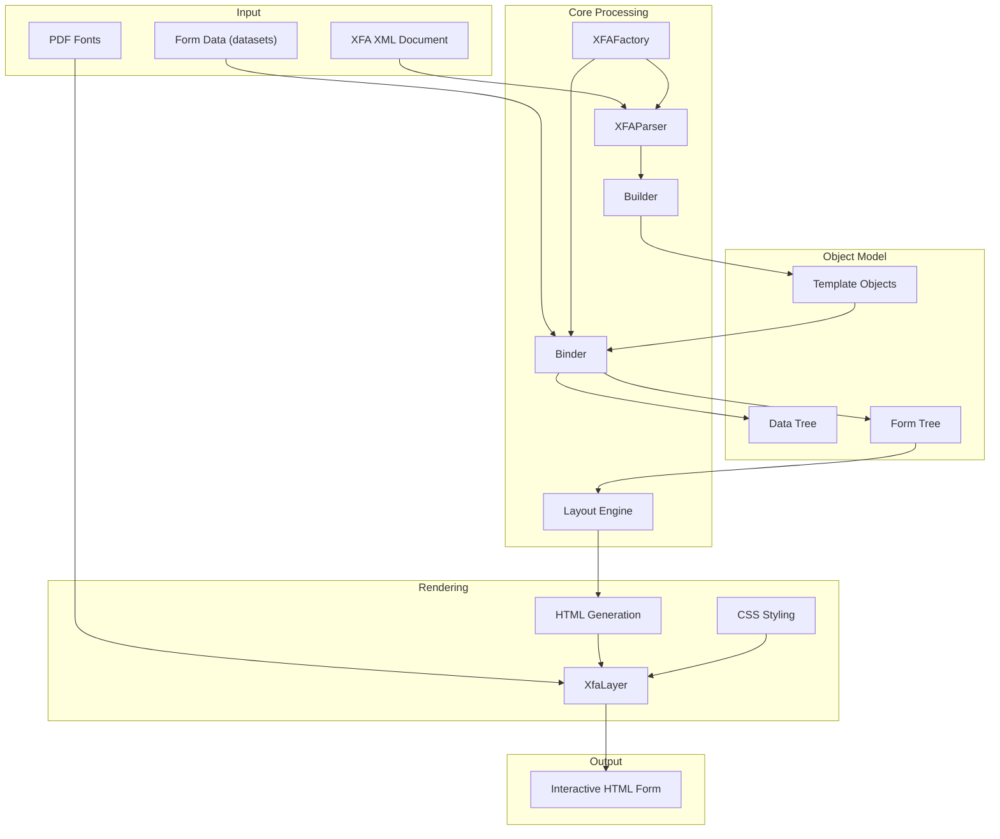
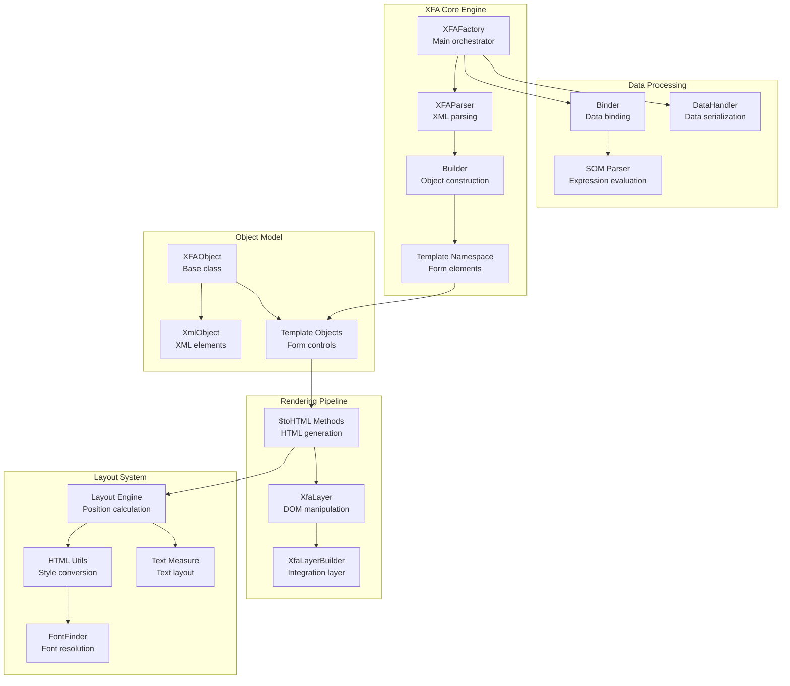
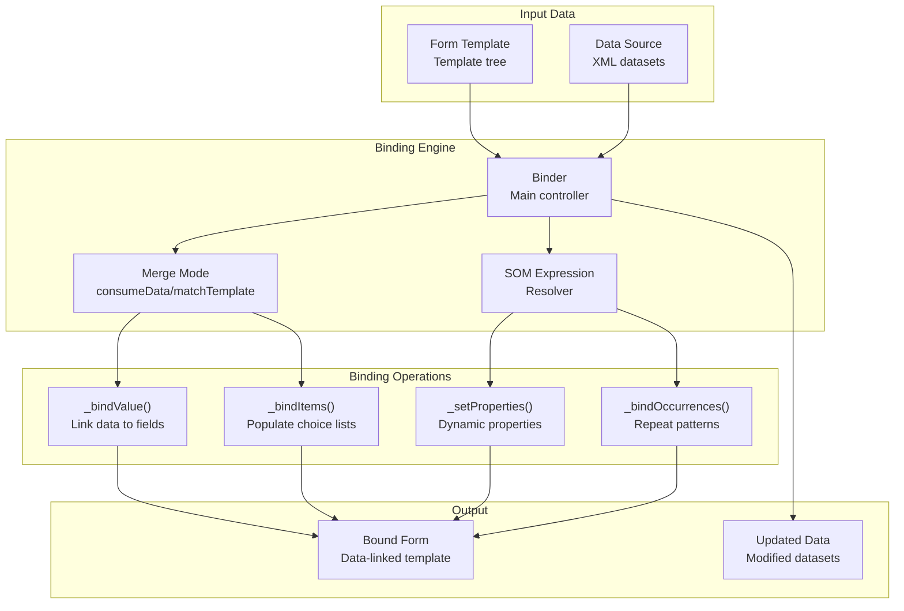
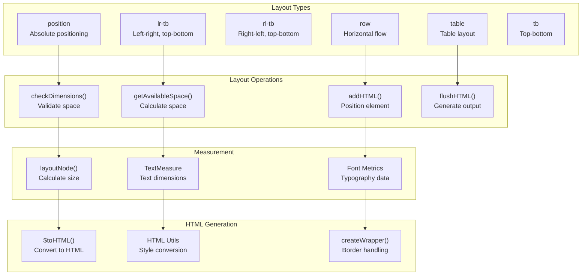
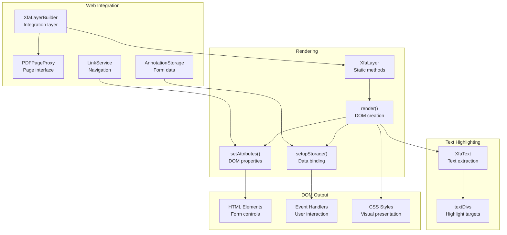

# XFA Forms Processing

> **Relevant source files**
> * [src/core/xfa/bind.js](https://github.com/Mr-xzq/pdf.js-4.4.168/blob/19fbc899/src/core/xfa/bind.js)
> * [src/core/xfa/builder.js](https://github.com/Mr-xzq/pdf.js-4.4.168/blob/19fbc899/src/core/xfa/builder.js)
> * [src/core/xfa/datasets.js](https://github.com/Mr-xzq/pdf.js-4.4.168/blob/19fbc899/src/core/xfa/datasets.js)
> * [src/core/xfa/factory.js](https://github.com/Mr-xzq/pdf.js-4.4.168/blob/19fbc899/src/core/xfa/factory.js)
> * [src/core/xfa/fonts.js](https://github.com/Mr-xzq/pdf.js-4.4.168/blob/19fbc899/src/core/xfa/fonts.js)
> * [src/core/xfa/html_utils.js](https://github.com/Mr-xzq/pdf.js-4.4.168/blob/19fbc899/src/core/xfa/html_utils.js)
> * [src/core/xfa/layout.js](https://github.com/Mr-xzq/pdf.js-4.4.168/blob/19fbc899/src/core/xfa/layout.js)
> * [src/core/xfa/parser.js](https://github.com/Mr-xzq/pdf.js-4.4.168/blob/19fbc899/src/core/xfa/parser.js)
> * [src/core/xfa/som.js](https://github.com/Mr-xzq/pdf.js-4.4.168/blob/19fbc899/src/core/xfa/som.js)
> * [src/core/xfa/template.js](https://github.com/Mr-xzq/pdf.js-4.4.168/blob/19fbc899/src/core/xfa/template.js)
> * [src/core/xfa/text.js](https://github.com/Mr-xzq/pdf.js-4.4.168/blob/19fbc899/src/core/xfa/text.js)
> * [src/core/xfa/xfa_object.js](https://github.com/Mr-xzq/pdf.js-4.4.168/blob/19fbc899/src/core/xfa/xfa_object.js)
> * [src/core/xfa/xhtml.js](https://github.com/Mr-xzq/pdf.js-4.4.168/blob/19fbc899/src/core/xfa/xhtml.js)
> * [src/display/xfa_layer.js](https://github.com/Mr-xzq/pdf.js-4.4.168/blob/19fbc899/src/display/xfa_layer.js)
> * [test/pdfs/xfa_issue13668.pdf.link](https://github.com/Mr-xzq/pdf.js-4.4.168/blob/19fbc899/test/pdfs/xfa_issue13668.pdf.link)
> * [test/pdfs/xfa_issue13994.pdf.link](https://github.com/Mr-xzq/pdf.js-4.4.168/blob/19fbc899/test/pdfs/xfa_issue13994.pdf.link)
> * [test/unit/xfa_parser_spec.js](https://github.com/Mr-xzq/pdf.js-4.4.168/blob/19fbc899/test/unit/xfa_parser_spec.js)
> * [test/unit/xfa_tohtml_spec.js](https://github.com/Mr-xzq/pdf.js-4.4.168/blob/19fbc899/test/unit/xfa_tohtml_spec.js)
> * [web/print_utils.js](https://github.com/Mr-xzq/pdf.js-4.4.168/blob/19fbc899/web/print_utils.js)
> * [web/xfa_layer_builder.css](https://github.com/Mr-xzq/pdf.js-4.4.168/blob/19fbc899/web/xfa_layer_builder.css)
> * [web/xfa_layer_builder.js](https://github.com/Mr-xzq/pdf.js-4.4.168/blob/19fbc899/web/xfa_layer_builder.js)

## Purpose and Scope

This document covers the XFA (XML Forms Architecture) processing system in PDF.js, which handles parsing, binding, layout, and rendering of XFA-based PDF forms. XFA forms are dynamic, XML-based forms that can contain complex layouts, data binding, and interactive elements.

For information about static PDF form fields (AcroForm), see [Annotation and Form Handling](/Mr-xzq/pdf.js-4.4.168/3.4-annotation-and-form-handling). For general PDF parsing and content processing, see [Core PDF Processing Engine](/Mr-xzq/pdf.js-4.4.168/2-core-pdf-processing-engine).

## Architecture Overview

The XFA processing system transforms XML-based form definitions into interactive HTML forms through a multi-stage pipeline involving parsing, data binding, layout calculation, and HTML generation.

### XFA Processing Pipeline



Sources: [src/core/xfa/factory.js L32-L43](https://github.com/Mr-xzq/pdf.js-4.4.168/blob/19fbc899/src/core/xfa/factory.js#L32-L43)

 [src/core/xfa/parser.js L32-L46](https://github.com/Mr-xzq/pdf.js-4.4.168/blob/19fbc899/src/core/xfa/parser.js#L32-L46)

 [src/core/xfa/bind.js L54-L76](https://github.com/Mr-xzq/pdf.js-4.4.168/blob/19fbc899/src/core/xfa/bind.js#L54-L76)

 [src/display/xfa_layer.js L33-L103](https://github.com/Mr-xzq/pdf.js-4.4.168/blob/19fbc899/src/display/xfa_layer.js#L33-L103)

### System Component Architecture



Sources: [src/core/xfa/factory.js L32-L140](https://github.com/Mr-xzq/pdf.js-4.4.168/blob/19fbc899/src/core/xfa/factory.js#L32-L140)

 [src/core/xfa/template.js L110-L130](https://github.com/Mr-xzq/pdf.js-4.4.168/blob/19fbc899/src/core/xfa/template.js#L110-L130)

 [src/core/xfa/bind.js L54-L76](https://github.com/Mr-xzq/pdf.js-4.4.168/blob/19fbc899/src/core/xfa/bind.js#L54-L76)

 [src/core/xfa/layout.js L26-L54](https://github.com/Mr-xzq/pdf.js-4.4.168/blob/19fbc899/src/core/xfa/layout.js#L26-L54)

## XFA Parsing and Object Model

The XFA parser converts XML documents into a structured object model representing form templates and data.

### XFA Object Hierarchy

```mermaid
flowchart TD

XFAObject["XFAObject<br>Base XFA element"]
XmlObject["XmlObject<br>Generic XML element"]
XFAObjectArray["XFAObjectArray<br>Collections"]
ContentObject["ContentObject<br>Text content"]
Template["Template<br>Root template"]
Subform["Subform<br>Container"]
Field["Field<br>Form field"]
Draw["Draw<br>Static content"]
PageSet["PageSet<br>Page layout"]
PageArea["PageArea<br>Page definition"]
TextEdit["TextEdit<br>Text input"]
CheckButton["CheckButton<br>Checkbox/Radio"]
ChoiceList["ChoiceList<br>Dropdown/List"]
Button["Button<br>Push button"]
Font["Font<br>Typography"]
Border["Border<br>Borders"]
Margin["Margin<br>Spacing"]
Para["Para<br>Paragraph"]
Value["Value<br>Field value"]
Text["Text<br>Text content"]
Integer["Integer<br>Numeric value"]
Boolean["Boolean<br>True/false"]

XFAObject --> Template
XFAObject --> Subform
XFAObject --> Field
XFAObject --> Draw
XFAObject --> PageSet
XFAObject --> PageArea
XFAObject --> TextEdit
XFAObject --> CheckButton
XFAObject --> ChoiceList
XFAObject --> Button
XFAObject --> Font
XFAObject --> Border
XFAObject --> Margin
XFAObject --> Para
ContentObject --> Value
ContentObject --> Text
ContentObject --> Integer
ContentObject --> Boolean
Field --> TextEdit
Field --> CheckButton
Field --> ChoiceList
Field --> Button

subgraph subGraph4 ["Data Objects"]
    Value
    Text
    Integer
    Boolean
end

subgraph subGraph3 ["Styling Objects"]
    Font
    Border
    Margin
    Para
end

subgraph subGraph2 ["UI Controls"]
    TextEdit
    CheckButton
    ChoiceList
    Button
end

subgraph subGraph1 ["Template Objects"]
    Template
    Subform
    Field
    Draw
    PageSet
    PageArea
end

subgraph subGraph0 ["Base Classes"]
    XFAObject
    XmlObject
    XFAObjectArray
    ContentObject
end
```



Sources: [src/core/xfa/xfa_object.js L104-L321](https://github.com/Mr-xzq/pdf.js-4.4.168/blob/19fbc899/src/core/xfa/xfa_object.js#L104-L321)

 [src/core/xfa/template.js L421-L1125](https://github.com/Mr-xzq/pdf.js-4.4.168/blob/19fbc899/src/core/xfa/template.js#L421-L1125)

 [src/core/xfa/template.js L2983-L3124](https://github.com/Mr-xzq/pdf.js-4.4.168/blob/19fbc899/src/core/xfa/template.js#L2983-L3124)

### Parser Implementation

The `XFAParser` class extends `XMLParserBase` and uses a `Builder` to construct the object hierarchy:

| Component | Purpose | Key Methods |
| --- | --- | --- |
| `XFAParser` | XML parsing and object creation | `parse()`, `onText()`, `onCdata()` |
| `Builder` | Object construction and namespace handling | `buildRoot()`, `build()`, `buildObject()` |
| `NamespaceIds` | Namespace identification | Template, datasets, xhtml namespaces |
| `Template` classes | Form element implementations | `$toHTML()`, `$setValue()`, `$appendChild()` |

Sources: [src/core/xfa/parser.js L32-L182](https://github.com/Mr-xzq/pdf.js-4.4.168/blob/19fbc899/src/core/xfa/parser.js#L32-L182)

 [src/core/xfa/builder.js L68-L168](https://github.com/Mr-xzq/pdf.js-4.4.168/blob/19fbc899/src/core/xfa/builder.js#L68-L168)

 [src/core/xfa/template.js L110-L500](https://github.com/Mr-xzq/pdf.js-4.4.168/blob/19fbc899/src/core/xfa/template.js#L110-L500)

## Data Binding

The `Binder` class connects form templates with data sources, handling both data consumption and form generation modes.

### Data Binding Process



Sources: [src/core/xfa/bind.js L54-L76](https://github.com/Mr-xzq/pdf.js-4.4.168/blob/19fbc899/src/core/xfa/bind.js#L54-L76)

 [src/core/xfa/bind.js L82-L110](https://github.com/Mr-xzq/pdf.js-4.4.168/blob/19fbc899/src/core/xfa/bind.js#L82-L110)

 [src/core/xfa/bind.js L175-L277](https://github.com/Mr-xzq/pdf.js-4.4.168/blob/19fbc899/src/core/xfa/bind.js#L175-L277)

### SOM Expression Resolution

SOM (Scripting Object Model) expressions provide XPath-like navigation through the form hierarchy:

| Expression Type | Syntax | Purpose |
| --- | --- | --- |
| Absolute | `$template.subform.field` | Navigate from root |
| Relative | `field.value` | Navigate from current |
| Parent | `..` | Move to parent |
| Shortcuts | `$data`, `$form` | Predefined references |
| Indexed | `field[2]` | Access array elements |

Sources: [src/core/xfa/som.js L24-L159](https://github.com/Mr-xzq/pdf.js-4.4.168/blob/19fbc899/src/core/xfa/som.js#L24-L159)

 [src/core/xfa/som.js L161-L240](https://github.com/Mr-xzq/pdf.js-4.4.168/blob/19fbc899/src/core/xfa/som.js#L161-L240)

## Layout and Rendering

The layout system calculates element positions and converts XFA objects to HTML structures.

### Layout Engine Architecture



Sources: [src/core/xfa/layout.js L55-L199](https://github.com/Mr-xzq/pdf.js-4.4.168/blob/19fbc899/src/core/xfa/layout.js#L55-L199)

 [src/core/xfa/layout.js L265-L355](https://github.com/Mr-xzq/pdf.js-4.4.168/blob/19fbc899/src/core/xfa/layout.js#L265-L355)

 [src/core/xfa/html_utils.js L194-L286](https://github.com/Mr-xzq/pdf.js-4.4.168/blob/19fbc899/src/core/xfa/html_utils.js#L194-L286)

### HTML Conversion Process

Each XFA object implements `$toHTML()` to generate corresponding HTML structures:

| XFA Element | HTML Output | Key Features |
| --- | --- | --- |
| `Field` + `TextEdit` | `<input>` or `<textarea>` | Text input with validation |
| `Field` + `CheckButton` | `<input type="checkbox/radio">` | Selection controls |
| `Field` + `ChoiceList` | `<select>` | Dropdown/listbox |
| `Draw` | `<div>` | Static content container |
| `Subform` | `<div>` | Layout container |

Sources: [src/core/xfa/template.js L3985-L4050](https://github.com/Mr-xzq/pdf.js-4.4.168/blob/19fbc899/src/core/xfa/template.js#L3985-L4050)

 [src/core/xfa/template.js L1321-L1391](https://github.com/Mr-xzq/pdf.js-4.4.168/blob/19fbc899/src/core/xfa/template.js#L1321-L1391)

 [src/core/xfa/template.js L1394-L1474](https://github.com/Mr-xzq/pdf.js-4.4.168/blob/19fbc899/src/core/xfa/template.js#L1394-L1474)

## Display Integration

The display layer renders XFA forms as interactive HTML within the PDF viewer.

### XFA Layer Implementation



Sources: [web/xfa_layer_builder.js L33-L114](https://github.com/Mr-xzq/pdf.js-4.4.168/blob/19fbc899/web/xfa_layer_builder.js#L33-L114)

 [src/display/xfa_layer.js L33-L103](https://github.com/Mr-xzq/pdf.js-4.4.168/blob/19fbc899/src/display/xfa_layer.js#L33-L103)

 [src/display/xfa_layer.js L105-L158](https://github.com/Mr-xzq/pdf.js-4.4.168/blob/19fbc899/src/display/xfa_layer.js#L105-L158)

### Form Interaction Handling

The XFA layer handles form interactions through event listeners and storage integration:

| Interaction Type | Implementation | Storage Method |
| --- | --- | --- |
| Text Input | `input` event on `<input>` | `setValue()` with text value |
| Checkbox/Radio | `change` event | `setValue()` with on/off values |
| Dropdown | `input` event on `<select>` | `setValue()` with selected option |
| Button Click | URL navigation | `linkService.addLinkAttributes()` |

Sources: [src/display/xfa_layer.js L34-L103](https://github.com/Mr-xzq/pdf.js-4.4.168/blob/19fbc899/src/display/xfa_layer.js#L34-L103)

 [src/display/xfa_layer.js L105-L158](https://github.com/Mr-xzq/pdf.js-4.4.168/blob/19fbc899/src/display/xfa_layer.js#L105-L158)

### CSS Styling System

XFA forms use custom CSS classes for styling and layout:

```
.xfaLayer        /* Main container */
.xfaFont         /* Font styling */
.xfaTextfield    /* Text inputs */
.xfaCheckbox     /* Checkboxes */
.xfaRadio        /* Radio buttons */
.xfaSelect       /* Dropdowns */
.xfaButton       /* Buttons */
.xfaLrTb         /* Left-right, top-bottom layout */
.xfaTable        /* Table layout */
.xfaPosition     /* Absolute positioning */
```

Sources: [web/xfa_layer_builder.css L30-L329](https://github.com/Mr-xzq/pdf.js-4.4.168/blob/19fbc899/web/xfa_layer_builder.css#L30-L329)

## Error Handling and Validation

The XFA system includes comprehensive error handling and validation mechanisms:

| Component | Error Handling | Validation |
| --- | --- | --- |
| Parser | XML syntax errors, namespace validation | Well-formed XML checking |
| Binder | Invalid SOM expressions, type mismatches | Data type validation |
| Layout | Dimension overflow, infinite loops | Space constraints |
| Rendering | Missing fonts, invalid HTML | DOM structure validation |

Sources: [src/core/xfa/parser.js L48-L58](https://github.com/Mr-xzq/pdf.js-4.4.168/blob/19fbc899/src/core/xfa/parser.js#L48-L58)

 [src/core/xfa/bind.js L103-L109](https://github.com/Mr-xzq/pdf.js-4.4.168/blob/19fbc899/src/core/xfa/bind.js#L103-L109)

 [src/core/xfa/layout.js L265-L320](https://github.com/Mr-xzq/pdf.js-4.4.168/blob/19fbc899/src/core/xfa/layout.js#L265-L320)