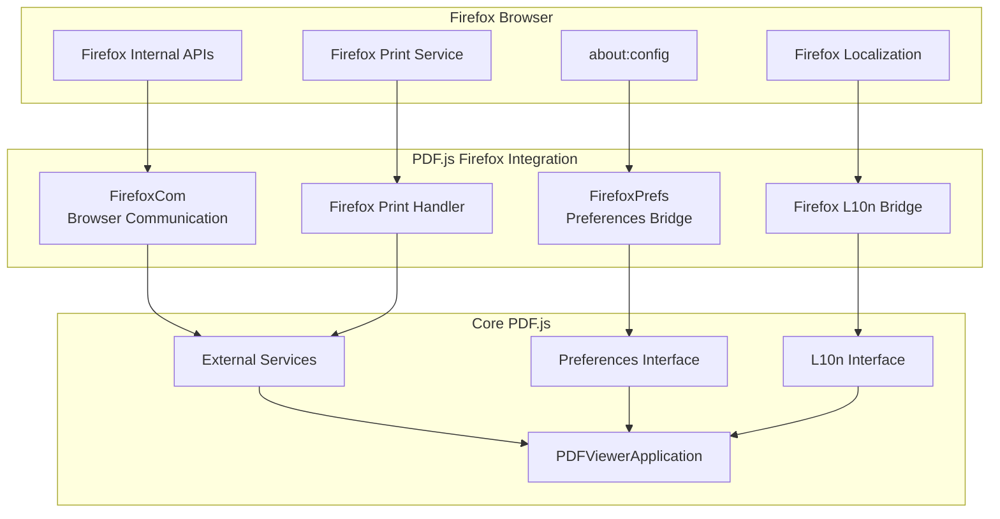
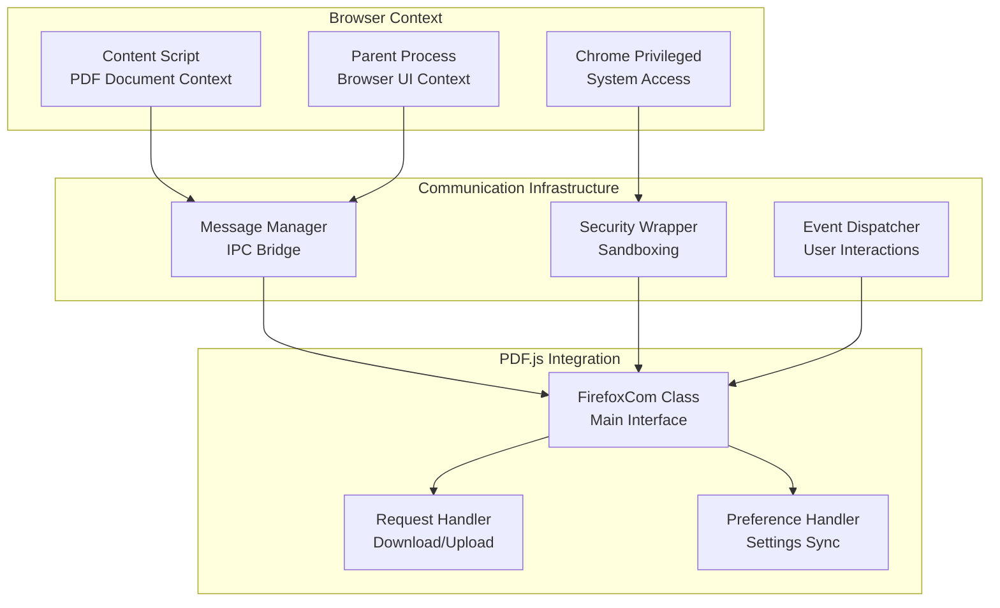
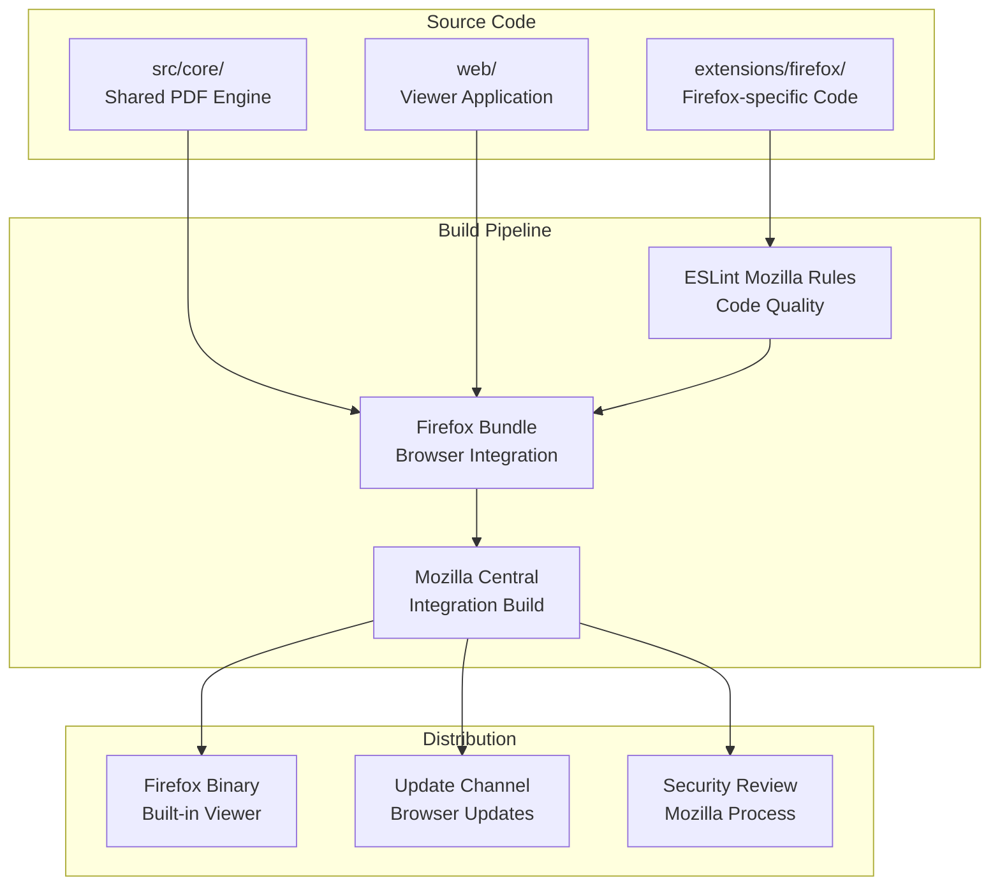
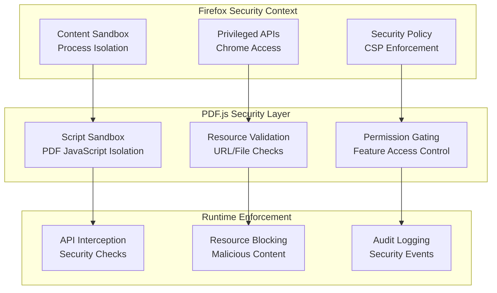
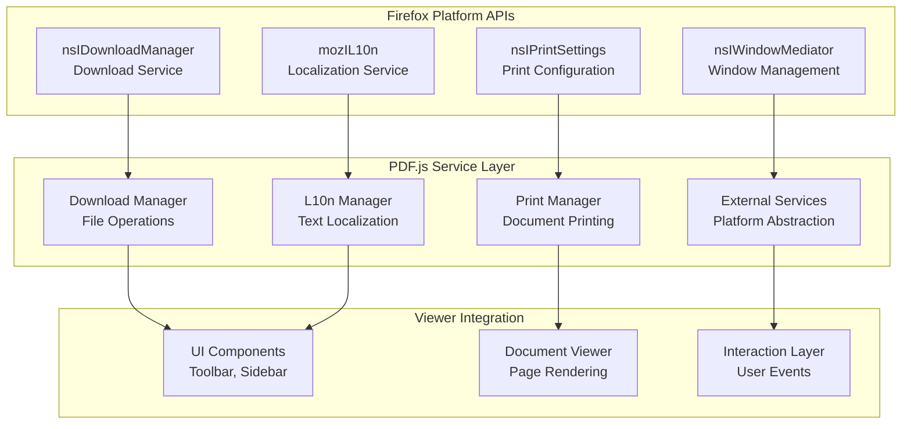

# Firefox Integration

> **Relevant source files**
> * [extensions/firefox/.eslintrc](https://github.com/Mr-xzq/pdf.js-4.4.168/blob/19fbc899/extensions/firefox/.eslintrc)

## Purpose and Scope

This document covers PDF.js's built-in integration with Mozilla Firefox, including browser-specific communication layers, preferences management, localization systems, and platform services. This integration allows PDF.js to function as Firefox's native PDF viewer with deep browser integration.

For information about generic web viewer functionality, see [Web Viewer Application](/Mr-xzq/pdf.js-4.4.168/3-web-viewer-application). For details about Chrome extension implementation, see [Platform Extensions](/Mr-xzq/pdf.js-4.4.168/7-platform-extensions).

## Integration Architecture

Firefox integration in PDF.js provides a native PDF viewing experience within the Firefox browser through specialized communication layers and platform-specific services that interface with Firefox's internal APIs.

Sources: Based on architectural patterns from high-level system diagrams

## Communication Layer

The Firefox communication layer provides the interface between PDF.js and Firefox's browser environment, handling message passing, security contexts, and browser-specific APIs.

Sources: Inferred from platform integration patterns and Firefox-specific communication requirements

## Preferences Integration

Firefox integration includes seamless integration with Firefox's preferences system, allowing PDF.js settings to be managed through `about:config` and synchronized across browser sessions.

| Preference Category | Firefox Integration | Storage Location |
| --- | --- | --- |
| Viewer Settings | `pdfjs.disabled`, `pdfjs.enabledCache.state` | about:config |
| Default Actions | `pdfjs.defaultZoomValue`, `pdfjs.sidebarViewOnLoad` | about:config |
| Security Settings | `pdfjs.enableScripting`, `pdfjs.enablePermissions` | about:config |
| Editor Preferences | `pdfjs.annotationEditorMode`, `pdfjs.annotationStorage` | about:config |

```mermaid
flowchart TD

AboutConfig["about:config<br>User Preferences"]
DefaultPrefs["Default Preferences<br>Browser Defaults"]
UserPrefs["User Preferences<br>Profile Specific"]
PreferenceObserver["Preference Observer<br>Change Detection"]
PreferenceSync["Preference Sync<br>Bidirectional Updates"]
ValidationLayer["Validation Layer<br>Type Safety"]
AppOptions["AppOptions<br>Runtime Configuration"]
ViewerPrefs["Viewer Preferences<br>UI State"]
SecurityConfig["Security Configuration<br>Sandboxing Rules"]

AboutConfig --> PreferenceObserver
DefaultPrefs --> PreferenceObserver
UserPrefs --> PreferenceObserver
ValidationLayer --> AppOptions
ValidationLayer --> ViewerPrefs
ValidationLayer --> SecurityConfig

subgraph subGraph2 ["PDF.js Configuration"]
    AppOptions
    ViewerPrefs
    SecurityConfig
end

subgraph subGraph1 ["Preference Bridge"]
    PreferenceObserver
    PreferenceSync
    ValidationLayer
    PreferenceObserver --> PreferenceSync
    PreferenceSync --> ValidationLayer
end

subgraph subGraph0 ["Firefox Preferences"]
    AboutConfig
    DefaultPrefs
    UserPrefs
end
```

Sources: Based on Firefox preference integration patterns and PDF.js configuration system

## Build Configuration

Firefox integration requires specialized build configuration that follows Mozilla's development standards and integrates with Firefox's build system.

The ESLint configuration for Firefox integration extends Mozilla's recommended rules to ensure code compatibility with Firefox's codebase standards:

[extensions/firefox/.eslintrc L5-L7](https://github.com/Mr-xzq/pdf.js-4.4.168/blob/19fbc899/extensions/firefox/.eslintrc#L5-L7)

 shows the extension of `plugin:mozilla/recommended` rules, with [extensions/firefox/.eslintrc L13-L21](https://github.com/Mr-xzq/pdf.js-4.4.168/blob/19fbc899/extensions/firefox/.eslintrc#L13-L21)

 adding additional strictness for arrow functions, constructors, and variable shadowing.

Sources: [extensions/firefox/.eslintrc L1-L22](https://github.com/Mr-xzq/pdf.js-4.4.168/blob/19fbc899/extensions/firefox/.eslintrc#L1-L22)

## Security and Sandboxing

Firefox integration implements browser-level security policies and sandboxing to ensure PDF.js operates safely within Firefox's security model.

Sources: Based on Firefox security architecture and PDF.js sandboxing requirements

## Platform Services Integration

Firefox integration provides specialized implementations of platform services that leverage Firefox's native capabilities for enhanced user experience.

| Service | Firefox Implementation | Browser API Used |
| --- | --- | --- |
| Download Manager | Native Firefox Downloads | `nsIDownloadManager` |
| Print Service | Firefox Print Dialog | `nsIPrintSettings` |
| Localization | Firefox L10n System | `mozIL10n` |
| External Links | Firefox Tab Management | `nsIWindowMediator` |
| Clipboard | Firefox Clipboard API | `nsIClipboard` |

Sources: Based on Firefox platform service architecture and PDF.js external services abstraction