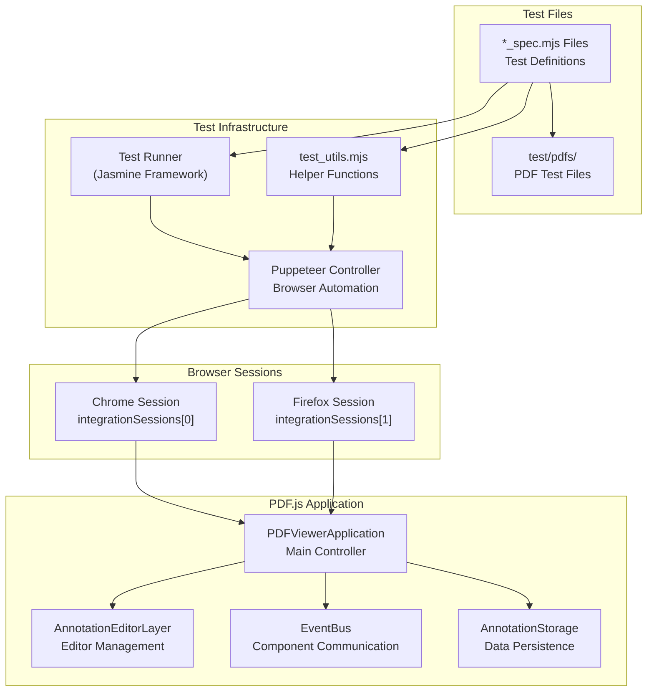
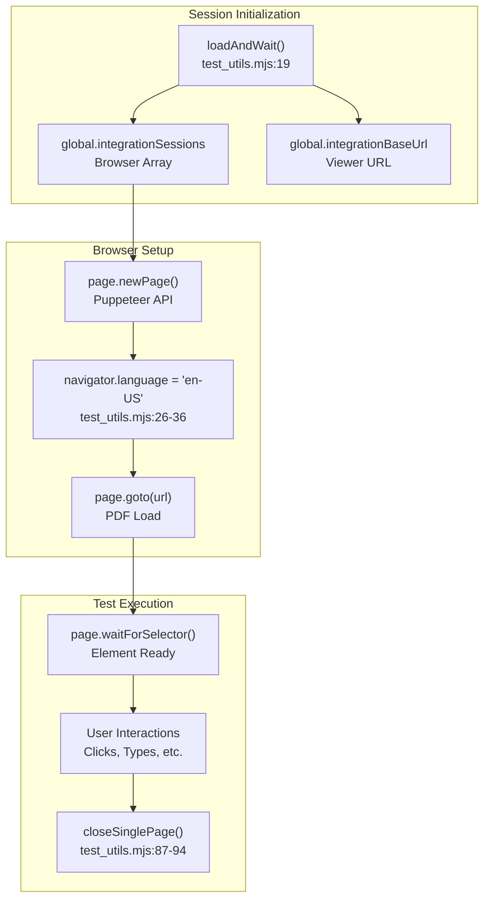
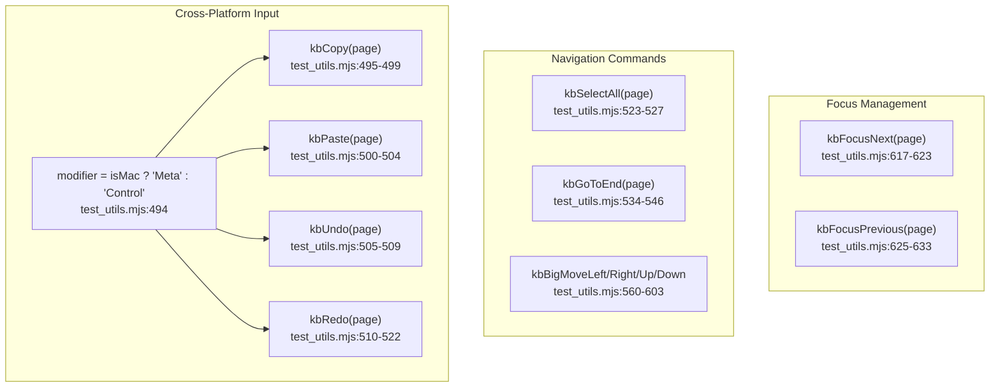
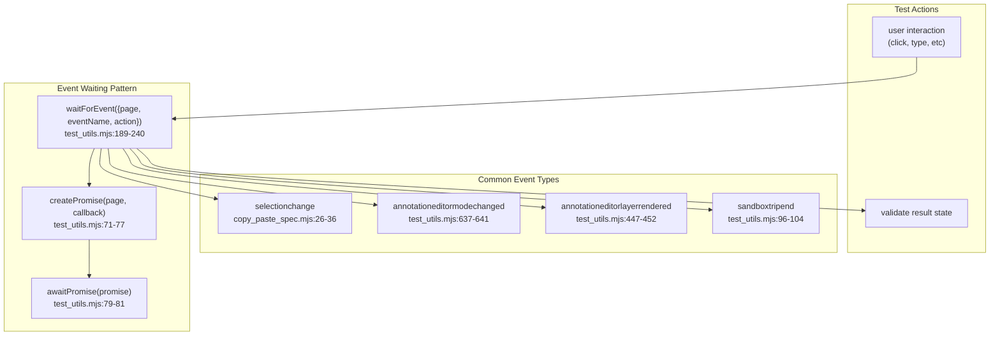
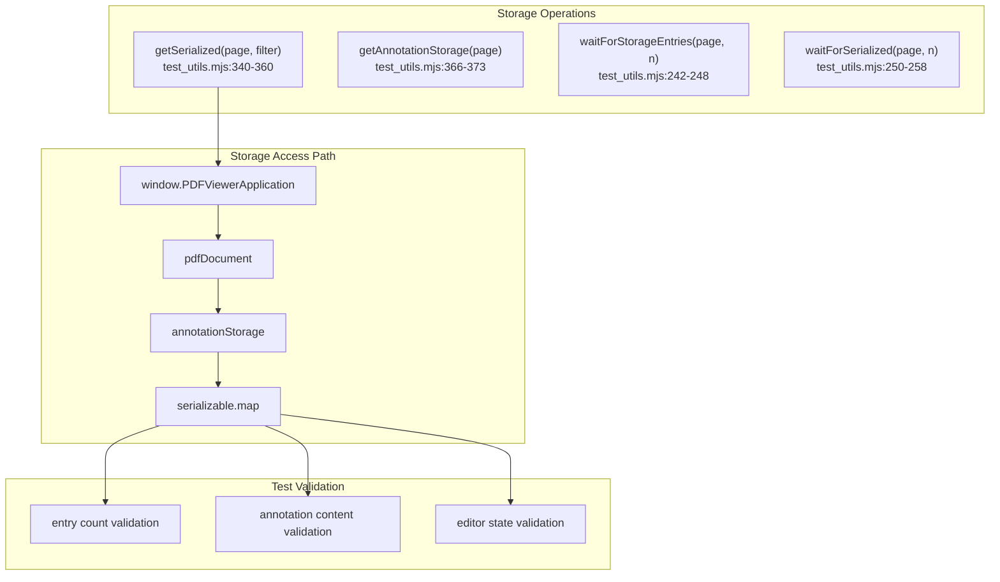
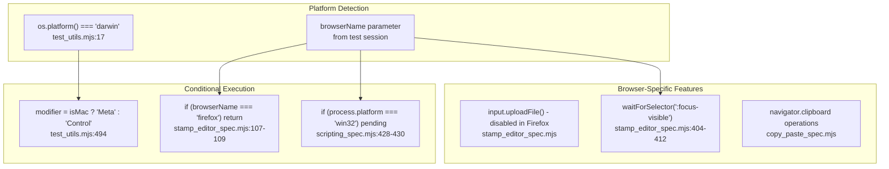
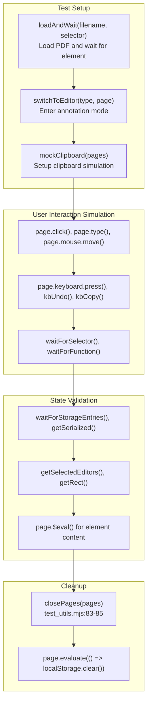

# Integration Testing

> **Relevant source files**
> * [test/integration/.eslintrc](https://github.com/Mr-xzq/pdf.js-4.4.168/blob/19fbc899/test/integration/.eslintrc)
> * [test/integration/accessibility_spec.mjs](https://github.com/Mr-xzq/pdf.js-4.4.168/blob/19fbc899/test/integration/accessibility_spec.mjs)
> * [test/integration/annotation_spec.mjs](https://github.com/Mr-xzq/pdf.js-4.4.168/blob/19fbc899/test/integration/annotation_spec.mjs)
> * [test/integration/caret_browsing_spec.mjs](https://github.com/Mr-xzq/pdf.js-4.4.168/blob/19fbc899/test/integration/caret_browsing_spec.mjs)
> * [test/integration/copy_paste_spec.mjs](https://github.com/Mr-xzq/pdf.js-4.4.168/blob/19fbc899/test/integration/copy_paste_spec.mjs)
> * [test/integration/find_spec.mjs](https://github.com/Mr-xzq/pdf.js-4.4.168/blob/19fbc899/test/integration/find_spec.mjs)
> * [test/integration/freetext_editor_spec.mjs](https://github.com/Mr-xzq/pdf.js-4.4.168/blob/19fbc899/test/integration/freetext_editor_spec.mjs)
> * [test/integration/ink_editor_spec.mjs](https://github.com/Mr-xzq/pdf.js-4.4.168/blob/19fbc899/test/integration/ink_editor_spec.mjs)
> * [test/integration/scripting_spec.mjs](https://github.com/Mr-xzq/pdf.js-4.4.168/blob/19fbc899/test/integration/scripting_spec.mjs)
> * [test/integration/stamp_editor_spec.mjs](https://github.com/Mr-xzq/pdf.js-4.4.168/blob/19fbc899/test/integration/stamp_editor_spec.mjs)
> * [test/integration/test_utils.mjs](https://github.com/Mr-xzq/pdf.js-4.4.168/blob/19fbc899/test/integration/test_utils.mjs)
> * [test/pdfs/issue17998.pdf](https://github.com/Mr-xzq/pdf.js-4.4.168/blob/19fbc899/test/pdfs/issue17998.pdf)
> * [test/pdfs/issue18305.pdf](https://github.com/Mr-xzq/pdf.js-4.4.168/blob/19fbc899/test/pdfs/issue18305.pdf)

## Purpose and Scope

Integration testing in PDF.js validates end-to-end functionality through browser automation, focusing on user interactions with the complete web viewer application. These tests verify that PDF rendering, annotation editing, form handling, scripting, and accessibility features work correctly across different browsers in real-world scenarios.

For information about unit testing, see [Unit Testing](/Mr-xzq/pdf.js-4.4.168/6.1-unit-testing). For visual regression testing of PDF rendering output, see [Visual Regression Testing](/Mr-xzq/pdf.js-4.4.168/6.3-visual-regression-testing).

## Test Infrastructure Architecture

The integration testing system uses Puppeteer for browser automation and Jasmine for test organization. Tests run against the full PDF.js viewer application loaded in headless browsers.

Sources: [test/integration/test_utils.mjs L20-L69](https://github.com/Mr-xzq/pdf.js-4.4.168/blob/19fbc899/test/integration/test_utils.mjs#L20-L69)

 [test/integration/freetext_editor_spec.mjs L106-L109](https://github.com/Mr-xzq/pdf.js-4.4.168/blob/19fbc899/test/integration/freetext_editor_spec.mjs#L106-L109)

## Global Test Session Management

Integration tests utilize a global session management system that maintains browser instances across test suites.

Sources: [test/integration/test_utils.mjs L19-L69](https://github.com/Mr-xzq/pdf.js-4.4.168/blob/19fbc899/test/integration/test_utils.mjs#L19-L69)

 [test/integration/test_utils.mjs L87-L94](https://github.com/Mr-xzq/pdf.js-4.4.168/blob/19fbc899/test/integration/test_utils.mjs#L87-L94)

## Helper Utilities System

The `test_utils.mjs` file provides a comprehensive set of helper functions for common testing operations:

### Element Selection and Interaction

| Function | Purpose | Line Reference |
| --- | --- | --- |
| `getSelector(id)` | Convert element ID to data attribute selector | [test/integration/test_utils.mjs L131-L133](https://github.com/Mr-xzq/pdf.js-4.4.168/blob/19fbc899/test/integration/test_utils.mjs#L131-L133) |
| `getEditorSelector(n)` | Get selector for annotation editor by number | [test/integration/test_utils.mjs L152-L154](https://github.com/Mr-xzq/pdf.js-4.4.168/blob/19fbc899/test/integration/test_utils.mjs#L152-L154) |
| `getRect(page, selector)` | Get element bounding rectangle | [test/integration/test_utils.mjs L135-L142](https://github.com/Mr-xzq/pdf.js-4.4.168/blob/19fbc899/test/integration/test_utils.mjs#L135-L142) |
| `waitForSelectedEditor(page, selector)` | Wait for editor selection state | [test/integration/test_utils.mjs L275-L277](https://github.com/Mr-xzq/pdf.js-4.4.168/blob/19fbc899/test/integration/test_utils.mjs#L275-L277) |

### Annotation Editor Operations

| Function | Purpose | Line Reference |
| --- | --- | --- |
| `switchToEditor(name, page)` | Change annotation editor mode | [test/integration/test_utils.mjs L635-L650](https://github.com/Mr-xzq/pdf.js-4.4.168/blob/19fbc899/test/integration/test_utils.mjs#L635-L650) |
| `getSelectedEditors(page)` | Get array of selected editor IDs | [test/integration/test_utils.mjs L156-L166](https://github.com/Mr-xzq/pdf.js-4.4.168/blob/19fbc899/test/integration/test_utils.mjs#L156-L166) |
| `getSerialized(page, filter)` | Extract serialized annotation data | [test/integration/test_utils.mjs L340-L360](https://github.com/Mr-xzq/pdf.js-4.4.168/blob/19fbc899/test/integration/test_utils.mjs#L340-L360) |
| `waitForStorageEntries(page, nEntries)` | Wait for annotation count in storage | [test/integration/test_utils.mjs L242-L248](https://github.com/Mr-xzq/pdf.js-4.4.168/blob/19fbc899/test/integration/test_utils.mjs#L242-L248) |

### Keyboard and Mouse Simulation

Sources: [test/integration/test_utils.mjs L494-L633](https://github.com/Mr-xzq/pdf.js-4.4.168/blob/19fbc899/test/integration/test_utils.mjs#L494-L633)

## Test Categories and Coverage

Integration tests are organized into distinct categories covering different aspects of PDF.js functionality:

### Editor Testing

| Test Suite | File | Focus Area |
| --- | --- | --- |
| FreeText Editor | `freetext_editor_spec.mjs` | Text annotation creation and editing |
| Stamp Editor | `stamp_editor_spec.mjs` | Image stamp annotations and alt-text |
| Ink Editor | `ink_editor_spec.mjs` | Drawing/sketching functionality |

### Form and Scripting Testing

| Test Suite | File | Focus Area |
| --- | --- | --- |
| Scripting | `scripting_spec.mjs` | PDF JavaScript execution and form interactions |
| Annotations | `annotation_spec.mjs` | Form field behavior and validation |

### User Interface Testing

| Test Suite | File | Focus Area |
| --- | --- | --- |
| Copy/Paste | `copy_paste_spec.mjs` | Text selection and clipboard operations |
| Find | `find_spec.mjs` | Search functionality and highlighting |
| Accessibility | `accessibility_spec.mjs` | Screen reader support and ARIA attributes |
| Caret Browsing | `caret_browsing_spec.mjs` | Keyboard navigation |

## Event-Driven Test Patterns

Integration tests frequently use event-based waiting patterns to ensure reliable test execution:

Sources: [test/integration/test_utils.mjs L189-L240](https://github.com/Mr-xzq/pdf.js-4.4.168/blob/19fbc899/test/integration/test_utils.mjs#L189-L240)

 [test/integration/copy_paste_spec.mjs L26-L36](https://github.com/Mr-xzq/pdf.js-4.4.168/blob/19fbc899/test/integration/copy_paste_spec.mjs#L26-L36)

## Annotation Storage Testing

Tests extensively validate the annotation storage system to ensure data persistence and serialization:

Sources: [test/integration/test_utils.mjs L340-L373](https://github.com/Mr-xzq/pdf.js-4.4.168/blob/19fbc899/test/integration/test_utils.mjs#L340-L373)

 [test/integration/freetext_editor_spec.mjs L747-L753](https://github.com/Mr-xzq/pdf.js-4.4.168/blob/19fbc899/test/integration/freetext_editor_spec.mjs#L747-L753)

## Browser-Specific Test Handling

Tests account for browser differences and platform-specific behaviors:

Sources: [test/integration/test_utils.mjs L17](https://github.com/Mr-xzq/pdf.js-4.4.168/blob/19fbc899/test/integration/test_utils.mjs#L17-L17)

 [test/integration/stamp_editor_spec.mjs L107-L109](https://github.com/Mr-xzq/pdf.js-4.4.168/blob/19fbc899/test/integration/stamp_editor_spec.mjs#L107-L109)

 [test/integration/scripting_spec.mjs L428-L430](https://github.com/Mr-xzq/pdf.js-4.4.168/blob/19fbc899/test/integration/scripting_spec.mjs#L428-L430)

## Test Execution Flow

The typical integration test follows a consistent pattern of setup, interaction, and validation:

Sources: [test/integration/test_utils.mjs L83-L94](https://github.com/Mr-xzq/pdf.js-4.4.168/blob/19fbc899/test/integration/test_utils.mjs#L83-L94)

 [test/integration/freetext_editor_spec.mjs L115-L166](https://github.com/Mr-xzq/pdf.js-4.4.168/blob/19fbc899/test/integration/freetext_editor_spec.mjs#L115-L166)

 [test/integration/copy_paste_spec.mjs L44-L46](https://github.com/Mr-xzq/pdf.js-4.4.168/blob/19fbc899/test/integration/copy_paste_spec.mjs#L44-L46)