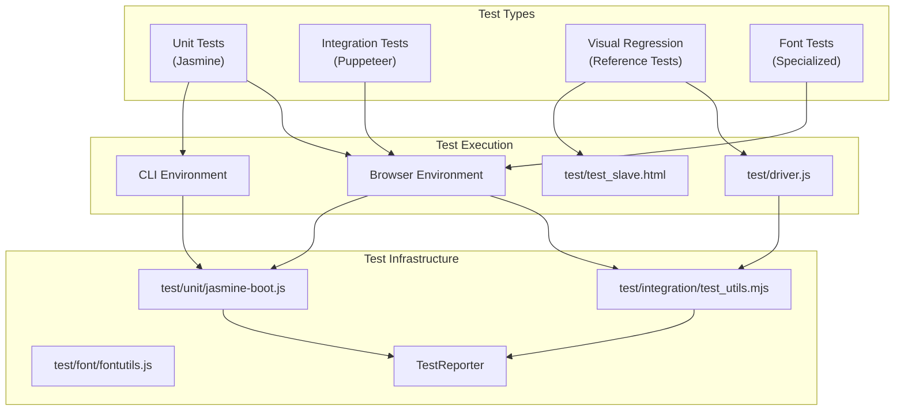
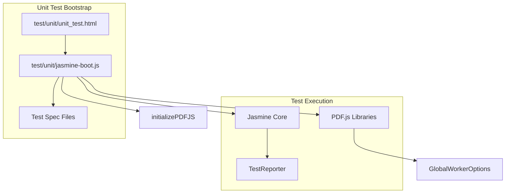
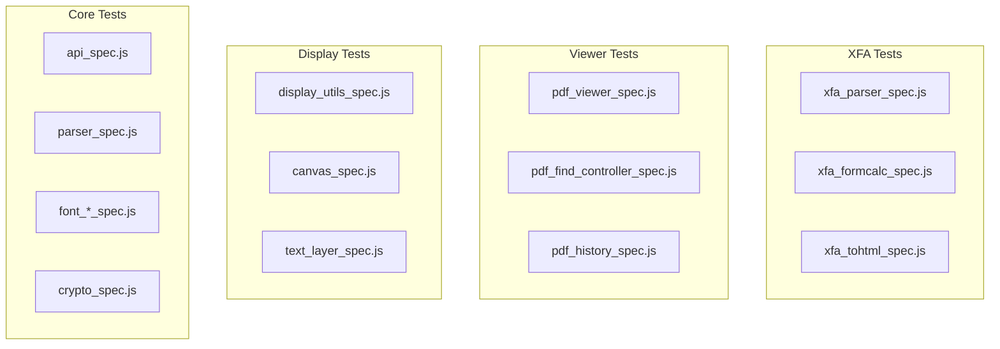
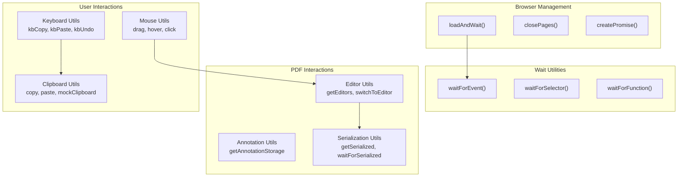
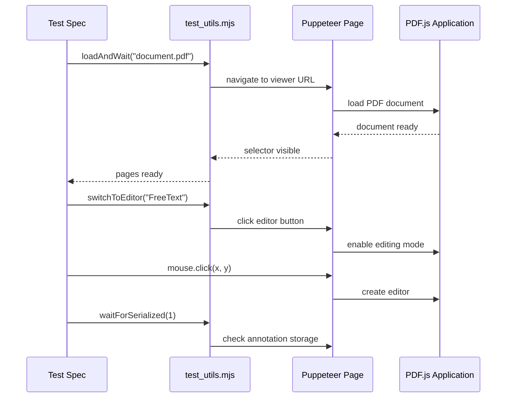
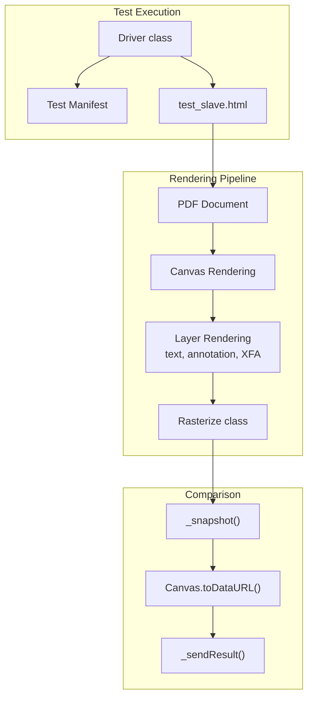
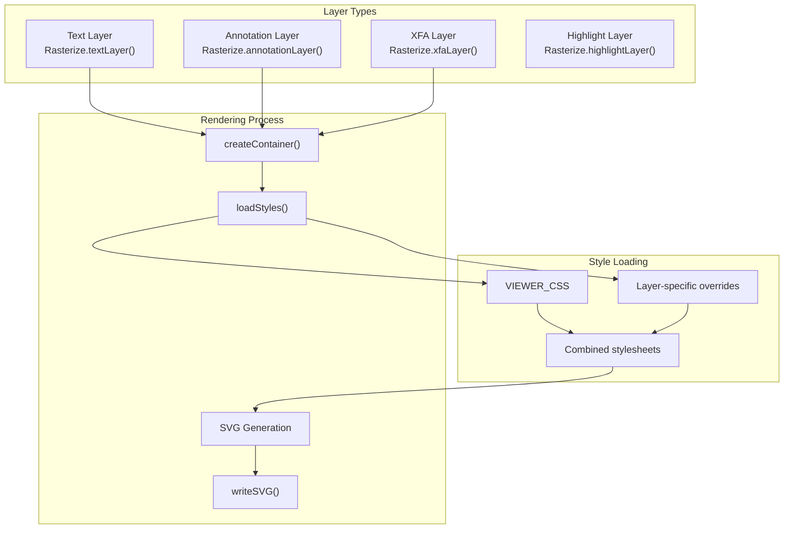
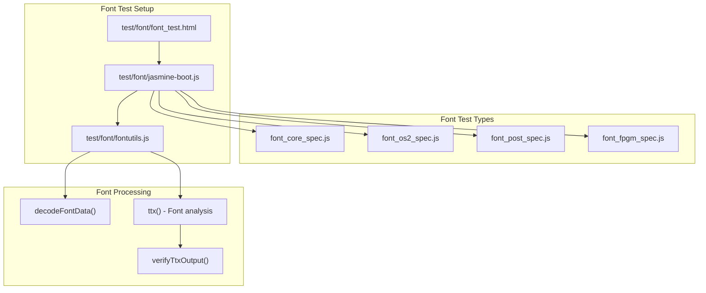
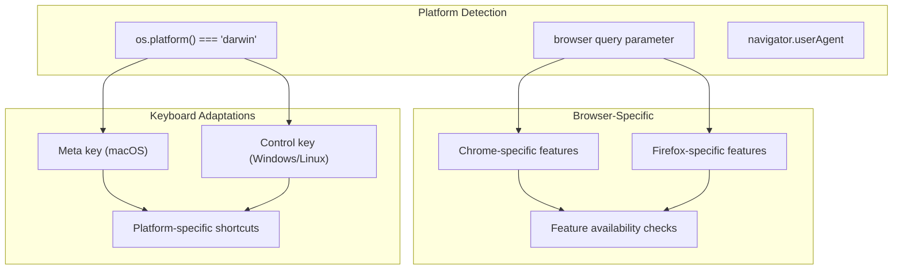

# Testing Infrastructure

> **Relevant source files**
> * [test/driver.js](https://github.com/Mr-xzq/pdf.js-4.4.168/blob/19fbc899/test/driver.js)
> * [test/font/font_core_spec.js](https://github.com/Mr-xzq/pdf.js-4.4.168/blob/19fbc899/test/font/font_core_spec.js)
> * [test/font/font_fpgm_spec.js](https://github.com/Mr-xzq/pdf.js-4.4.168/blob/19fbc899/test/font/font_fpgm_spec.js)
> * [test/font/font_os2_spec.js](https://github.com/Mr-xzq/pdf.js-4.4.168/blob/19fbc899/test/font/font_os2_spec.js)
> * [test/font/font_post_spec.js](https://github.com/Mr-xzq/pdf.js-4.4.168/blob/19fbc899/test/font/font_post_spec.js)
> * [test/font/font_test.html](https://github.com/Mr-xzq/pdf.js-4.4.168/blob/19fbc899/test/font/font_test.html)
> * [test/font/fontutils.js](https://github.com/Mr-xzq/pdf.js-4.4.168/blob/19fbc899/test/font/fontutils.js)
> * [test/font/jasmine-boot.js](https://github.com/Mr-xzq/pdf.js-4.4.168/blob/19fbc899/test/font/jasmine-boot.js)
> * [test/integration/.eslintrc](https://github.com/Mr-xzq/pdf.js-4.4.168/blob/19fbc899/test/integration/.eslintrc)
> * [test/integration/accessibility_spec.mjs](https://github.com/Mr-xzq/pdf.js-4.4.168/blob/19fbc899/test/integration/accessibility_spec.mjs)
> * [test/integration/annotation_spec.mjs](https://github.com/Mr-xzq/pdf.js-4.4.168/blob/19fbc899/test/integration/annotation_spec.mjs)
> * [test/integration/caret_browsing_spec.mjs](https://github.com/Mr-xzq/pdf.js-4.4.168/blob/19fbc899/test/integration/caret_browsing_spec.mjs)
> * [test/integration/copy_paste_spec.mjs](https://github.com/Mr-xzq/pdf.js-4.4.168/blob/19fbc899/test/integration/copy_paste_spec.mjs)
> * [test/integration/find_spec.mjs](https://github.com/Mr-xzq/pdf.js-4.4.168/blob/19fbc899/test/integration/find_spec.mjs)
> * [test/integration/freetext_editor_spec.mjs](https://github.com/Mr-xzq/pdf.js-4.4.168/blob/19fbc899/test/integration/freetext_editor_spec.mjs)
> * [test/integration/ink_editor_spec.mjs](https://github.com/Mr-xzq/pdf.js-4.4.168/blob/19fbc899/test/integration/ink_editor_spec.mjs)
> * [test/integration/scripting_spec.mjs](https://github.com/Mr-xzq/pdf.js-4.4.168/blob/19fbc899/test/integration/scripting_spec.mjs)
> * [test/integration/stamp_editor_spec.mjs](https://github.com/Mr-xzq/pdf.js-4.4.168/blob/19fbc899/test/integration/stamp_editor_spec.mjs)
> * [test/integration/test_utils.mjs](https://github.com/Mr-xzq/pdf.js-4.4.168/blob/19fbc899/test/integration/test_utils.mjs)
> * [test/pdfs/issue17998.pdf](https://github.com/Mr-xzq/pdf.js-4.4.168/blob/19fbc899/test/pdfs/issue17998.pdf)
> * [test/pdfs/issue18305.pdf](https://github.com/Mr-xzq/pdf.js-4.4.168/blob/19fbc899/test/pdfs/issue18305.pdf)
> * [test/test_slave.html](https://github.com/Mr-xzq/pdf.js-4.4.168/blob/19fbc899/test/test_slave.html)
> * [test/unit/clitests.json](https://github.com/Mr-xzq/pdf.js-4.4.168/blob/19fbc899/test/unit/clitests.json)
> * [test/unit/jasmine-boot.js](https://github.com/Mr-xzq/pdf.js-4.4.168/blob/19fbc899/test/unit/jasmine-boot.js)
> * [test/unit/unit_test.html](https://github.com/Mr-xzq/pdf.js-4.4.168/blob/19fbc899/test/unit/unit_test.html)

This document covers the comprehensive testing systems used in PDF.js to ensure code quality, functionality, and visual accuracy across different browsers and platforms. The testing infrastructure includes unit testing, integration testing, and visual regression testing capabilities.

For information about the build system that prepares test artifacts, see [Build System and Distribution](/Mr-xzq/pdf.js-4.4.168/5-build-system-and-distribution).

## Overview

PDF.js employs a multi-layered testing approach to validate different aspects of the PDF processing and viewing functionality:

**Test Infrastructure Architecture**

The testing system supports multiple execution environments and provides comprehensive coverage of PDF.js functionality through automated testing.

Sources: [test/driver.js L1-L1124](https://github.com/Mr-xzq/pdf.js-4.4.168/blob/19fbc899/test/driver.js#L1-L1124)

 [test/unit/jasmine-boot.js L1-L218](https://github.com/Mr-xzq/pdf.js-4.4.168/blob/19fbc899/test/unit/jasmine-boot.js#L1-L218)

 [test/integration/test_utils.mjs L1-L707](https://github.com/Mr-xzq/pdf.js-4.4.168/blob/19fbc899/test/integration/test_utils.mjs#L1-L707)

## Unit Testing Framework

PDF.js uses the Jasmine testing framework for unit tests, with custom boot loaders for different test environments.

### Jasmine Configuration

The unit testing system is configured through a custom boot loader that initializes PDF.js libraries and sets up the test environment:

**Unit Test Initialization Flow**

The `jasmine-boot.js` file loads all test specifications dynamically and configures the PDF.js worker options.

| Component | Purpose | Key Features |
| --- | --- | --- |
| `initializePDFJS` | Loads test modules | Dynamic module imports, worker configuration |
| `TestReporter` | Test result reporting | Browser-based result collection |
| Import maps | Module resolution | Clean import paths for tests |

The unit test configuration supports both browser and CLI execution environments through the `clitests.json` configuration file.

Sources: [test/unit/jasmine-boot.js L47-L115](https://github.com/Mr-xzq/pdf.js-4.4.168/blob/19fbc899/test/unit/jasmine-boot.js#L47-L115)

 [test/unit/unit_test.html L1-L54](https://github.com/Mr-xzq/pdf.js-4.4.168/blob/19fbc899/test/unit/unit_test.html#L1-L54)

 [test/unit/clitests.json L1-L58](https://github.com/Mr-xzq/pdf.js-4.4.168/blob/19fbc899/test/unit/clitests.json#L1-L58)

### Test Organization

Unit tests are organized by functional area and use a consistent naming convention:

**Unit Test Organization Structure**

Tests are grouped by the PDF.js component they validate, enabling focused testing and easier maintenance.

Sources: [test/unit/clitests.json L6-L56](https://github.com/Mr-xzq/pdf.js-4.4.168/blob/19fbc899/test/unit/clitests.json#L6-L56)

 [test/unit/jasmine-boot.js L48-L105](https://github.com/Mr-xzq/pdf.js-4.4.168/blob/19fbc899/test/unit/jasmine-boot.js#L48-L105)

## Integration Testing System

Integration tests use Puppeteer to automate browser interactions and validate end-to-end functionality across different browser environments.

### Test Utilities Framework

The `test_utils.mjs` file provides a comprehensive set of utilities for integration testing:

**Integration Test Utilities Architecture**

The test utilities provide high-level abstractions for common PDF.js testing scenarios.

| Utility Category | Key Functions | Purpose |
| --- | --- | --- |
| Browser Management | `loadAndWait`, `closePages` | PDF document loading and cleanup |
| Editor Testing | `switchToEditor`, `getSelectedEditors` | Annotation editor interactions |
| Serialization | `getSerialized`, `waitForStorageEntries` | Annotation persistence validation |
| Cross-platform | Platform-specific keyboard shortcuts | Consistent behavior across OS |

Sources: [test/integration/test_utils.mjs L19-L707](https://github.com/Mr-xzq/pdf.js-4.4.168/blob/19fbc899/test/integration/test_utils.mjs#L19-L707)

### Integration Test Examples

Integration tests cover complex user workflows like annotation editing:

**Integration Test Flow Example**

This sequence shows how integration tests orchestrate complex interactions between test code, utilities, and the PDF.js application.

Sources: [test/integration/freetext_editor_spec.mjs L115-L166](https://github.com/Mr-xzq/pdf.js-4.4.168/blob/19fbc899/test/integration/freetext_editor_spec.mjs#L115-L166)

 [test/integration/stamp_editor_spec.mjs L103-L133](https://github.com/Mr-xzq/pdf.js-4.4.168/blob/19fbc899/test/integration/stamp_editor_spec.mjs#L103-L133)

## Visual Regression Testing

The visual regression testing system validates PDF rendering accuracy by comparing generated images against reference outputs.

### Reference Test Driver

The `driver.js` file implements the core reference testing functionality:

**Reference Test Architecture**

The reference testing system renders PDF pages and layers to canvas elements, then captures the results for comparison.

| Component | Responsibility | Key Methods |
| --- | --- | --- |
| `Driver` | Test orchestration | `run()`, `_nextTask()`, `_nextPage()` |
| `Rasterize` | Layer rendering | `annotationLayer()`, `textLayer()`, `xfaLayer()` |
| Canvas processing | Image generation | `toDataURL()`, image conversion |

Sources: [test/driver.js L442-L1124](https://github.com/Mr-xzq/pdf.js-4.4.168/blob/19fbc899/test/driver.js#L442-L1124)

 [test/test_slave.html L1-L47](https://github.com/Mr-xzq/pdf.js-4.4.168/blob/19fbc899/test/test_slave.html#L1-L47)

### Layer Rendering System

The `Rasterize` class handles rendering different PDF layers for visual testing:

**Layer Rendering Pipeline**

Each layer type has specialized rendering logic that creates SVG containers with appropriate styles before rasterization.

The rendering system uses promises to handle asynchronous operations like style loading and image processing:

* `annotationStylePromise`: Loads annotation-specific CSS overrides
* `textStylePromise`: Loads text layer testing styles
* `xfaStylePromise`: Loads XFA form styling
* `drawLayerStylePromise`: Loads highlight layer styles

Sources: [test/driver.js L167-L430](https://github.com/Mr-xzq/pdf.js-4.4.168/blob/19fbc899/test/driver.js#L167-L430)

## Font Testing System

PDF.js includes specialized font testing capabilities to validate font processing and rendering.

### Font Test Infrastructure

Font tests use a separate testing setup with specialized utilities:

**Font Testing Architecture**

Font tests validate PDF.js font processing capabilities using specialized analysis tools.

The font testing utilities provide functions for:

* `decodeFontData()`: Convert base64 font data to byte arrays
* `ttx()`: Analyze font structure via HTTP service
* `verifyTtxOutput()`: Validate font analysis results

Sources: [test/font/font_test.html L1-L26](https://github.com/Mr-xzq/pdf.js-4.4.168/blob/19fbc899/test/font/font_test.html#L1-L26)

 [test/font/jasmine-boot.js L1-L162](https://github.com/Mr-xzq/pdf.js-4.4.168/blob/19fbc899/test/font/jasmine-boot.js#L1-L162)

 [test/font/fontutils.js L1-L49](https://github.com/Mr-xzq/pdf.js-4.4.168/blob/19fbc899/test/font/fontutils.js#L1-L49)

## Cross-Browser Testing

The testing infrastructure supports execution across multiple browser environments with platform-specific adaptations.

### Browser Detection and Adaptation

Test utilities automatically adapt to different browser and platform capabilities:

**Cross-Platform Testing Adaptations**

The testing system automatically adjusts behavior based on the target platform and browser capabilities.

Key platform adaptations include:

* Keyboard shortcut mapping (Cmd vs Ctrl)
* Browser-specific feature availability
* Clipboard operation differences
* Focus and selection behavior variations

Sources: [test/integration/test_utils.mjs L17-L18](https://github.com/Mr-xzq/pdf.js-4.4.168/blob/19fbc899/test/integration/test_utils.mjs#L17-L18)

 [test/integration/test_utils.mjs L494-L603](https://github.com/Mr-xzq/pdf.js-4.4.168/blob/19fbc899/test/integration/test_utils.mjs#L494-L603)

 [test/driver.js L461-L467](https://github.com/Mr-xzq/pdf.js-4.4.168/blob/19fbc899/test/driver.js#L461-L467)