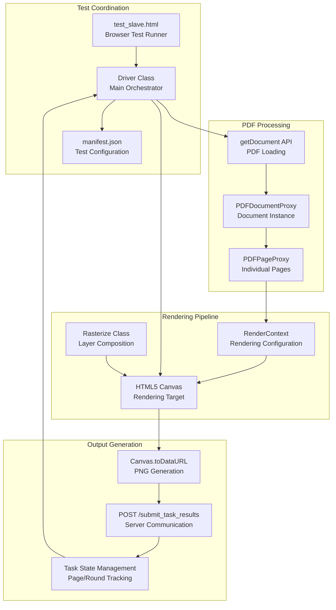
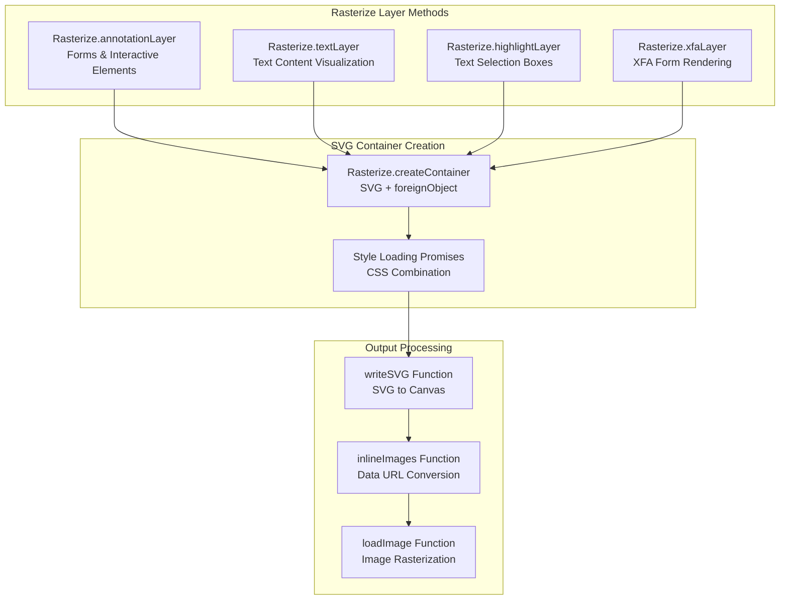
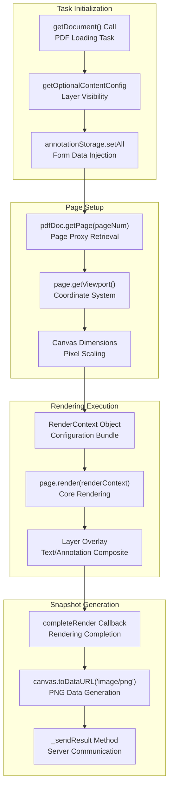
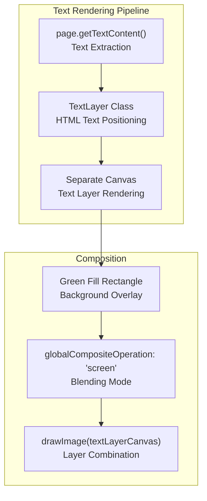
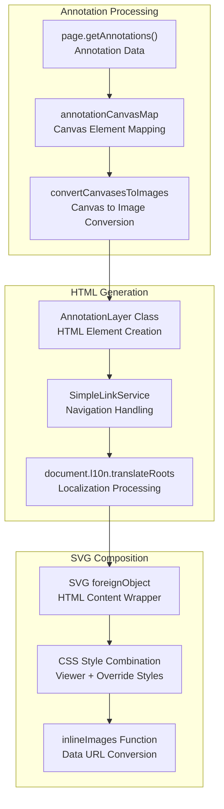
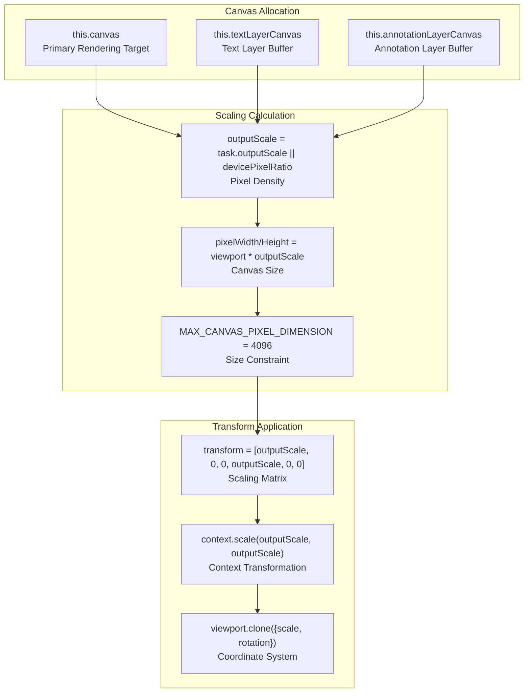

# Visual Regression Testing

> **Relevant source files**
> * [test/driver.js](https://github.com/Mr-xzq/pdf.js-4.4.168/blob/19fbc899/test/driver.js)
> * [test/font/font_test.html](https://github.com/Mr-xzq/pdf.js-4.4.168/blob/19fbc899/test/font/font_test.html)
> * [test/test_slave.html](https://github.com/Mr-xzq/pdf.js-4.4.168/blob/19fbc899/test/test_slave.html)
> * [test/unit/unit_test.html](https://github.com/Mr-xzq/pdf.js-4.4.168/blob/19fbc899/test/unit/unit_test.html)

## Purpose and Scope

This document covers PDF.js's visual regression testing system, which automatically renders PDF pages and compares the output against reference images to detect rendering regressions. The system generates pixel-perfect snapshots of PDF content across different browsers and configurations to ensure consistent rendering behavior.

For information about unit testing, see [Unit Testing](/Mr-xzq/pdf.js-4.4.168/6.1-unit-testing). For integration testing of user interactions, see [Integration Testing](/Mr-xzq/pdf.js-4.4.168/6.2-integration-testing).

## System Overview

The visual regression testing system operates as a browser-based test harness that loads PDF documents, renders them to canvas elements, and captures snapshots for comparison. The system supports multiple rendering modes including standard page rendering, text layer visualization, annotation layers, and XFA form rendering.

### Test Execution Architecture

Sources: [test/driver.js L442-L471](https://github.com/Mr-xzq/pdf.js-4.4.168/blob/19fbc899/test/driver.js#L442-L471)

 [test/test_slave.html L35-L46](https://github.com/Mr-xzq/pdf.js-4.4.168/blob/19fbc899/test/test_slave.html#L35-L46)

### Rendering System Components

The `Rasterize` class provides specialized rendering methods for different PDF content layers, each producing SVG-based output that gets rasterized to canvas.

Sources: [test/driver.js L167-L430](https://github.com/Mr-xzq/pdf.js-4.4.168/blob/19fbc899/test/driver.js#L167-L430)

## Test Task Processing

### Task Configuration and Execution Flow

The `Driver` class processes test tasks sequentially, where each task represents a PDF document with specific rendering configuration.

| Task Property | Purpose | Example Values |
| --- | --- | --- |
| `file` | PDF document path | `"tracemonkey.pdf"` |
| `type` | Rendering mode | `"eq"`, `"text"`, `"highlight"` |
| `firstPage`/`lastPage` | Page range | `1`, `10` |
| `enableXfa` | XFA form support | `true`, `false` |
| `annotationStorage` | Form field values | `{"field1": "value"}` |
| `outputScale` | Pixel density | `1.0`, `2.0` |

Sources: [test/driver.js L539-L708](https://github.com/Mr-xzq/pdf.js-4.4.168/blob/19fbc899/test/driver.js#L539-L708)

### Page Rendering Process

Sources: [test/driver.js L795-L1021](https://github.com/Mr-xzq/pdf.js-4.4.168/blob/19fbc899/test/driver.js#L795-L1021)

## Specialized Rendering Modes

### Text Layer Visualization

For `type: "text"` tasks, the system renders text content with a green background overlay to visualize text positioning accuracy.

Sources: [test/driver.js L864-L881](https://github.com/Mr-xzq/pdf.js-4.4.168/blob/19fbc899/test/driver.js#L864-L881)

 [test/driver.js L952-L966](https://github.com/Mr-xzq/pdf.js-4.4.168/blob/19fbc899/test/driver.js#L952-L966)

### Annotation Layer Testing

The annotation layer rendering system converts PDF annotations to HTML elements within SVG containers for precise visual testing.

Sources: [test/driver.js L217-L284](https://github.com/Mr-xzq/pdf.js-4.4.168/blob/19fbc899/test/driver.js#L217-L284)

 [test/driver.js L144-L165](https://github.com/Mr-xzq/pdf.js-4.4.168/blob/19fbc899/test/driver.js#L144-L165)

## Canvas Management and Output

### Canvas Scaling and Viewport Handling

The system manages multiple canvas instances for different rendering layers, with careful attention to pixel scaling and viewport transformations.

Sources: [test/driver.js L799-L831](https://github.com/Mr-xzq/pdf.js-4.4.168/blob/19fbc899/test/driver.js#L799-L831)

 [test/driver.js L853-L863](https://github.com/Mr-xzq/pdf.js-4.4.168/blob/19fbc899/test/driver.js#L853-L863)

### Result Transmission Protocol

Test results are transmitted to the test server via HTTP POST requests containing comprehensive metadata about the rendering context.

| Result Field | Description | Source |
| --- | --- | --- |
| `browser` | Browser identifier | Query parameter |
| `id` | Test case identifier | Manifest task property |
| `snapshot` | Base64 PNG data | `canvas.toDataURL()` |
| `viewportWidth`/`Height` | Logical dimensions | `Math.floor(viewport.width/height)` |
| `outputScale` | Pixel scaling factor | Calculated scale value |
| `failure` | Error message | Exception/error string |
| `stats` | Performance data | `page.stats.times` |

Sources: [test/driver.js L1088-L1105](https://github.com/Mr-xzq/pdf.js-4.4.168/blob/19fbc899/test/driver.js#L1088-L1105)