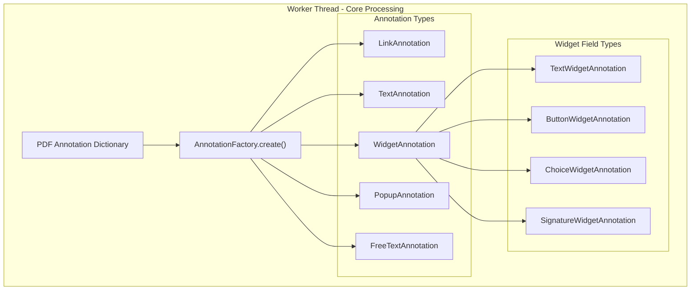
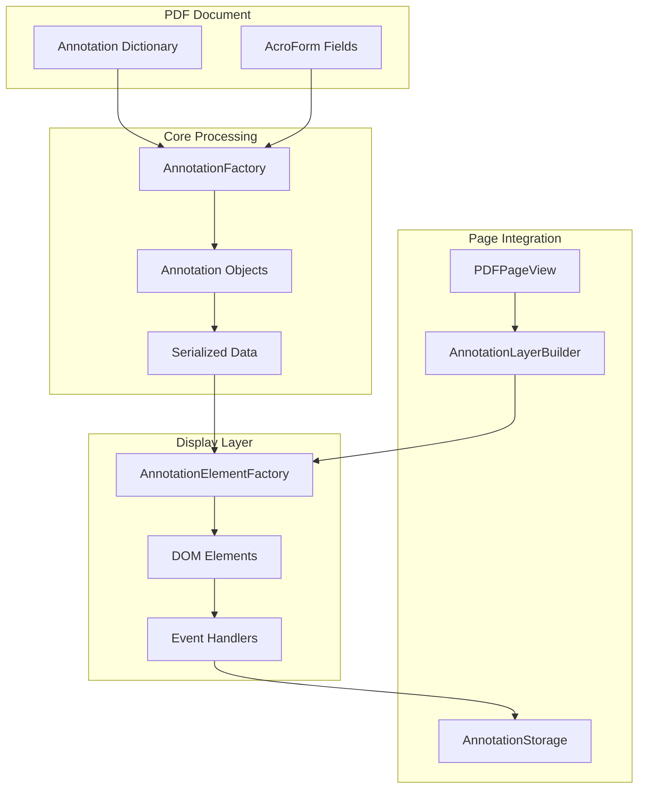
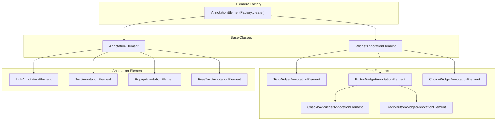
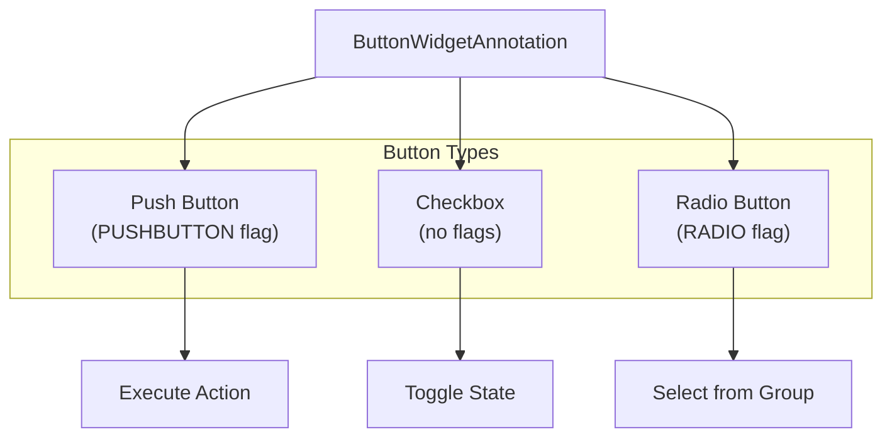
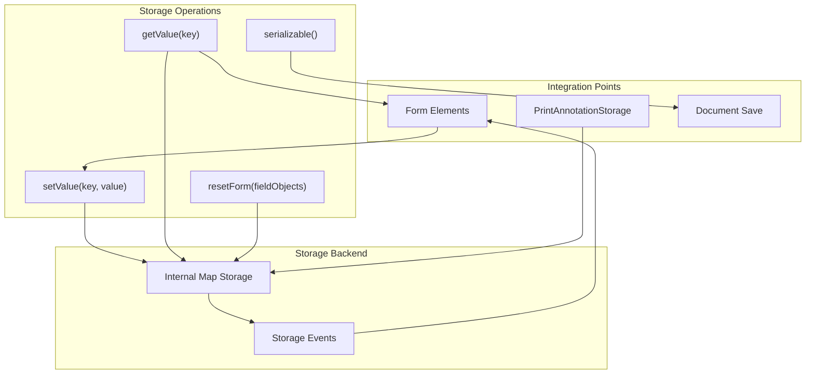
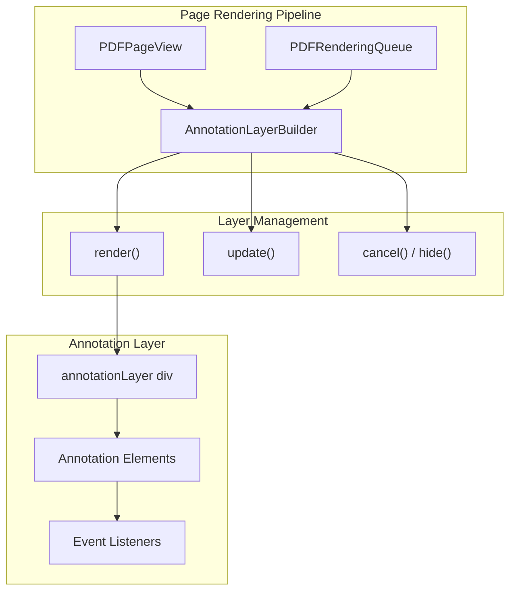

# Annotation and Form Handling

> **Relevant source files**
> * [src/core/annotation.js](https://github.com/Mr-xzq/pdf.js-4.4.168/blob/19fbc899/src/core/annotation.js)
> * [src/core/catalog.js](https://github.com/Mr-xzq/pdf.js-4.4.168/blob/19fbc899/src/core/catalog.js)
> * [src/core/document.js](https://github.com/Mr-xzq/pdf.js-4.4.168/blob/19fbc899/src/core/document.js)
> * [src/core/evaluator.js](https://github.com/Mr-xzq/pdf.js-4.4.168/blob/19fbc899/src/core/evaluator.js)
> * [src/core/fonts.js](https://github.com/Mr-xzq/pdf.js-4.4.168/blob/19fbc899/src/core/fonts.js)
> * [src/core/worker.js](https://github.com/Mr-xzq/pdf.js-4.4.168/blob/19fbc899/src/core/worker.js)
> * [src/display/annotation_layer.js](https://github.com/Mr-xzq/pdf.js-4.4.168/blob/19fbc899/src/display/annotation_layer.js)
> * [src/display/api.js](https://github.com/Mr-xzq/pdf.js-4.4.168/blob/19fbc899/src/display/api.js)
> * [src/display/canvas.js](https://github.com/Mr-xzq/pdf.js-4.4.168/blob/19fbc899/src/display/canvas.js)
> * [src/display/text_layer.js](https://github.com/Mr-xzq/pdf.js-4.4.168/blob/19fbc899/src/display/text_layer.js)
> * [src/shared/util.js](https://github.com/Mr-xzq/pdf.js-4.4.168/blob/19fbc899/src/shared/util.js)
> * [test/annotation_layer_builder_overrides.css](https://github.com/Mr-xzq/pdf.js-4.4.168/blob/19fbc899/test/annotation_layer_builder_overrides.css)
> * [test/pdfs/.gitignore](https://github.com/Mr-xzq/pdf.js-4.4.168/blob/19fbc899/test/pdfs/.gitignore)
> * [test/test_manifest.json](https://github.com/Mr-xzq/pdf.js-4.4.168/blob/19fbc899/test/test_manifest.json)
> * [test/unit/annotation_spec.js](https://github.com/Mr-xzq/pdf.js-4.4.168/blob/19fbc899/test/unit/annotation_spec.js)
> * [test/unit/api_spec.js](https://github.com/Mr-xzq/pdf.js-4.4.168/blob/19fbc899/test/unit/api_spec.js)
> * [test/unit/pdf_find_controller_spec.js](https://github.com/Mr-xzq/pdf.js-4.4.168/blob/19fbc899/test/unit/pdf_find_controller_spec.js)
> * [test/unit/ui_utils_spec.js](https://github.com/Mr-xzq/pdf.js-4.4.168/blob/19fbc899/test/unit/ui_utils_spec.js)
> * [test/unit/util_spec.js](https://github.com/Mr-xzq/pdf.js-4.4.168/blob/19fbc899/test/unit/util_spec.js)
> * [web/annotation_layer_builder.css](https://github.com/Mr-xzq/pdf.js-4.4.168/blob/19fbc899/web/annotation_layer_builder.css)
> * [web/annotation_layer_builder.js](https://github.com/Mr-xzq/pdf.js-4.4.168/blob/19fbc899/web/annotation_layer_builder.js)
> * [web/interfaces.js](https://github.com/Mr-xzq/pdf.js-4.4.168/blob/19fbc899/web/interfaces.js)
> * [web/pdf_find_bar.js](https://github.com/Mr-xzq/pdf.js-4.4.168/blob/19fbc899/web/pdf_find_bar.js)
> * [web/pdf_find_controller.js](https://github.com/Mr-xzq/pdf.js-4.4.168/blob/19fbc899/web/pdf_find_controller.js)
> * [web/pdf_history.js](https://github.com/Mr-xzq/pdf.js-4.4.168/blob/19fbc899/web/pdf_history.js)
> * [web/pdf_link_service.js](https://github.com/Mr-xzq/pdf.js-4.4.168/blob/19fbc899/web/pdf_link_service.js)
> * [web/pdf_page_view.js](https://github.com/Mr-xzq/pdf.js-4.4.168/blob/19fbc899/web/pdf_page_view.js)
> * [web/pdf_thumbnail_view.js](https://github.com/Mr-xzq/pdf.js-4.4.168/blob/19fbc899/web/pdf_thumbnail_view.js)
> * [web/pdf_thumbnail_viewer.js](https://github.com/Mr-xzq/pdf.js-4.4.168/blob/19fbc899/web/pdf_thumbnail_viewer.js)
> * [web/pdf_viewer.js](https://github.com/Mr-xzq/pdf.js-4.4.168/blob/19fbc899/web/pdf_viewer.js)
> * [web/text_layer_builder.js](https://github.com/Mr-xzq/pdf.js-4.4.168/blob/19fbc899/web/text_layer_builder.js)
> * [web/ui_utils.js](https://github.com/Mr-xzq/pdf.js-4.4.168/blob/19fbc899/web/ui_utils.js)

This document covers PDF.js's annotation and form handling system, which processes, renders, and manages interactive elements in PDF documents. This includes both static annotations (text, highlights, stamps) and interactive form fields (text inputs, buttons, checkboxes). For information about annotation editing capabilities, see [Annotation Editor System](/Mr-xzq/pdf.js-4.4.168/4-annotation-editor-system).

The annotation and form handling system operates in two main phases: core processing on the worker thread that extracts and parses annotation data from the PDF, and display layer rendering on the main thread that creates interactive DOM elements.

## Core Annotation Processing

The annotation processing pipeline begins in the worker thread where PDF annotation dictionaries are parsed and converted into structured data objects. The [`AnnotationFactory`](https://github.com/Mr-xzq/pdf.js-4.4.168/blob/19fbc899/`AnnotationFactory`)

 serves as the central factory for creating annotation objects based on their subtype and field type.

The factory uses a two-level classification system. First, it determines the annotation subtype from the PDF's `/Subtype` entry, then for Widget annotations, it further classifies by field type (`/FT`) into text fields (`Tx`), buttons (`Btn`), choice fields (`Ch`), or signatures (`Sig`).

**Sources:** [src/core/annotation.js L118-L267](https://github.com/Mr-xzq/pdf.js-4.4.168/blob/19fbc899/src/core/annotation.js#L118-L267)

 [src/core/annotation.js L182-L207](https://github.com/Mr-xzq/pdf.js-4.4.168/blob/19fbc899/src/core/annotation.js#L182-L207)

## Annotation Data Flow

The complete annotation processing flow spans from PDF parsing to DOM element creation, involving multiple layers of the PDF.js architecture.

Annotation data flows from PDF dictionaries through the core processing layer where it's parsed and validated, then serialized for transfer to the main thread. The display layer creates corresponding DOM elements with appropriate event handlers that integrate with the annotation storage system for state management.

**Sources:** [src/core/annotation.js L73-L102](https://github.com/Mr-xzq/pdf.js-4.4.168/blob/19fbc899/src/core/annotation.js#L73-L102)

 [src/display/annotation_layer.js L74-L158](https://github.com/Mr-xzq/pdf.js-4.4.168/blob/19fbc899/src/display/annotation_layer.js#L74-L158)

 [web/annotation_layer_builder.js L28-L95](https://github.com/Mr-xzq/pdf.js-4.4.168/blob/19fbc899/web/annotation_layer_builder.js#L28-L95)

## Display Layer Architecture

The display layer transforms annotation data into interactive DOM elements through the [`AnnotationElementFactory`](https://github.com/Mr-xzq/pdf.js-4.4.168/blob/19fbc899/`AnnotationElementFactory`)

 Each annotation type has a corresponding element class that handles rendering and user interaction.

The element hierarchy reflects the PDF annotation structure, with [`AnnotationElement`](https://github.com/Mr-xzq/pdf.js-4.4.168/blob/19fbc899/`AnnotationElement`)

 as the base class providing common functionality like positioning, visibility, and basic event handling. [`WidgetAnnotationElement`](https://github.com/Mr-xzq/pdf.js-4.4.168/blob/19fbc899/`WidgetAnnotationElement`)

 extends this with form-specific features like field validation and value storage.

**Sources:** [src/display/annotation_layer.js L79-L157](https://github.com/Mr-xzq/pdf.js-4.4.168/blob/19fbc899/src/display/annotation_layer.js#L79-L157)

 [src/display/annotation_layer.js L160-L165](https://github.com/Mr-xzq/pdf.js-4.4.168/blob/19fbc899/src/display/annotation_layer.js#L160-L165)

 [src/display/annotation_layer.js L3306-L3320](https://github.com/Mr-xzq/pdf.js-4.4.168/blob/19fbc899/src/display/annotation_layer.js#L3306-L3320)

## Form Field Implementation

Form field elements implement interactive behavior through DOM event listeners and integration with the [`AnnotationStorage`](https://github.com/Mr-xzq/pdf.js-4.4.168/blob/19fbc899/`AnnotationStorage`)

 system for state persistence.

### Text Fields

Text widget annotations create `<input>` or `<textarea>` elements with validation and formatting support:

| Field Type | DOM Element | Key Features |
| --- | --- | --- |
| Single-line text | `<input type="text">` | Character limits, formatting |
| Multi-line text | `<textarea>` | Line wrapping, scroll bars |
| Password fields | `<input type="password">` | Masked input |
| Rich text | `
` | HTML formatting support |

**Sources:** [src/display/annotation_layer.js L3548-L3710](https://github.com/Mr-xzq/pdf.js-4.4.168/blob/19fbc899/src/display/annotation_layer.js#L3548-L3710)

### Button Fields

Button widgets support three distinct behaviors based on their field flags:

**Sources:** [src/display/annotation_layer.js L3711-L4055](https://github.com/Mr-xzq/pdf.js-4.4.168/blob/19fbc899/src/display/annotation_layer.js#L3711-L4055)

 [src/core/annotation.js L4851-L4910](https://github.com/Mr-xzq/pdf.js-4.4.168/blob/19fbc899/src/core/annotation.js#L4851-L4910)

### Choice Fields

Choice widgets implement dropdown menus and list boxes with single or multiple selection support. The implementation uses native `<select>` elements for optimal accessibility and platform integration.

**Sources:** [src/display/annotation_layer.js L4056-L4275](https://github.com/Mr-xzq/pdf.js-4.4.168/blob/19fbc899/src/display/annotation_layer.js#L4056-L4275)

## Annotation Storage System

The [`AnnotationStorage`](https://github.com/Mr-xzq/pdf.js-4.4.168/blob/19fbc899/`AnnotationStorage`)

 class manages form field values and annotation states, providing persistence across page navigation and document reloading. It uses a key-value store where annotation IDs map to their current state.

The storage system supports different serialization modes for various operations like printing, saving, or form submission, allowing selective inclusion of field values based on context.

**Sources:** [src/display/annotation_storage.js L28-L425](https://github.com/Mr-xzq/pdf.js-4.4.168/blob/19fbc899/src/display/annotation_storage.js#L28-L425)

 [src/display/api.js L41-L44](https://github.com/Mr-xzq/pdf.js-4.4.168/blob/19fbc899/src/display/api.js#L41-L44)

## Layer Integration

The [`AnnotationLayerBuilder`](https://github.com/Mr-xzq/pdf.js-4.4.168/blob/19fbc899/`AnnotationLayerBuilder`)

 coordinates annotation rendering within the page view system, managing the lifecycle of annotation elements as pages are loaded, rendered, and destroyed.

The layer builder ensures proper ordering of rendering operations, with annotations rendered after the canvas layer but before any editor layers. It also handles viewport changes, annotation mode switching, and cleanup during page destruction.

**Sources:** [web/annotation_layer_builder.js L52-L156](https://github.com/Mr-xzq/pdf.js-4.4.168/blob/19fbc899/web/annotation_layer_builder.js#L52-L156)

 [web/pdf_page_view.js L104-L110](https://github.com/Mr-xzq/pdf.js-4.4.168/blob/19fbc899/web/pdf_page_view.js#L104-L110)

 [web/pdf_page_view.js L487-L535](https://github.com/Mr-xzq/pdf.js-4.4.168/blob/19fbc899/web/pdf_page_view.js#L487-L535)

## Annotation Modes

PDF.js supports different annotation rendering modes that control which annotations are displayed and how they behave:

| Mode | Constant | Behavior |
| --- | --- | --- |
| Disabled | `AnnotationMode.DISABLE` | No annotations rendered |
| Display Only | `AnnotationMode.ENABLE` | Static annotation display |
| Forms Enabled | `AnnotationMode.ENABLE_FORMS` | Interactive form fields |
| Storage Mode | `AnnotationMode.ENABLE_STORAGE` | Includes annotation storage data |

The mode is determined by the rendering intent and affects both which annotations are processed and how they're rendered in the display layer.

**Sources:** [src/shared/util.js L62-L67](https://github.com/Mr-xzq/pdf.js-4.4.168/blob/19fbc899/src/shared/util.js#L62-L67)

 [web/pdf_page_view.js L116](https://github.com/Mr-xzq/pdf.js-4.4.168/blob/19fbc899/web/pdf_page_view.js#L116-L116)

 [src/display/annotation_layer.js L4439-L4448](https://github.com/Mr-xzq/pdf.js-4.4.168/blob/19fbc899/src/display/annotation_layer.js#L4439-L4448)