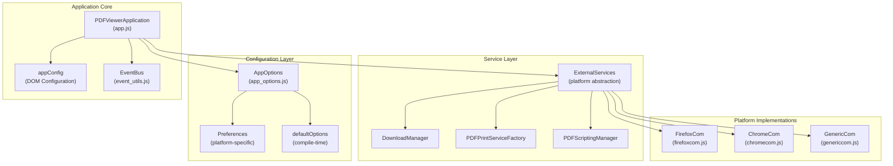
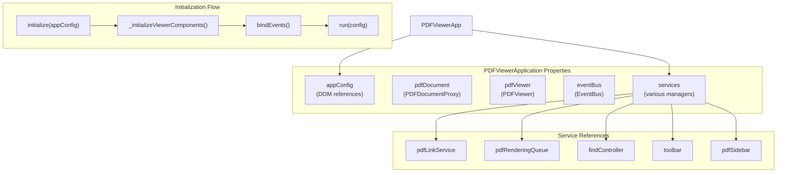
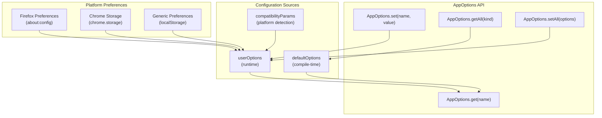
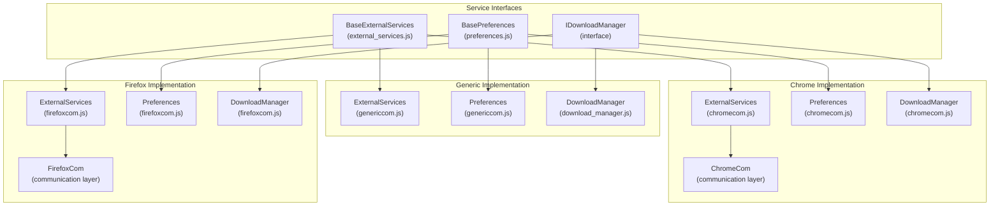
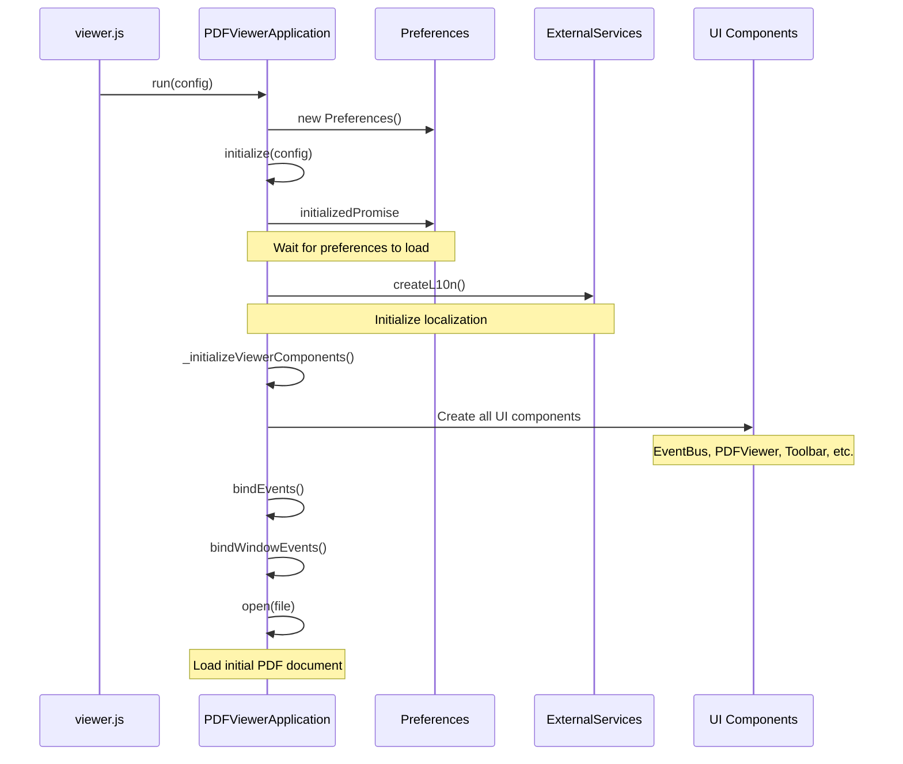

# Application Architecture

> **Relevant source files**
> * [extensions/chromium/preferences_schema.json](https://github.com/Mr-xzq/pdf.js-4.4.168/blob/19fbc899/extensions/chromium/preferences_schema.json)
> * [web/app.js](https://github.com/Mr-xzq/pdf.js-4.4.168/blob/19fbc899/web/app.js)
> * [web/app_options.js](https://github.com/Mr-xzq/pdf.js-4.4.168/blob/19fbc899/web/app_options.js)
> * [web/chromecom.js](https://github.com/Mr-xzq/pdf.js-4.4.168/blob/19fbc899/web/chromecom.js)
> * [web/download_manager.js](https://github.com/Mr-xzq/pdf.js-4.4.168/blob/19fbc899/web/download_manager.js)
> * [web/firefox_print_service.js](https://github.com/Mr-xzq/pdf.js-4.4.168/blob/19fbc899/web/firefox_print_service.js)
> * [web/firefoxcom.js](https://github.com/Mr-xzq/pdf.js-4.4.168/blob/19fbc899/web/firefoxcom.js)
> * [web/genericcom.js](https://github.com/Mr-xzq/pdf.js-4.4.168/blob/19fbc899/web/genericcom.js)
> * [web/password_prompt.js](https://github.com/Mr-xzq/pdf.js-4.4.168/blob/19fbc899/web/password_prompt.js)
> * [web/pdf_document_properties.js](https://github.com/Mr-xzq/pdf.js-4.4.168/blob/19fbc899/web/pdf_document_properties.js)
> * [web/pdf_print_service.js](https://github.com/Mr-xzq/pdf.js-4.4.168/blob/19fbc899/web/pdf_print_service.js)
> * [web/preferences.js](https://github.com/Mr-xzq/pdf.js-4.4.168/blob/19fbc899/web/preferences.js)
> * [web/viewer.css](https://github.com/Mr-xzq/pdf.js-4.4.168/blob/19fbc899/web/viewer.css)
> * [web/viewer.html](https://github.com/Mr-xzq/pdf.js-4.4.168/blob/19fbc899/web/viewer.html)
> * [web/viewer.js](https://github.com/Mr-xzq/pdf.js-4.4.168/blob/19fbc899/web/viewer.js)

This document covers the web viewer application architecture, focusing on the main application controller, configuration management, and service integration patterns. For information about the core PDF processing engine, see [Core PDF Processing Engine](/Mr-xzq/pdf.js-4.4.168/2-core-pdf-processing-engine). For details about individual UI components, see [User Interface Components](/Mr-xzq/pdf.js-4.4.168/3.2-user-interface-components).

## Overview

The PDF.js web viewer application is built around a central application controller pattern with modular service integration and platform abstraction layers. The architecture separates concerns between application orchestration, configuration management, and platform-specific implementations.

**Main Application Controller**

Sources: [web/app.js L98-L655](https://github.com/Mr-xzq/pdf.js-4.4.168/blob/19fbc899/web/app.js#L98-L655)

 [web/app_options.js L466-L531](https://github.com/Mr-xzq/pdf.js-4.4.168/blob/19fbc899/web/app_options.js#L466-L531)

 [web/viewer.js L37-L180](https://github.com/Mr-xzq/pdf.js-4.4.168/blob/19fbc899/web/viewer.js#L37-L180)

## PDFViewerApplication Controller

The `PDFViewerApplication` object serves as the main application controller, managing the lifecycle and coordination of all viewer components.

**Core Properties and Lifecycle**

The application follows this initialization sequence:

1. **Configuration Setup** - DOM elements are mapped to configuration objects
2. **Component Initialization** - All viewer components are instantiated with dependencies
3. **Event Binding** - Event handlers are attached for user interactions and system events
4. **Document Loading** - PDF documents are opened and rendered

Sources: [web/app.js L184-L260](https://github.com/Mr-xzq/pdf.js-4.4.168/blob/19fbc899/web/app.js#L184-L260)

 [web/app.js L392-L654](https://github.com/Mr-xzq/pdf.js-4.4.168/blob/19fbc899/web/app.js#L392-L654)

 [web/app.js L656-L752](https://github.com/Mr-xzq/pdf.js-4.4.168/blob/19fbc899/web/app.js#L656-L752)

## Configuration Management

The `AppOptions` class provides a centralized configuration system with compile-time defaults, runtime preferences, and platform-specific overrides.

| Configuration Type | Source | Purpose |
| --- | --- | --- |
| `OptionKind.BROWSER` | Platform detection | Browser capability flags |
| `OptionKind.VIEWER` | Application logic | UI behavior settings |
| `OptionKind.API` | PDF.js core | PDF processing parameters |
| `OptionKind.WORKER` | Worker thread | Background processing options |
| `OptionKind.PREFERENCE` | User settings | Persistent user preferences |

**Configuration Architecture**

The configuration system supports different option kinds that determine where and how settings are applied:

* **Browser Options** - Detected capabilities like touch support, fullscreen API availability
* **Viewer Options** - UI behavior like default zoom, sidebar state, editor modes
* **API Options** - PDF processing settings like worker source, CMap URLs, font handling
* **Preference Options** - User-configurable settings that persist across sessions

Sources: [web/app_options.js L44-L50](https://github.com/Mr-xzq/pdf.js-4.4.168/blob/19fbc899/web/app_options.js#L44-L50)

 [web/app_options.js L57-L381](https://github.com/Mr-xzq/pdf.js-4.4.168/blob/19fbc899/web/app_options.js#L57-L381)

 [web/app_options.js L466-L531](https://github.com/Mr-xzq/pdf.js-4.4.168/blob/19fbc899/web/app_options.js#L466-L531)

## Service Integration and Platform Abstraction

The application uses a service-oriented architecture with platform-specific implementations abstracted behind common interfaces.

**Platform Service Architecture**

Each platform implementation provides:

1. **External Services** - Platform integration points (L10n, scripting, telemetry)
2. **Preferences** - Persistent settings storage mechanisms
3. **Download Management** - File download and saving functionality
4. **Communication Layers** - Message passing with browser extension APIs

Sources: [web/external_services.js L18-L87](https://github.com/Mr-xzq/pdf.js-4.4.168/blob/19fbc899/web/external_services.js#L18-L87)

 [web/firefoxcom.js L311-L418](https://github.com/Mr-xzq/pdf.js-4.4.168/blob/19fbc899/web/firefoxcom.js#L311-L418)

 [web/chromecom.js L55-L130](https://github.com/Mr-xzq/pdf.js-4.4.168/blob/19fbc899/web/chromecom.js#L55-L130)

 [web/genericcom.js L40-L56](https://github.com/Mr-xzq/pdf.js-4.4.168/blob/19fbc899/web/genericcom.js#L40-L56)

## Initialization Flow

The application initialization follows a carefully orchestrated sequence to ensure proper dependency setup and component readiness.

**Startup Sequence**

Key initialization phases:

1. **Preferences Loading** - Platform-specific preferences are loaded asynchronously
2. **Localization Setup** - L10n service is initialized for the detected/configured locale
3. **Component Creation** - All UI components are instantiated with proper dependencies
4. **Event Binding** - DOM and application event handlers are registered
5. **Document Loading** - Initial PDF file (if specified) is opened

Sources: [web/viewer.js L182-L222](https://github.com/Mr-xzq/pdf.js-4.4.168/blob/19fbc899/web/viewer.js#L182-L222)

 [web/app.js L656-L752](https://github.com/Mr-xzq/pdf.js-4.4.168/blob/19fbc899/web/app.js#L656-L752)

 [web/app.js L184-L260](https://github.com/Mr-xzq/pdf.js-4.4.168/blob/19fbc899/web/app.js#L184-L260)

## Key Architectural Patterns

The application employs several key architectural patterns:

**Event-Driven Communication**

* Central `EventBus` for component communication
* Loose coupling between UI components and application logic
* Platform-specific event handling (Firefox find events, Chrome extension messages)

**Dependency Injection**

* Components receive dependencies through constructor parameters
* Service interfaces allow for platform-specific implementations
* Configuration objects centralize application settings

**Factory Pattern**

* `PDFPrintServiceFactory` creates platform-appropriate print services
* Service factories abstract platform differences
* Component factories handle conditional feature enablement

**Observer Pattern**

* Event bus implements publish-subscribe for component coordination
* Preferences use promises for asynchronous initialization
* Document loading uses callbacks for progress reporting

Sources: [web/event_utils.js L18-L87](https://github.com/Mr-xzq/pdf.js-4.4.168/blob/19fbc899/web/event_utils.js#L18-L87)

 [web/app.js L392-L654](https://github.com/Mr-xzq/pdf.js-4.4.168/blob/19fbc899/web/app.js#L392-L654)

 [web/pdf_print_service.js L196-L210](https://github.com/Mr-xzq/pdf.js-4.4.168/blob/19fbc899/web/pdf_print_service.js#L196-L210)