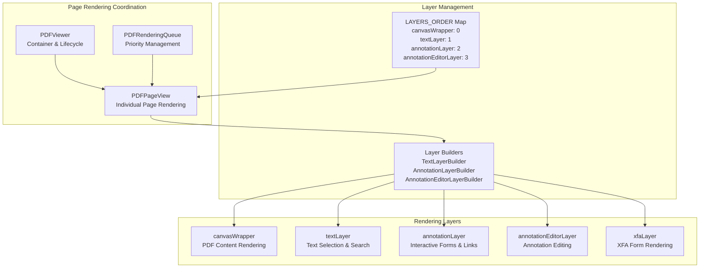
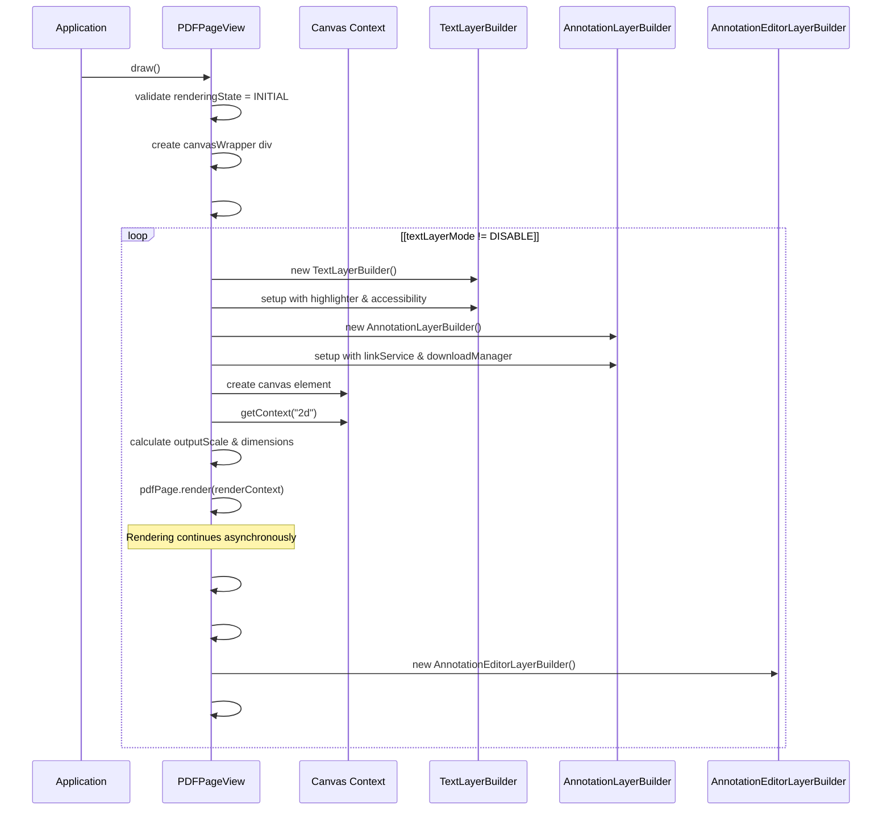
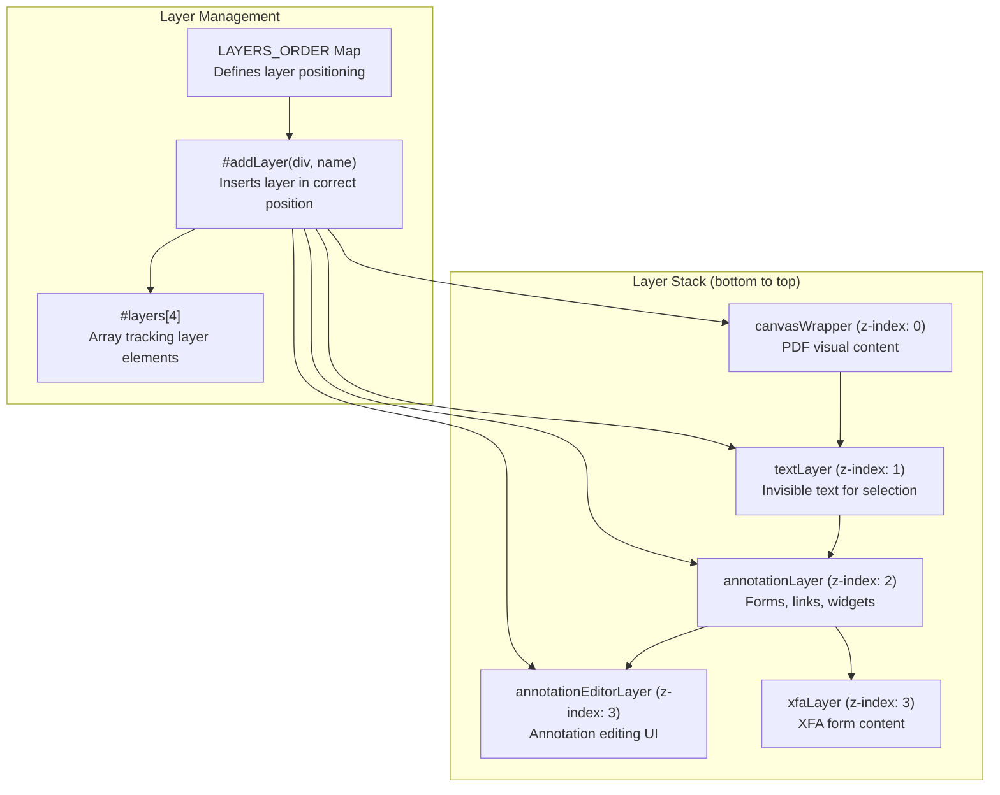
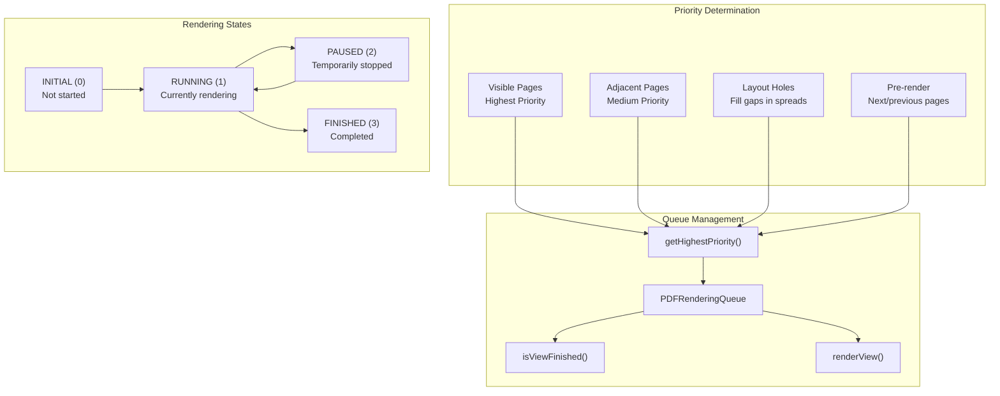
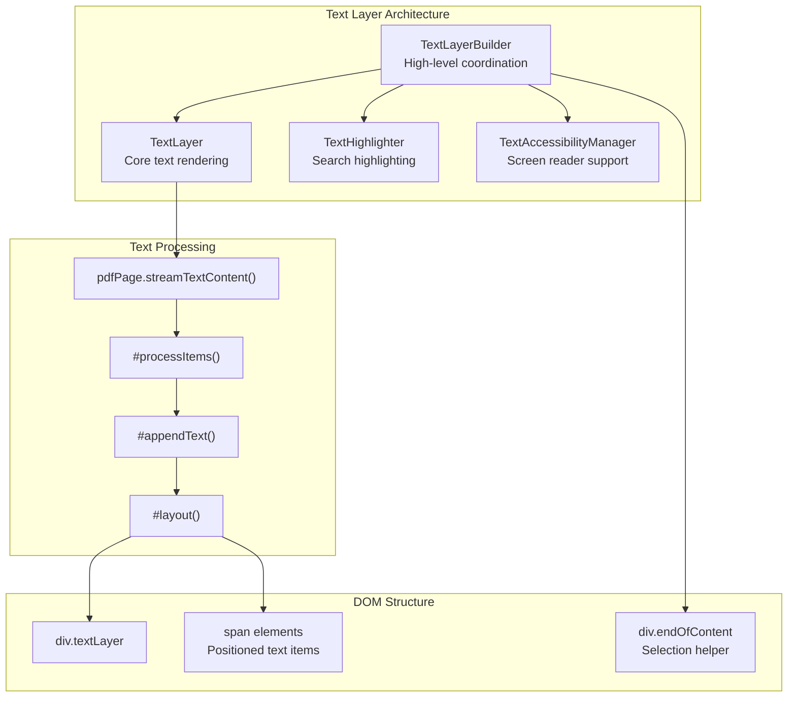
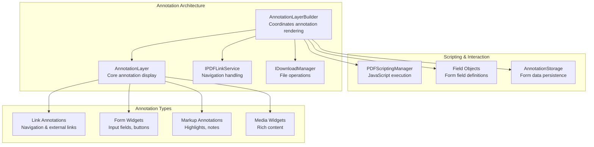
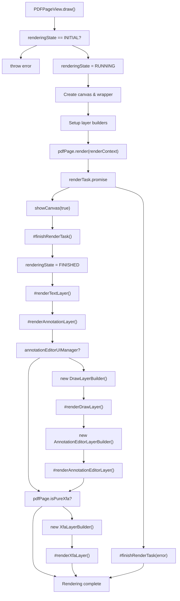
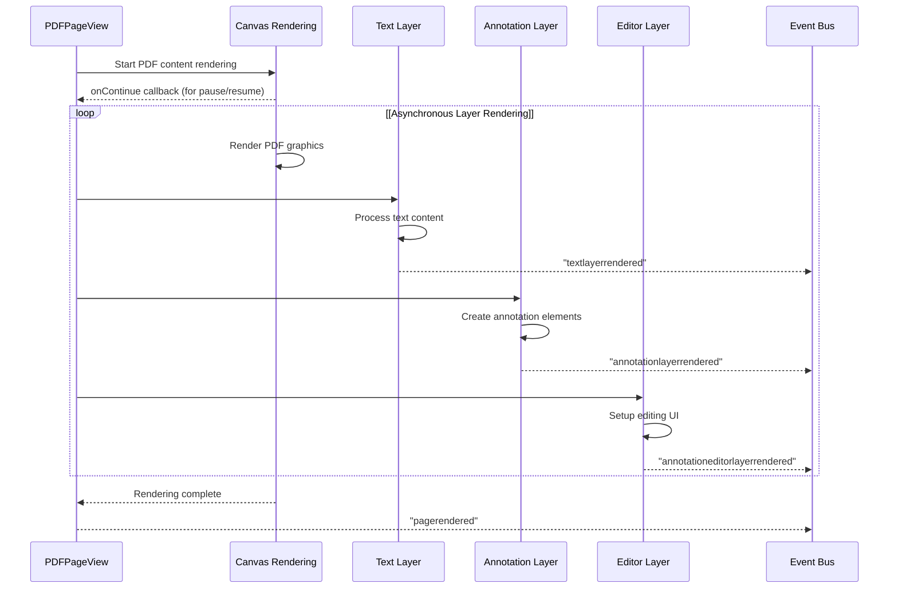

# Page Rendering System

> **Relevant source files**
> * [src/display/text_layer.js](https://github.com/Mr-xzq/pdf.js-4.4.168/blob/19fbc899/src/display/text_layer.js)
> * [test/unit/pdf_find_controller_spec.js](https://github.com/Mr-xzq/pdf.js-4.4.168/blob/19fbc899/test/unit/pdf_find_controller_spec.js)
> * [test/unit/ui_utils_spec.js](https://github.com/Mr-xzq/pdf.js-4.4.168/blob/19fbc899/test/unit/ui_utils_spec.js)
> * [web/annotation_layer_builder.js](https://github.com/Mr-xzq/pdf.js-4.4.168/blob/19fbc899/web/annotation_layer_builder.js)
> * [web/interfaces.js](https://github.com/Mr-xzq/pdf.js-4.4.168/blob/19fbc899/web/interfaces.js)
> * [web/pdf_find_bar.js](https://github.com/Mr-xzq/pdf.js-4.4.168/blob/19fbc899/web/pdf_find_bar.js)
> * [web/pdf_find_controller.js](https://github.com/Mr-xzq/pdf.js-4.4.168/blob/19fbc899/web/pdf_find_controller.js)
> * [web/pdf_history.js](https://github.com/Mr-xzq/pdf.js-4.4.168/blob/19fbc899/web/pdf_history.js)
> * [web/pdf_link_service.js](https://github.com/Mr-xzq/pdf.js-4.4.168/blob/19fbc899/web/pdf_link_service.js)
> * [web/pdf_page_view.js](https://github.com/Mr-xzq/pdf.js-4.4.168/blob/19fbc899/web/pdf_page_view.js)
> * [web/pdf_rendering_queue.js](https://github.com/Mr-xzq/pdf.js-4.4.168/blob/19fbc899/web/pdf_rendering_queue.js)
> * [web/pdf_thumbnail_view.js](https://github.com/Mr-xzq/pdf.js-4.4.168/blob/19fbc899/web/pdf_thumbnail_view.js)
> * [web/pdf_thumbnail_viewer.js](https://github.com/Mr-xzq/pdf.js-4.4.168/blob/19fbc899/web/pdf_thumbnail_viewer.js)
> * [web/pdf_viewer.js](https://github.com/Mr-xzq/pdf.js-4.4.168/blob/19fbc899/web/pdf_viewer.js)
> * [web/text_layer_builder.js](https://github.com/Mr-xzq/pdf.js-4.4.168/blob/19fbc899/web/text_layer_builder.js)
> * [web/ui_utils.js](https://github.com/Mr-xzq/pdf.js-4.4.168/blob/19fbc899/web/ui_utils.js)

## Purpose and Scope

The Page Rendering System is responsible for rendering individual PDF pages in the web viewer, including the coordination of multiple visual layers and user interaction capabilities. This system takes parsed PDF content and transforms it into interactive web elements with proper layering for text selection, annotations, and visual display.

This document covers the rendering of individual pages and their constituent layers. For information about PDF content parsing and processing, see [Core PDF Processing Engine](/Mr-xzq/pdf.js-4.4.168/2-core-pdf-processing-engine). For information about the overall viewer application architecture, see [Application Architecture](/Mr-xzq/pdf.js-4.4.168/3.1-application-architecture).

## Architecture Overview

The page rendering system follows a multi-layer architecture where each PDF page is represented by a `PDFPageView` instance that manages several specialized layers stacked on top of each other.

### Core Components



Sources: [web/pdf_page_view.js L104-L110](https://github.com/Mr-xzq/pdf.js-4.4.168/blob/19fbc899/web/pdf_page_view.js#L104-L110)

 [web/pdf_viewer.js L939-L955](https://github.com/Mr-xzq/pdf.js-4.4.168/blob/19fbc899/web/pdf_viewer.js#L939-L955)

 [web/pdf_rendering_queue.js L29-L45](https://github.com/Mr-xzq/pdf.js-4.4.168/blob/19fbc899/web/pdf_rendering_queue.js#L29-L45)

## PDFPageView - Core Page Rendering

The `PDFPageView` class is the central component responsible for rendering individual PDF pages. Each page in the viewer is represented by a `PDFPageView` instance that manages the page's lifecycle, dimensions, and layer coordination.

### PDFPageView Structure

```mermaid
flowchart TD

PDFPageView["PDFPageView"]
id["id: page number"]
renderingId["renderingId: 'page' + id"]
pdfPage["pdfPage: PDFPageProxy"]
viewport["viewport: PageViewport"]
div["div: HTML container"]
renderingState["#renderingState: RenderingStates"]
renderTask["renderTask: RenderTask"]
resume["resume: continuation function"]
textLayer["textLayer: TextLayerBuilder"]
annotationLayer["annotationLayer: AnnotationLayerBuilder"]
annotationEditorLayer["annotationEditorLayer: AnnotationEditorLayerBuilder"]
xfaLayer["xfaLayer: XfaLayerBuilder"]
canvas["canvas: HTMLCanvasElement"]

PDFPageView --> id
PDFPageView --> renderingId
PDFPageView --> pdfPage
PDFPageView --> viewport
PDFPageView --> div
PDFPageView --> renderingState
PDFPageView --> renderTask
PDFPageView --> resume
PDFPageView --> textLayer
PDFPageView --> annotationLayer
PDFPageView --> annotationEditorLayer
PDFPageView --> xfaLayer
PDFPageView --> canvas

subgraph subGraph2 ["Layer References"]
    textLayer
    annotationLayer
    annotationEditorLayer
    xfaLayer
    canvas
end

subgraph subGraph1 ["Rendering State"]
    renderingState
    renderTask
    resume
end

subgraph subGraph0 ["Core Properties"]
    id
    renderingId
    pdfPage
    viewport
    div
end
```



Sources: [web/pdf_page_view.js L115-L195](https://github.com/Mr-xzq/pdf.js-4.4.168/blob/19fbc899/web/pdf_page_view.js#L115-L195)

 [web/pdf_page_view.js L258-L293](https://github.com/Mr-xzq/pdf.js-4.4.168/blob/19fbc899/web/pdf_page_view.js#L258-L293)

### Page Rendering Lifecycle

The `PDFPageView.draw()` method orchestrates the complete rendering process:



Sources: [web/pdf_page_view.js L879-L1114](https://github.com/Mr-xzq/pdf.js-4.4.168/blob/19fbc899/web/pdf_page_view.js#L879-L1114)

 [web/pdf_page_view.js L377-L431](https://github.com/Mr-xzq/pdf.js-4.4.168/blob/19fbc899/web/pdf_page_view.js#L377-L431)

## Layer Management System

The page rendering system uses a strict layering approach where each layer type has a predefined z-index order managed by the `LAYERS_ORDER` map.

### Layer Ordering and Management



The `#addLayer()` method ensures proper DOM insertion order:

```

```

Sources: [web/pdf_page_view.js L104-L110](https://github.com/Mr-xzq/pdf.js-4.4.168/blob/19fbc899/web/pdf_page_view.js#L104-L110)

 [web/pdf_page_view.js L240-L256](https://github.com/Mr-xzq/pdf.js-4.4.168/blob/19fbc899/web/pdf_page_view.js#L240-L256)

## Rendering Coordination

The rendering system uses `PDFRenderingQueue` to coordinate rendering priority across multiple pages and optimize performance.

### Rendering Queue Priority System



Sources: [web/pdf_rendering_queue.js L106-L165](https://github.com/Mr-xzq/pdf.js-4.4.168/blob/19fbc899/web/pdf_rendering_queue.js#L106-L165)

 [web/ui_utils.js L26-L31](https://github.com/Mr-xzq/pdf.js-4.4.168/blob/19fbc899/web/ui_utils.js#L26-L31)

## Layer Types and Builders

Each layer type has a specialized builder class that handles the creation, rendering, and lifecycle management of that layer.

### Text Layer System



The text layer creates invisible, selectable text elements positioned over the PDF content:

Sources: [web/text_layer_builder.js L40-L115](https://github.com/Mr-xzq/pdf.js-4.4.168/blob/19fbc899/web/text_layer_builder.js#L40-L115)

 [src/display/text_layer.js L45-L153](https://github.com/Mr-xzq/pdf.js-4.4.168/blob/19fbc899/src/display/text_layer.js#L45-L153)

 [src/display/text_layer.js L285-L394](https://github.com/Mr-xzq/pdf.js-4.4.168/blob/19fbc899/src/display/text_layer.js#L285-L394)

### Annotation Layer System



Sources: [web/annotation_layer_builder.js L50-L91](https://github.com/Mr-xzq/pdf.js-4.4.168/blob/19fbc899/web/annotation_layer_builder.js#L50-L91)

 [web/annotation_layer_builder.js L99-L130](https://github.com/Mr-xzq/pdf.js-4.4.168/blob/19fbc899/web/annotation_layer_builder.js#L99-L130)

## Rendering Pipeline

The complete rendering pipeline coordinates multiple asynchronous operations to produce the final page display.

### Complete Page Rendering Flow



### Layer Rendering Coordination



Sources: [web/pdf_page_view.js L1044-L1092](https://github.com/Mr-xzq/pdf.js-4.4.168/blob/19fbc899/web/pdf_page_view.js#L1044-L1092)

 [web/pdf_page_view.js L434-L451](https://github.com/Mr-xzq/pdf.js-4.4.168/blob/19fbc899/web/pdf_page_view.js#L434-L451)

 [web/pdf_page_view.js L845-L877](https://github.com/Mr-xzq/pdf.js-4.4.168/blob/19fbc899/web/pdf_page_view.js#L845-L877)