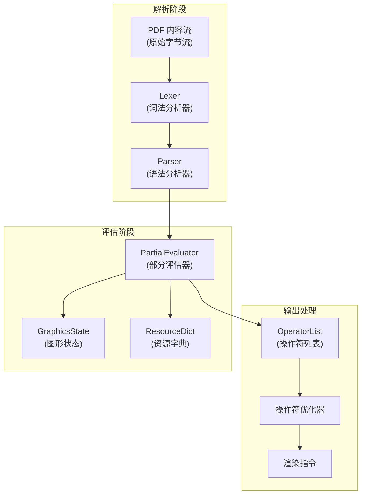
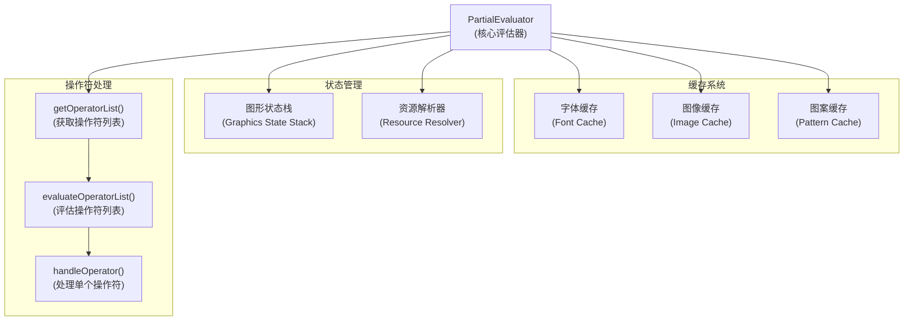
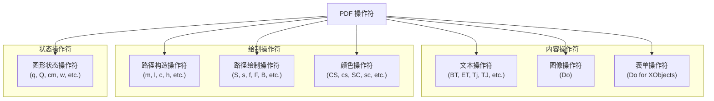
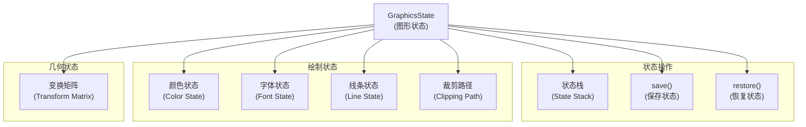
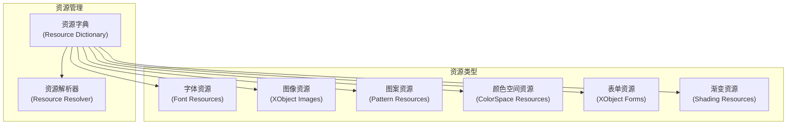
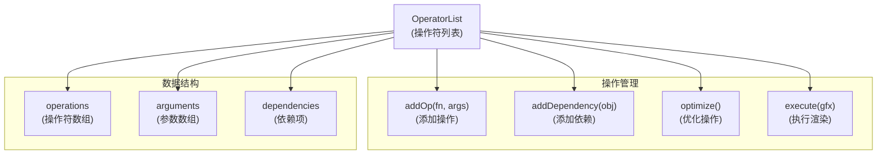
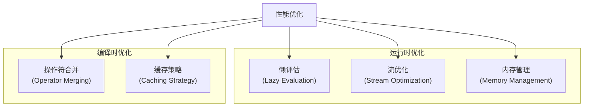
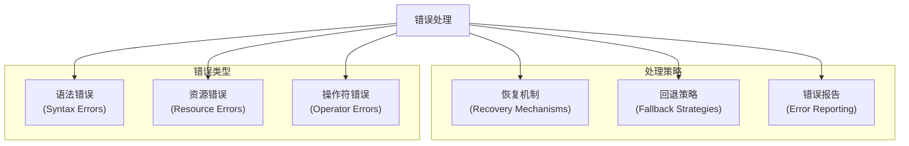
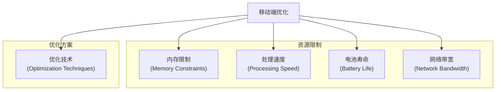

# 内容流处理

> **相关源文件**
> * [src/core/evaluator.js](https://github.com/Mr-xzq/pdf.js-4.4.168/blob/19fbc899/src/core/evaluator.js)
> * [src/core/parser.js](https://github.com/Mr-xzq/pdf.js-4.4.168/blob/19fbc899/src/core/parser.js)
> * [src/core/stream.js](https://github.com/Mr-xzq/pdf.js-4.4.168/blob/19fbc899/src/core/stream.js)
> * [src/core/function.js](https://github.com/Mr-xzq/pdf.js-4.4.168/blob/19fbc899/src/core/function.js)
> * [src/core/pattern.js](https://github.com/Mr-xzq/pdf.js-4.4.168/blob/19fbc899/src/core/pattern.js)
> * [src/core/colorspace.js](https://github.com/Mr-xzq/pdf.js-4.4.168/blob/19fbc899/src/core/colorspace.js)
> * [src/display/canvas.js](https://github.com/Mr-xzq/pdf.js-4.4.168/blob/19fbc899/src/display/canvas.js)
> * [src/shared/util.js](https://github.com/Mr-xzq/pdf.js-4.4.168/blob/19fbc899/src/shared/util.js)

内容流处理是 PDF.js 核心引擎的关键组件，负责解析和评估 PDF 页面的内容流，将 PDF 操作符转换为可渲染的指令序列。该系统处理图形状态管理、资源解析、坐标变换和操作符优化。

有关文档加载的信息，请参阅 [文档加载和 API](/Mr-xzq/pdf.js-4.4.168/2.1-document-loading-and-api)。有关字体处理的详细信息，请参阅 [字体和字符映射](/Mr-xzq/pdf.js-4.4.168/2.3-font-and-character-mapping)。

## 概述

PDF 内容流是包含描述页面外观的图形操作符序列的数据流。内容流处理系统将这些操作符解析、评估并转换为 `OperatorList` 对象，该对象包含渲染引擎可以执行的标准化指令。

该过程涉及多个阶段：词法分析、语法解析、资源解析、图形状态管理和操作符优化。

来源: [src/core/evaluator.js L209-L237](https://github.com/Mr-xzq/pdf.js-4.4.168/blob/19fbc899/src/core/evaluator.js#L209-L237)

 [src/core/parser.js L61-L93](https://github.com/Mr-xzq/pdf.js-4.4.168/blob/19fbc899/src/core/parser.js#L61-L93)

## 内容流处理架构

### 处理管道概述



## PartialEvaluator 核心组件

`PartialEvaluator` 是内容流处理的核心，负责将 PDF 操作符转换为渲染指令：

### PartialEvaluator 架构



### 关键处理方法

```javascript
// PartialEvaluator 的主要方法示例
class PartialEvaluator {
  async getOperatorList({
    stream,
    task,
    resources,
    operatorList,
    initialState
  }) {
    // 解析内容流并生成操作符列表
    const parser = new Parser({
      lexer: new Lexer(stream),
      xref: this.xref
    });
    
    // 评估操作符序列
    await this.evaluateOperatorList({
      parser,
      task,
      resources,
      operatorList,
      initialState
    });
    
    return operatorList;
  }
  
  async evaluateOperatorList({
    parser,
    task,
    resources,
    operatorList,
    initialState
  }) {
    const graphicsState = initialState || new GraphicsState();
    
    while (true) {
      const operation = parser.getOperator();
      if (!operation) break;
      
      await this.handleOperator(
        operation,
        graphicsState,
        resources,
        operatorList,
        task
      );
    }
  }
}
```

来源: [src/core/evaluator.js L4550-L4650](https://github.com/Mr-xzq/pdf.js-4.4.168/blob/19fbc899/src/core/evaluator.js#L4550-L4650)

## PDF 操作符处理

PDF 内容流包含各种图形操作符，每种操作符都有特定的处理逻辑：

### 操作符分类



### 操作符处理示例

```javascript
// 操作符处理的示例实现
const operatorHandlers = {
  // 图形状态保存
  q: function(args, graphicsState) {
    graphicsState.save();
  },
  
  // 图形状态恢复
  Q: function(args, graphicsState) {
    graphicsState.restore();
  },
  
  // 变换矩阵
  cm: function(args, graphicsState) {
    const [a, b, c, d, e, f] = args;
    const matrix = [a, b, c, d, e, f];
    graphicsState.transform(matrix);
  },
  
  // 移动到点
  m: function(args, graphicsState) {
    const [x, y] = args;
    graphicsState.moveTo(x, y);
  },
  
  // 直线到点
  l: function(args, graphicsState) {
    const [x, y] = args;
    graphicsState.lineTo(x, y);
  },
  
  // 显示文本
  Tj: function(args, graphicsState, resources) {
    const text = args[0];
    const font = resources.getFont(graphicsState.font);
    return {
      fn: OPS.showText,
      args: [text, font, graphicsState.fontSize]
    };
  }
};
```

## 图形状态管理

图形状态跟踪当前的绘制参数，包括变换矩阵、颜色、字体等：

### 图形状态架构



### 图形状态实现

```javascript
class GraphicsState {
  constructor() {
    // 变换矩阵 [a, b, c, d, e, f]
    this.ctm = [1, 0, 0, 1, 0, 0]; // 当前变换矩阵
    
    // 颜色状态
    this.fillColorSpace = 'DeviceGray';
    this.strokeColorSpace = 'DeviceGray';
    this.fillColor = [0]; // 黑色
    this.strokeColor = [0];
    
    // 字体状态
    this.font = null;
    this.fontSize = 12;
    this.textMatrix = [1, 0, 0, 1, 0, 0];
    this.textLineMatrix = [1, 0, 0, 1, 0, 0];
    
    // 线条状态
    this.lineWidth = 1;
    this.lineCap = 0;
    this.lineJoin = 0;
    this.miterLimit = 10;
    this.dashArray = [];
    this.dashPhase = 0;
    
    // 状态栈
    this.stateStack = [];
  }
  
  save() {
    // 保存当前状态到栈中
    this.stateStack.push(this.clone());
  }
  
  restore() {
    // 从栈中恢复状态
    if (this.stateStack.length > 0) {
      const savedState = this.stateStack.pop();
      Object.assign(this, savedState);
    }
  }
  
  transform(matrix) {
    // 应用变换矩阵
    this.ctm = Util.transform(this.ctm, matrix);
  }
  
  clone() {
    // 深度克隆当前状态
    return JSON.parse(JSON.stringify(this));
  }
}
```

## 资源解析

PDF 页面引用各种资源，如字体、图像、图案等，需要在处理过程中解析：

### 资源解析架构



### 资源解析实现

```javascript
class ResourceResolver {
  constructor(resources, xref) {
    this.resources = resources;
    this.xref = xref;
    this.cache = new Map();
  }
  
  getFont(fontName) {
    // 获取字体资源
    if (this.cache.has(`font_${fontName}`)) {
      return this.cache.get(`font_${fontName}`);
    }
    
    const fontDict = this.resources.get('Font');
    if (fontDict && fontDict.has(fontName)) {
      const fontRef = fontDict.get(fontName);
      const font = this.xref.fetchIfRef(fontRef);
      this.cache.set(`font_${fontName}`, font);
      return font;
    }
    
    return null;
  }
  
  getXObject(name) {
    // 获取 XObject 资源（图像或表单）
    const xObjectDict = this.resources.get('XObject');
    if (xObjectDict && xObjectDict.has(name)) {
      const xObjectRef = xObjectDict.get(name);
      return this.xref.fetchIfRef(xObjectRef);
    }
    
    return null;
  }
  
  getColorSpace(name) {
    // 获取颜色空间资源
    const colorSpaceDict = this.resources.get('ColorSpace');
    if (colorSpaceDict && colorSpaceDict.has(name)) {
      const colorSpaceRef = colorSpaceDict.get(name);
      return this.xref.fetchIfRef(colorSpaceRef);
    }
    
    // 返回设备相关的默认颜色空间
    return this.getDeviceColorSpace(name);
  }
}
```

来源: [src/core/evaluator.js L81-L92](https://github.com/Mr-xzq/pdf.js-4.4.168/blob/19fbc899/src/core/evaluator.js#L81-L92)

## OperatorList 生成

`OperatorList` 是内容流处理的最终输出，包含标准化的渲染指令：

### OperatorList 架构



### OperatorList 实现

```javascript
class OperatorList {
  constructor() {
    this.fnArray = []; // 操作符函数数组
    this.argsArray = []; // 参数数组
    this.dependencies = new Set(); // 依赖项集合
  }

  addOp(fn, args) {
    // 添加操作符和参数
    this.fnArray.push(fn);
    this.argsArray.push(args || []);
  }

  addDependency(dependency) {
    // 添加依赖项（字体、图像等）
    this.dependencies.add(dependency);
  }

  addDependencies(dependencies) {
    // 批量添加依赖项
    for (const dep of dependencies) {
      this.dependencies.add(dep);
    }
  }

  optimize() {
    // 优化操作符序列
    this.mergeConsecutiveOperations();
    this.removeRedundantOperations();
    this.optimizeTransforms();
  }

  mergeConsecutiveOperations() {
    // 合并连续的相同操作
    const newFnArray = [];
    const newArgsArray = [];

    for (let i = 0; i < this.fnArray.length; i++) {
      const fn = this.fnArray[i];
      const args = this.argsArray[i];

      // 检查是否可以与前一个操作合并
      if (this.canMergeWithPrevious(fn, args, newFnArray, newArgsArray)) {
        this.mergeOperations(fn, args, newFnArray, newArgsArray);
      } else {
        newFnArray.push(fn);
        newArgsArray.push(args);
      }
    }

    this.fnArray = newFnArray;
    this.argsArray = newArgsArray;
  }
}
```

## 性能优化策略

内容流处理包含多种性能优化技术：

### 优化策略概览



### 缓存机制

```javascript
class EvaluatorCache {
  constructor() {
    this.fontCache = new Map();
    this.imageCache = new Map();
    this.patternCache = new Map();
    this.colorSpaceCache = new Map();
  }

  getFont(fontRef) {
    const key = fontRef.toString();
    if (this.fontCache.has(key)) {
      return this.fontCache.get(key);
    }

    // 创建新的字体对象
    const font = new Font(fontRef);
    this.fontCache.set(key, font);
    return font;
  }

  getImage(imageRef) {
    const key = imageRef.toString();
    if (this.imageCache.has(key)) {
      return this.imageCache.get(key);
    }

    // 创建新的图像对象
    const image = new PDFImage(imageRef);
    this.imageCache.set(key, image);
    return image;
  }

  clear() {
    // 清理缓存以释放内存
    this.fontCache.clear();
    this.imageCache.clear();
    this.patternCache.clear();
    this.colorSpaceCache.clear();
  }
}
```

## 错误处理和容错

内容流处理包含强大的错误处理机制：

### 错误处理策略



### 容错实现

```javascript
class RobustEvaluator extends PartialEvaluator {
  async handleOperator(operation, graphicsState, resources, operatorList, task) {
    try {
      // 尝试正常处理操作符
      await super.handleOperator(operation, graphicsState, resources, operatorList, task);
    } catch (error) {
      // 错误处理和恢复
      this.handleOperatorError(error, operation, graphicsState, operatorList);
    }
  }

  handleOperatorError(error, operation, graphicsState, operatorList) {
    const { fn, args } = operation;

    if (this.options.ignoreErrors) {
      // 忽略错误模式：记录警告并继续
      console.warn(`操作符 ${fn} 处理失败:`, error.message);

      // 尝试使用默认参数
      this.useDefaultOperation(fn, graphicsState, operatorList);
    } else {
      // 严格模式：抛出错误
      throw new Error(`操作符 ${fn} 处理失败: ${error.message}`);
    }
  }

  useDefaultOperation(fn, graphicsState, operatorList) {
    // 根据操作符类型使用默认行为
    switch (fn) {
      case 'Tf': // 设置字体
        operatorList.addOp(OPS.setFont, ['Helvetica', 12]);
        break;
      case 'Do': // 显示 XObject
        // 跳过无法处理的 XObject
        break;
      default:
        // 对于未知操作符，添加空操作
        operatorList.addOp(OPS.noop, []);
    }
  }
}
```

## 移动端优化

针对移动设备的内容流处理优化：

### 移动端优化特性



**移动端优化配置**:

```javascript
const mobileEvaluatorConfig = {
  // 启用激进的缓存策略
  enableCache: true,
  cacheSize: 50, // 限制缓存大小

  // 简化操作符处理
  simplifyOperators: true,

  // 降低精度以提高性能
  reducePrecision: true,

  // 跳过复杂的图形操作
  skipComplexGraphics: true,

  // 限制并发处理
  maxConcurrentOperations: 2,

  // 启用增量处理
  enableIncrementalProcessing: true,

  // 内存管理
  memoryThreshold: 50 * 1024 * 1024, // 50MB
  enableGarbageCollection: true
};

// 应用移动端优化
const evaluator = new PartialEvaluator({
  ...mobileEvaluatorConfig,
  xref: document.xref,
  handler: messageHandler
});
```

这些优化确保内容流处理在移动设备上能够高效运行，同时保持良好的用户体验和电池寿命。
