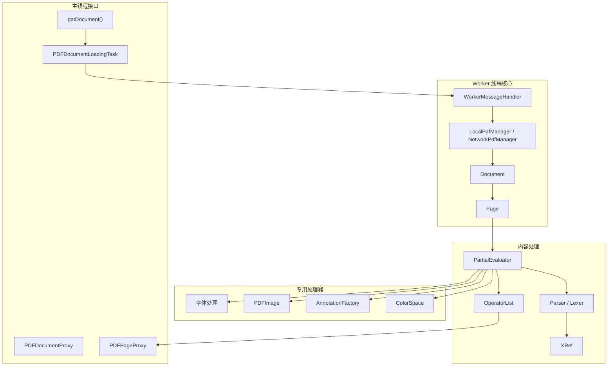
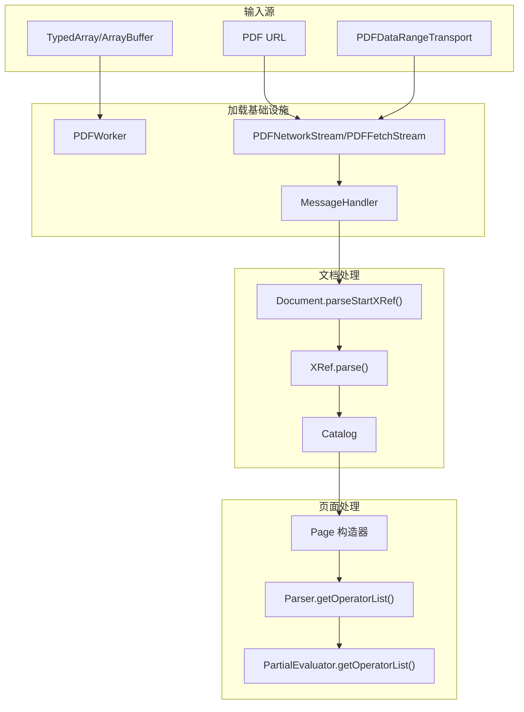
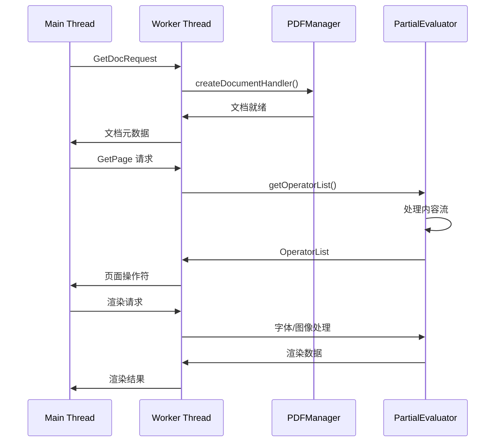

# 核心 PDF 处理引擎

> **相关源文件**
> * [src/core/annotation.js](https://github.com/Mr-xzq/pdf.js-4.4.168/blob/19fbc899/src/core/annotation.js)
> * [src/core/catalog.js](https://github.com/Mr-xzq/pdf.js-4.4.168/blob/19fbc899/src/core/catalog.js)
> * [src/core/chunked_stream.js](https://github.com/Mr-xzq/pdf.js-4.4.168/blob/19fbc899/src/core/chunked_stream.js)
> * [src/core/colorspace.js](https://github.com/Mr-xzq/pdf.js-4.4.168/blob/19fbc899/src/core/colorspace.js)
> * [src/core/document.js](https://github.com/Mr-xzq/pdf.js-4.4.168/blob/19fbc899/src/core/document.js)
> * [src/core/evaluator.js](https://github.com/Mr-xzq/pdf.js-4.4.168/blob/19fbc899/src/core/evaluator.js)
> * [src/core/font_renderer.js](https://github.com/Mr-xzq/pdf.js-4.4.168/blob/19fbc899/src/core/font_renderer.js)
> * [src/core/fonts.js](https://github.com/Mr-xzq/pdf.js-4.4.168/blob/19fbc899/src/core/fonts.js)
> * [src/core/function.js](https://github.com/Mr-xzq/pdf.js-4.4.168/blob/19fbc899/src/core/function.js)
> * [src/core/image.js](https://github.com/Mr-xzq/pdf.js-4.4.168/blob/19fbc899/src/core/image.js)
> * [src/core/jbig2.js](https://github.com/Mr-xzq/pdf.js-4.4.168/blob/19fbc899/src/core/jbig2.js)
> * [src/core/jpg.js](https://github.com/Mr-xzq/pdf.js-4.4.168/blob/19fbc899/src/core/jpg.js)
> * [src/core/jpx.js](https://github.com/Mr-xzq/pdf.js-4.4.168/blob/19fbc899/src/core/jpx.js)
> * [src/core/parser.js](https://github.com/Mr-xzq/pdf.js-4.4.168/blob/19fbc899/src/core/parser.js)
> * [src/core/pattern.js](https://github.com/Mr-xzq/pdf.js-4.4.168/blob/19fbc899/src/core/pattern.js)
> * [src/core/pdf_manager.js](https://github.com/Mr-xzq/pdf.js-4.4.168/blob/19fbc899/src/core/pdf_manager.js)
> * [src/core/stream.js](https://github.com/Mr-xzq/pdf.js-4.4.168/blob/19fbc899/src/core/stream.js)
> * [src/core/worker.js](https://github.com/Mr-xzq/pdf.js-4.4.168/blob/19fbc899/src/core/worker.js)
> * [src/display/annotation_layer.js](https://github.com/Mr-xzq/pdf.js-4.4.168/blob/19fbc899/src/display/annotation_layer.js)
> * [src/display/api.js](https://github.com/Mr-xzq/pdf.js-4.4.168/blob/19fbc899/src/display/api.js)
> * [src/display/canvas.js](https://github.com/Mr-xzq/pdf.js-4.4.168/blob/19fbc899/src/display/canvas.js)
> * [src/display/font_loader.js](https://github.com/Mr-xzq/pdf.js-4.4.168/blob/19fbc899/src/display/font_loader.js)
> * [src/display/pattern_helper.js](https://github.com/Mr-xzq/pdf.js-4.4.168/blob/19fbc899/src/display/pattern_helper.js)
> * [src/shared/util.js](https://github.com/Mr-xzq/pdf.js-4.4.168/blob/19fbc899/src/shared/util.js)

## 目的和范围

核心 PDF 处理引擎构成了 PDF.js 的基础层，负责解析 PDF 文档、处理内容流，并将 PDF 操作转换为可渲染的数据结构。该系统处理 PDF 格式规范的底层解释，包括文档结构解析、内容流评估、字体处理、图像解码和注释处理。

引擎主要在 Web Worker 线程中运行以保持 UI 响应性，并提供高级组件所依赖的基本服务。有关使用此引擎的 Web 查看器应用程序的信息，请参阅 [Web 查看器应用程序](/Mr-xzq/pdf.js-4.4.168/3-web-viewer-application)。有关构建系统和分发的详细信息，请参阅 [构建系统和分发](/Mr-xzq/pdf.js-4.4.168/5-build-system-and-distribution)。

## 架构概述

核心 PDF 处理引擎由几个相互连接的子系统组成，它们协同工作将 PDF 数据转换为可渲染的内容：

### 核心引擎组件

来源: [src/display/api.js L232-L477](https://github.com/Mr-xzq/pdf.js-4.4.168/blob/19fbc899/src/display/api.js#L232-L477)

 [src/core/worker.js L72-L520](https://github.com/Mr-xzq/pdf.js-4.4.168/blob/19fbc899/src/core/worker.js#L72-L520)

 [src/core/evaluator.js L209-L237](https://github.com/Mr-xzq/pdf.js-4.4.168/blob/19fbc899/src/core/evaluator.js#L209-L237)

 [src/core/document.js L79-L122](https://github.com/Mr-xzq/pdf.js-4.4.168/blob/19fbc899/src/core/document.js#L79-L122)

### 文档加载和处理管道

来源: [src/display/api.js L232-L477](https://github.com/Mr-xzq/pdf.js-4.4.168/blob/19fbc899/src/display/api.js#L232-L477)

 [src/core/document.js L1-L150](https://github.com/Mr-xzq/pdf.js-4.4.168/blob/19fbc899/src/core/document.js#L1-L150)

 [src/core/parser.js L61-L93](https://github.com/Mr-xzq/pdf.js-4.4.168/blob/19fbc899/src/core/parser.js#L61-L93)

 [src/core/evaluator.js L4550-L4650](https://github.com/Mr-xzq/pdf.js-4.4.168/blob/19fbc899/src/core/evaluator.js#L4550-L4650)

## 核心子系统

### 文档加载和 API 层

引擎通过 [src/display/api.js L232](https://github.com/Mr-xzq/pdf.js-4.4.168/blob/19fbc899/src/display/api.js#L232-L232) 中的 `getDocument()` API 公开其功能，该 API 创建一个管理整个加载过程的 `PDFDocumentLoadingTask`。API 支持多种输入格式，包括 URL、TypedArray 和通过 `PDFDataRangeTransport` 的自定义范围传输。

关键组件：

* **PDFDocumentLoadingTask**: 管理加载状态和进度报告
* **PDFWorker**: 处理 Worker 线程创建和消息传递
* **WorkerTransport**: 桥接主线程和 Worker 通信

有关文档加载的详细信息，请参阅 [文档加载和 API](/Mr-xzq/pdf.js-4.4.168/2.1-document-loading-and-api)。

### 内容流处理

`PartialEvaluator` 类 [src/core/evaluator.js L209](https://github.com/Mr-xzq/pdf.js-4.4.168/blob/19fbc899/src/core/evaluator.js#L209-L209) 作为中央处理引擎，解释 PDF 内容流并将其转换为操作符列表。它处理：

* PDF 操作符解析和评估
* 资源解析（字体、图像、图案）
* 图形状态管理
* 坐标变换

评估器与 `Parser` 类 [src/core/parser.js L61](https://github.com/Mr-xzq/pdf.js-4.4.168/blob/19fbc899/src/core/parser.js#L61-L61) 协作，对 PDF 内容流进行标记化和解析，构建包含渲染指令的 `OperatorList` 对象。

有关内容处理的详细信息，请参阅 [内容流处理](/Mr-xzq/pdf.js-4.4.168/2.2-content-stream-processing)。

### 字体和字符处理

字体处理通过 `Font` 类层次结构 [src/core/fonts.js L240-L4000](https://github.com/Mr-xzq/pdf.js-4.4.168/blob/19fbc899/src/core/fonts.js#L240-L4000) 管理，支持：

* Type1、TrueType、CFF 和复合字体
* 通过 `ToUnicodeMap` 进行字符编码和 Unicode 映射
* 字形处理和字体度量
* 字体子集化和 OpenType 转换

有关字体处理的详细信息，请参阅 [字体和字符映射](/Mr-xzq/pdf.js-4.4.168/2.3-font-and-character-mapping)。

### 图像和图形处理

图像处理由 `PDFImage` 类 [src/core/image.js L35-L1000](https://github.com/Mr-xzq/pdf.js-4.4.168/blob/19fbc899/src/core/image.js#L35-L1000) 和相关组件处理：

* 多种图像格式（JPEG、PNG、JBIG2、JPEG2000）
* 通过 `ColorSpace` [src/core/colorspace.js](https://github.com/Mr-xzq/pdf.js-4.4.168/blob/19fbc899/src/core/colorspace.js) 进行颜色空间变换
* 图像蒙版和透明度
* 内联图像缓存

有关图像处理的详细信息，请参阅 [图像和图形处理](/Mr-xzq/pdf.js-4.4.168/2.4-image-and-graphics-processing)。

### 注释处理

`AnnotationFactory` [src/core/annotation.js L73](https://github.com/Mr-xzq/pdf.js-4.4.168/blob/19fbc899/src/core/annotation.js#L73-L73) 创建和处理各种注释类型：

* 交互式表单字段（文本、按钮、选择）
* 标记注释（高亮、备注等）
* 外观流处理
* 控件值处理

有关注释处理的详细信息，请参阅 [注释和表单处理](/Mr-xzq/pdf.js-4.4.168/3.4-annotation-and-form-handling)。

## Worker 线程架构

引擎主要在 Web Worker 中运行以保持 UI 响应性。Worker 架构以 `WorkerMessageHandler` [src/core/worker.js L72](https://github.com/Mr-xzq/pdf.js-4.4.168/blob/19fbc899/src/core/worker.js#L72-L72) 为中心：

### Worker 通信流程

来源: [src/core/worker.js L89-L300](https://github.com/Mr-xzq/pdf.js-4.4.168/blob/19fbc899/src/core/worker.js#L89-L300)

 [src/core/evaluator.js L4550-L4650](https://github.com/Mr-xzq/pdf.js-4.4.168/blob/19fbc899/src/core/evaluator.js#L4550-L4650)

### 关键 Worker 组件

* **WorkerTask**: 管理具有取消支持的单个处理任务
* **PDFManager**: 基于数据源的 `LocalPdfManager` 与 `NetworkPdfManager` 工厂
* **MessageHandler**: 提供基于 Promise 的 API 在线程间进行结构化通信

## 数据流和集成

引擎通过明确定义的管道处理 PDF 文档：

1. **加载阶段**: 通过 `getDocument()` 加载文档并解析基本结构
2. **页面访问**: 通过 `PDFPageProxy.getOperatorList()` 访问单个页面
3. **内容评估**: `PartialEvaluator` 处理页面内容流
4. **资源处理**: 根据需要处理字体、图像和其他资源
5. **操作符生成**: 为渲染生成最终的 `OperatorList`

系统使用多种缓存机制来优化性能：

* 跨页面重用字体的字体缓存
* 重复图像的图像缓存
* 字符映射的内置 CMap 缓存
* 标准字体数据缓存

错误处理贯穿整个系统，为损坏或非标准 PDF 文件提供回退机制，由 `PartialEvaluator` 中的 `ignoreErrors` 选项控制。

## 项目特定的架构特点

基于当前项目的上下文，核心 PDF 处理引擎具有以下特定特点：

### 移动端优化

针对移动设备的特殊优化：

* **内存管理**: 严格控制内存使用，适应移动设备的内存限制
* **电池优化**: 减少 CPU 密集型操作，延长电池寿命
* **网络优化**: 支持分块加载和断点续传，适应移动网络环境
* **缓存策略**: 智能缓存机制，减少重复处理

### 性能优化

* **懒加载**: 按需加载和处理页面内容
* **渐进式渲染**: 支持渐进式页面渲染，提供更好的用户体验
* **资源压缩**: 优化字体和图像数据的传输和存储
* **并行处理**: 利用 Worker 线程进行并行处理

来源: [src/display/api.js L232-L477](https://github.com/Mr-xzq/pdf.js-4.4.168/blob/19fbc899/src/display/api.js#L232-L477)

 [src/core/evaluator.js L81-L92](https://github.com/Mr-xzq/pdf.js-4.4.168/blob/19fbc899/src/core/evaluator.js#L81-L92)

 [src/core/document.js L79-L200](https://github.com/Mr-xzq/pdf.js-4.4.168/blob/19fbc899/src/core/document.js#L79-L200)

 [src/core/worker.js L94-L300](https://github.com/Mr-xzq/pdf.js-4.4.168/blob/19fbc899/src/core/worker.js#L94-L300)
