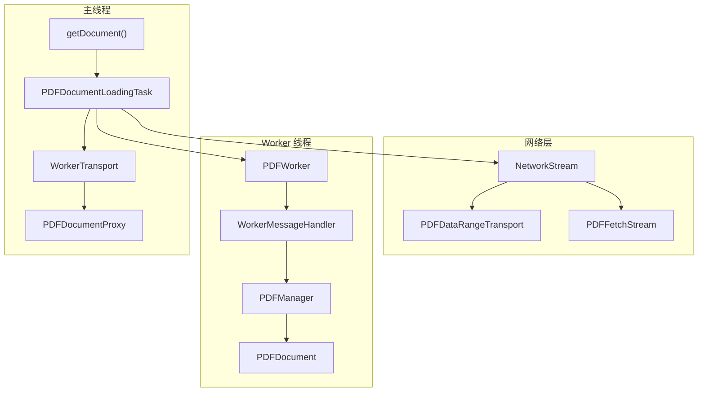
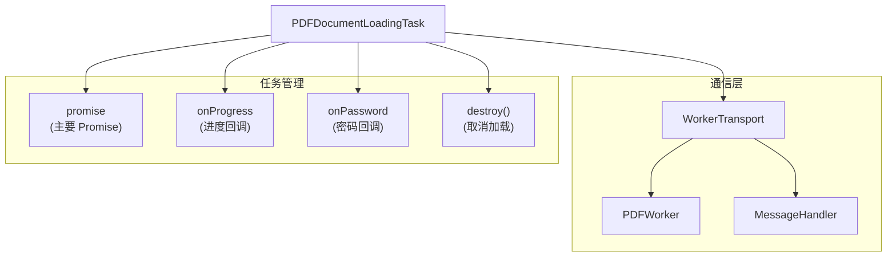
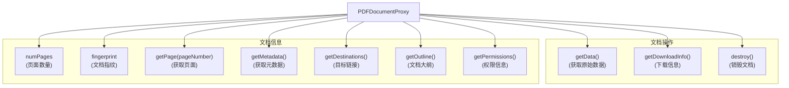
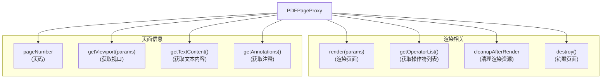
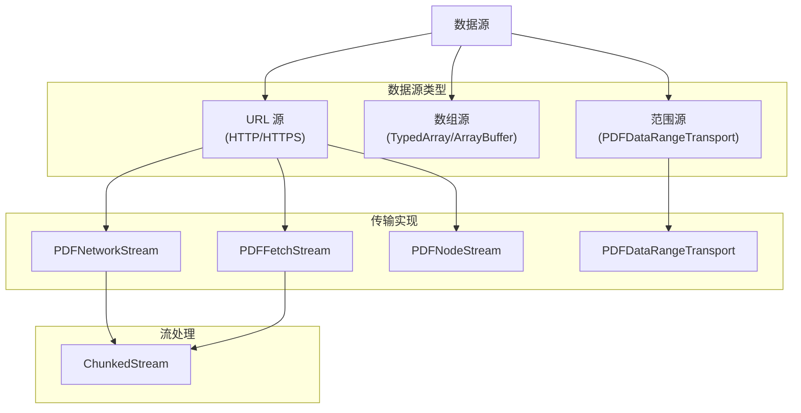
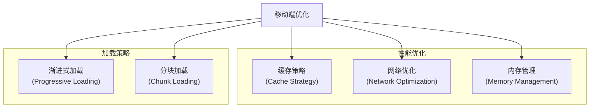

# 文档加载和 API

> **相关源文件**
> * [src/core/annotation.js](https://github.com/Mr-xzq/pdf.js-4.4.168/blob/19fbc899/src/core/annotation.js)
> * [src/core/catalog.js](https://github.com/Mr-xzq/pdf.js-4.4.168/blob/19fbc899/src/core/catalog.js)
> * [src/core/document.js](https://github.com/Mr-xzq/pdf.js-4.4.168/blob/19fbc899/src/core/document.js)
> * [src/core/evaluator.js](https://github.com/Mr-xzq/pdf.js-4.4.168/blob/19fbc899/src/core/evaluator.js)
> * [src/core/fonts.js](https://github.com/Mr-xzq/pdf.js-4.4.168/blob/19fbc899/src/core/fonts.js)
> * [src/core/worker.js](https://github.com/Mr-xzq/pdf.js-4.4.168/blob/19fbc899/src/core/worker.js)
> * [src/display/annotation_layer.js](https://github.com/Mr-xzq/pdf.js-4.4.168/blob/19fbc899/src/display/annotation_layer.js)
> * [src/display/api.js](https://github.com/Mr-xzq/pdf.js-4.4.168/blob/19fbc899/src/display/api.js)
> * [src/display/base_factory.js](https://github.com/Mr-xzq/pdf.js-4.4.168/blob/19fbc899/src/display/base_factory.js)
> * [src/display/canvas.js](https://github.com/Mr-xzq/pdf.js-4.4.168/blob/19fbc899/src/display/canvas.js)
> * [src/display/display_utils.js](https://github.com/Mr-xzq/pdf.js-4.4.168/blob/19fbc899/src/display/display_utils.js)
> * [src/display/node_utils.js](https://github.com/Mr-xzq/pdf.js-4.4.168/blob/19fbc899/src/display/node_utils.js)
> * [src/pdf.js](https://github.com/Mr-xzq/pdf.js-4.4.168/blob/19fbc899/src/pdf.js)
> * [src/shared/util.js](https://github.com/Mr-xzq/pdf.js-4.4.168/blob/19fbc899/src/shared/util.js)

本文档涵盖 PDF.js 文档加载系统及其公共 API。这包括主要的 `getDocument` 函数、文档加载任务、传输机制，以及提供对 PDF 文档数据访问的代理对象。该系统作为在 PDF.js 中加载和与 PDF 文档交互的主要入口点。

有关文档加载后的内容流处理信息，请参阅 [内容流处理](/Mr-xzq/pdf.js-4.4.168/2.2-content-stream-processing)。有关使用此 API 的 Web 查看器应用程序的详细信息，请参阅 [应用程序架构](/Mr-xzq/pdf.js-4.4.168/3.1-application-architecture)。

## 概述

PDF.js 中的文档加载系统为从各种源（URL、TypedArray、ArrayBuffer）加载 PDF 文档提供统一接口，并通过一致的 API 呈现它们。该系统处理网络请求、Worker 线程协调、进度报告和错误处理，同时向最终用户抽象 PDF 解析的复杂性。

主要入口点 `getDocument()` 返回一个管理加载过程的 `PDFDocumentLoadingTask`，最终解析为提供对文档页面、元数据和其他属性访问的 `PDFDocumentProxy` 对象。

来源: [src/display/api.js L232-L477](https://github.com/Mr-xzq/pdf.js-4.4.168/blob/19fbc899/src/display/api.js#L232-L477)

 [src/core/worker.js L72-L117](https://github.com/Mr-xzq/pdf.js-4.4.168/blob/19fbc899/src/core/worker.js#L72-L117)

 [src/core/document.js L79-L122](https://github.com/Mr-xzq/pdf.js-4.4.168/blob/19fbc899/src/core/document.js#L79-L122)

## 文档加载流程



**文档加载流程图**

加载过程从 `getDocument()` 开始，创建一个 `PDFDocumentLoadingTask`，该任务在主线程、Worker 线程和网络层之间协调以产生 `PDFDocumentProxy`。

来源: [src/display/api.js L232-L477](https://github.com/Mr-xzq/pdf.js-4.4.168/blob/19fbc899/src/display/api.js#L232-L477)

 [src/core/worker.js L89-L91](https://github.com/Mr-xzq/pdf.js-4.4.168/blob/19fbc899/src/core/worker.js#L89-L91)

## getDocument API

`getDocument()` 函数是 PDF.js 的主要入口点，支持多种输入格式和配置选项：

### API 签名和参数

```javascript
function getDocument(src) {
  // src 可以是：
  // - string (URL)
  // - Uint8Array | ArrayBuffer
  // - PDFDataRangeTransport
  // - 包含以下属性的对象：
  //   - url: string
  //   - data: Uint8Array | ArrayBuffer
  //   - httpHeaders: Object
  //   - withCredentials: boolean
  //   - password: string
  //   - length: number
  //   - range: PDFDataRangeTransport
  //   - worker: PDFWorker
  //   - verbosity: number
  //   - docBaseUrl: string
  //   - cMapUrl: string
  //   - cMapPacked: boolean
  //   - CMapReaderFactory: function
  //   - standardFontDataUrl: string
  //   - StandardFontDataFactory: function
  //   - ignoreErrors: boolean
  //   - isEvalSupported: boolean
  //   - fontExtraProperties: boolean
  //   - enableXfa: boolean
  //   - ownerDocument: Document
  //   - disableRange: boolean
  //   - disableStream: boolean
  //   - disableAutoFetch: boolean
  //   - pdfBug: boolean
}
```

### 基本使用示例

```javascript
// 从 URL 加载
const loadingTask = pdfjsLib.getDocument('path/to/document.pdf');
loadingTask.promise.then(pdf => {
  console.log('PDF 加载完成，页数:', pdf.numPages);
});

// 从 ArrayBuffer 加载
const loadingTask = pdfjsLib.getDocument(arrayBuffer);
loadingTask.promise.then(pdf => {
  // 处理 PDF 文档
});

// 带配置选项加载
const loadingTask = pdfjsLib.getDocument({
  url: 'path/to/document.pdf',
  httpHeaders: {
    'Authorization': 'Bearer token'
  },
  withCredentials: true,
  password: 'document-password'
});
```

来源: [src/display/api.js L232-L477](https://github.com/Mr-xzq/pdf.js-4.4.168/blob/19fbc899/src/display/api.js#L232-L477)

## PDFDocumentLoadingTask

`PDFDocumentLoadingTask` 管理文档加载过程，提供进度监控和取消功能：

### 加载任务架构



### 进度监控和错误处理

```javascript
const loadingTask = pdfjsLib.getDocument('document.pdf');

// 监控加载进度
loadingTask.onProgress = function(progress) {
  const percent = (progress.loaded / progress.total) * 100;
  console.log(`加载进度: ${percent.toFixed(2)}%`);
};

// 处理密码保护的文档
loadingTask.onPassword = function(callback, reason) {
  if (reason === pdfjsLib.PasswordResponses.NEED_PASSWORD) {
    const password = prompt('请输入 PDF 密码:');
    callback(password);
  } else if (reason === pdfjsLib.PasswordResponses.INCORRECT_PASSWORD) {
    const password = prompt('密码错误，请重新输入:');
    callback(password);
  }
};

// 处理加载完成
loadingTask.promise.then(pdf => {
  console.log('文档加载成功');
}).catch(error => {
  console.error('文档加载失败:', error);
});

// 取消加载
// loadingTask.destroy();
```

来源: [src/display/api.js L477-L589](https://github.com/Mr-xzq/pdf.js-4.4.168/blob/19fbc899/src/display/api.js#L477-L589)

## PDFDocumentProxy

`PDFDocumentProxy` 是加载完成后的文档对象，提供对文档内容的访问：

### 文档代理架构



### 文档信息访问

```javascript
loadingTask.promise.then(async pdf => {
  // 基本文档信息
  console.log('页面数量:', pdf.numPages);
  console.log('文档指纹:', pdf.fingerprint);

  // 获取文档元数据
  const metadata = await pdf.getMetadata();
  console.log('标题:', metadata.info.Title);
  console.log('作者:', metadata.info.Author);
  console.log('创建日期:', metadata.info.CreationDate);

  // 获取文档大纲
  const outline = await pdf.getOutline();
  if (outline) {
    console.log('文档大纲:', outline);
  }

  // 获取文档权限
  const permissions = await pdf.getPermissions();
  console.log('打印权限:', permissions.includes(pdfjsLib.PermissionFlag.PRINT));

  // 获取页面
  const page = await pdf.getPage(1); // 获取第一页
  console.log('页面尺寸:', page.getViewport({ scale: 1.0 }));
});
```

## PDFPageProxy

`PDFPageProxy` 表示文档中的单个页面：

### 页面代理功能



### 页面渲染示例

```javascript
pdf.getPage(1).then(page => {
  // 设置渲染参数
  const scale = 1.5;
  const viewport = page.getViewport({ scale });

  // 创建画布
  const canvas = document.createElement('canvas');
  const context = canvas.getContext('2d');
  canvas.height = viewport.height;
  canvas.width = viewport.width;

  // 渲染页面
  const renderContext = {
    canvasContext: context,
    viewport: viewport
  };

  const renderTask = page.render(renderContext);
  renderTask.promise.then(() => {
    console.log('页面渲染完成');
    document.body.appendChild(canvas);
  });
});
```

## 网络传输和数据源

PDF.js 支持多种数据源和传输机制：

### 网络传输架构



### 自定义范围传输

```javascript
// 实现自定义范围传输
class CustomRangeTransport {
  constructor(length, initialData) {
    this.length = length;
    this.initialData = initialData;
  }

  requestRange(begin, end) {
    return new Promise((resolve, reject) => {
      // 实现自定义的范围请求逻辑
      // 例如：从自定义存储或缓存中获取数据
      const chunk = this.getDataRange(begin, end);
      resolve(chunk);
    });
  }

  abort() {
    // 取消正在进行的请求
  }
}

// 使用自定义传输
const transport = new CustomRangeTransport(fileLength, initialChunk);
const loadingTask = pdfjsLib.getDocument({
  range: transport
});
```

## 移动端优化特性

针对移动设备的文档加载优化：

### 移动端加载策略



**移动端优化配置**:

```javascript
const mobileConfig = {
  // 禁用范围请求以减少网络往返
  disableRange: true,

  // 禁用流式加载以减少内存使用
  disableStream: true,

  // 禁用自动获取以节省带宽
  disableAutoFetch: true,

  // 启用字体额外属性以提高渲染质量
  fontExtraProperties: false,

  // 忽略错误以提高兼容性
  ignoreErrors: true,

  // 设置较小的工作线程数量
  maxImageSize: 1024 * 1024, // 1MB

  // 启用 XFA 表单支持（如果需要）
  enableXfa: false
};

const loadingTask = pdfjsLib.getDocument({
  url: 'document.pdf',
  ...mobileConfig
});
```

这些功能共同构成了一个强大而灵活的文档加载系统，能够适应各种使用场景和设备环境，特别是针对移动端应用的优化需求。
