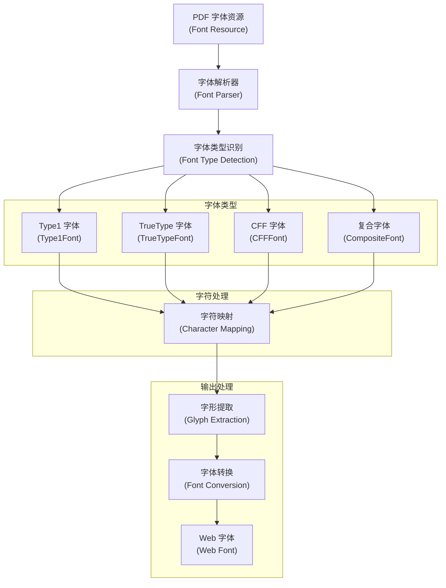
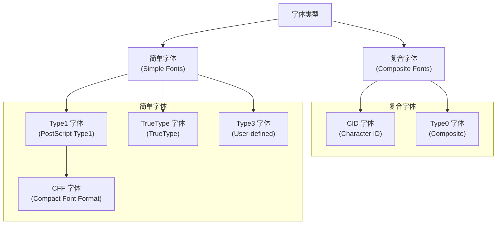
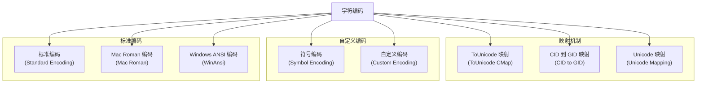
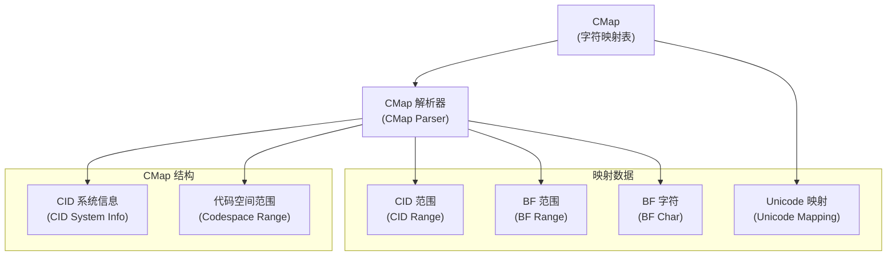
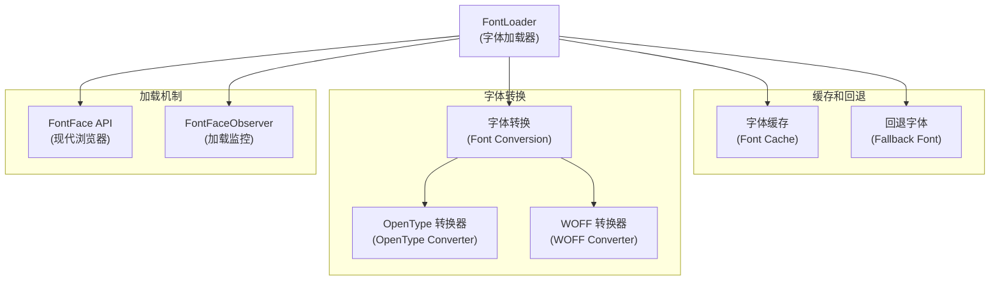
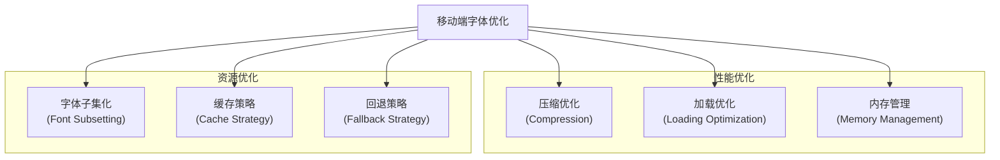

# 字体和字符映射

> **相关源文件**
> * [src/core/fonts.js](https://github.com/Mr-xzq/pdf.js-4.4.168/blob/19fbc899/src/core/fonts.js)
> * [src/core/font_renderer.js](https://github.com/Mr-xzq/pdf.js-4.4.168/blob/19fbc899/src/core/font_renderer.js)
> * [src/core/cmap.js](https://github.com/Mr-xzq/pdf.js-4.4.168/blob/19fbc899/src/core/cmap.js)
> * [src/core/unicode.js](https://github.com/Mr-xzq/pdf.js-4.4.168/blob/19fbc899/src/core/unicode.js)
> * [src/core/glyphlist.js](https://github.com/Mr-xzq/pdf.js-4.4.168/blob/19fbc899/src/core/glyphlist.js)
> * [src/display/font_loader.js](https://github.com/Mr-xzq/pdf.js-4.4.168/blob/19fbc899/src/display/font_loader.js)
> * [src/shared/util.js](https://github.com/Mr-xzq/pdf.js-4.4.168/blob/19fbc899/src/shared/util.js)

字体和字符映射系统是 PDF.js 核心引擎的关键组件，负责处理 PDF 文档中的字体资源、字符编码转换和文本渲染。该系统支持多种字体格式，处理复杂的字符映射关系，并确保文本在不同平台上的正确显示。

有关内容流处理的信息，请参阅 [内容流处理](/Mr-xzq/pdf.js-4.4.168/2.2-content-stream-processing)。有关图像处理的详细信息，请参阅 [图像和图形处理](/Mr-xzq/pdf.js-4.4.168/2.4-image-and-graphics-processing)。

## 概述

PDF 文档可以包含多种类型的字体，从简单的标准字体到复杂的复合字体。字体系统必须处理字符编码、字形映射、字体度量和渲染优化。该系统还需要处理缺失字体的回退机制，确保文档在任何环境下都能正确显示。

字体处理涉及多个阶段：字体解析、字符映射构建、字形数据提取、字体转换和渲染优化。

来源: [src/core/fonts.js L240-L4000](https://github.com/Mr-xzq/pdf.js-4.4.168/blob/19fbc899/src/core/fonts.js#L240-L4000)

 [src/display/font_loader.js L89-L234](https://github.com/Mr-xzq/pdf.js-4.4.168/blob/19fbc899/src/display/font_loader.js#L89-L234)

## 字体系统架构

### 字体处理管道



## 字体类型支持

PDF.js 支持多种字体格式，每种都有特定的处理逻辑：

### 字体类型分类



### 字体类层次结构

```javascript
// 字体类的基本结构
class Font {
  constructor(name, file, properties) {
    this.name = name;
    this.file = file;
    this.properties = properties;
    this.encoding = null;
    this.toUnicode = null;
    this.widths = [];
    this.defaultWidth = 1000;
  }
  
  // 抽象方法，由子类实现
  buildCharCodeToGlyphMap() {
    throw new Error('buildCharCodeToGlyphMap must be implemented');
  }
  
  getCharCodeToGlyphMap() {
    if (!this.charCodeToGlyphMap) {
      this.charCodeToGlyphMap = this.buildCharCodeToGlyphMap();
    }
    return this.charCodeToGlyphMap;
  }
}

class Type1Font extends Font {
  constructor(name, file, properties) {
    super(name, file, properties);
    this.type = 'Type1';
  }
  
  buildCharCodeToGlyphMap() {
    // Type1 字体特定的字符映射构建
    const map = new Map();
    const encoding = this.encoding || StandardEncoding;
    
    for (let charCode = 0; charCode < 256; charCode++) {
      const glyphName = encoding[charCode];
      if (glyphName) {
        map.set(charCode, glyphName);
      }
    }
    
    return map;
  }
}

class TrueTypeFont extends Font {
  constructor(name, file, properties) {
    super(name, file, properties);
    this.type = 'TrueType';
    this.cmap = null; // 字符映射表
  }
  
  buildCharCodeToGlyphMap() {
    // TrueType 字体特定的字符映射构建
    const map = new Map();
    
    if (this.cmap) {
      // 使用 TrueType 的 cmap 表
      for (const [charCode, glyphIndex] of this.cmap.entries()) {
        map.set(charCode, glyphIndex);
      }
    }
    
    return map;
  }
}
```

来源: [src/core/fonts.js L240-L4000](https://github.com/Mr-xzq/pdf.js-4.4.168/blob/19fbc899/src/core/fonts.js#L240-L4000)

## 字符编码和映射

字符编码处理是字体系统的核心功能，涉及多种编码标准：

### 编码系统架构



### 字符映射实现

```javascript
class CharacterMapping {
  constructor(font) {
    this.font = font;
    this.charCodeToUnicode = new Map();
    this.unicodeToCharCode = new Map();
    this.glyphNameToUnicode = new Map();
  }
  
  buildMapping() {
    // 构建字符映射关系
    this.buildEncodingMapping();
    this.buildToUnicodeMapping();
    this.buildGlyphNameMapping();
  }
  
  buildEncodingMapping() {
    // 基于编码构建映射
    const encoding = this.font.encoding;
    if (!encoding) return;
    
    for (let charCode = 0; charCode < 256; charCode++) {
      const glyphName = encoding[charCode];
      if (glyphName) {
        const unicode = this.getUnicodeFromGlyphName(glyphName);
        if (unicode) {
          this.charCodeToUnicode.set(charCode, unicode);
          this.unicodeToCharCode.set(unicode, charCode);
        }
      }
    }
  }
  
  buildToUnicodeMapping() {
    // 使用 ToUnicode CMap
    const toUnicode = this.font.toUnicode;
    if (!toUnicode) return;
    
    for (const [charCode, unicode] of toUnicode.entries()) {
      this.charCodeToUnicode.set(charCode, unicode);
      this.unicodeToCharCode.set(unicode, charCode);
    }
  }
  
  buildGlyphNameMapping() {
    // 构建字形名称到 Unicode 的映射
    for (const [glyphName, unicode] of GlyphList.entries()) {
      this.glyphNameToUnicode.set(glyphName, unicode);
    }
  }
  
  getUnicodeFromCharCode(charCode) {
    return this.charCodeToUnicode.get(charCode);
  }
  
  getCharCodeFromUnicode(unicode) {
    return this.unicodeToCharCode.get(unicode);
  }
  
  getUnicodeFromGlyphName(glyphName) {
    // 从字形名称获取 Unicode
    if (this.glyphNameToUnicode.has(glyphName)) {
      return this.glyphNameToUnicode.get(glyphName);
    }
    
    // 尝试解析 Adobe Glyph List 格式
    return this.parseAdobeGlyphName(glyphName);
  }
  
  parseAdobeGlyphName(glyphName) {
    // 解析 Adobe 字形名称约定
    // 例如：uni4E2D -> U+4E2D (中)
    if (glyphName.startsWith('uni') && glyphName.length === 7) {
      const hexCode = glyphName.substring(3);
      return parseInt(hexCode, 16);
    }
    
    // 例如：u4E2D -> U+4E2D
    if (glyphName.startsWith('u') && glyphName.length === 5) {
      const hexCode = glyphName.substring(1);
      return parseInt(hexCode, 16);
    }
    
    return null;
  }
}
```

## CMap 处理

CMap（Character Map）用于复合字体的字符映射：

### CMap 架构



### CMap 实现

```javascript
class CMap {
  constructor() {
    this.codespaceRanges = [];
    this.cidRanges = [];
    this.bfRanges = [];
    this.bfChars = new Map();
    this.vertical = false;
  }
  
  addCodespaceRange(low, high) {
    this.codespaceRanges.push({ low, high });
  }
  
  addCIDRange(srcCodeLow, srcCodeHigh, dstCID) {
    this.cidRanges.push({
      srcCodeLow,
      srcCodeHigh,
      dstCID
    });
  }
  
  addBFRange(srcCodeLow, srcCodeHigh, dstString) {
    this.bfRanges.push({
      srcCodeLow,
      srcCodeHigh,
      dstString
    });
  }
  
  addBFChar(srcCode, dstString) {
    this.bfChars.set(srcCode, dstString);
  }
  
  lookup(charCode) {
    // 查找字符码对应的 Unicode
    
    // 首先检查 BF 字符映射
    if (this.bfChars.has(charCode)) {
      return this.bfChars.get(charCode);
    }
    
    // 检查 BF 范围映射
    for (const range of this.bfRanges) {
      if (charCode >= range.srcCodeLow && charCode <= range.srcCodeHigh) {
        const offset = charCode - range.srcCodeLow;
        return this.calculateBFRangeValue(range.dstString, offset);
      }
    }
    
    // 检查 CID 范围映射
    for (const range of this.cidRanges) {
      if (charCode >= range.srcCodeLow && charCode <= range.srcCodeHigh) {
        const offset = charCode - range.srcCodeLow;
        return range.dstCID + offset;
      }
    }
    
    return null;
  }
  
  calculateBFRangeValue(dstString, offset) {
    // 计算 BF 范围的目标值
    if (typeof dstString === 'string') {
      // 字符串形式的目标值
      const baseCode = dstString.charCodeAt(0);
      return String.fromCharCode(baseCode + offset);
    } else if (Array.isArray(dstString)) {
      // 数组形式的目标值
      return dstString[offset] || null;
    }
    
    return null;
  }
}
```

来源: [src/core/cmap.js](https://github.com/Mr-xzq/pdf.js-4.4.168/blob/19fbc899/src/core/cmap.js)

## 字体加载和转换

字体加载系统负责将 PDF 字体转换为 Web 可用的格式：

### 字体加载架构



### 字体加载实现

```javascript
class FontLoader {
  constructor() {
    this.loadedFonts = new Map();
    this.loadingPromises = new Map();
    this.fallbackFonts = ['Arial', 'Helvetica', 'sans-serif'];
  }

  async loadFont(fontName, fontData, properties) {
    // 检查是否已加载
    if (this.loadedFonts.has(fontName)) {
      return this.loadedFonts.get(fontName);
    }

    // 检查是否正在加载
    if (this.loadingPromises.has(fontName)) {
      return this.loadingPromises.get(fontName);
    }

    // 开始加载字体
    const loadingPromise = this.doLoadFont(fontName, fontData, properties);
    this.loadingPromises.set(fontName, loadingPromise);

    try {
      const loadedFont = await loadingPromise;
      this.loadedFonts.set(fontName, loadedFont);
      return loadedFont;
    } finally {
      this.loadingPromises.delete(fontName);
    }
  }

  async doLoadFont(fontName, fontData, properties) {
    try {
      // 转换字体数据为 Web 字体格式
      const webFontData = await this.convertToWebFont(fontData, properties);

      // 创建 FontFace 对象
      const fontFace = new FontFace(fontName, webFontData);

      // 加载字体
      await fontFace.load();

      // 添加到文档
      document.fonts.add(fontFace);

      return {
        name: fontName,
        fontFace: fontFace,
        properties: properties
      };
    } catch (error) {
      console.warn(`字体 ${fontName} 加载失败:`, error);
      return this.createFallbackFont(fontName, properties);
    }
  }

  async convertToWebFont(fontData, properties) {
    // 根据字体类型选择转换器
    switch (properties.type) {
      case 'TrueType':
        return this.convertTrueTypeToOpenType(fontData);
      case 'Type1':
        return this.convertType1ToOpenType(fontData);
      case 'CFF':
        return this.convertCFFToOpenType(fontData);
      default:
        throw new Error(`不支持的字体类型: ${properties.type}`);
    }
  }

  createFallbackFont(fontName, properties) {
    // 创建回退字体
    return {
      name: fontName,
      fontFace: null,
      properties: properties,
      fallback: true,
      fallbackFamily: this.selectFallbackFamily(properties)
    };
  }
}
```

## 移动端字体优化

针对移动设备的字体处理优化：

### 移动端优化策略



### 移动端字体配置

```javascript
const mobileFontConfig = {
  // 启用字体子集化
  enableSubsetting: true,

  // 限制字体缓存大小
  maxCacheSize: 10, // 最多缓存 10 个字体

  // 启用激进的回退策略
  aggressiveFallback: true,

  // 禁用复杂字体特性
  disableComplexFeatures: true,

  // 压缩字体数据
  compressFontData: true,

  // 延迟加载非关键字体
  lazyLoadFonts: true,

  // 预加载常用字体
  preloadCommonFonts: ['Arial', 'Helvetica'],

  // 字体加载超时
  loadTimeout: 3000, // 3秒

  // 内存限制
  memoryThreshold: 20 * 1024 * 1024 // 20MB
};
```

这些优化确保字体系统在移动设备上能够高效运行，同时保持良好的文本渲染质量和用户体验。
