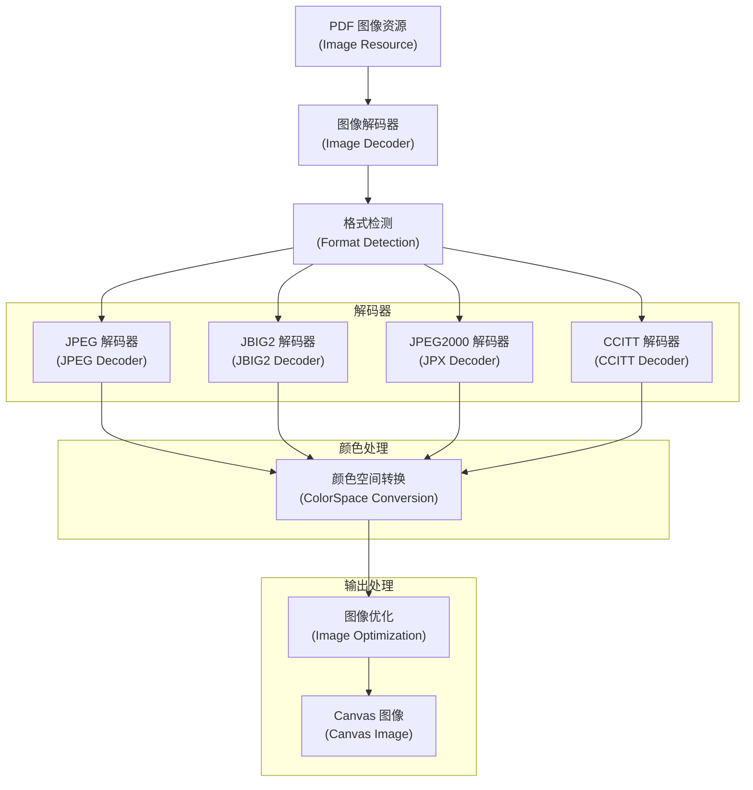
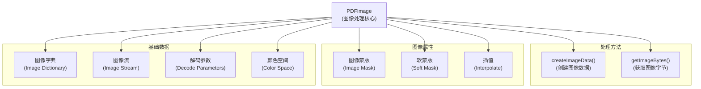
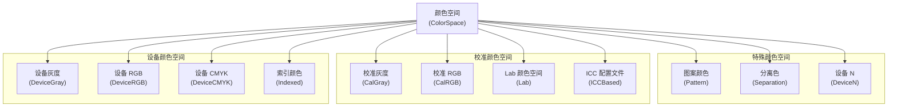
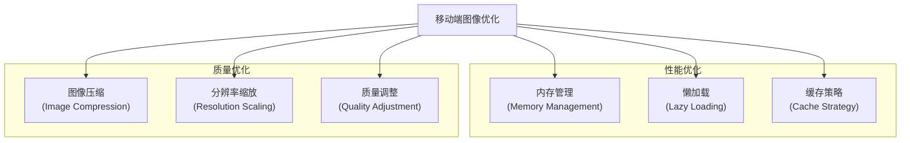

# 图像和图形处理

> **相关源文件**
> * [src/core/image.js](https://github.com/Mr-xzq/pdf.js-4.4.168/blob/19fbc899/src/core/image.js)
> * [src/core/colorspace.js](https://github.com/Mr-xzq/pdf.js-4.4.168/blob/19fbc899/src/core/colorspace.js)
> * [src/core/pattern.js](https://github.com/Mr-xzq/pdf.js-4.4.168/blob/19fbc899/src/core/pattern.js)
> * [src/core/function.js](https://github.com/Mr-xzq/pdf.js-4.4.168/blob/19fbc899/src/core/function.js)
> * [src/core/jbig2.js](https://github.com/Mr-xzq/pdf.js-4.4.168/blob/19fbc899/src/core/jbig2.js)
> * [src/core/jpg.js](https://github.com/Mr-xzq/pdf.js-4.4.168/blob/19fbc899/src/core/jpg.js)
> * [src/core/jpx.js](https://github.com/Mr-xzq/pdf.js-4.4.168/blob/19fbc899/src/core/jpx.js)
> * [src/display/canvas.js](https://github.com/Mr-xzq/pdf.js-4.4.168/blob/19fbc899/src/display/canvas.js)
> * [src/display/pattern_helper.js](https://github.com/Mr-xzq/pdf.js-4.4.168/blob/19fbc899/src/display/pattern_helper.js)
> * [src/shared/util.js](https://github.com/Mr-xzq/pdf.js-4.4.168/blob/19fbc899/src/shared/util.js)

图像和图形处理系统负责处理 PDF 文档中的图像资源、颜色空间转换、图案渲染和图形操作。该系统支持多种图像格式，处理复杂的颜色空间变换，并提供高效的图形渲染能力。

有关内容流处理的信息，请参阅 [内容流处理](/Mr-xzq/pdf.js-4.4.168/2.2-content-stream-processing)。有关字体处理的详细信息，请参阅 [字体和字符映射](/Mr-xzq/pdf.js-4.4.168/2.3-font-and-character-mapping)。

## 概述

PDF 文档可以包含各种类型的图像和图形元素，从简单的位图图像到复杂的矢量图形和渐变图案。图像和图形处理系统必须处理图像解码、颜色空间转换、图案生成和图形状态管理。

该系统涉及多个处理阶段：图像格式识别、解码处理、颜色空间转换、图案渲染和图形优化。

来源: [src/core/image.js L35-L1000](https://github.com/Mr-xzq/pdf.js-4.4.168/blob/19fbc899/src/core/image.js#L35-L1000)

 [src/core/colorspace.js L89-L234](https://github.com/Mr-xzq/pdf.js-4.4.168/blob/19fbc899/src/core/colorspace.js#L89-L234)

## 图像处理架构

### 图像处理管道



## PDFImage 核心组件

`PDFImage` 类是图像处理的核心，负责图像解码和转换：

### PDFImage 架构



### PDFImage 实现

```javascript
class PDFImage {
  constructor({
    xref,
    res,
    image,
    isInline = false,
    smask = null,
    mask = null,
    isMask = false
  }) {
    this.xref = xref;
    this.res = res;
    this.image = image;
    this.isInline = isInline;
    this.smask = smask;
    this.mask = mask;
    this.isMask = isMask;
    
    // 解析图像属性
    this.width = image.get('Width');
    this.height = image.get('Height');
    this.bitsPerComponent = image.get('BitsPerComponent') || 1;
    this.colorSpace = image.get('ColorSpace');
    this.decode = image.get('Decode');
    this.interpolate = image.get('Interpolate') || false;
  }
  
  async createImageData() {
    // 创建图像数据
    const imageBytes = await this.getImageBytes();
    const colorSpace = this.getColorSpace();
    
    // 解码图像数据
    const decodedBytes = await this.decodeImageData(imageBytes);
    
    // 转换颜色空间
    const rgbBytes = await colorSpace.getRgbBytes(
      decodedBytes,
      this.bitsPerComponent
    );
    
    // 应用蒙版
    const finalBytes = await this.applyMask(rgbBytes);
    
    return {
      data: finalBytes,
      width: this.width,
      height: this.height
    };
  }
  
  async getImageBytes() {
    // 获取图像字节数据
    const imageStream = this.image.getStream();
    return imageStream.getBytes();
  }
  
  async decodeImageData(imageBytes) {
    // 根据过滤器解码图像数据
    const filter = this.image.get('Filter');
    
    if (filter) {
      if (filter.name === 'DCTDecode') {
        return this.decodeDCT(imageBytes);
      } else if (filter.name === 'JBIG2Decode') {
        return this.decodeJBIG2(imageBytes);
      } else if (filter.name === 'JPXDecode') {
        return this.decodeJPX(imageBytes);
      } else if (filter.name === 'CCITTFaxDecode') {
        return this.decodeCCITT(imageBytes);
      }
    }
    
    return imageBytes;
  }
  
  decodeDCT(imageBytes) {
    // JPEG 解码
    const jpegDecoder = new JpegImage();
    jpegDecoder.parse(imageBytes);
    return jpegDecoder.getData(this.width, this.height);
  }
  
  decodeJBIG2(imageBytes) {
    // JBIG2 解码
    const jbig2Decoder = new Jbig2Image();
    return jbig2Decoder.parseChunks([imageBytes]);
  }
  
  decodeJPX(imageBytes) {
    // JPEG2000 解码
    const jpxDecoder = new JpxImage();
    jpxDecoder.parse(imageBytes);
    return jpxDecoder.tiles[0].items;
  }
}
```

来源: [src/core/image.js L35-L1000](https://github.com/Mr-xzq/pdf.js-4.4.168/blob/19fbc899/src/core/image.js#L35-L1000)

## 颜色空间处理

颜色空间系统处理各种 PDF 颜色空间的转换：

### 颜色空间架构



### 颜色空间实现

```javascript
class ColorSpace {
  constructor(name, numComps) {
    this.name = name;
    this.numComps = numComps;
  }

  // 抽象方法，由子类实现
  getRgbBytes(sourceBytes, bitsPerComponent) {
    throw new Error('getRgbBytes must be implemented');
  }

  getRgb(src, srcOffset) {
    throw new Error('getRgb must be implemented');
  }
}

class DeviceRgbCS extends ColorSpace {
  constructor() {
    super('DeviceRGB', 3);
  }

  getRgbBytes(sourceBytes, bitsPerComponent) {
    // RGB 颜色空间直接返回
    if (bitsPerComponent === 8) {
      return new Uint8Array(sourceBytes);
    }

    // 处理其他位深度
    return this.convertBitDepth(sourceBytes, bitsPerComponent);
  }

  getRgb(src, srcOffset) {
    return [
      src[srcOffset],
      src[srcOffset + 1],
      src[srcOffset + 2]
    ];
  }
}

class DeviceCmykCS extends ColorSpace {
  constructor() {
    super('DeviceCMYK', 4);
  }

  getRgbBytes(sourceBytes, bitsPerComponent) {
    const rgbBytes = new Uint8Array((sourceBytes.length / 4) * 3);
    let rgbIndex = 0;

    for (let i = 0; i < sourceBytes.length; i += 4) {
      const cmyk = [
        sourceBytes[i] / 255,
        sourceBytes[i + 1] / 255,
        sourceBytes[i + 2] / 255,
        sourceBytes[i + 3] / 255
      ];

      const rgb = this.cmykToRgb(cmyk);
      rgbBytes[rgbIndex++] = Math.round(rgb[0] * 255);
      rgbBytes[rgbIndex++] = Math.round(rgb[1] * 255);
      rgbBytes[rgbIndex++] = Math.round(rgb[2] * 255);
    }

    return rgbBytes;
  }

  cmykToRgb(cmyk) {
    // CMYK 到 RGB 转换
    const [c, m, y, k] = cmyk;
    const r = 1 - Math.min(1, c * (1 - k) + k);
    const g = 1 - Math.min(1, m * (1 - k) + k);
    const b = 1 - Math.min(1, y * (1 - k) + k);
    return [r, g, b];
  }
}
```

## 移动端图像优化

针对移动设备的图像处理优化：

### 移动端优化策略



### 移动端图像配置

```javascript
const mobileImageConfig = {
  // 最大图像尺寸
  maxImageSize: 2048 * 2048,

  // 图像质量设置
  imageQuality: 0.8,

  // 启用图像压缩
  enableCompression: true,

  // 内存限制
  memoryThreshold: 100 * 1024 * 1024, // 100MB

  // 缓存设置
  maxCacheSize: 50,
  cacheTimeout: 5 * 60 * 1000, // 5分钟

  // 懒加载设置
  enableLazyLoading: true,
  preloadDistance: 1, // 预加载距离

  // 自动缩放
  autoScale: true,
  maxScale: 2.0
};

class MobileImageProcessor extends PDFImage {
  constructor(config = mobileImageConfig) {
    super();
    this.config = config;
    this.imageCache = new Map();
    this.memoryUsage = 0;
  }

  async createImageData() {
    // 检查内存使用情况
    if (this.memoryUsage > this.config.memoryThreshold) {
      await this.cleanupCache();
    }

    // 检查缓存
    const cacheKey = this.getCacheKey();
    if (this.imageCache.has(cacheKey)) {
      return this.imageCache.get(cacheKey);
    }

    // 处理图像
    let imageData = await super.createImageData();

    // 应用移动端优化
    imageData = await this.optimizeForMobile(imageData);

    // 缓存结果
    this.cacheImageData(cacheKey, imageData);

    return imageData;
  }

  async optimizeForMobile(imageData) {
    // 检查图像尺寸
    if (imageData.width * imageData.height > this.config.maxImageSize) {
      imageData = await this.scaleImage(imageData);
    }

    // 压缩图像数据
    if (this.config.enableCompression) {
      imageData = await this.compressImage(imageData);
    }

    return imageData;
  }

  async scaleImage(imageData) {
    // 计算缩放比例
    const totalPixels = imageData.width * imageData.height;
    const scale = Math.sqrt(this.config.maxImageSize / totalPixels);

    if (scale >= 1) {
      return imageData; // 不需要缩放
    }

    // 执行缩放
    const newWidth = Math.floor(imageData.width * scale);
    const newHeight = Math.floor(imageData.height * scale);

    return this.resizeImageData(imageData, newWidth, newHeight);
  }

  async cleanupCache() {
    // 清理过期的缓存项
    const now = Date.now();
    for (const [key, entry] of this.imageCache.entries()) {
      if (now - entry.timestamp > this.config.cacheTimeout) {
        this.imageCache.delete(key);
        this.memoryUsage -= entry.size;
      }
    }

    // 如果仍然超过限制，删除最旧的项
    if (this.memoryUsage > this.config.memoryThreshold) {
      const entries = Array.from(this.imageCache.entries())
        .sort((a, b) => a[1].timestamp - b[1].timestamp);

      while (this.memoryUsage > this.config.memoryThreshold && entries.length > 0) {
        const [key, entry] = entries.shift();
        this.imageCache.delete(key);
        this.memoryUsage -= entry.size;
      }
    }
  }
}
```

这些优化确保图像处理系统在移动设备上能够高效运行，同时保持良好的图像质量和用户体验。
