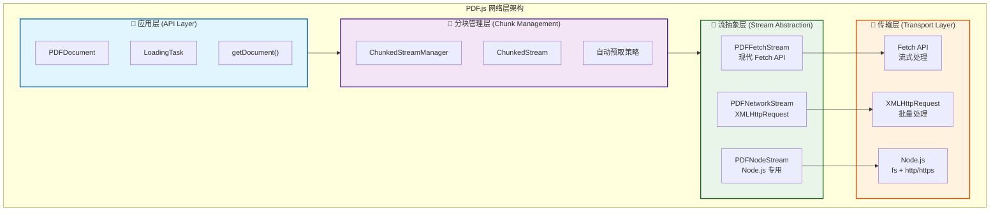
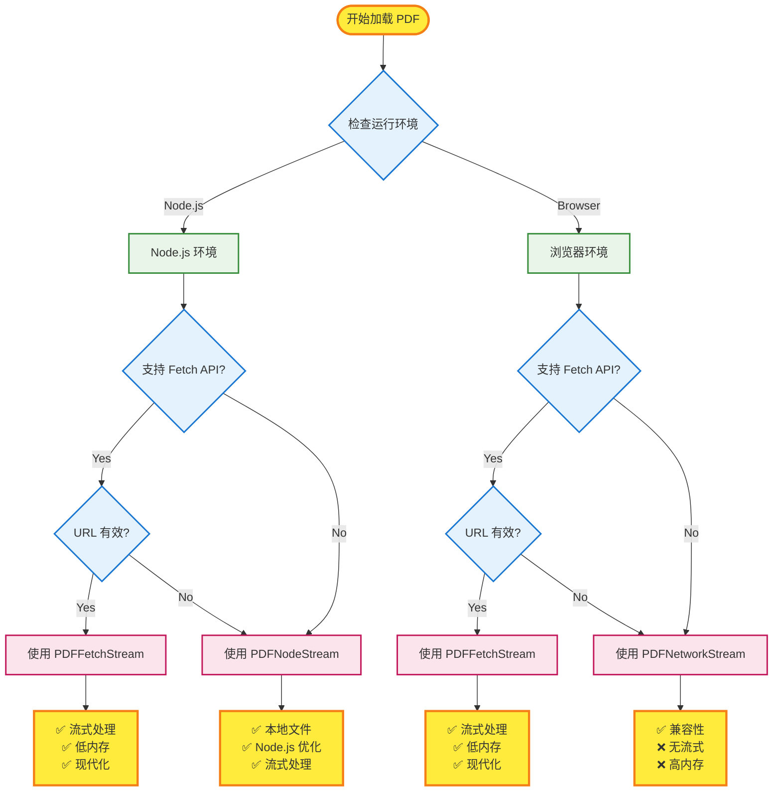
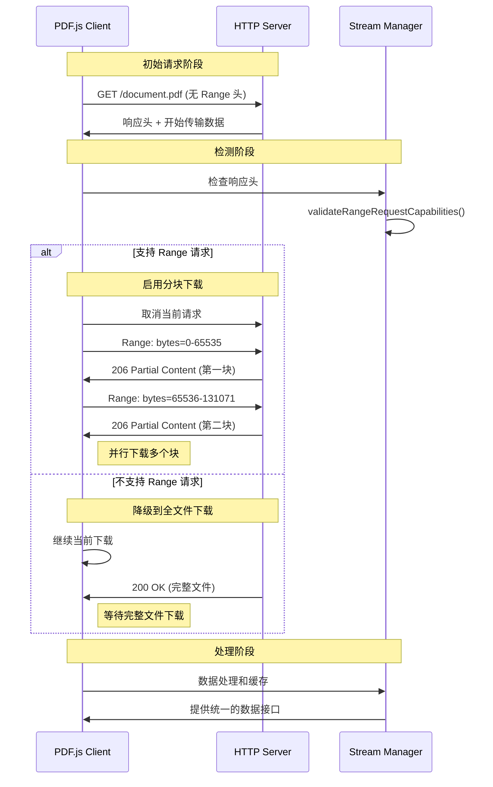

# PDF.js 网络层架构

PDF.js 的网络层负责处理 PDF 文件的下载、流式传输和分块管理。系统采用分层架构，支持多种传输协议和优化策略。

## 架构概览



## 流实现类型

### 1. PDFFetchStream - 现代 Fetch API

**适用环境**: 现代浏览器和支持 Fetch API 的 Node.js 环境

**核心特性**:
- 使用 Fetch API 进行网络请求
- 支持真正的流式处理 (`response.body.getReader()`)
- 使用 `AbortController` 进行请求取消
- 低内存占用，边下载边处理

**关键实现**:
```javascript
// src/display/fetch_stream.js
class PDFFetchStream {
  getRangeReader(begin, end) {
    const reader = new PDFFetchStreamRangeReader(this, begin, end);
    // 支持流式读取
    return reader;
  }
}

class PDFFetchStreamRangeReader {
  constructor(stream, begin, end) {
    this._headers.append("Range", `bytes=${begin}-${end - 1}`);

    fetch(url, createFetchOptions(...))
      .then(response => {
        this._reader = response.body.getReader(); // 流式读取
      });
  }

  get isStreamingSupported() {
    return this._isStreamingSupported; // 可以为 true
  }
}
```

**优势**:
- ✅ 真正的流式处理
- ✅ 现代化的异步处理
- ✅ 低内存占用
- ✅ 更好的用户体验

### 2. PDFNetworkStream - 传统 XMLHttpRequest

**适用环境**: 所有浏览器环境，作为兼容性回退方案

**核心特性**:
- 使用 XMLHttpRequest 进行网络请求
- 不支持流式处理（硬编码 `isStreamingSupported = false`）
- 必须等待完整响应后才能处理
- 高内存占用

**关键实现**:
```javascript
// src/display/network.js
class PDFNetworkStream {
  constructor(source) {
    this._manager = new NetworkManager(source.url, {
      httpHeaders: source.httpHeaders,
      withCredentials: source.withCredentials,
    });
  }
}

class NetworkManager {
  request(args) {
    const xhr = new XMLHttpRequest();
    xhr.open("GET", this.url);
    xhr.responseType = "arraybuffer";

    if (this.isHttp && "begin" in args && "end" in args) {
      xhr.setRequestHeader("Range", `bytes=${args.begin}-${args.end - 1}`);
    }

    xhr.send(null);
  }
}

class PDFNetworkStreamRangeRequestReader {
  get isStreamingSupported() {
    return false; // 硬编码为 false
  }
}
```

**特点**:
- ✅ 兼容所有浏览器
- ✅ 成熟稳定的技术
- ❌ 无流式处理
- ❌ 高内存占用

### 3. PDFNodeStream - Node.js 专用

**适用环境**: Node.js 环境，特别是处理本地文件系统

**核心特性**:
- 支持 `file://` 协议（关键区别）
- HTTP/HTTPS 使用 Node.js 原生模块
- 本地文件使用 `fs.createReadStream()`
- 针对 Node.js 环境优化

**关键实现**:
```javascript
// src/display/node_stream.js
class PDFNodeStream {
  constructor(source) {
    this.url = parseUrl(source.url);
    this.isHttp = this.url.protocol === "http:" || this.url.protocol === "https:";
    this.isFsUrl = this.url.protocol === "file:"; // 关键特性
  }

  getFullReader() {
    this._fullRequestReader = this.isFsUrl
      ? new PDFNodeStreamFsFullReader(this)    // 文件系统读取
      : new PDFNodeStreamFullReader(this);     // HTTP 读取
    return this._fullRequestReader;
  }
}

class PDFNodeStreamFsFullReader {
  constructor(stream) {
    const fs = NodePackages.get("fs");
    this._setReadableStream(fs.createReadStream(path));
  }
}
```

**优势**:
- ✅ 支持本地文件系统
- ✅ Node.js 原生优化
- ✅ 支持流式处理
- ✅ 全功能实现

## 流选择策略

系统根据环境和能力自动选择最适合的流实现：

```javascript
// src/display/api.js
const createPDFNetworkStream = params => {
  const isFetchSupported = function () {
    return (
      typeof fetch !== "undefined" &&
      typeof Response !== "undefined" &&
      "body" in Response.prototype  // 检查流式支持
    );
  };

  if (typeof PDFJSDev !== "undefined" && PDFJSDev.test("GENERIC") && isNodeJS) {
    // Node.js 环境
    return isFetchSupported() && isValidFetchUrl(params.url)
      ? new PDFFetchStream(params)
      : new PDFNodeStream(params);
  }

  // 浏览器环境
  return isFetchSupported() && isValidFetchUrl(params.url)
    ? new PDFFetchStream(params)    // 优先选择
    : new PDFNetworkStream(params); // 兼容性回退
};
```

**选择优先级**:
1. **PDFFetchStream**: 现代浏览器 + 有效 URL
2. **PDFNodeStream**: Node.js 环境 + 本地文件或 Fetch 不可用
3. **PDFNetworkStream**: 兼容性回退方案

### 流选择决策流程



## Range 请求机制

### Range 请求概念层次

PDF.js 中有三个不同层面的概念，经常被混淆：

1. **HTTP Range 请求** - 网络协议层面的分块下载
2. **流式处理** - 数据处理层面的实时处理
3. **分块管理** - 应用层面的智能策略

### Range 请求启用条件

Range 请求**必须服务器支持**，通过严格的条件检测：

```javascript
// src/display/network_utils.js
function validateRangeRequestCapabilities({
  getResponseHeader,
  isHttp,
  rangeChunkSize,
  disableRange,
}) {
  // 1. 不能手动禁用，必须是 HTTP 协议
  if (disableRange || !isHttp) {
    return { allowRangeRequests: false };
  }

  // 2. 服务器必须明确支持字节范围请求
  if (getResponseHeader("Accept-Ranges") !== "bytes") {
    return { allowRangeRequests: false };
  }

  // 3. 不能有内容压缩（压缩后字节范围无意义）
  const contentEncoding = getResponseHeader("Content-Encoding") || "identity";
  if (contentEncoding !== "identity") {
    return { allowRangeRequests: false };
  }

  // 4. 文件必须足够大（至少 2 个 chunk，默认 128KB）
  const length = parseInt(getResponseHeader("Content-Length"), 10);
  if (length <= 2 * rangeChunkSize) {
    return { allowRangeRequests: false };
  }

  return { allowRangeRequests: true };
}
```

### 服务器支持检测

| HTTP 响应头 | 要求 | 说明 |
|-------------|------|------|
| `Accept-Ranges` | 必须是 `"bytes"` | 服务器声明支持字节范围请求 |
| `Content-Encoding` | 必须是 `"identity"` 或空 | 不能有 gzip 等压缩编码 |
| `Content-Length` | 必须是有效数字 | 需要知道文件总大小进行分块计算 |

### Range 请求发送条件

#### ✅ 会发送 Range 请求的情况：
- HTTP/HTTPS 协议（不支持 `file://`）
- 服务器返回 `Accept-Ranges: bytes`
- 没有内容压缩（`Content-Encoding: identity`）
- 文件大小 > 2 × `rangeChunkSize`（默认 128KB）
- 用户没有设置 `disableRange: true`
- 设置了 `rangeChunkSize` 参数

#### ❌ 不会发送 Range 请求的情况：
- `file://` 协议（本地文件直接读取）
- 服务器返回 `Accept-Ranges: none` 或缺少此头
- 有内容压缩（如 `Content-Encoding: gzip`）
- 文件太小（< 128KB，分块无意义）
- 手动禁用（`disableRange: true`）
- 没有设置 `rangeChunkSize`

### 降级策略

当不支持 Range 请求时，系统有完善的降级机制：

#### 1. 自动检测和降级
```javascript
// 发送初始请求（不带 Range 头）
fetch(url)
  .then(response => {
    // 检查响应头判断 Range 支持
    const { allowRangeRequests } = validateRangeRequestCapabilities({...});

    if (!allowRangeRequests) {
      // 降级：继续下载整个文件
      return this._reader = response.body.getReader();
    } else {
      // 支持 Range：取消当前请求，改用分块下载
      this.cancel(new AbortException("Switching to range requests"));
    }
  });
```

#### 2. 智能文件大小判断
```javascript
if (length <= 2 * rangeChunkSize) {
  // 文件太小，直接下载整个文件比分块更高效
  return { allowRangeRequests: false };
}
```

#### 3. 透明降级
降级后的行为：
- **下载整个文件**：一次性获取完整 PDF
- **保持接口一致**：上层 API 不变，透明降级
- **禁用分块优化**：`ChunkedStreamManager` 仍工作，但管理单个大块

### Range 请求工作流程



## 分块管理层 (ChunkedStreamManager)

分块管理层是 PDF.js 网络架构的核心，负责将 PDF 文件分割成固定大小的块，并智能地管理这些块的下载和缓存。

### 核心概念

```javascript
// src/core/chunked_stream.js
class ChunkedStreamManager {
  constructor(pdfNetworkStream, args) {
    this.length = args.length;                    // PDF 文件总大小
    this.chunkSize = args.rangeChunkSize;         // 块大小，默认 65536 (64KB)
    this.stream = new ChunkedStream(this.length, this.chunkSize, this);
    this.pdfNetworkStream = pdfNetworkStream;     // 底层网络流

    this.numChunks = Math.ceil(length / chunkSize); // 总块数
    this._loadedChunks = new Set();               // 已加载的块
  }
}
```

### 分块策略

#### 1. 固定大小分块
- **默认块大小**: 65536 字节 (64KB)
- **块编号**: 从 0 开始，`chunk_id = Math.floor(byte_offset / chunkSize)`
- **字节范围**: `chunk_0: [0, 65535]`, `chunk_1: [65536, 131071]`, ...

#### 2. 智能合并策略
```javascript
// 将连续的块合并为单个 Range 请求
groupChunks(chunks) {
  const groupedChunks = [];
  let beginChunk = -1;
  let prevChunk = -1;

  for (let chunk of chunks) {
    if (prevChunk >= 0 && prevChunk + 1 !== chunk) {
      // 不连续，结束当前组
      groupedChunks.push({ beginChunk, endChunk: prevChunk + 1 });
      beginChunk = chunk;
    }
    prevChunk = chunk;
  }

  return groupedChunks; // 返回合并后的连续范围
}
```

#### 3. 按需加载机制
```javascript
requestRange(begin, end) {
  const beginChunk = this.getBeginChunk(begin);
  const endChunk = this.getEndChunk(end);

  const chunks = [];
  for (let chunk = beginChunk; chunk < endChunk; ++chunk) {
    if (!this._loadedChunks.has(chunk)) {
      chunks.push(chunk); // 只请求未加载的块
    }
  }

  return this._requestChunks(chunks);
}
```

### 自动预取策略

#### 1. 首块优化
```javascript
if (this.stream.numChunksLoaded === 1) {
  // 特殊优化：加载第一块后，优先加载最后一块
  // 这样可以快速获取 PDF 的尾部信息（xref 表等）
  const lastChunk = this.stream.numChunks - 1;
  if (!this.stream.hasChunk(lastChunk)) {
    nextEmptyChunk = lastChunk;
  }
}
```

#### 2. 顺序预取
```javascript
if (!this.disableAutoFetch && this._requestsByChunk.size === 0) {
  // 没有待处理请求时，自动获取下一个空块
  nextEmptyChunk = this.stream.nextEmptyChunk(endChunk);
  if (Number.isInteger(nextEmptyChunk)) {
    this._requestChunks([nextEmptyChunk]);
  }
}
```

### 流式处理差异

分块管理层会根据底层流的能力采用不同的处理方式：

#### PDFFetchStream (支持流式)
```javascript
sendRequest(begin, end) {
  const rangeReader = this.pdfNetworkStream.getRangeReader(begin, end);

  if (rangeReader.isStreamingSupported) {
    // 流式处理：边下载边处理
    const readChunk = ({ value, done }) => {
      if (!done) {
        this.onProgress({ loaded: value.byteLength });
        chunks.push(value);
        rangeReader.read().then(readChunk, reject);
      }
    };
    rangeReader.read().then(readChunk, reject);
  }
}
```

#### PDFNetworkStream (批量处理)
```javascript
sendRequest(begin, end) {
  const rangeReader = this.pdfNetworkStream.getRangeReader(begin, end);

  if (!rangeReader.isStreamingSupported) {
    // 非流式：使用进度回调
    rangeReader.onProgress = this.onProgress.bind(this);
    // 必须等待完整响应
  }
}
```

### 内存管理

#### 1. 渐进式数据处理
```javascript
onReceiveProgressiveData(data) {
  let position = this.progressiveDataLength;
  const beginChunk = Math.floor(position / this.chunkSize);

  // 将数据写入字节数组
  this.bytes.set(new Uint8Array(data), position);
  position += data.byteLength;
  this.progressiveDataLength = position;

  // 标记完整的块为已加载
  const endChunk = Math.floor(position / this.chunkSize);
  for (let curChunk = beginChunk; curChunk < endChunk; ++curChunk) {
    this._loadedChunks.add(curChunk);
  }
}
```

#### 2. 缺失数据异常处理
```javascript
ensureRange(begin, end) {
  const beginChunk = Math.floor(begin / this.chunkSize);
  const endChunk = Math.min(Math.floor((end - 1) / this.chunkSize) + 1, this.numChunks);

  for (let chunk = beginChunk; chunk < endChunk; ++chunk) {
    if (!this._loadedChunks.has(chunk)) {
      // 抛出缺失数据异常，触发自动下载
      throw new MissingDataException(begin, end);
    }
  }
}

## 性能优化策略

### 1. 流式处理 vs 批量处理

| 特性 | PDFFetchStream (流式) | PDFNetworkStream (批量) |
|------|----------------------|------------------------|
| **内存使用** | 🟢 低 - 边下载边处理 | 🔴 高 - 完整响应缓存 |
| **首屏时间** | 🟢 快 - 立即开始解析 | 🔴 慢 - 等待完整下载 |
| **大文件处理** | 🟢 优秀 - 恒定内存 | 🔴 困难 - 内存线性增长 |
| **网络利用** | 🟢 高效 - 并行处理 | 🟡 一般 - 串行处理 |

### 2. 分块大小优化

```javascript
// 默认配置
const DEFAULT_RANGE_CHUNK_SIZE = 65536; // 64KB

// 优化考虑：
// - 太小：HTTP 请求开销大，服务器压力大
// - 太大：内存占用高，首屏时间长
// - 64KB：平衡点，适合大多数场景
```

### 3. 预取策略优化

#### 智能预取顺序
```
1. 首块 (chunk_0) - 获取 PDF 头部信息
2. 尾块 (chunk_last) - 获取 xref 表和 trailer
3. 按需块 - 根据用户操作请求
4. 顺序预取 - 空闲时预取后续块
```

#### 网络并发控制
```javascript
// 避免过多并发请求
if (this._requestsByChunk.size === 0) {
  // 只在没有待处理请求时启动预取
  this._requestChunks([nextEmptyChunk]);
}
```

## 实际应用场景

### 1. 大文件 PDF 浏览

**场景**: 100MB+ 的 PDF 文档
**优化策略**:
- 启用 Range 请求分块下载
- 使用 PDFFetchStream 流式处理
- 优先加载首页和目录信息
- 按需加载用户查看的页面

```javascript
// 配置示例
const loadingTask = pdfjsLib.getDocument({
  url: 'large-document.pdf',
  rangeChunkSize: 65536,    // 64KB 块
  disableRange: false,      // 启用 Range 请求
  disableStream: false,     // 启用流式处理
});
```

### 2. 移动端优化

**场景**: 移动设备，网络不稳定
**优化策略**:
- 较小的块大小减少重传成本
- 激进的预取策略提升体验
- 降级到 XMLHttpRequest 确保兼容性

```javascript
const isMobile = /Android|iPhone|iPad/.test(navigator.userAgent);
const config = {
  url: 'document.pdf',
  rangeChunkSize: isMobile ? 32768 : 65536, // 移动端使用 32KB
  disableAutoFetch: false,  // 启用自动预取
};
```

### 3. 本地文件处理

**场景**: Node.js 环境，本地 PDF 文件
**优化策略**:
- 使用 PDFNodeStream 直接文件系统访问
- 利用 fs.createReadStream 的原生流式能力
- 避免网络层开销

```javascript
// Node.js 环境
const loadingTask = pdfjsLib.getDocument({
  url: 'file:///path/to/document.pdf',
  // 自动选择 PDFNodeStream
});
```

### 4. 服务器不支持 Range 的降级

**场景**: 老旧服务器或 CDN 不支持 Range 请求
**降级行为**:
- 自动检测并降级到全文件下载
- 保持 API 兼容性
- 适当的用户提示

```javascript
loadingTask.promise.then(pdf => {
  // 检查是否使用了 Range 请求
  console.log('Range supported:', pdf._transport.stream.isRangeSupported);
});
```


## 源码文件结构

```
src/display/
├── api.js                 # 流选择逻辑
├── fetch_stream.js        # Fetch API 实现
├── network.js            # XMLHttpRequest 实现
├── node_stream.js        # Node.js 实现
├── network_utils.js      # Range 请求验证
└── transport_stream.js   # 自定义传输实现

src/core/
├── chunked_stream.js     # 分块管理核心
├── pdf_manager.js        # PDF 管理器
└── worker_stream.js      # Worker 线程流
```

## 配置参数参考

| 参数 | 默认值 | 说明 |
|------|--------|------|
| `rangeChunkSize` | 65536 | 分块大小（字节） |
| `disableRange` | false | 禁用 Range 请求 |
| `disableStream` | false | 禁用流式处理 |
| `disableAutoFetch` | false | 禁用自动预取 |
| `withCredentials` | false | 跨域凭证 |
| `httpHeaders` | {} | 自定义 HTTP 头 |

通过合理配置这些参数，可以针对不同的应用场景优化 PDF.js 的网络性能。
