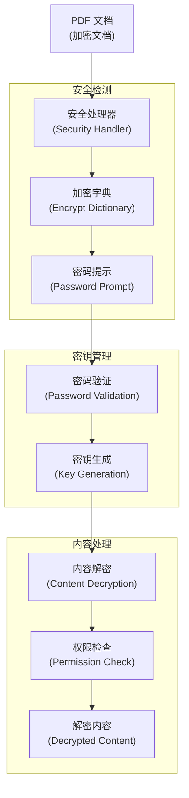
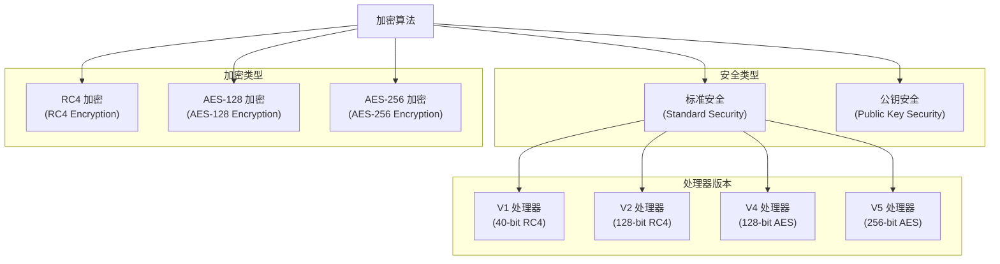
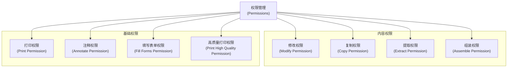
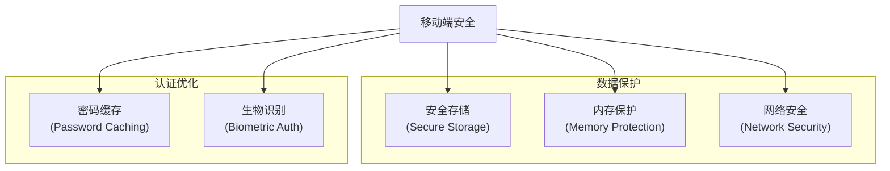

# 安全和加密

> **相关源文件**
> * [src/core/crypto.js](https://github.com/Mr-xzq/pdf.js-4.4.168/blob/19fbc899/src/core/crypto.js)
> * [src/core/security.js](https://github.com/Mr-xzq/pdf.js-4.4.168/blob/19fbc899/src/core/security.js)
> * [src/core/document.js](https://github.com/Mr-xzq/pdf.js-4.4.168/blob/19fbc899/src/core/document.js)
> * [src/shared/util.js](https://github.com/Mr-xzq/pdf.js-4.4.168/blob/19fbc899/src/shared/util.js)

安全和加密系统负责处理 PDF 文档的安全特性，包括密码保护、权限控制和内容加密。该系统确保只有授权用户才能访问受保护的 PDF 文档，并根据文档权限控制用户可以执行的操作。

有关文档加载的信息，请参阅 [文档加载和 API](/Mr-xzq/pdf.js-4.4.168/2.1-document-loading-and-api)。有关内容流处理的详细信息，请参阅 [内容流处理](/Mr-xzq/pdf.js-4.4.168/2.2-content-stream-processing)。

## 概述

PDF 安全模型基于两种类型的密码：用户密码（用于打开文档）和所有者密码（用于修改权限）。加密系统使用各种算法来保护文档内容，包括 RC4、AES 等加密标准。权限系统控制用户可以执行的操作，如打印、复制文本、修改文档等。

安全处理涉及多个阶段：安全字典解析、密码验证、密钥生成、内容解密和权限检查。

来源: [src/core/security.js](https://github.com/Mr-xzq/pdf.js-4.4.168/blob/19fbc899/src/core/security.js)

 [src/core/crypto.js](https://github.com/Mr-xzq/pdf.js-4.4.168/blob/19fbc899/src/core/crypto.js)

## 安全架构

### 安全处理流程



## 加密算法支持

PDF.js 支持多种加密算法和安全标准：

### 加密算法架构



### 安全处理器实现

```javascript
class SecurityHandler {
  constructor(xref, passwordPrompt) {
    this.xref = xref;
    this.passwordPrompt = passwordPrompt;
    this.encryptDict = null;
    this.encryptionKey = null;
    this.permissions = null;
  }
  
  async initialize() {
    // 获取加密字典
    this.encryptDict = this.xref.trailer.get('Encrypt');
    if (!this.encryptDict) {
      return; // 文档未加密
    }
    
    // 解析安全设置
    this.parseEncryptionSettings();
    
    // 验证密码
    await this.authenticateUser();
    
    // 生成解密密钥
    this.generateEncryptionKey();
    
    // 解析权限
    this.parsePermissions();
  }
  
  parseEncryptionSettings() {
    // 解析加密设置
    this.filter = this.encryptDict.get('Filter');
    this.version = this.encryptDict.get('V') || 0;
    this.revision = this.encryptDict.get('R') || 0;
    this.keyLength = this.encryptDict.get('Length') || 40;
    this.ownerPassword = this.encryptDict.get('O');
    this.userPassword = this.encryptDict.get('U');
    this.permissions = this.encryptDict.get('P') || 0;
  }
  
  async authenticateUser() {
    // 用户认证
    let password = '';
    let authenticated = false;
    
    while (!authenticated) {
      // 尝试空密码
      if (this.checkPassword('')) {
        authenticated = true;
        break;
      }
      
      // 提示用户输入密码
      password = await this.promptForPassword();
      if (password === null) {
        throw new Error('用户取消密码输入');
      }
      
      // 验证密码
      if (this.checkPassword(password)) {
        authenticated = true;
      } else {
        // 密码错误，重新提示
        continue;
      }
    }
    
    this.password = password;
  }
  
  checkPassword(password) {
    // 检查密码是否正确
    if (this.version <= 2) {
      return this.checkPasswordV1V2(password);
    } else if (this.version === 4) {
      return this.checkPasswordV4(password);
    } else if (this.version === 5) {
      return this.checkPasswordV5(password);
    }
    
    return false;
  }
  
  checkPasswordV1V2(password) {
    // V1/V2 密码验证
    const paddedPassword = this.padPassword(password);
    const hash = this.computePasswordHash(paddedPassword);
    
    // 检查用户密码
    if (this.comparePasswords(hash, this.userPassword)) {
      this.isOwner = false;
      return true;
    }
    
    // 检查所有者密码
    const ownerKey = this.computeOwnerKey(paddedPassword);
    if (this.comparePasswords(ownerKey, this.ownerPassword)) {
      this.isOwner = true;
      return true;
    }
    
    return false;
  }
  
  generateEncryptionKey() {
    // 生成解密密钥
    if (this.version <= 2) {
      this.encryptionKey = this.generateKeyV1V2();
    } else if (this.version === 4) {
      this.encryptionKey = this.generateKeyV4();
    } else if (this.version === 5) {
      this.encryptionKey = this.generateKeyV5();
    }
  }
  
  decrypt(data, objNum, genNum) {
    // 解密数据
    if (!this.encryptionKey) {
      return data; // 未加密
    }
    
    const objectKey = this.computeObjectKey(objNum, genNum);
    
    if (this.version <= 2) {
      return this.decryptRC4(data, objectKey);
    } else if (this.version === 4) {
      return this.decryptAES128(data, objectKey);
    } else if (this.version === 5) {
      return this.decryptAES256(data, objectKey);
    }
    
    return data;
  }
  
  decryptRC4(data, key) {
    // RC4 解密
    const rc4 = new RC4Cipher(key);
    return rc4.decrypt(data);
  }
  
  decryptAES128(data, key) {
    // AES-128 解密
    const aes = new AESCipher(key, 128);
    return aes.decrypt(data);
  }
  
  decryptAES256(data, key) {
    // AES-256 解密
    const aes = new AESCipher(key, 256);
    return aes.decrypt(data);
  }
}
```

## 权限管理

PDF 权限系统控制用户可以执行的操作：

### 权限架构



### 权限检查实现

```javascript
class PermissionManager {
  constructor(permissions) {
    this.permissions = permissions;
    this.parsePermissions();
  }
  
  parsePermissions() {
    // 解析权限位
    this.canPrint = this.checkPermission(2);
    this.canModify = this.checkPermission(3);
    this.canCopy = this.checkPermission(4);
    this.canAnnotate = this.checkPermission(5);
    this.canFillForms = this.checkPermission(8);
    this.canExtract = this.checkPermission(9);
    this.canAssemble = this.checkPermission(10);
    this.canPrintHighQuality = this.checkPermission(11);
  }
  
  checkPermission(bit) {
    // 检查特定权限位
    return (this.permissions & (1 << (bit - 1))) !== 0;
  }
  
  validateOperation(operation) {
    // 验证操作权限
    switch (operation) {
      case 'print':
        return this.canPrint;
      case 'modify':
        return this.canModify;
      case 'copy':
        return this.canCopy;
      case 'annotate':
        return this.canAnnotate;
      case 'fillForms':
        return this.canFillForms;
      case 'extract':
        return this.canExtract;
      case 'assemble':
        return this.canAssemble;
      case 'printHighQuality':
        return this.canPrintHighQuality;
      default:
        return false;
    }
  }
  
  getPermissionSummary() {
    // 获取权限摘要
    return {
      print: this.canPrint,
      modify: this.canModify,
      copy: this.canCopy,
      annotate: this.canAnnotate,
      fillForms: this.canFillForms,
      extract: this.canExtract,
      assemble: this.canAssemble,
      printHighQuality: this.canPrintHighQuality
    };
  }
}
```

## 移动端安全优化

针对移动设备的安全处理优化：

### 移动端安全策略



### 移动端安全配置

```javascript
const mobileSecurityConfig = {
  // 密码缓存设置
  enablePasswordCache: true,
  cacheTimeout: 30 * 60 * 1000, // 30分钟
  
  // 生物识别支持
  enableBiometric: true,
  biometricPrompt: '使用指纹或面部识别解锁 PDF',
  
  // 安全存储
  useSecureStorage: true,
  encryptCache: true,
  
  // 内存保护
  clearSensitiveData: true,
  memoryTimeout: 5 * 60 * 1000, // 5分钟
  
  // 网络安全
  requireHTTPS: true,
  validateCertificates: true
};

class MobileSecurityHandler extends SecurityHandler {
  constructor(config = mobileSecurityConfig) {
    super();
    this.config = config;
    this.passwordCache = new Map();
    this.biometricSupported = this.checkBiometricSupport();
  }
  
  async authenticateUser() {
    // 检查缓存的密码
    if (this.config.enablePasswordCache) {
      const cachedPassword = this.getCachedPassword();
      if (cachedPassword && this.checkPassword(cachedPassword)) {
        this.password = cachedPassword;
        return;
      }
    }
    
    // 尝试生物识别认证
    if (this.config.enableBiometric && this.biometricSupported) {
      const biometricResult = await this.tryBiometricAuth();
      if (biometricResult.success) {
        this.password = biometricResult.password;
        return;
      }
    }
    
    // 回退到传统密码认证
    await super.authenticateUser();
    
    // 缓存密码
    if (this.config.enablePasswordCache) {
      this.cachePassword(this.password);
    }
  }
  
  async tryBiometricAuth() {
    // 尝试生物识别认证
    try {
      const credential = await navigator.credentials.get({
        publicKey: {
          challenge: new Uint8Array(32),
          allowCredentials: [{
            type: 'public-key',
            id: this.getDocumentId()
          }]
        }
      });
      
      if (credential) {
        const password = this.decryptStoredPassword(credential);
        return { success: true, password };
      }
    } catch (error) {
      console.warn('生物识别认证失败:', error);
    }
    
    return { success: false };
  }
  
  cachePassword(password) {
    // 缓存密码
    const documentId = this.getDocumentId();
    const encryptedPassword = this.encryptPassword(password);
    
    this.passwordCache.set(documentId, {
      password: encryptedPassword,
      timestamp: Date.now()
    });
    
    // 设置清理定时器
    setTimeout(() => {
      this.clearPasswordCache(documentId);
    }, this.config.cacheTimeout);
  }
  
  clearSensitiveData() {
    // 清理敏感数据
    if (this.encryptionKey) {
      this.encryptionKey.fill(0);
      this.encryptionKey = null;
    }
    
    if (this.password) {
      this.password = '';
    }
    
    this.passwordCache.clear();
  }
}
```

这些安全特性确保 PDF 文档在移动设备上能够安全地处理，同时提供良好的用户体验和便利的认证方式。
