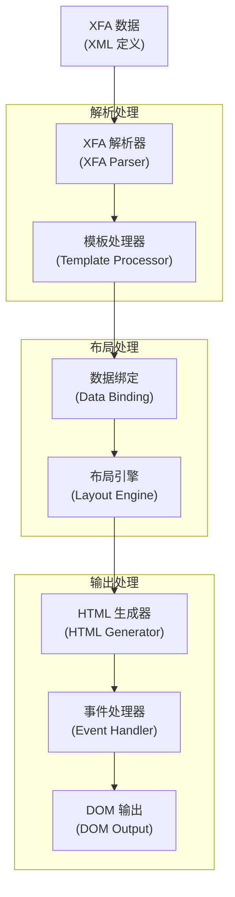
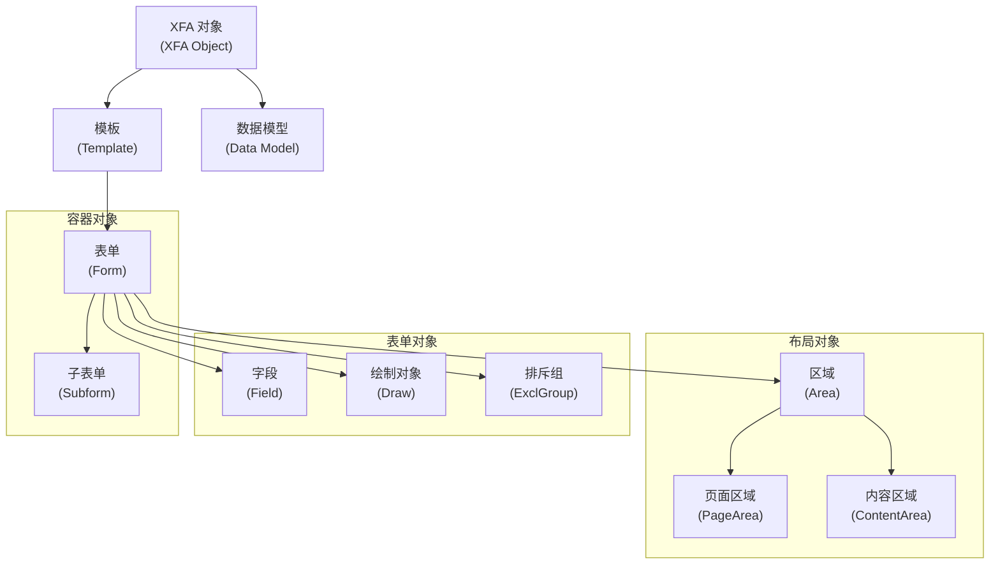
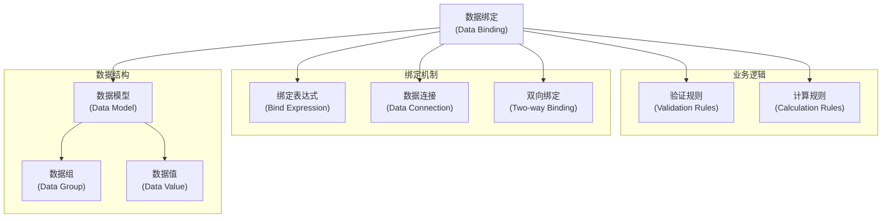
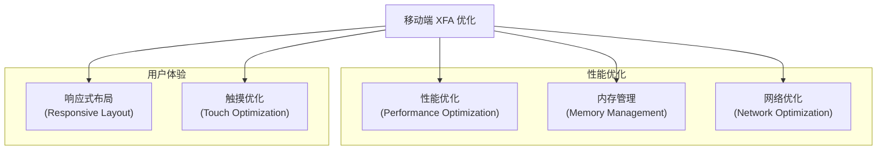

# XFA 表单处理

> **相关源文件**
> * [src/core/xfa/](https://github.com/Mr-xzq/pdf.js-4.4.168/blob/19fbc899/src/core/xfa/)
> * [src/display/xfa_layer.js](https://github.com/Mr-xzq/pdf.js-4.4.168/blob/19fbc899/src/display/xfa_layer.js)
> * [web/xfa_layer_builder.js](https://github.com/Mr-xzq/pdf.js-4.4.168/blob/19fbc899/web/xfa_layer_builder.js)
> * [src/core/annotation.js](https://github.com/Mr-xzq/pdf.js-4.4.168/blob/19fbc899/src/core/annotation.js)

XFA（XML Forms Architecture）表单处理系统负责处理 Adobe 的现代表单技术。与传统的 AcroForm 不同，XFA 表单基于 XML 定义，支持动态布局、复杂的数据绑定和丰富的用户交互。

有关传统表单处理的信息，请参阅 [注释和表单处理](/Mr-xzq/pdf.js-4.4.168/3.4-annotation-and-form-handling)。有关内容流处理的详细信息，请参阅 [内容流处理](/Mr-xzq/pdf.js-4.4.168/2.2-content-stream-processing)。

## 概述

XFA 表单是基于 XML 的表单技术，提供比传统 AcroForm 更强大的功能。XFA 表单支持动态布局、数据绑定、脚本执行和复杂的验证规则。PDF.js 的 XFA 处理系统将 XML 表单定义转换为 HTML 表单，使其能够在 Web 浏览器中正确显示和交互。

XFA 处理涉及多个阶段：XML 解析、模板处理、数据绑定、布局计算、HTML 生成和事件处理。

来源: [src/core/xfa/](https://github.com/Mr-xzq/pdf.js-4.4.168/blob/19fbc899/src/core/xfa/)

 [src/display/xfa_layer.js](https://github.com/Mr-xzq/pdf.js-4.4.168/blob/19fbc899/src/display/xfa_layer.js)

## XFA 架构概述

### XFA 处理流程



## XFA 核心组件

### XFA 对象模型



### XFA 对象实现

```javascript
class XFAObject {
  constructor(nsId, name, hasChildren = false) {
    this.nsId = nsId;
    this.name = name;
    this.hasChildren = hasChildren;
    this.attributes = new Map();
    this.children = [];
    this.parent = null;
  }
  
  setAttribute(name, value) {
    this.attributes.set(name, value);
  }
  
  getAttribute(name) {
    return this.attributes.get(name);
  }
  
  appendChild(child) {
    if (this.hasChildren) {
      child.parent = this;
      this.children.push(child);
    }
  }
  
  toHTML() {
    // 抽象方法，由子类实现
    throw new Error('toHTML must be implemented');
  }
}

class XFATemplate extends XFAObject {
  constructor() {
    super(NamespaceIds.template.id, 'template', true);
    this.subforms = [];
    this.pageAreas = [];
  }
  
  toHTML() {
    // 生成模板的 HTML 结构
    const div = document.createElement('div');
    div.className = 'xfa-template';
    
    for (const child of this.children) {
      const childHTML = child.toHTML();
      if (childHTML) {
        div.appendChild(childHTML);
      }
    }
    
    return div;
  }
}

class XFAField extends XFAObject {
  constructor() {
    super(NamespaceIds.template.id, 'field', true);
    this.ui = null;
    this.value = null;
    this.bind = null;
    this.validate = null;
  }
  
  toHTML() {
    // 根据 UI 类型生成相应的 HTML 元素
    if (!this.ui) {
      return null;
    }
    
    const uiType = this.ui.children[0];
    switch (uiType.name) {
      case 'textEdit':
        return this.createTextInput();
      case 'checkButton':
        return this.createCheckbox();
      case 'choiceList':
        return this.createSelect();
      case 'button':
        return this.createButton();
      default:
        return this.createGenericInput();
    }
  }
  
  createTextInput() {
    const input = document.createElement('input');
    input.type = 'text';
    input.className = 'xfa-field xfa-text';
    
    // 设置属性
    if (this.value) {
      input.value = this.value.text || '';
    }
    
    // 绑定事件
    this.bindEvents(input);
    
    return input;
  }
  
  createCheckbox() {
    const input = document.createElement('input');
    input.type = 'checkbox';
    input.className = 'xfa-field xfa-checkbox';
    
    // 设置选中状态
    if (this.value) {
      input.checked = this.value.text === '1';
    }
    
    this.bindEvents(input);
    return input;
  }
  
  createSelect() {
    const select = document.createElement('select');
    select.className = 'xfa-field xfa-select';
    
    // 添加选项
    const choiceList = this.ui.children[0];
    for (const item of choiceList.children) {
      if (item.name === 'items') {
        for (const option of item.children) {
          const optionElement = document.createElement('option');
          optionElement.value = option.text;
          optionElement.textContent = option.text;
          select.appendChild(optionElement);
        }
      }
    }
    
    // 设置选中值
    if (this.value) {
      select.value = this.value.text || '';
    }
    
    this.bindEvents(select);
    return select;
  }
  
  bindEvents(element) {
    // 绑定事件处理器
    element.addEventListener('change', (event) => {
      this.handleValueChange(event.target.value);
    });
    
    element.addEventListener('focus', (event) => {
      this.handleFocus(event);
    });
    
    element.addEventListener('blur', (event) => {
      this.handleBlur(event);
    });
  }
  
  handleValueChange(newValue) {
    // 处理值变化
    if (this.value) {
      this.value.text = newValue;
    }
    
    // 触发验证
    if (this.validate) {
      this.validateValue(newValue);
    }
    
    // 触发数据绑定更新
    this.updateDataBinding(newValue);
  }
}
```

## 数据绑定系统

XFA 表单支持复杂的数据绑定机制：

### 数据绑定架构



### 数据绑定实现

```javascript
class XFADataBinding {
  constructor(template, dataModel) {
    this.template = template;
    this.dataModel = dataModel;
    this.bindings = new Map();
    this.calculationOrder = [];
  }
  
  establishBindings() {
    // 建立数据绑定关系
    this.traverseTemplate(this.template);
    this.calculateDependencies();
  }
  
  traverseTemplate(node) {
    // 遍历模板建立绑定
    if (node.bind) {
      const bindExpression = node.bind.ref;
      if (bindExpression) {
        this.createBinding(node, bindExpression);
      }
    }
    
    // 递归处理子节点
    for (const child of node.children) {
      this.traverseTemplate(child);
    }
  }
  
  createBinding(field, expression) {
    // 创建数据绑定
    const binding = {
      field: field,
      expression: expression,
      dataPath: this.parseExpression(expression),
      type: this.getBindingType(field)
    };
    
    this.bindings.set(field, binding);
    
    // 设置初始值
    this.updateFieldFromData(binding);
  }
  
  parseExpression(expression) {
    // 解析绑定表达式
    // 例如：$.form1.subform1.field1
    return expression.split('.').slice(1); // 移除 $ 前缀
  }
  
  updateFieldFromData(binding) {
    // 从数据模型更新字段值
    const dataValue = this.getDataValue(binding.dataPath);
    if (dataValue !== undefined) {
      this.setFieldValue(binding.field, dataValue);
    }
  }
  
  updateDataFromField(field, value) {
    // 从字段更新数据模型
    const binding = this.bindings.get(field);
    if (binding) {
      this.setDataValue(binding.dataPath, value);
      
      // 触发相关计算
      this.triggerCalculations(binding.dataPath);
    }
  }
  
  getDataValue(dataPath) {
    // 获取数据值
    let current = this.dataModel;
    for (const segment of dataPath) {
      if (current && current[segment] !== undefined) {
        current = current[segment];
      } else {
        return undefined;
      }
    }
    return current;
  }
  
  setDataValue(dataPath, value) {
    // 设置数据值
    let current = this.dataModel;
    for (let i = 0; i < dataPath.length - 1; i++) {
      const segment = dataPath[i];
      if (!current[segment]) {
        current[segment] = {};
      }
      current = current[segment];
    }
    
    const lastSegment = dataPath[dataPath.length - 1];
    current[lastSegment] = value;
  }
  
  triggerCalculations(changedPath) {
    // 触发相关的计算
    for (const field of this.calculationOrder) {
      const binding = this.bindings.get(field);
      if (this.isDependentOn(binding, changedPath)) {
        this.executeCalculation(field);
      }
    }
  }
  
  executeCalculation(field) {
    // 执行字段计算
    const calculate = field.calculate;
    if (calculate && calculate.script) {
      try {
        const result = this.evaluateScript(calculate.script);
        this.setFieldValue(field, result);
        this.updateDataFromField(field, result);
      } catch (error) {
        console.error('计算执行失败:', error);
      }
    }
  }
}
```

## 移动端 XFA 优化

针对移动设备的 XFA 表单优化：

### 移动端优化策略



### 移动端 XFA 配置

```javascript
const mobileXFAConfig = {
  // 响应式布局
  enableResponsiveLayout: true,
  breakpoints: {
    mobile: 768,
    tablet: 1024
  },
  
  // 触摸优化
  touchOptimization: {
    minTouchTarget: 44, // 最小触摸目标尺寸
    touchPadding: 8,    // 触摸填充
    enableGestures: true // 启用手势
  },
  
  // 性能优化
  performance: {
    lazyRendering: true,
    virtualScrolling: true,
    debounceDelay: 300,
    maxConcurrentCalculations: 3
  },
  
  // 内存管理
  memory: {
    maxCacheSize: 50,
    cleanupInterval: 60000, // 1分钟
    memoryThreshold: 100 * 1024 * 1024 // 100MB
  }
};

class MobileXFAProcessor {
  constructor(config = mobileXFAConfig) {
    this.config = config;
    this.renderCache = new Map();
    this.memoryUsage = 0;
  }
  
  processXFAForm(xfaData) {
    // 处理 XFA 表单
    const parser = new XFAParser();
    const template = parser.parse(xfaData);
    
    // 应用移动端优化
    this.optimizeForMobile(template);
    
    // 生成 HTML
    const html = this.generateMobileHTML(template);
    
    return html;
  }
  
  optimizeForMobile(template) {
    // 移动端优化
    this.applyResponsiveLayout(template);
    this.optimizeTouchTargets(template);
    this.enableLazyRendering(template);
  }
  
  applyResponsiveLayout(template) {
    // 应用响应式布局
    const viewport = this.getViewportSize();
    
    if (viewport.width <= this.config.breakpoints.mobile) {
      this.applyMobileLayout(template);
    } else if (viewport.width <= this.config.breakpoints.tablet) {
      this.applyTabletLayout(template);
    }
  }
  
  optimizeTouchTargets(template) {
    // 优化触摸目标
    this.traverseFields(template, (field) => {
      if (field.ui) {
        this.adjustTouchTarget(field);
      }
    });
  }
  
  adjustTouchTarget(field) {
    // 调整触摸目标尺寸
    const minSize = this.config.touchOptimization.minTouchTarget;
    const padding = this.config.touchOptimization.touchPadding;
    
    if (field.w && field.w.value < minSize) {
      field.w.value = minSize;
    }
    
    if (field.h && field.h.value < minSize) {
      field.h.value = minSize;
    }
    
    // 添加触摸填充
    field.margin = field.margin || {};
    field.margin.topInset = Math.max(field.margin.topInset || 0, padding);
    field.margin.bottomInset = Math.max(field.margin.bottomInset || 0, padding);
    field.margin.leftInset = Math.max(field.margin.leftInset || 0, padding);
    field.margin.rightInset = Math.max(field.margin.rightInset || 0, padding);
  }
  
  generateMobileHTML(template) {
    // 生成移动端优化的 HTML
    const container = document.createElement('div');
    container.className = 'xfa-mobile-container';
    
    // 添加视口元标签
    this.addViewportMeta();
    
    // 添加移动端样式
    this.addMobileStyles(container);
    
    // 渲染模板
    const templateHTML = template.toHTML();
    container.appendChild(templateHTML);
    
    return container;
  }
  
  addMobileStyles(container) {
    // 添加移动端样式
    const style = document.createElement('style');
    style.textContent = `
      .xfa-mobile-container {
        width: 100%;
        max-width: 100vw;
        overflow-x: hidden;
        font-size: 16px;
        line-height: 1.5;
      }
      
      .xfa-field {
        min-height: ${this.config.touchOptimization.minTouchTarget}px;
        padding: ${this.config.touchOptimization.touchPadding}px;
        border-radius: 4px;
        border: 1px solid #ccc;
        font-size: 16px; /* 防止 iOS 缩放 */
      }
      
      .xfa-field:focus {
        outline: 2px solid #007AFF;
        outline-offset: 2px;
      }
      
      @media (max-width: ${this.config.breakpoints.mobile}px) {
        .xfa-mobile-container {
          padding: 16px;
        }
        
        .xfa-field {
          width: 100%;
          margin-bottom: 16px;
        }
      }
    `;
    
    document.head.appendChild(style);
  }
}
```

这些优化确保 XFA 表单在移动设备上能够提供良好的用户体验，同时保持表单的功能完整性和数据绑定的正确性。
