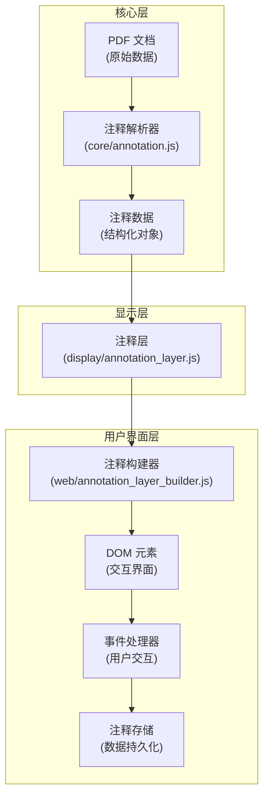
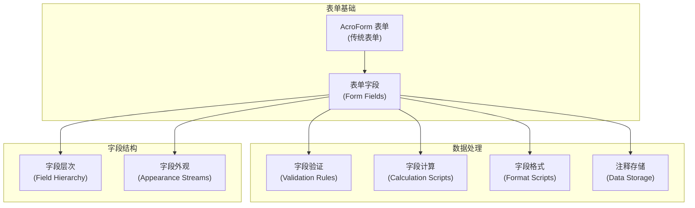
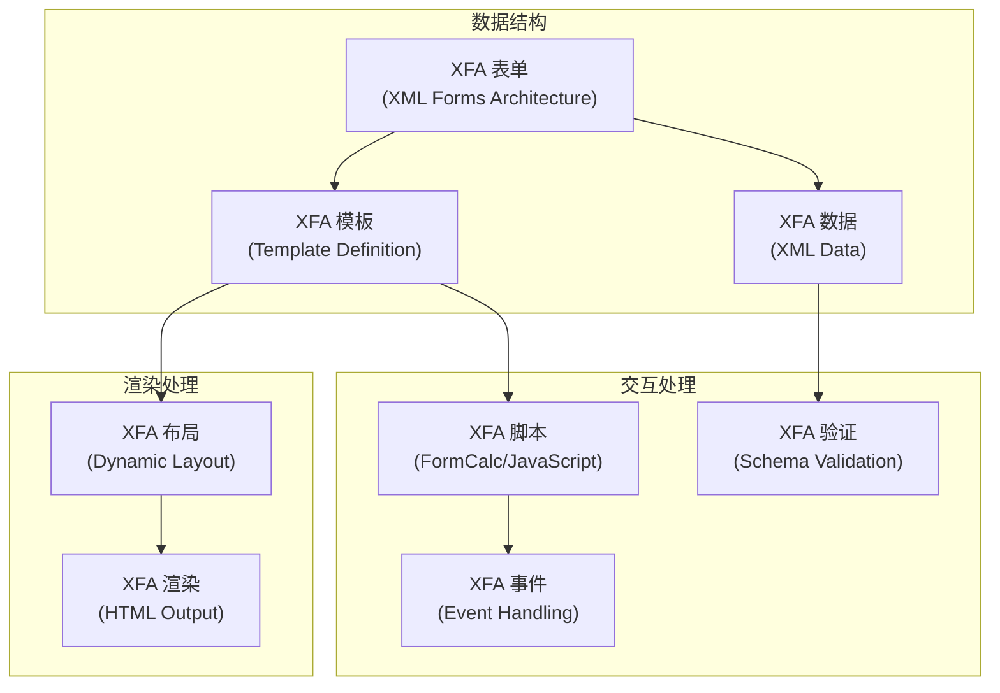
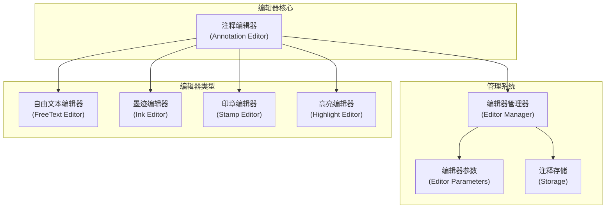
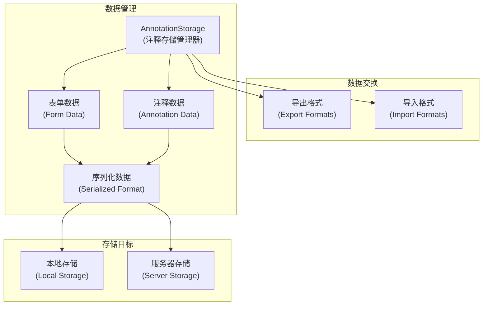
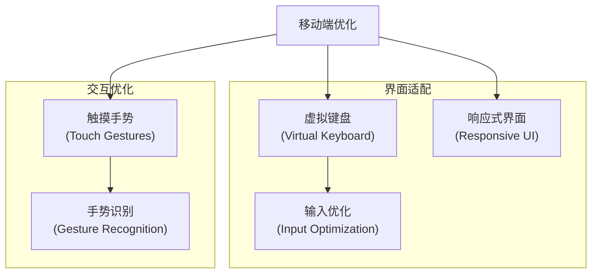
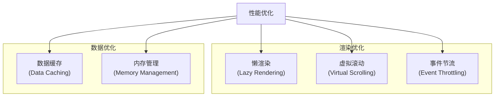

# 注释和表单处理

> **相关源文件**
> * [web/annotation_layer_builder.js](https://github.com/Mr-xzq/pdf.js-4.4.168/blob/19fbc899/web/annotation_layer_builder.js)
> * [web/annotation_editor_params.js](https://github.com/Mr-xzq/pdf.js-4.4.168/blob/19fbc899/web/annotation_editor_params.js)
> * [web/xfa_layer_builder.js](https://github.com/Mr-xzq/pdf.js-4.4.168/blob/19fbc899/web/xfa_layer_builder.js)
> * [src/display/annotation_layer.js](https://github.com/Mr-xzq/pdf.js-4.4.168/blob/19fbc899/src/display/annotation_layer.js)
> * [src/display/xfa_layer.js](https://github.com/Mr-xzq/pdf.js-4.4.168/blob/19fbc899/src/display/xfa_layer.js)
> * [src/core/annotation.js](https://github.com/Mr-xzq/pdf.js-4.4.168/blob/19fbc899/src/core/annotation.js)
> * [src/core/xfa/](https://github.com/Mr-xzq/pdf.js-4.4.168/blob/19fbc899/src/core/xfa/)

注释和表单处理系统负责 PDF 文档中交互元素的渲染、编辑和数据管理。它支持传统的 AcroForm 表单和现代的 XFA 表单，以及各种类型的注释创建和编辑。

有关页面渲染的信息，请参阅 [页面渲染系统](/Mr-xzq/pdf.js-4.4.168/3.3-page-rendering-system)。有关用户界面的详细信息，请参阅 [用户界面组件](/Mr-xzq/pdf.js-4.4.168/3.4-user-interface-components)。

## 注释系统架构

注释系统采用分层架构，从核心解析到用户界面渲染：

### 注释处理流程



## 注释类型支持

系统支持多种类型的 PDF 注释：

### 注释类型分类

```mermaid
flowchart TD

AnnotationTypes["注释类型"]
TextAnnotations["文本注释<br>(Text Annotations)"]
MarkupAnnotations["标记注释<br>(Markup Annotations)"]
WidgetAnnotations["控件注释<br>(Widget Annotations)"]
LinkAnnotations["链接注释<br>(Link Annotations)"]
MediaAnnotations["媒体注释<br>(Media Annotations)"]

TextAnnotations --> FreeText["自由文本<br>(FreeText)"]
TextAnnotations --> Note["便签<br>(Note)"]
TextAnnotations --> Popup["弹出窗口<br>(Popup)"]

MarkupAnnotations --> Highlight["高亮<br>(Highlight)"]
MarkupAnnotations --> Underline["下划线<br>(Underline)"]
MarkupAnnotations --> StrikeOut["删除线<br>(StrikeOut)"]
MarkupAnnotations --> Squiggly["波浪线<br>(Squiggly)"]
MarkupAnnotations --> Ink["墨迹<br>(Ink)"]

WidgetAnnotations --> TextField["文本框<br>(Text Field)"]
WidgetAnnotations --> CheckBox["复选框<br>(Check Box)"]
WidgetAnnotations --> RadioButton["单选按钮<br>(Radio Button)"]
WidgetAnnotations --> ComboBox["下拉列表<br>(Combo Box)"]
WidgetAnnotations --> ListBox["列表框<br>(List Box)"]
WidgetAnnotations --> PushButton["按钮<br>(Push Button)"]

LinkAnnotations --> InternalLink["内部链接<br>(Internal)"]
LinkAnnotations --> ExternalLink["外部链接<br>(External)"]
LinkAnnotations --> FileAttachment["文件附件<br>(File Attachment)"]

MediaAnnotations --> Sound["声音<br>(Sound)"]
MediaAnnotations --> Movie["视频<br>(Movie)"]
MediaAnnotations --> Screen["屏幕<br>(Screen)"]

subgraph subGraph4 ["媒体类型"]
    Sound
    Movie
    Screen
end

subgraph subGraph3 ["链接类型"]
    InternalLink
    ExternalLink
    FileAttachment
end

subgraph subGraph2 ["表单控件"]
    TextField
    CheckBox
    RadioButton
    ComboBox
    ListBox
    PushButton
end

subgraph subGraph1 ["标记类型"]
    Highlight
    Underline
    StrikeOut
    Squiggly
    Ink
end

subgraph subGraph0 ["文本类型"]
    FreeText
    Note
    Popup
end
```



## AcroForm 表单处理

AcroForm 是 PDF 的传统表单技术，支持各种表单字段类型：

### AcroForm 架构



**AcroForm 特性**:

- **字段类型**: 文本、按钮、选择、签名等多种字段类型
- **层次结构**: 支持字段分组和继承
- **外观流**: 自定义字段的视觉外观
- **脚本支持**: JavaScript 验证、计算和格式化
- **数据导入导出**: FDF/XFDF 格式的数据交换

来源: [src/core/annotation.js L234-L567](https://github.com/Mr-xzq/pdf.js-4.4.168/blob/19fbc899/src/core/annotation.js#L234-L567)

## XFA 表单处理

XFA (XML Forms Architecture) 是 Adobe 的现代表单技术：

### XFA 架构



**XFA 特性**:

- **动态布局**: 根据数据内容动态调整表单布局
- **丰富控件**: 支持复杂的表单控件和交互
- **数据绑定**: XML 数据与表单字段的双向绑定
- **脚本语言**: FormCalc 和 JavaScript 脚本支持
- **验证规则**: 基于 XML Schema 的数据验证

来源: [src/core/xfa/](https://github.com/Mr-xzq/pdf.js-4.4.168/blob/19fbc899/src/core/xfa/)

 [web/xfa_layer_builder.js L89-L234](https://github.com/Mr-xzq/pdf.js-4.4.168/blob/19fbc899/web/xfa_layer_builder.js#L89-L234)

## 注释编辑器系统

注释编辑器提供创建和编辑注释的用户界面：

### 编辑器类型



**编辑器功能**:

1. **自由文本编辑器**: 添加和编辑文本注释
2. **墨迹编辑器**: 手绘和涂鸦功能
3. **印章编辑器**: 添加预定义或自定义印章
4. **高亮编辑器**: 文本高亮和标记
5. **参数面板**: 调整注释属性（颜色、字体、透明度等）

来源: [web/annotation_editor_params.js L127-L345](https://github.com/Mr-xzq/pdf.js-4.4.168/blob/19fbc899/web/annotation_editor_params.js#L127-L345)

## 注释数据存储

注释和表单数据的存储管理确保用户输入的持久化：

### 存储架构



**存储特性**:

- **实时保存**: 用户输入时自动保存数据
- **版本控制**: 支持数据版本管理和回滚
- **格式支持**: FDF、XFDF、JSON 等多种数据格式
- **同步机制**: 本地和远程数据同步
- **压缩存储**: 大型表单数据的压缩存储

### 数据序列化格式

```javascript
// 注释数据序列化示例
const annotationData = {
  id: "annotation_001",
  type: "FreeText",
  page: 1,
  rect: [100, 200, 300, 250],
  contents: "这是一个文本注释",
  author: "用户名",
  creationDate: "2024-01-15T10:30:00Z",
  modificationDate: "2024-01-15T10:35:00Z",
  appearance: {
    fontSize: 12,
    fontColor: "#000000",
    backgroundColor: "#FFFF00",
    opacity: 0.8
  },
  flags: {
    print: true,
    hidden: false,
    locked: false
  }
};

// 表单数据序列化示例
const formData = {
  fields: {
    "textField1": {
      value: "用户输入的文本",
      type: "text",
      required: true,
      validation: "email"
    },
    "checkBox1": {
      value: true,
      type: "checkbox",
      exportValue: "Yes"
    },
    "dropdown1": {
      value: "选项2",
      type: "choice",
      options: ["选项1", "选项2", "选项3"]
    }
  },
  metadata: {
    formVersion: "1.0",
    lastModified: "2024-01-15T10:35:00Z",
    checksum: "abc123def456"
  }
};
```

## 移动端注释和表单优化

针对移动设备的特殊优化：

### 移动端交互优化



**移动端特性**:

1. **触摸手势**: 长按创建注释、双指缩放、滑动选择
2. **虚拟键盘**: 智能键盘类型切换、输入法适配
3. **响应式界面**: 编辑器面板的自适应布局
4. **手势识别**: 手写识别、图形识别
5. **输入优化**: 大按钮、触摸友好的控件

### 移动端表单优化

```javascript
// 移动端表单字段优化
const mobileFormConfig = {
  textField: {
    inputType: 'text', // 自动切换键盘类型
    autoComplete: true,
    spellCheck: false,
    touchTarget: '44px' // 最小触摸目标
  },
  emailField: {
    inputType: 'email',
    pattern: '[a-z0-9._%+-]+@[a-z0-9.-]+\.[a-z]{2,}$',
    autoComplete: 'email'
  },
  phoneField: {
    inputType: 'tel',
    pattern: '[0-9]{3}-[0-9]{3}-[0-9]{4}',
    autoComplete: 'tel'
  },
  dateField: {
    inputType: 'date',
    nativeControl: true // 使用原生日期选择器
  }
};
```

## 性能优化策略

注释和表单处理的性能优化：

### 优化策略



**优化技术**:

1. **懒渲染**: 只渲染可见区域的注释和表单字段
2. **虚拟滚动**: 大量注释的高效滚动显示
3. **数据缓存**: 缓存解析后的注释数据
4. **事件节流**: 限制高频事件的处理频率
5. **内存管理**: 及时清理不需要的注释对象

这些功能共同构成了一个完整的注释和表单处理系统，支持从基础查看到高级编辑的各种使用场景，特别适合移动端的 PDF 应用开发。
