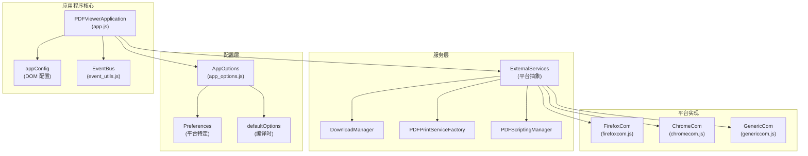
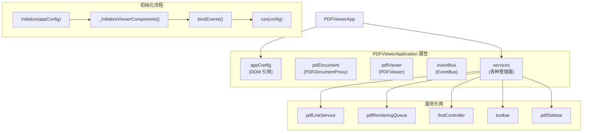
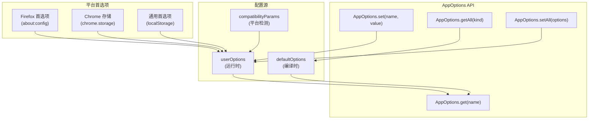
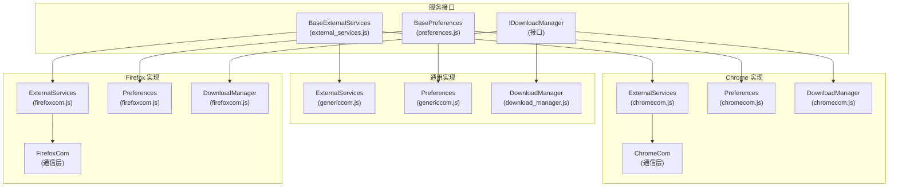

# 应用程序架构

> **相关源文件**
> * [extensions/chromium/preferences_schema.json](https://github.com/Mr-xzq/pdf.js-4.4.168/blob/19fbc899/extensions/chromium/preferences_schema.json)
> * [web/app.js](https://github.com/Mr-xzq/pdf.js-4.4.168/blob/19fbc899/web/app.js)
> * [web/app_options.js](https://github.com/Mr-xzq/pdf.js-4.4.168/blob/19fbc899/web/app_options.js)
> * [web/chromecom.js](https://github.com/Mr-xzq/pdf.js-4.4.168/blob/19fbc899/web/chromecom.js)
> * [web/download_manager.js](https://github.com/Mr-xzq/pdf.js-4.4.168/blob/19fbc899/web/download_manager.js)
> * [web/firefox_print_service.js](https://github.com/Mr-xzq/pdf.js-4.4.168/blob/19fbc899/web/firefox_print_service.js)
> * [web/firefoxcom.js](https://github.com/Mr-xzq/pdf.js-4.4.168/blob/19fbc899/web/firefoxcom.js)
> * [web/genericcom.js](https://github.com/Mr-xzq/pdf.js-4.4.168/blob/19fbc899/web/genericcom.js)
> * [web/password_prompt.js](https://github.com/Mr-xzq/pdf.js-4.4.168/blob/19fbc899/web/password_prompt.js)
> * [web/pdf_document_properties.js](https://github.com/Mr-xzq/pdf.js-4.4.168/blob/19fbc899/web/pdf_document_properties.js)
> * [web/pdf_print_service.js](https://github.com/Mr-xzq/pdf.js-4.4.168/blob/19fbc899/web/pdf_print_service.js)
> * [web/preferences.js](https://github.com/Mr-xzq/pdf.js-4.4.168/blob/19fbc899/web/preferences.js)
> * [web/viewer.css](https://github.com/Mr-xzq/pdf.js-4.4.168/blob/19fbc899/web/viewer.css)
> * [web/viewer.html](https://github.com/Mr-xzq/pdf.js-4.4.168/blob/19fbc899/web/viewer.html)
> * [web/viewer.js](https://github.com/Mr-xzq/pdf.js-4.4.168/blob/19fbc899/web/viewer.js)

本文档涵盖 Web 查看器应用程序架构，重点关注主应用程序控制器、配置管理和服务集成模式。有关核心 PDF 处理引擎的信息，请参阅 [核心 PDF 处理引擎](/Mr-xzq/pdf.js-4.4.168/2-core-pdf-processing-engine)。有关各个 UI 组件的详细信息，请参阅 [用户界面组件](/Mr-xzq/pdf.js-4.4.168/3.2-user-interface-components)。

## 概述

PDF.js Web 查看器应用程序围绕中央应用程序控制器模式构建，具有模块化服务集成和平台抽象层。该架构将应用程序编排、配置管理和平台特定实现之间的关注点分离。

**主应用程序控制器**

来源: [web/app.js L98-L655](https://github.com/Mr-xzq/pdf.js-4.4.168/blob/19fbc899/web/app.js#L98-L655)

 [web/app_options.js L466-L531](https://github.com/Mr-xzq/pdf.js-4.4.168/blob/19fbc899/web/app_options.js#L466-L531)

 [web/viewer.js L37-L180](https://github.com/Mr-xzq/pdf.js-4.4.168/blob/19fbc899/web/viewer.js#L37-L180)

## PDFViewerApplication 控制器

`PDFViewerApplication` 对象作为主应用程序控制器，管理所有查看器组件的生命周期和协调。

**核心属性和生命周期**

应用程序遵循以下初始化序列：

1. **配置设置** - DOM 元素映射到配置对象
2. **组件初始化** - 所有查看器组件都使用依赖项实例化
3. **事件绑定** - 为用户交互和系统事件附加事件处理程序
4. **文档加载** - PDF 文档被打开和渲染

来源: [web/app.js L184-L260](https://github.com/Mr-xzq/pdf.js-4.4.168/blob/19fbc899/web/app.js#L184-L260)

 [web/app.js L392-L654](https://github.com/Mr-xzq/pdf.js-4.4.168/blob/19fbc899/web/app.js#L392-L654)

 [web/app.js L656-L752](https://github.com/Mr-xzq/pdf.js-4.4.168/blob/19fbc899/web/app.js#L656-L752)

## 配置管理

`AppOptions` 类提供集中式配置系统，具有编译时默认值、运行时首选项和平台特定覆盖。

| 配置类型 | 来源 | 目的 |
| --- | --- | --- |
| `OptionKind.BROWSER` | 平台检测 | 浏览器功能标志 |
| `OptionKind.VIEWER` | 应用程序逻辑 | UI 行为设置 |
| `OptionKind.API` | PDF.js 核心 | PDF 处理参数 |
| `OptionKind.WORKER` | 工作线程 | 后台处理选项 |
| `OptionKind.PREFERENCE` | 用户设置 | 持久用户首选项 |

**配置架构**

配置系统支持不同的选项类型，这些类型决定设置的应用位置和方式：

* **浏览器选项** - 检测到的功能，如触摸支持、全屏 API 可用性
* **查看器选项** - UI 行为，如默认缩放、侧边栏状态、编辑器模式
* **API 选项** - PDF 处理设置，如工作源、CMap URL、字体处理
* **首选项选项** - 跨会话持续的用户可配置设置

来源: [web/app_options.js L44-L50](https://github.com/Mr-xzq/pdf.js-4.4.168/blob/19fbc899/web/app_options.js#L44-L50)

 [web/app_options.js L57-L381](https://github.com/Mr-xzq/pdf.js-4.4.168/blob/19fbc899/web/app_options.js#L57-L381)

 [web/app_options.js L466-L531](https://github.com/Mr-xzq/pdf.js-4.4.168/blob/19fbc899/web/app_options.js#L466-L531)

## 服务集成和平台抽象

应用程序使用面向服务的架构，平台特定的实现抽象在通用接口后面。

**平台服务架构**

每个平台实现提供：

1. **外部服务** - 平台集成点（L10n、脚本、遥测）
2. **首选项** - 持久设置存储机制
3. **下载管理** - 文件下载和保存功能
4. **通信层** - 与浏览器扩展 API 的消息传递

来源: [web/external_services.js L18-L87](https://github.com/Mr-xzq/pdf.js-4.4.168/blob/19fbc899/web/external_services.js#L18-L87)

 [web/firefoxcom.js L311-L418](https://github.com/Mr-xzq/pdf.js-4.4.168/blob/19fbc899/web/firefoxcom.js#L311-L418)

 [web/chromecom.js L55-L130](https://github.com/Mr-xzq/pdf.js-4.4.168/blob/19fbc899/web/chromecom.js#L55-L130)

 [web/genericcom.js L40-L56](https://github.com/Mr-xzq/pdf.js-4.4.168/blob/19fbc899/web/genericcom.js#L40-L56)
