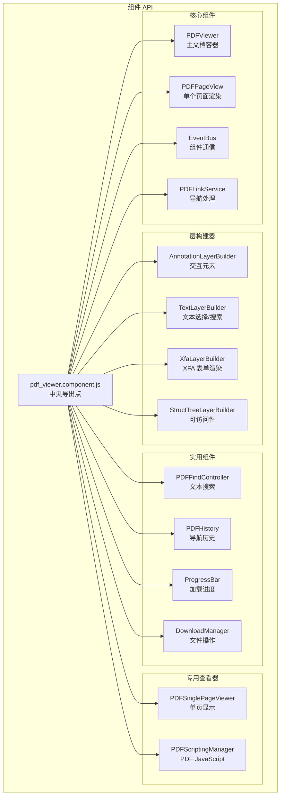
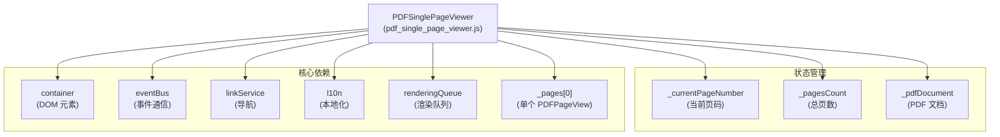
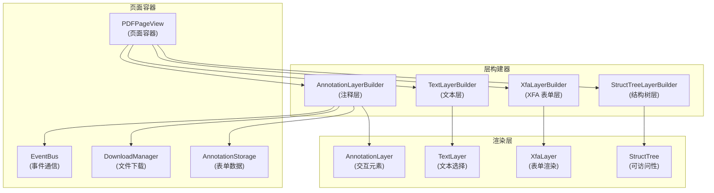
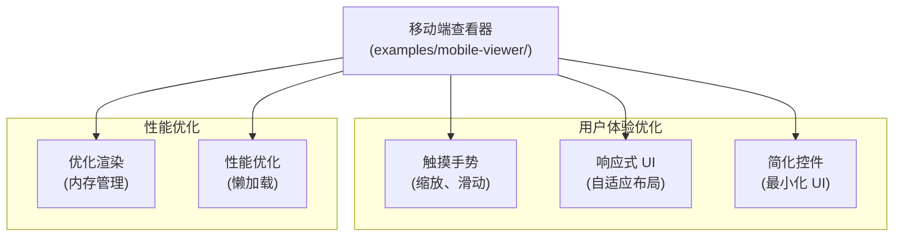

# 组件系统

> **相关源文件**
> * [.stylelintrc](https://github.com/Mr-xzq/pdf.js-4.4.168/blob/19fbc899/.stylelintrc)
> * [examples/mobile-viewer/README.md](https://github.com/Mr-xzq/pdf.js-4.4.168/blob/19fbc899/examples/mobile-viewer/README.md)
> * [examples/mobile-viewer/viewer.css](https://github.com/Mr-xzq/pdf.js-4.4.168/blob/19fbc899/examples/mobile-viewer/viewer.css)
> * [examples/mobile-viewer/viewer.html](https://github.com/Mr-xzq/pdf.js-4.4.168/blob/19fbc899/examples/mobile-viewer/viewer.html)
> * [examples/mobile-viewer/viewer.mjs](https://github.com/Mr-xzq/pdf.js-4.4.168/blob/19fbc899/examples/mobile-viewer/viewer.mjs)
> * [test/unit/pdf_viewer.component_spec.js](https://github.com/Mr-xzq/pdf.js-4.4.168/blob/19fbc899/test/unit/pdf_viewer.component_spec.js)
> * [test/xfa_layer_builder_overrides.css](https://github.com/Mr-xzq/pdf.js-4.4.168/blob/19fbc899/test/xfa_layer_builder_overrides.css)
> * [web/debugger.css](https://github.com/Mr-xzq/pdf.js-4.4.168/blob/19fbc899/web/debugger.css)
> * [web/genericl10n.js](https://github.com/Mr-xzq/pdf.js-4.4.168/blob/19fbc899/web/genericl10n.js)
> * [web/l10n.js](https://github.com/Mr-xzq/pdf.js-4.4.168/blob/19fbc899/web/l10n.js)
> * [web/pdf_scripting_manager.component.js](https://github.com/Mr-xzq/pdf.js-4.4.168/blob/19fbc899/web/pdf_scripting_manager.component.js)
> * [web/pdf_single_page_viewer.js](https://github.com/Mr-xzq/pdf.js-4.4.168/blob/19fbc899/web/pdf_single_page_viewer.js)
> * [web/pdf_viewer.component.js](https://github.com/Mr-xzq/pdf.js-4.4.168/blob/19fbc899/web/pdf_viewer.component.js)

组件系统提供模块化、可重用的 PDF.js 构建块，可以组合成自定义查看器并集成到第三方应用程序中。该系统使开发人员能够使用特定的 PDF.js 功能，而无需完整的 Web 查看器应用程序。

有关完整 Web 查看器应用程序的信息，请参阅 [Web 查看器应用程序](/Mr-xzq/pdf.js-4.4.168/3-web-viewer-application)。有关平台特定集成的详细信息，请参阅 [平台扩展](/Mr-xzq/pdf.js-4.4.168/7-platform-extensions)。

## 目的和架构

组件系统服务于三个主要目的：

1. **模块化集成**: 能够将特定的 PDF.js 功能嵌入到现有应用程序中
2. **移动端优化**: 提供针对移动端和触摸界面优化的精简组件
3. **平台抽象**: 提供在不同 JavaScript 环境中工作的通用实现

该系统围绕可组合组件构建，这些组件可以独立使用或组合以创建自定义 PDF 查看体验。

### 组件导出结构



来源: [web/pdf_viewer.component.js L49-L72](https://github.com/Mr-xzq/pdf.js-4.4.168/blob/19fbc899/web/pdf_viewer.component.js#L49-L72)

 [test/unit/pdf_viewer.component_spec.js L48-L71](https://github.com/Mr-xzq/pdf.js-4.4.168/blob/19fbc899/test/unit/pdf_viewer.component_spec.js#L48-L71)

## 核心组件分类

组件系统按功能分为几个主要类别：

| 组件类别 | 类 | 目的 |
| --- | --- | --- |
| **查看器组件** | `PDFViewer`, `PDFSinglePageViewer`, `PDFPageView` | 文档显示和页面渲染 |
| **层构建器** | `AnnotationLayerBuilder`, `TextLayerBuilder`, `XfaLayerBuilder`, `StructTreeLayerBuilder` | 内容层管理 |
| **导航** | `PDFLinkService`, `SimpleLinkService`, `PDFHistory` | 文档导航和历史 |
| **搜索和交互** | `PDFFindController`, `PDFScriptingManager` | 文本搜索和 JavaScript 执行 |
| **实用工具** | `EventBus`, `ProgressBar`, `DownloadManager` | 通信和文件操作 |
| **本地化** | `GenericL10n` | 国际化支持 |

### PDFSinglePageViewer 实现

`PDFSinglePageViewer` 是针对移动端和简化用例优化的专用查看器：



**关键特性**:
- **简化的 API**: 专注于单页显示，减少复杂性
- **移动端优化**: 针对触摸交互和小屏幕优化
- **内存效率**: 一次只渲染一个页面，减少内存使用
- **事件驱动**: 使用 EventBus 进行组件间通信

来源: [web/pdf_single_page_viewer.js L49-L127](https://github.com/Mr-xzq/pdf.js-4.4.168/blob/19fbc899/web/pdf_single_page_viewer.js#L49-L127)

 [examples/mobile-viewer/viewer.mjs L89-L156](https://github.com/Mr-xzq/pdf.js-4.4.168/blob/19fbc899/examples/mobile-viewer/viewer.mjs#L89-L156)

## 层构建器系统

层构建器负责在 PDF 页面上创建和管理不同类型的内容层：

### 层构建器架构



**层构建器职责**:

1. **AnnotationLayerBuilder**: 处理链接、表单字段、注释的交互
2. **TextLayerBuilder**: 管理文本选择、搜索高亮和复制功能
3. **XfaLayerBuilder**: 渲染 XFA（XML Forms Architecture）表单
4. **StructTreeLayerBuilder**: 提供可访问性支持和结构化内容

来源: [web/annotation_layer_builder.js](https://github.com/Mr-xzq/pdf.js-4.4.168/blob/19fbc899/web/annotation_layer_builder.js)

 [web/text_layer_builder.js](https://github.com/Mr-xzq/pdf.js-4.4.168/blob/19fbc899/web/text_layer_builder.js)

 [web/xfa_layer_builder.js](https://github.com/Mr-xzq/pdf.js-4.4.168/blob/19fbc899/web/xfa_layer_builder.js)

## 移动端优化组件

项目包含专门针对移动设备优化的组件实现：

### 移动端查看器特性



**移动端特定功能**:

- **触摸手势支持**: 双指缩放、滑动翻页
- **响应式设计**: 适应不同屏幕尺寸
- **内存优化**: 按需加载和卸载页面
- **简化界面**: 减少不必要的 UI 元素
- **性能调优**: 针对移动设备的渲染优化

来源: [examples/mobile-viewer/viewer.html](https://github.com/Mr-xzq/pdf.js-4.4.168/blob/19fbc899/examples/mobile-viewer/viewer.html)

 [examples/mobile-viewer/viewer.css](https://github.com/Mr-xzq/pdf.js-4.4.168/blob/19fbc899/examples/mobile-viewer/viewer.css)

 [examples/mobile-viewer/viewer.mjs](https://github.com/Mr-xzq/pdf.js-4.4.168/blob/19fbc899/examples/mobile-viewer/viewer.mjs)

## 组件集成模式

组件系统支持多种集成模式，适应不同的使用场景：

### 1. 独立组件使用

```javascript
// 使用单个组件
import { PDFSinglePageViewer, EventBus } from 'pdfjs-dist/web/pdf_viewer.component.js';

const eventBus = new EventBus();
const viewer = new PDFSinglePageViewer({
  container: document.getElementById('viewerContainer'),
  eventBus: eventBus
});
```

### 2. 组合式集成

```javascript
// 组合多个组件
import {
  PDFViewer,
  PDFFindController,
  PDFLinkService,
  EventBus
} from 'pdfjs-dist/web/pdf_viewer.component.js';

const eventBus = new EventBus();
const linkService = new PDFLinkService({ eventBus });
const findController = new PDFFindController({ linkService, eventBus });
const viewer = new PDFViewer({
  container,
  eventBus,
  linkService,
  findController
});
```

## 组件测试和验证

组件系统包含完整的测试套件，确保各组件的独立性和集成稳定性：

```javascript
// 组件测试示例
describe('PDFViewer Component', () => {
  it('should initialize with required dependencies', () => {
    const eventBus = new EventBus();
    const viewer = new PDFViewer({ container, eventBus });
    expect(viewer.eventBus).toBe(eventBus);
  });
});
```

来源: [test/unit/pdf_viewer.component_spec.js](https://github.com/Mr-xzq/pdf.js-4.4.168/blob/19fbc899/test/unit/pdf_viewer.component_spec.js)
