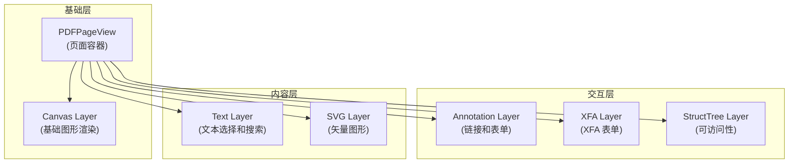
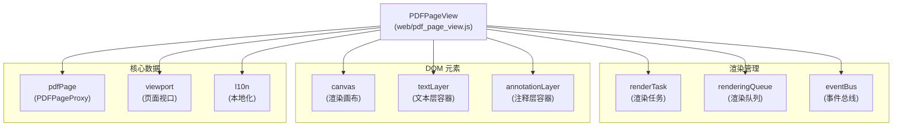
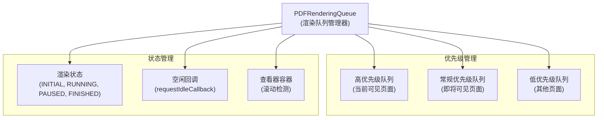
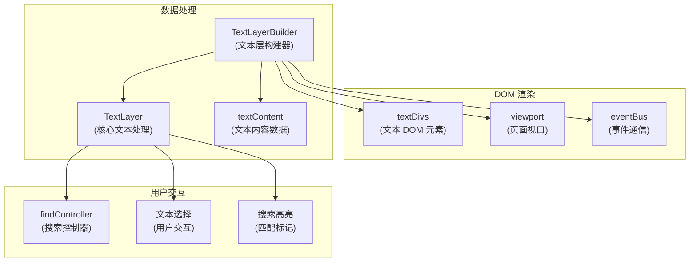
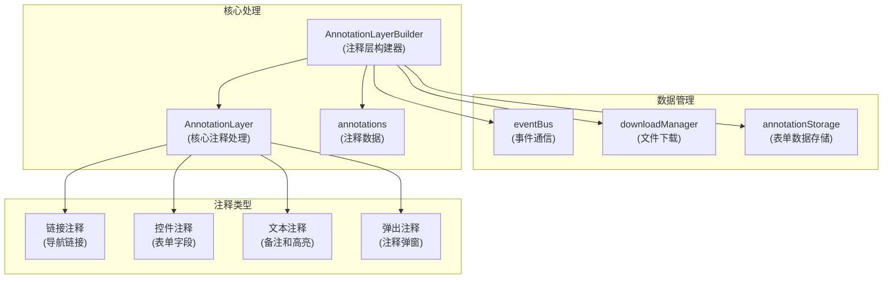
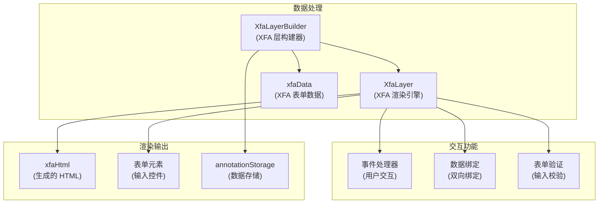
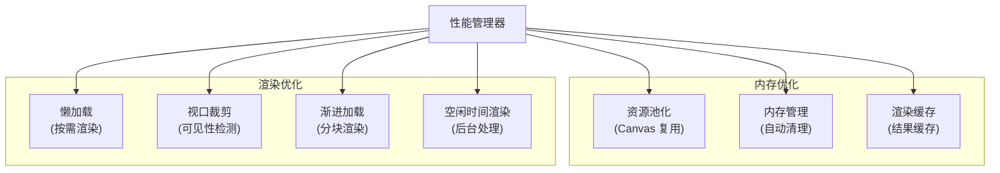
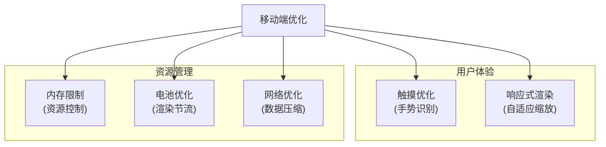

# 页面渲染系统

> **相关源文件**
> * [web/pdf_page_view.js](https://github.com/Mr-xzq/pdf.js-4.4.168/blob/19fbc899/web/pdf_page_view.js)
> * [web/pdf_viewer.js](https://github.com/Mr-xzq/pdf.js-4.4.168/blob/19fbc899/web/pdf_viewer.js)
> * [web/pdf_rendering_queue.js](https://github.com/Mr-xzq/pdf.js-4.4.168/blob/19fbc899/web/pdf_rendering_queue.js)
> * [web/text_layer_builder.js](https://github.com/Mr-xzq/pdf.js-4.4.168/blob/19fbc899/web/text_layer_builder.js)
> * [web/annotation_layer_builder.js](https://github.com/Mr-xzq/pdf.js-4.4.168/blob/19fbc899/web/annotation_layer_builder.js)
> * [web/xfa_layer_builder.js](https://github.com/Mr-xzq/pdf.js-4.4.168/blob/19fbc899/web/xfa_layer_builder.js)
> * [web/struct_tree_layer_builder.js](https://github.com/Mr-xzq/pdf.js-4.4.168/blob/19fbc899/web/struct_tree_layer_builder.js)

页面渲染系统负责将 PDF 页面内容转换为可在浏览器中显示的视觉元素。它管理多层渲染架构，包括画布渲染、文本层、注释层和表单层。

有关核心 PDF 处理的信息，请参阅 [核心 PDF 处理引擎](/Mr-xzq/pdf.js-4.4.168/2-core-pdf-processing-engine)。有关用户界面组件的详细信息，请参阅 [用户界面组件](/Mr-xzq/pdf.js-4.4.168/3.2-user-interface-components)。

## 渲染架构概述

页面渲染系统采用分层架构，每一层负责特定类型的内容渲染：

### 渲染层次结构

**层级说明**:
1. **Canvas Layer**: 渲染 PDF 的基础图形内容（文本、图像、路径）
2. **Text Layer**: 提供文本选择、复制和搜索功能
3. **Annotation Layer**: 处理链接、表单字段和注释的交互
4. **XFA Layer**: 渲染 XML Forms Architecture (XFA) 表单
5. **StructTree Layer**: 提供可访问性支持和语义结构
6. **SVG Layer**: 可选的矢量图形渲染模式

## PDFPageView 核心组件

`PDFPageView` 是单个 PDF 页面的主要容器和协调器：

### PDFPageView 架构

**关键属性和方法**:

- **id**: 页面唯一标识符
- **scale**: 当前缩放比例
- **rotation**: 页面旋转角度
- **viewport**: 页面视口配置
- **draw()**: 执行页面渲染
- **reset()**: 重置页面状态
- **update()**: 更新页面配置

来源: [web/pdf_page_view.js L49-L127](https://github.com/Mr-xzq/pdf.js-4.4.168/blob/19fbc899/web/pdf_page_view.js#L49-L127)

## 渲染队列管理

`PDFRenderingQueue` 管理多个页面的渲染优先级和资源分配：

### 渲染队列架构

**渲染优先级策略**:

1. **高优先级**: 当前视口内的可见页面
2. **常规优先级**: 即将进入视口的页面
3. **低优先级**: 其他页面的预渲染

**性能优化特性**:
- **懒加载**: 只渲染可见或即将可见的页面
- **资源回收**: 自动清理不可见页面的渲染资源
- **空闲时间利用**: 使用 `requestIdleCallback` 在浏览器空闲时进行渲染

来源: [web/pdf_rendering_queue.js L49-L156](https://github.com/Mr-xzq/pdf.js-4.4.168/blob/19fbc899/web/pdf_rendering_queue.js#L49-L156)

## 文本层渲染

文本层提供文本选择、复制和搜索功能，同时保持与原始 PDF 的精确对应：

### 文本层架构

**文本层特性**:

- **精确定位**: 文本元素与 PDF 原始位置完全对应
- **选择支持**: 支持跨行、跨页的文本选择
- **搜索集成**: 与查找控制器集成，支持高亮显示
- **复制功能**: 保持原始文本格式的复制操作
- **可访问性**: 支持屏幕阅读器和键盘导航

来源: [web/text_layer_builder.js L89-L234](https://github.com/Mr-xzq/pdf.js-4.4.168/blob/19fbc899/web/text_layer_builder.js#L89-L234)

## 注释层渲染

注释层处理 PDF 中的交互元素，包括链接、表单字段和注释：

### 注释层架构

**注释类型支持**:

1. **链接注释**: 内部链接、外部 URL、文件附件
2. **表单字段**: 文本框、复选框、单选按钮、下拉列表
3. **文本注释**: 高亮、下划线、删除线、备注
4. **图形注释**: 矩形、圆形、多边形、自由绘制

来源: [web/annotation_layer_builder.js L127-L289](https://github.com/Mr-xzq/pdf.js-4.4.168/blob/19fbc899/web/annotation_layer_builder.js#L127-L289)

## XFA 表单渲染

XFA (XML Forms Architecture) 层处理动态表单的渲染和交互：

### XFA 层架构

**XFA 特性**:
- **动态布局**: 根据数据内容动态调整表单布局
- **数据绑定**: 表单字段与数据模型的双向绑定
- **验证规则**: 内置的表单验证和错误提示
- **事件处理**: 支持复杂的表单交互逻辑

来源: [web/xfa_layer_builder.js L89-L178](https://github.com/Mr-xzq/pdf.js-4.4.168/blob/19fbc899/web/xfa_layer_builder.js#L89-L178)

## 渲染性能优化

页面渲染系统包含多种性能优化策略：

### 性能优化架构

**优化策略详解**:

1. **懒加载**: 只渲染当前可见的页面，减少初始加载时间
2. **视口裁剪**: 检测页面可见性，避免渲染不可见内容
3. **资源池化**: 复用 Canvas 和其他渲染资源
4. **内存管理**: 自动清理不再需要的渲染数据
5. **渐进加载**: 分块渲染大型页面，提供更好的用户体验
6. **空闲时间渲染**: 利用浏览器空闲时间进行预渲染

## 移动端渲染优化

针对移动设备的特殊渲染优化：

### 移动端优化策略

**移动端特性**:
- **触摸手势**: 支持双指缩放、滑动翻页等触摸操作
- **内存控制**: 严格控制同时渲染的页面数量
- **电池优化**: 在低电量时降低渲染质量
- **网络优化**: 优先加载关键内容，延迟加载非关键资源
- **响应式缩放**: 根据设备屏幕自动调整渲染参数
