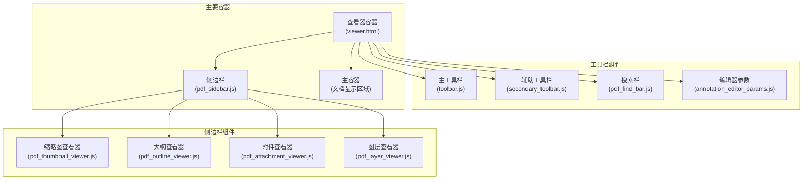
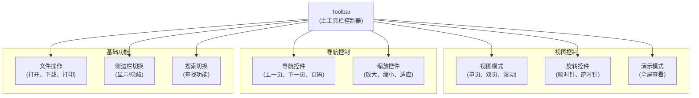
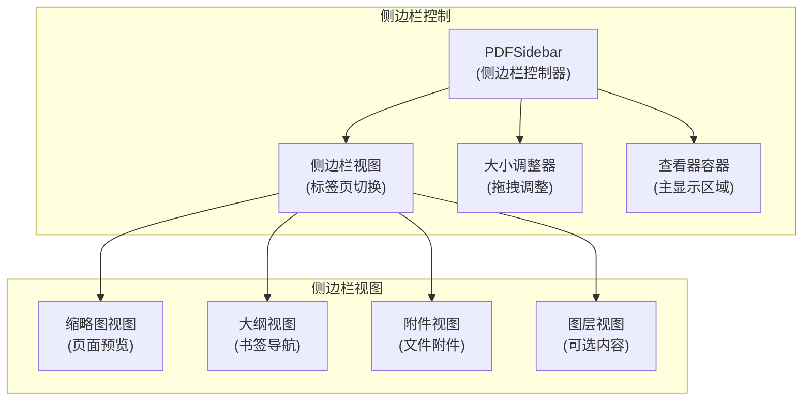
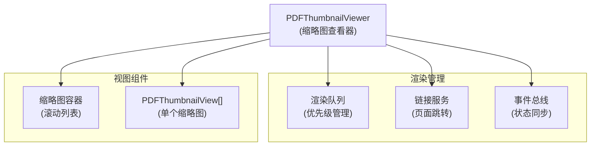
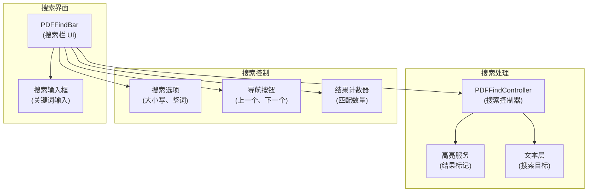
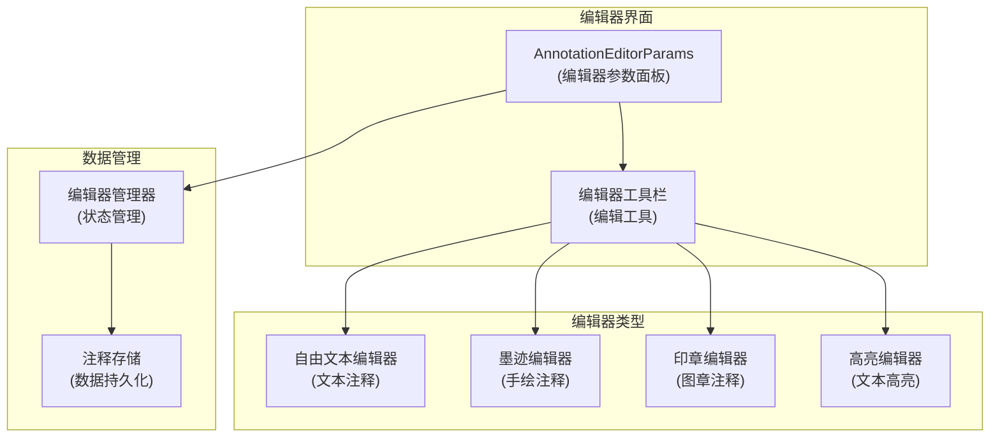
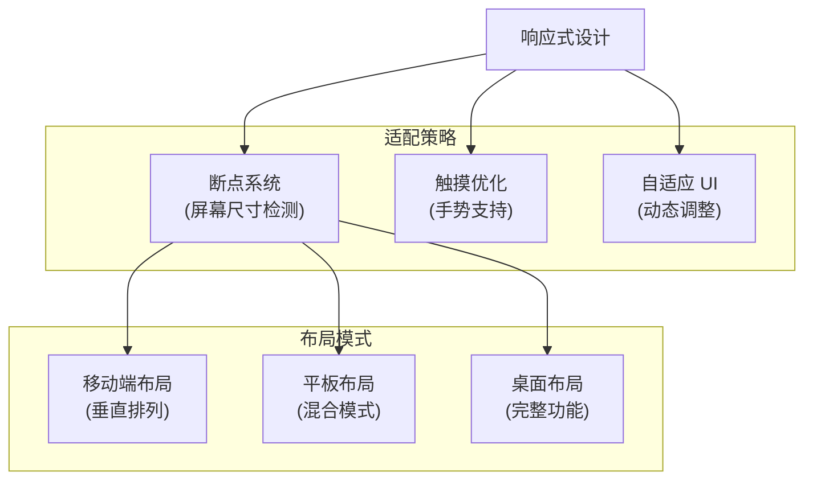
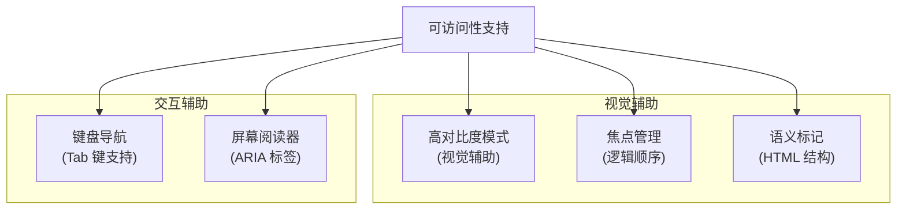

# 用户界面组件

> **相关源文件**
> * [web/toolbar.js](https://github.com/Mr-xzq/pdf.js-4.4.168/blob/19fbc899/web/toolbar.js)
> * [web/secondary_toolbar.js](https://github.com/Mr-xzq/pdf.js-4.4.168/blob/19fbc899/web/secondary_toolbar.js)
> * [web/pdf_sidebar.js](https://github.com/Mr-xzq/pdf.js-4.4.168/blob/19fbc899/web/pdf_sidebar.js)
> * [web/pdf_find_bar.js](https://github.com/Mr-xzq/pdf.js-4.4.168/blob/19fbc899/web/pdf_find_bar.js)
> * [web/pdf_thumbnail_viewer.js](https://github.com/Mr-xzq/pdf.js-4.4.168/blob/19fbc899/web/pdf_thumbnail_viewer.js)
> * [web/pdf_outline_viewer.js](https://github.com/Mr-xzq/pdf.js-4.4.168/blob/19fbc899/web/pdf_outline_viewer.js)
> * [web/pdf_attachment_viewer.js](https://github.com/Mr-xzq/pdf.js-4.4.168/blob/19fbc899/web/pdf_attachment_viewer.js)
> * [web/pdf_layer_viewer.js](https://github.com/Mr-xzq/pdf.js-4.4.168/blob/19fbc899/web/pdf_layer_viewer.js)
> * [web/annotation_editor_params.js](https://github.com/Mr-xzq/pdf.js-4.4.168/blob/19fbc899/web/annotation_editor_params.js)
> * [web/viewer.html](https://github.com/Mr-xzq/pdf.js-4.4.168/blob/19fbc899/web/viewer.html)
> * [web/viewer.css](https://github.com/Mr-xzq/pdf.js-4.4.168/blob/19fbc899/web/viewer.css)

用户界面组件系统提供完整的 PDF 查看器用户界面，包括工具栏、侧边栏、搜索栏和各种交互控件。这些组件协同工作，为用户提供直观、功能丰富的 PDF 查看体验。

有关应用程序架构的信息，请参阅 [应用程序架构](/Mr-xzq/pdf.js-4.4.168/3.1-application-architecture)。有关页面渲染的详细信息，请参阅 [页面渲染系统](/Mr-xzq/pdf.js-4.4.168/3.3-page-rendering-system)。

## UI 组件架构概述

用户界面采用模块化设计，每个组件负责特定的功能区域：

### 主要 UI 组件结构



## 主工具栏组件

主工具栏提供最常用的 PDF 查看功能：

### 工具栏架构



**主工具栏功能**:

- **文件操作**: 打开文件、下载、打印、文档属性
- **页面导航**: 首页、末页、上一页、下一页、跳转到指定页
- **缩放控制**: 放大、缩小、适应页面、适应宽度、实际大小
- **视图模式**: 单页视图、双页视图、连续滚动
- **页面旋转**: 顺时针旋转、逆时针旋转
- **界面控制**: 侧边栏切换、搜索栏切换、演示模式

来源: [web/toolbar.js L89-L234](https://github.com/Mr-xzq/pdf.js-4.4.168/blob/19fbc899/web/toolbar.js#L89-L234)

## 侧边栏组件系统

侧边栏提供文档导航和信息查看功能：

### 侧边栏架构



### 缩略图查看器

缩略图查看器提供页面预览和快速导航：



**缩略图特性**:
- **懒加载**: 只渲染可见的缩略图
- **点击导航**: 点击缩略图跳转到对应页面
- **当前页高亮**: 显示当前查看页面的状态
- **渲染优化**: 使用低分辨率快速渲染

来源: [web/pdf_thumbnail_viewer.js L127-L289](https://github.com/Mr-xzq/pdf.js-4.4.168/blob/19fbc899/web/pdf_thumbnail_viewer.js#L127-L289)

## 搜索功能组件

搜索系统提供全文搜索和高亮显示功能：

### 搜索组件架构



**搜索功能特性**:
- **实时搜索**: 输入时即时显示搜索结果
- **高亮显示**: 在文档中高亮显示所有匹配项
- **导航控制**: 在搜索结果间快速跳转
- **搜索选项**: 支持大小写敏感、整词匹配等选项
- **结果统计**: 显示匹配数量和当前位置

来源: [web/pdf_find_bar.js L89-L178](https://github.com/Mr-xzq/pdf.js-4.4.168/blob/19fbc899/web/pdf_find_bar.js#L89-L178)

 [web/pdf_find_controller.js L127-L345](https://github.com/Mr-xzq/pdf.js-4.4.168/blob/19fbc899/web/pdf_find_controller.js#L127-L345)

## 注释编辑器组件

注释编辑器提供 PDF 注释的创建、编辑和管理功能：

### 注释编辑器架构



**注释编辑功能**:
- **文本注释**: 添加自由文本、备注和标签
- **手绘注释**: 支持触摸和鼠标绘制
- **图章注释**: 预定义和自定义图章
- **高亮标记**: 文本高亮、下划线、删除线
- **属性编辑**: 颜色、字体、透明度等属性调整

来源: [web/annotation_editor_params.js L89-L234](https://github.com/Mr-xzq/pdf.js-4.4.168/blob/19fbc899/web/annotation_editor_params.js#L89-L234)

## 响应式设计和移动端适配

UI 组件系统支持响应式设计，适应不同设备和屏幕尺寸：

### 响应式架构



**移动端优化特性**:

1. **触摸友好**: 增大按钮尺寸，优化触摸目标
2. **手势支持**: 双指缩放、滑动翻页、长按菜单
3. **简化界面**: 隐藏非必要功能，突出核心操作
4. **自适应布局**: 根据屏幕方向和尺寸调整布局
5. **性能优化**: 减少动画效果，优化渲染性能

### CSS 媒体查询示例

```css
/* 移动端样式 */
@media (max-width: 768px) {
  .toolbar {
    flex-direction: column;
    padding: 8px;
  }

  .toolbarButton {
    min-height: 44px; /* 触摸友好尺寸 */
    margin: 2px;
  }

  .sidebarContainer {
    width: 100%;
    position: absolute;
    z-index: 100;
  }
}

/* 平板样式 */
@media (min-width: 769px) and (max-width: 1024px) {
  .toolbar {
    flex-wrap: wrap;
  }

  .sidebarContainer {
    width: 300px;
    position: relative;
  }
}
```

来源: [web/viewer.css](https://github.com/Mr-xzq/pdf.js-4.4.168/blob/19fbc899/web/viewer.css)

 [examples/mobile-viewer/viewer.css](https://github.com/Mr-xzq/pdf.js-4.4.168/blob/19fbc899/examples/mobile-viewer/viewer.css)

## 可访问性支持

UI 组件系统包含完整的可访问性支持：

### 可访问性特性



**可访问性功能**:
- **键盘导航**: 完整的键盘操作支持
- **屏幕阅读器**: ARIA 标签和语义化标记
- **高对比度**: 支持系统高对比度模式
- **焦点指示**: 清晰的焦点视觉反馈
- **语义结构**: 正确的 HTML 语义标记

这些 UI 组件共同构成了一个功能完整、用户友好的 PDF 查看器界面，支持从基础查看到高级编辑的各种使用场景。
