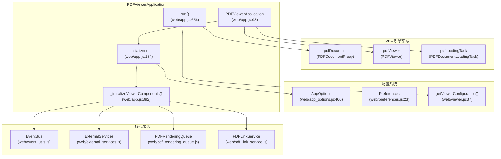
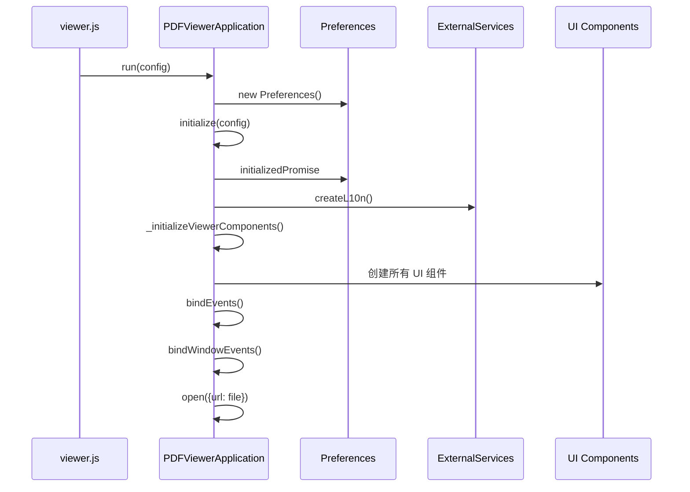
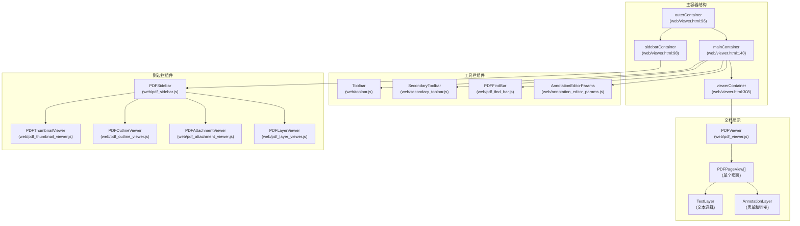
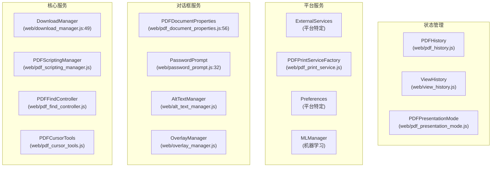
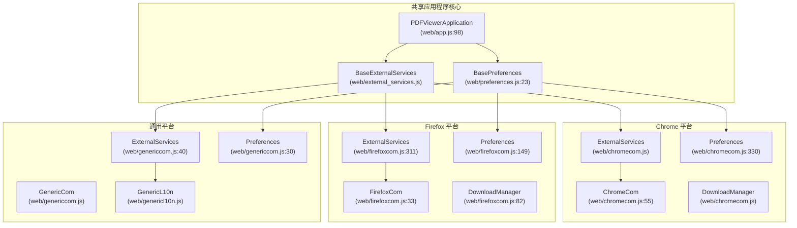
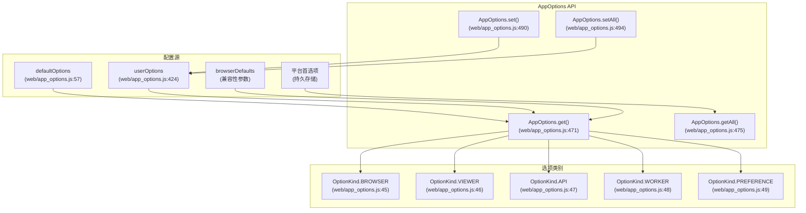
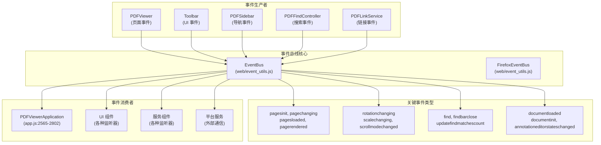
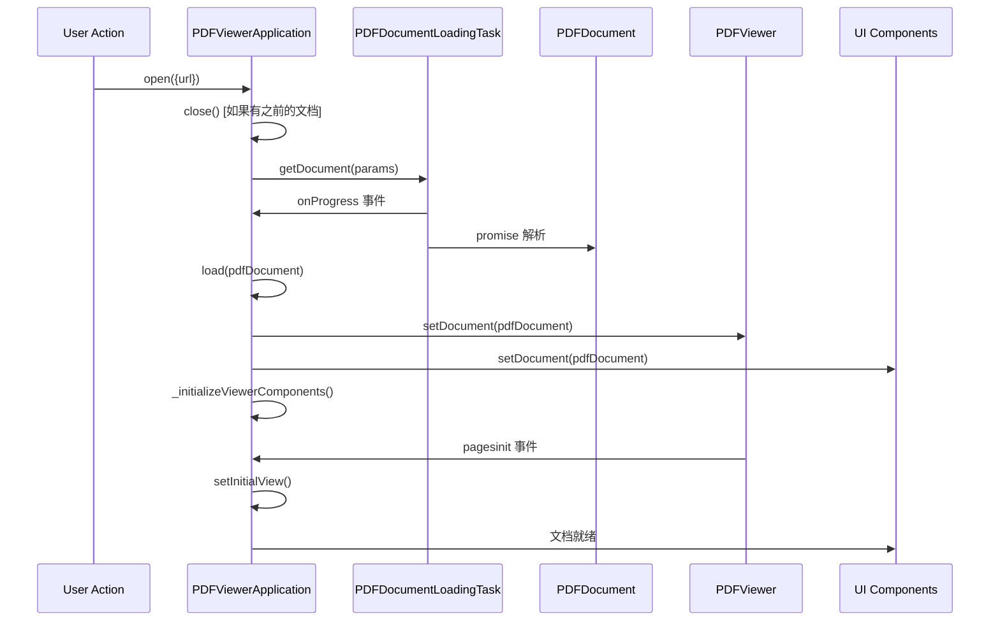
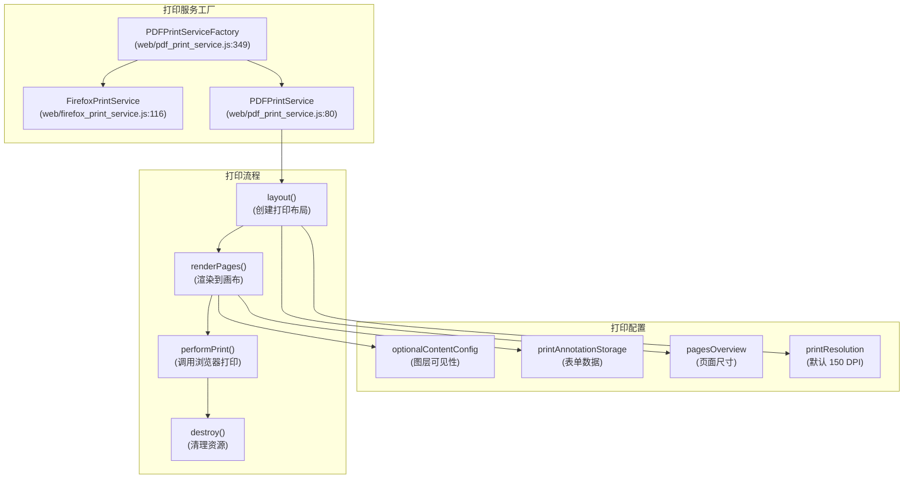

# Web 查看器应用程序

> **相关源文件**
> * [extensions/chromium/preferences_schema.json](https://github.com/Mr-xzq/pdf.js-4.4.168/blob/19fbc899/extensions/chromium/preferences_schema.json)
> * [web/app.js](https://github.com/Mr-xzq/pdf.js-4.4.168/blob/19fbc899/web/app.js)
> * [web/app_options.js](https://github.com/Mr-xzq/pdf.js-4.4.168/blob/19fbc899/web/app_options.js)
> * [web/chromecom.js](https://github.com/Mr-xzq/pdf.js-4.4.168/blob/19fbc899/web/chromecom.js)
> * [web/download_manager.js](https://github.com/Mr-xzq/pdf.js-4.4.168/blob/19fbc899/web/download_manager.js)
> * [web/firefox_print_service.js](https://github.com/Mr-xzq/pdf.js-4.4.168/blob/19fbc899/web/firefox_print_service.js)
> * [web/firefoxcom.js](https://github.com/Mr-xzq/pdf.js-4.4.168/blob/19fbc899/web/firefoxcom.js)
> * [web/genericcom.js](https://github.com/Mr-xzq/pdf.js-4.4.168/blob/19fbc899/web/genericcom.js)
> * [web/password_prompt.js](https://github.com/Mr-xzq/pdf.js-4.4.168/blob/19fbc899/web/password_prompt.js)
> * [web/pdf_document_properties.js](https://github.com/Mr-xzq/pdf.js-4.4.168/blob/19fbc899/web/pdf_document_properties.js)
> * [web/pdf_print_service.js](https://github.com/Mr-xzq/pdf.js-4.4.168/blob/19fbc899/web/pdf_print_service.js)
> * [web/preferences.js](https://github.com/Mr-xzq/pdf.js-4.4.168/blob/19fbc899/web/preferences.js)
> * [web/viewer.css](https://github.com/Mr-xzq/pdf.js-4.4.168/blob/19fbc899/web/viewer.css)
> * [web/viewer.html](https://github.com/Mr-xzq/pdf.js-4.4.168/blob/19fbc899/web/viewer.html)
> * [web/viewer.js](https://github.com/Mr-xzq/pdf.js-4.4.168/blob/19fbc899/web/viewer.js)

## 目的和范围

Web 查看器应用程序基于核心 PDF 处理引擎构建，提供完整的基于浏览器的 PDF 查看体验。它包括用户界面、应用程序编排、平台抽象以及用户在浏览器中查看 PDF 时交互的所有功能。

本文档涵盖应用程序级架构、组件系统和平台集成。有关底层 PDF 解析和渲染系统的信息，请参阅 [核心 PDF 处理引擎](/Mr-xzq/pdf.js-4.4.168/2-core-pdf-processing-engine)。有关交互式注释编辑的详细信息，请参阅 [注释编辑器系统](/Mr-xzq/pdf.js-4.4.168/4-annotation-editor-system)。

## 应用程序架构

Web 查看器应用程序由 `PDFViewerApplication` 对象编排，它作为所有查看器组件、服务和生命周期管理的中央协调器。

### 核心应用程序对象

`PDFViewerApplication` 对象维护对所有主要组件的引用，并处理从初始化到文档加载和清理的应用程序生命周期。

来源: [web/app.js L98-L182](https://github.com/Mr-xzq/pdf.js-4.4.168/blob/19fbc899/web/app.js#L98-L182)

 [web/viewer.js L37-L180](https://github.com/Mr-xzq/pdf.js-4.4.168/blob/19fbc899/web/viewer.js#L37-L180)

 [web/app_options.js L466-L532](https://github.com/Mr-xzq/pdf.js-4.4.168/blob/19fbc899/web/app_options.js#L466-L532)

### 组件初始化流程

初始化过程遵循严格的顺序，确保在查看器变为交互式之前正确设置所有依赖项。

来源: [web/app.js L656-L752](https://github.com/Mr-xzq/pdf.js-4.4.168/blob/19fbc899/web/app.js#L656-L752)

 [web/app.js L184-L260](https://github.com/Mr-xzq/pdf.js-4.4.168/blob/19fbc899/web/app.js#L184-L260)

 [web/app.js L392-L654](https://github.com/Mr-xzq/pdf.js-4.4.168/blob/19fbc899/web/app.js#L392-L654)

## 组件系统

Web 查看器应用程序由几个主要组件类别组成，它们协同工作以提供完整的查看体验。

### UI 组件架构

每个 UI 组件都在 `PDFViewerApplication` 的 `_initializeViewerComponents()` 阶段实例化和管理。

来源: [web/app.js L392-L654](https://github.com/Mr-xzq/pdf.js-4.4.168/blob/19fbc899/web/app.js#L392-L654)

 [web/viewer.html L96-L411](https://github.com/Mr-xzq/pdf.js-4.4.168/blob/19fbc899/web/viewer.html#L96-L411)

 [web/toolbar.js](https://github.com/Mr-xzq/pdf.js-4.4.168/blob/19fbc899/web/toolbar.js)

 [web/pdf_sidebar.js](https://github.com/Mr-xzq/pdf.js-4.4.168/blob/19fbc899/web/pdf_sidebar.js)

### 服务组件架构

服务组件提供专门的功能，通常在应用程序上下文中作为单例实例化。

来源: [web/app.js L421-L653](https://github.com/Mr-xzq/pdf.js-4.4.168/blob/19fbc899/web/app.js#L421-L653)

 [web/download_manager.js L49-L126](https://github.com/Mr-xzq/pdf.js-4.4.168/blob/19fbc899/web/download_manager.js#L49-L126)

 [web/pdf_document_properties.js L56-L327](https://github.com/Mr-xzq/pdf.js-4.4.168/blob/19fbc899/web/pdf_document_properties.js#L56-L327)

## 平台集成策略

Web 查看器应用程序使用平台抽象层来支持不同的部署目标，同时维护统一的代码库。

### 平台抽象层

平台特定的实现通过条件编译指令在构建时选择。

来源: [web/external_services.js](https://github.com/Mr-xzq/pdf.js-4.4.168/blob/19fbc899/web/external_services.js)

 [web/firefoxcom.js L311-L419](https://github.com/Mr-xzq/pdf.js-4.4.168/blob/19fbc899/web/firefoxcom.js#L311-L419)

 [web/chromecom.js L330-L428](https://github.com/Mr-xzq/pdf.js-4.4.168/blob/19fbc899/web/chromecom.js#L330-L428)

 [web/genericcom.js L40-L57](https://github.com/Mr-xzq/pdf.js-4.4.168/blob/19fbc899/web/genericcom.js#L40-L57)

### 配置管理

配置系统提供分层方法，其中用户首选项覆盖默认值，并根据需要应用平台特定值。

来源: [web/app_options.js L57-L532](https://github.com/Mr-xzq/pdf.js-4.4.168/blob/19fbc899/web/app_options.js#L57-L532)

 [web/preferences.js L23-L210](https://github.com/Mr-xzq/pdf.js-4.4.168/blob/19fbc899/web/preferences.js#L23-L210)

## 事件系统和通信

Web 查看器应用程序使用集中式事件系统来协调组件之间的通信。

### EventBus 架构

事件系统在组件之间实现松耦合，同时在整个应用程序中维护协调行为。

来源: [web/event_utils.js](https://github.com/Mr-xzq/pdf.js-4.4.168/blob/19fbc899/web/event_utils.js)

 [web/app.js L2565-L2802](https://github.com/Mr-xzq/pdf.js-4.4.168/blob/19fbc899/web/app.js#L2565-L2802)

 [web/pdf_viewer.js](https://github.com/Mr-xzq/pdf.js-4.4.168/blob/19fbc899/web/pdf_viewer.js)

### 文档生命周期管理

文档生命周期经过精心管理，确保在切换 PDF 文档时进行适当的清理和初始化。

来源: [web/app.js L1005-L1093](https://github.com/Mr-xzq/pdf.js-4.4.168/blob/19fbc899/web/app.js#L1005-L1093)

 [web/app.js L1139-L1254](https://github.com/Mr-xzq/pdf.js-4.4.168/blob/19fbc899/web/app.js#L1139-L1254)

 [web/app.js L932-L997](https://github.com/Mr-xzq/pdf.js-4.4.168/blob/19fbc899/web/app.js#L932-L997)

## 打印和导出服务

应用程序通过平台感知的打印服务系统提供全面的打印功能。

### 打印服务架构

打印系统适应浏览器功能，在可用时使用原生 Firefox 打印 API，或回退到通用的基于画布的打印。

来源: [web/pdf_print_service.js L80-L241](https://github.com/Mr-xzq/pdf.js-4.4.168/blob/19fbc899/web/pdf_print_service.js#L80-L241)

 [web/firefox_print_service.js L116-L194](https://github.com/Mr-xzq/pdf.js-4.4.168/blob/19fbc899/web/firefox_print_service.js#L116-L194)

 [web/pdf_print_service.js L349-L374](https://github.com/Mr-xzq/pdf.js-4.4.168/blob/19fbc899/web/pdf_print_service.js#L349-L374)

## 项目特定的架构特点

### 构建系统扩展

项目包含自定义的构建配置和测试服务器：

- **开发服务器**: `test/webserver.mjs` 提供本地开发环境
- **构建优化**: 针对不同平台的构建目标优化
- **资源管理**: 静态资源和依赖项的管理策略

### 平台兼容性

项目支持多平台部署：

- **通用浏览器**: 标准 Web 环境支持
- **移动端**: 触摸交互和响应式设计
- **扩展程序**: Chrome 和 Firefox 扩展支持
