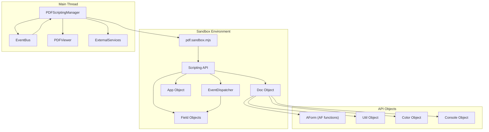
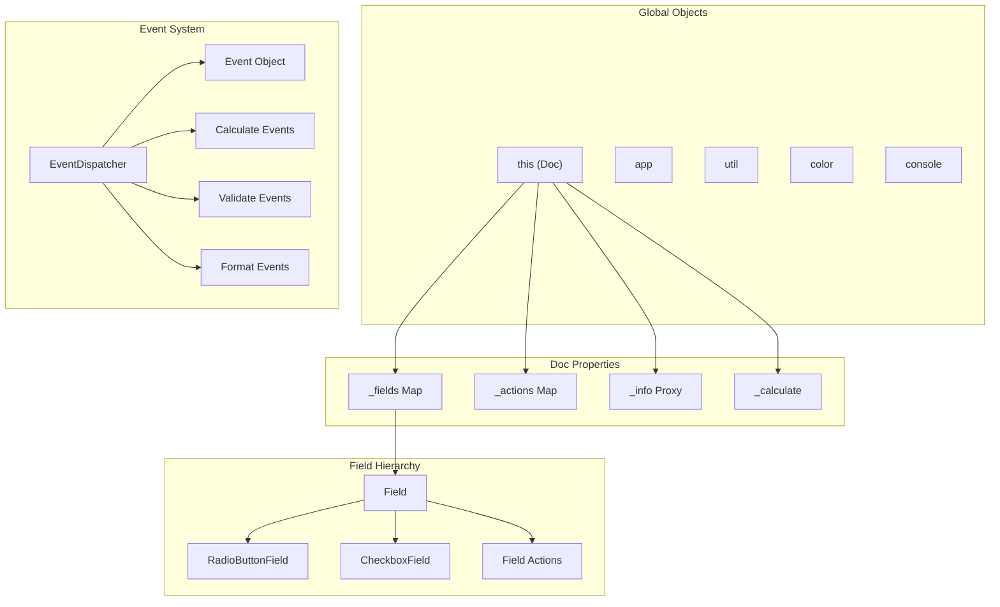
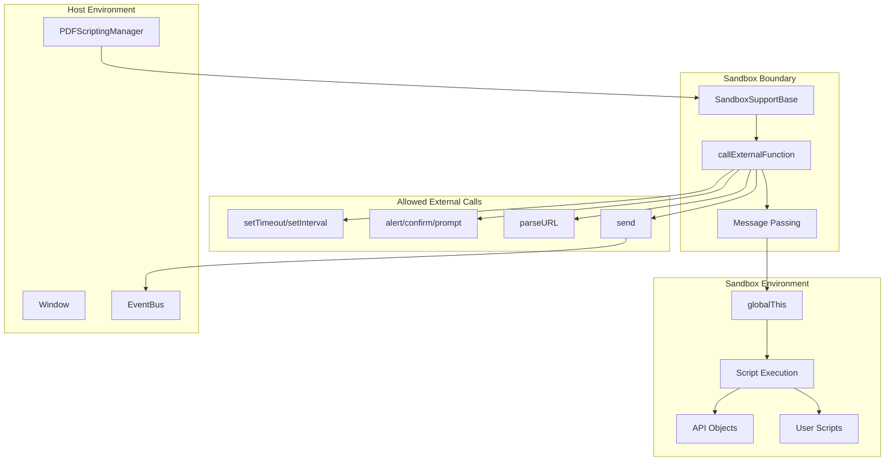
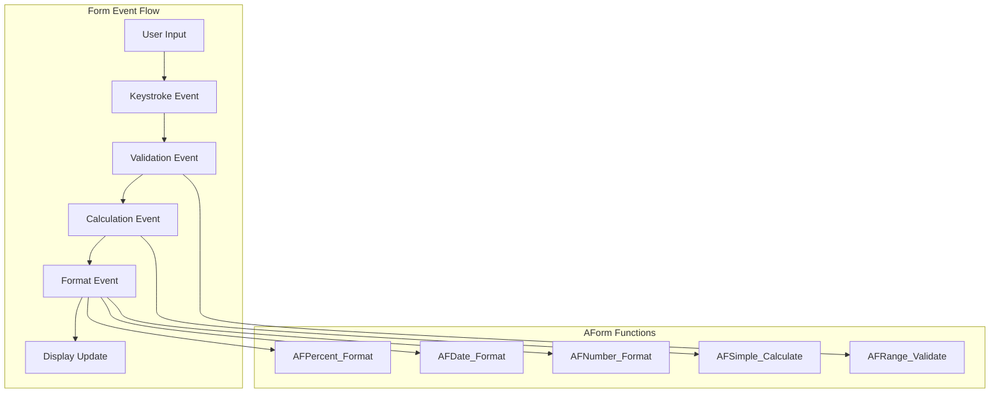
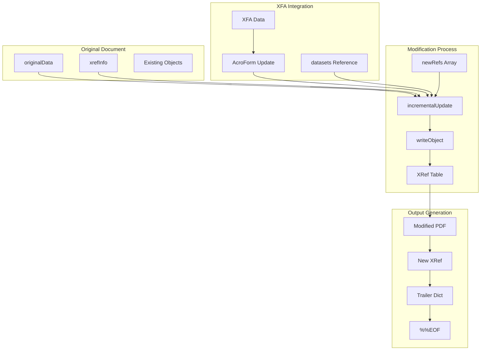
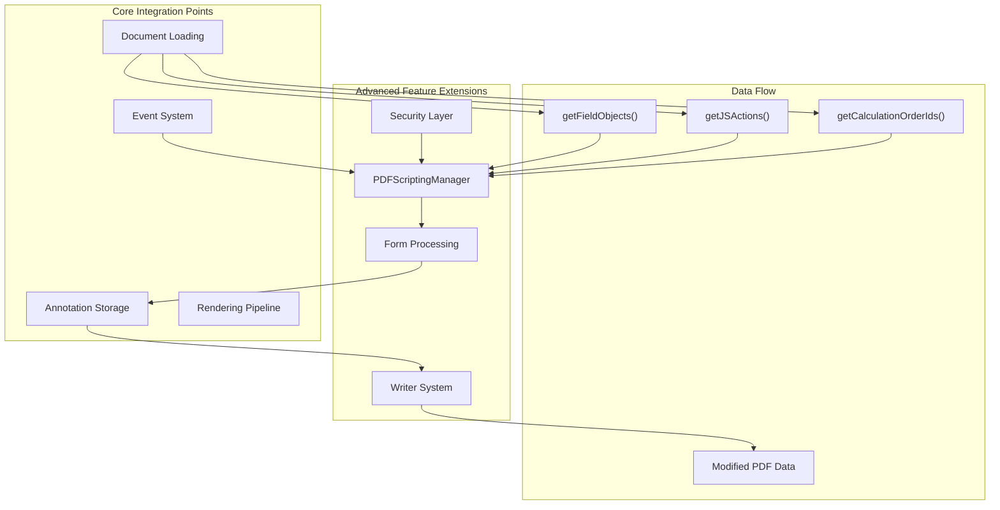

# Advanced Features

> **Relevant source files**
> * [extensions/firefox/content/PdfJsDefaultPreferences.sys.mjs](https://github.com/Mr-xzq/pdf.js-4.4.168/blob/19fbc899/extensions/firefox/content/PdfJsDefaultPreferences.sys.mjs)
> * [src/core/core_utils.js](https://github.com/Mr-xzq/pdf.js-4.4.168/blob/19fbc899/src/core/core_utils.js)
> * [src/core/writer.js](https://github.com/Mr-xzq/pdf.js-4.4.168/blob/19fbc899/src/core/writer.js)
> * [src/pdf.sandbox.external.js](https://github.com/Mr-xzq/pdf.js-4.4.168/blob/19fbc899/src/pdf.sandbox.external.js)
> * [src/scripting_api/aform.js](https://github.com/Mr-xzq/pdf.js-4.4.168/blob/19fbc899/src/scripting_api/aform.js)
> * [src/scripting_api/app.js](https://github.com/Mr-xzq/pdf.js-4.4.168/blob/19fbc899/src/scripting_api/app.js)
> * [src/scripting_api/doc.js](https://github.com/Mr-xzq/pdf.js-4.4.168/blob/19fbc899/src/scripting_api/doc.js)
> * [src/scripting_api/event.js](https://github.com/Mr-xzq/pdf.js-4.4.168/blob/19fbc899/src/scripting_api/event.js)
> * [src/scripting_api/field.js](https://github.com/Mr-xzq/pdf.js-4.4.168/blob/19fbc899/src/scripting_api/field.js)
> * [src/scripting_api/initialization.js](https://github.com/Mr-xzq/pdf.js-4.4.168/blob/19fbc899/src/scripting_api/initialization.js)
> * [src/scripting_api/proxy.js](https://github.com/Mr-xzq/pdf.js-4.4.168/blob/19fbc899/src/scripting_api/proxy.js)
> * [src/scripting_api/util.js](https://github.com/Mr-xzq/pdf.js-4.4.168/blob/19fbc899/src/scripting_api/util.js)
> * [test/unit/core_utils_spec.js](https://github.com/Mr-xzq/pdf.js-4.4.168/blob/19fbc899/test/unit/core_utils_spec.js)
> * [test/unit/scripting_spec.js](https://github.com/Mr-xzq/pdf.js-4.4.168/blob/19fbc899/test/unit/scripting_spec.js)
> * [test/unit/writer_spec.js](https://github.com/Mr-xzq/pdf.js-4.4.168/blob/19fbc899/test/unit/writer_spec.js)
> * [web/pdf_scripting_manager.js](https://github.com/Mr-xzq/pdf.js-4.4.168/blob/19fbc899/web/pdf_scripting_manager.js)

This document covers specialized PDF.js functionality designed for complex use cases that go beyond basic PDF viewing and rendering. These features enable advanced document interaction, scripting capabilities, and document modification workflows.

For basic PDF processing and rendering, see [Core PDF Processing Engine](/Mr-xzq/pdf.js-4.4.168/2-core-pdf-processing-engine). For web viewer functionality, see [Web Viewer Application](/Mr-xzq/pdf.js-4.4.168/3-web-viewer-application). For standard annotation handling, see [Annotation and Form Handling](/Mr-xzq/pdf.js-4.4.168/3.4-annotation-and-form-handling).

## PDF Scripting System Architecture

PDF.js includes a comprehensive JavaScript execution environment that enables interactive forms, document automation, and complex user interactions within PDF documents. The scripting system provides a sandboxed environment that closely mimics Adobe Acrobat's JavaScript API.

The scripting system operates through the `PDFScriptingManager` class, which coordinates between the main PDF.js application and a secure JavaScript sandbox environment. The sandbox contains a complete implementation of Adobe Acrobat's JavaScript API, enabling PDF documents to execute interactive scripts.

Sources: [web/pdf_scripting_manager.js L1-L498](https://github.com/Mr-xzq/pdf.js-4.4.168/blob/19fbc899/web/pdf_scripting_manager.js#L1-L498)

 [src/scripting_api/initialization.js L1-L224](https://github.com/Mr-xzq/pdf.js-4.4.168/blob/19fbc899/src/scripting_api/initialization.js#L1-L224)

 [src/pdf.sandbox.external.js L1-L187](https://github.com/Mr-xzq/pdf.js-4.4.168/blob/19fbc899/src/pdf.sandbox.external.js#L1-L187)

## Document Object Model

The scripting API provides a rich object model that mirrors Adobe Acrobat's JavaScript API, enabling comprehensive document and field manipulation.

The `Doc` object serves as the global context (`this`) within PDF scripts, providing access to document properties, field management, and calculation control. Field objects support complex interactions including value validation, formatting, and cross-field calculations.

Sources: [src/scripting_api/doc.js L1-L1027](https://github.com/Mr-xzq/pdf.js-4.4.168/blob/19fbc899/src/scripting_api/doc.js#L1-L1027)

 [src/scripting_api/field.js L1-L697](https://github.com/Mr-xzq/pdf.js-4.4.168/blob/19fbc899/src/scripting_api/field.js#L1-L697)

 [src/scripting_api/event.js L1-L388](https://github.com/Mr-xzq/pdf.js-4.4.168/blob/19fbc899/src/scripting_api/event.js#L1-L388)

## Sandbox Security and Communication

PDF.js implements a secure sandbox environment for script execution, preventing malicious scripts from accessing the host environment while maintaining compatibility with legitimate PDF functionality.

The sandbox provides controlled access to external functionality through the `SandboxSupportBase` class and `callExternalFunction` interface. Only specific, safe operations like DOM manipulation and event dispatching are permitted across the sandbox boundary.

Sources: [src/pdf.sandbox.external.js L19-L187](https://github.com/Mr-xzq/pdf.js-4.4.168/blob/19fbc899/src/pdf.sandbox.external.js#L19-L187)

 [web/pdf_scripting_manager.js L281-L379](https://github.com/Mr-xzq/pdf.js-4.4.168/blob/19fbc899/web/pdf_scripting_manager.js#L281-L379)

 [src/scripting_api/initialization.js L40-L221](https://github.com/Mr-xzq/pdf.js-4.4.168/blob/19fbc899/src/scripting_api/initialization.js#L40-L221)

## Advanced Form Processing

PDF.js supports complex form processing including AcroForm fields with JavaScript actions, XFA forms, and advanced field validation and formatting.

| Feature | Implementation | Key Classes |
| --- | --- | --- |
| Field Events | Keystroke, Validate, Calculate, Format | `EventDispatcher`, `Event` |
| AcroForm Functions | AF_Number_Format, AF_Date_Format, etc. | `AForm` |
| Field Types | Text, Choice, Button, Radio, Checkbox | `Field`, `RadioButtonField`, `CheckboxField` |
| XFA Support | XML Forms Architecture parsing | XFA processing in core |
| Calculation Order | Dependency-based field calculations | `calculationOrder` array |

The AForm system provides Adobe-compatible field formatting and validation functions, enabling complex form behaviors like number formatting, date validation, and cross-field calculations.

Sources: [src/scripting_api/aform.js L1-L628](https://github.com/Mr-xzq/pdf.js-4.4.168/blob/19fbc899/src/scripting_api/aform.js#L1-L628)

 [src/scripting_api/event.js L154-L384](https://github.com/Mr-xzq/pdf.js-4.4.168/blob/19fbc899/src/scripting_api/event.js#L154-L384)

 [test/unit/scripting_spec.js L1-L1483](https://github.com/Mr-xzq/pdf.js-4.4.168/blob/19fbc899/test/unit/scripting_spec.js#L1-L1483)

## Document Modification and Writing

PDF.js includes capabilities for modifying existing PDF documents and writing new content through incremental updates, maintaining compatibility with the PDF specification.

The `incrementalUpdate` function enables non-destructive PDF modification by appending new objects and cross-reference entries to existing documents. This approach maintains document integrity while supporting form data updates and annotation additions.

Sources: [src/core/writer.js L403-L477](https://github.com/Mr-xzq/pdf.js-4.4.168/blob/19fbc899/src/core/writer.js#L403-L477)

 [src/core/writer.js L30-L154](https://github.com/Mr-xzq/pdf.js-4.4.168/blob/19fbc899/src/core/writer.js#L30-L154)

 [test/unit/writer_spec.js L23-L317](https://github.com/Mr-xzq/pdf.js-4.4.168/blob/19fbc899/test/unit/writer_spec.js#L23-L317)

## Advanced Utility Functions

PDF.js provides specialized utility functions for complex PDF processing scenarios, including security-aware URL handling, encoding conversions, and XFA path processing.

| Utility Category | Functions | Purpose |
| --- | --- | --- |
| String Processing | `escapePDFName`, `escapeString`, `encodeToXmlString` | Safe PDF content generation |
| Encoding | `stringToUTF16String`, `stringToUTF16HexString` | Character encoding conversion |
| XFA Processing | `parseXFAPath`, `writeXFADataForAcroform` | XML Forms Architecture support |
| Security | `recoverJsURL`, `validateCSSFont` | Safe content handling |
| Numeric | `toRomanNumerals`, `numberToString`, `getSizeInBytes` | Specialized formatting |

```mermaid
flowchart TD

InputString["Input String"]
Validation["validateCSSFont"]
Escaping["escapePDFName"]
SafeOutput["Safe Output"]
XFAPath["XFA Field Path"]
PathParsing["parseXFAPath"]
NodeSearch["Node Search"]
DataUpdate["Data Update"]
JSCode["JavaScript Code"]
URLPattern["URL Pattern Matching"]
RecoveredURL["Recovered URL"]
SecurityCheck["Security Validation"]

subgraph subGraph2 ["String Safety"]
    InputString
    Validation
    Escaping
    SafeOutput
    InputString --> Validation
    InputString --> Escaping
    Validation --> SafeOutput
    Escaping --> SafeOutput
end

subgraph subGraph1 ["XFA Processing"]
    XFAPath
    PathParsing
    NodeSearch
    DataUpdate
    XFAPath --> PathParsing
    PathParsing --> NodeSearch
    NodeSearch --> DataUpdate
end

subgraph subGraph0 ["URL Processing"]
    JSCode
    URLPattern
    RecoveredURL
    SecurityCheck
    JSCode --> URLPattern
    URLPattern --> RecoveredURL
    RecoveredURL --> SecurityCheck
end
```

The `recoverJsURL` function safely extracts URLs from JavaScript code using whitelisted patterns, while XFA path processing enables navigation of complex form hierarchies. String validation and escaping functions ensure generated PDF content meets specification requirements.

Sources: [src/core/core_utils.js L550-L576](https://github.com/Mr-xzq/pdf.js-4.4.168/blob/19fbc899/src/core/core_utils.js#L550-L576)

 [src/core/core_utils.js L276-L285](https://github.com/Mr-xzq/pdf.js-4.4.168/blob/19fbc899/src/core/core_utils.js#L276-L285)

 [src/core/core_utils.js L483-L548](https://github.com/Mr-xzq/pdf.js-4.4.168/blob/19fbc899/src/core/core_utils.js#L483-L548)

 [test/unit/core_utils_spec.js L244-L327](https://github.com/Mr-xzq/pdf.js-4.4.168/blob/19fbc899/test/unit/core_utils_spec.js#L244-L327)

## Integration with PDF.js Core

Advanced features integrate seamlessly with PDF.js core systems, extending basic functionality while maintaining architectural consistency.

Advanced features leverage core PDF.js APIs for document access while providing enhanced functionality. The scripting system receives form field definitions and JavaScript actions from the core document loader, while the writer system can serialize modified form data back to PDF format.

Sources: [web/pdf_scripting_manager.js L82-L216](https://github.com/Mr-xzq/pdf.js-4.4.168/blob/19fbc899/web/pdf_scripting_manager.js#L82-L216)

 [src/core/core_utils.js L595-L614](https://github.com/Mr-xzq/pdf.js-4.4.168/blob/19fbc899/src/core/core_utils.js#L595-L614)

 [src/core/writer.js L219-L258](https://github.com/Mr-xzq/pdf.js-4.4.168/blob/19fbc899/src/core/writer.js#L219-L258)