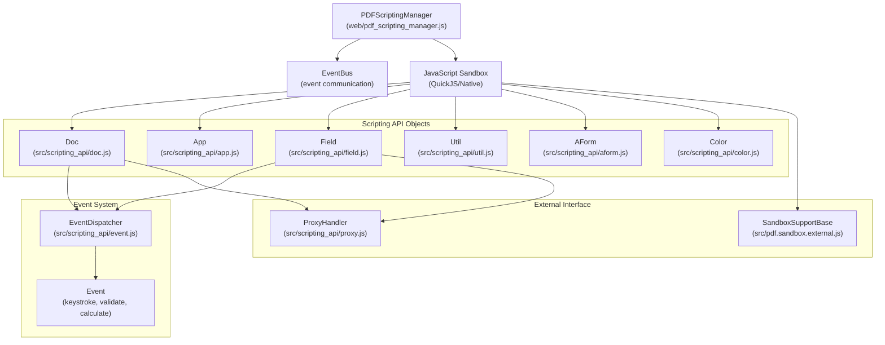
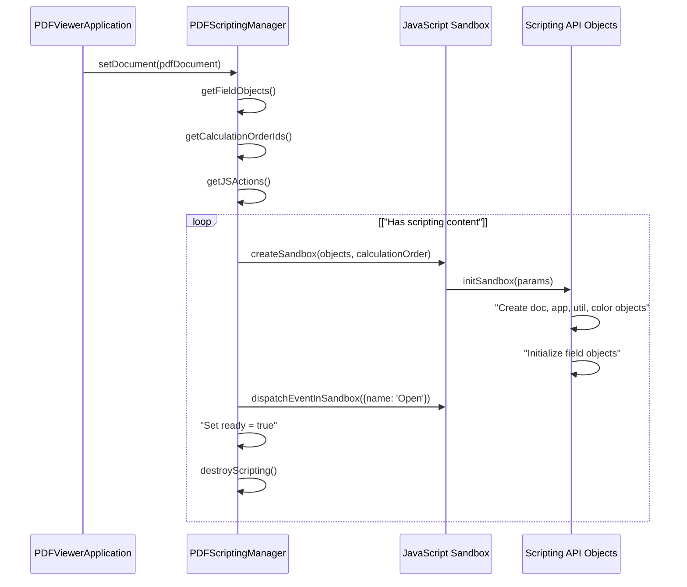
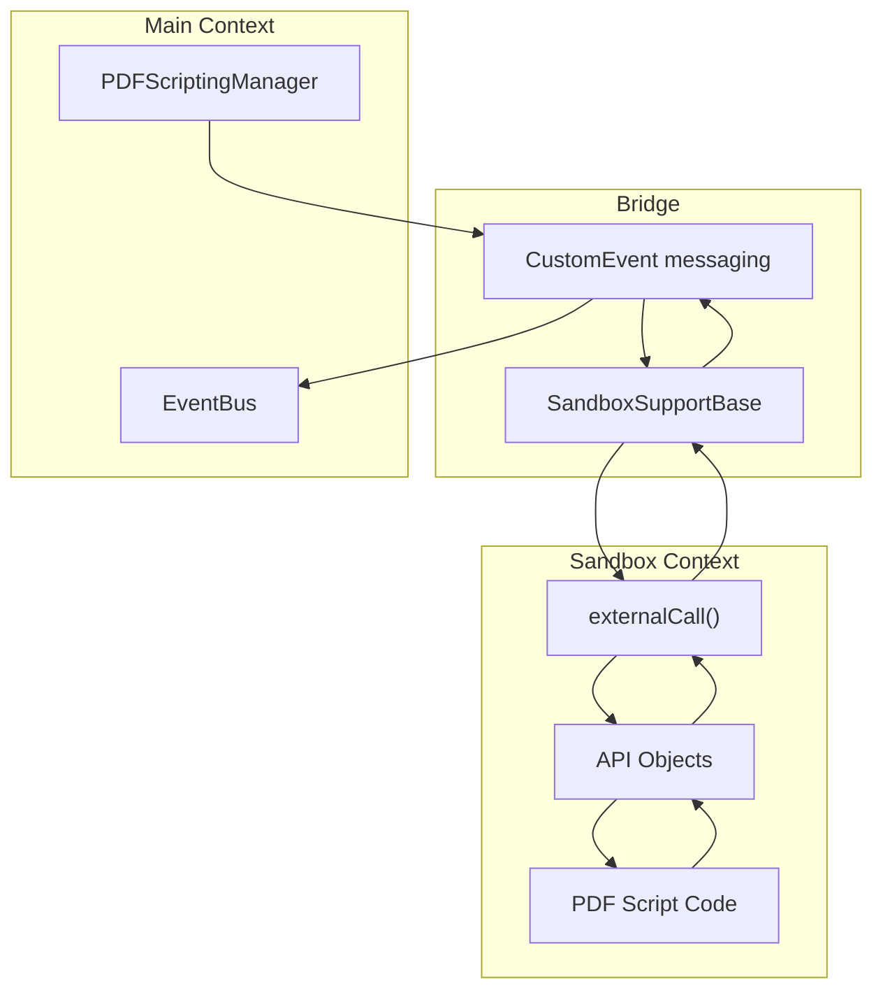
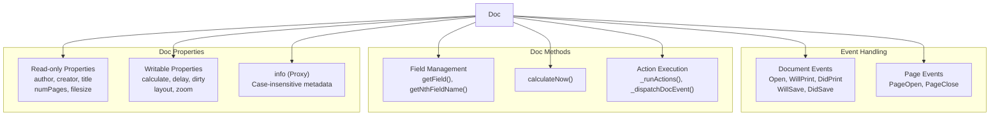
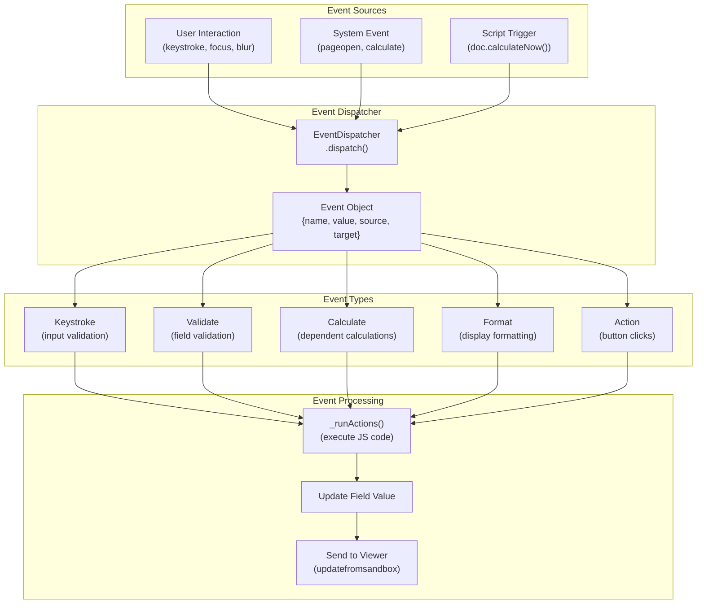
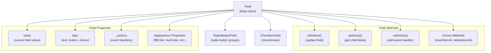

# PDF Scripting System

> **Relevant source files**
> * [extensions/firefox/content/PdfJsDefaultPreferences.sys.mjs](https://github.com/Mr-xzq/pdf.js-4.4.168/blob/19fbc899/extensions/firefox/content/PdfJsDefaultPreferences.sys.mjs)
> * [src/pdf.sandbox.external.js](https://github.com/Mr-xzq/pdf.js-4.4.168/blob/19fbc899/src/pdf.sandbox.external.js)
> * [src/scripting_api/aform.js](https://github.com/Mr-xzq/pdf.js-4.4.168/blob/19fbc899/src/scripting_api/aform.js)
> * [src/scripting_api/app.js](https://github.com/Mr-xzq/pdf.js-4.4.168/blob/19fbc899/src/scripting_api/app.js)
> * [src/scripting_api/doc.js](https://github.com/Mr-xzq/pdf.js-4.4.168/blob/19fbc899/src/scripting_api/doc.js)
> * [src/scripting_api/event.js](https://github.com/Mr-xzq/pdf.js-4.4.168/blob/19fbc899/src/scripting_api/event.js)
> * [src/scripting_api/field.js](https://github.com/Mr-xzq/pdf.js-4.4.168/blob/19fbc899/src/scripting_api/field.js)
> * [src/scripting_api/initialization.js](https://github.com/Mr-xzq/pdf.js-4.4.168/blob/19fbc899/src/scripting_api/initialization.js)
> * [src/scripting_api/proxy.js](https://github.com/Mr-xzq/pdf.js-4.4.168/blob/19fbc899/src/scripting_api/proxy.js)
> * [src/scripting_api/util.js](https://github.com/Mr-xzq/pdf.js-4.4.168/blob/19fbc899/src/scripting_api/util.js)
> * [test/unit/scripting_spec.js](https://github.com/Mr-xzq/pdf.js-4.4.168/blob/19fbc899/test/unit/scripting_spec.js)
> * [web/pdf_scripting_manager.js](https://github.com/Mr-xzq/pdf.js-4.4.168/blob/19fbc899/web/pdf_scripting_manager.js)

## Purpose and Scope

The PDF Scripting System enables execution of JavaScript code embedded within PDF documents, providing form automation, field validation, and interactive document behavior. This system implements a subset of Adobe Acrobat's JavaScript API to ensure compatibility with existing PDF forms and interactive documents.

For information about the broader PDF processing engine, see [Core PDF Processing Engine](/Mr-xzq/pdf.js-4.4.168/2-core-pdf-processing-engine). For details about form rendering and interaction, see [Annotation and Form Handling](/Mr-xzq/pdf.js-4.4.168/3.4-annotation-and-form-handling).

## Architecture Overview

The PDF Scripting System operates through a sandboxed JavaScript environment that isolates PDF scripts from the main browser context while providing a controlled API surface that mimics Adobe Acrobat's scripting capabilities.

### Core Components Architecture

Sources: [web/pdf_scripting_manager.js L1-L498](https://github.com/Mr-xzq/pdf.js-4.4.168/blob/19fbc899/web/pdf_scripting_manager.js#L1-L498)

 [src/scripting_api/initialization.js L40-L221](https://github.com/Mr-xzq/pdf.js-4.4.168/blob/19fbc899/src/scripting_api/initialization.js#L40-L221)

 [src/scripting_api/event.js L46-L385](https://github.com/Mr-xzq/pdf.js-4.4.168/blob/19fbc899/src/scripting_api/event.js#L46-L385)

### Scripting Manager Lifecycle

Sources: [web/pdf_scripting_manager.js L82-L216](https://github.com/Mr-xzq/pdf.js-4.4.168/blob/19fbc899/web/pdf_scripting_manager.js#L82-L216)

 [src/scripting_api/initialization.js L40-L75](https://github.com/Mr-xzq/pdf.js-4.4.168/blob/19fbc899/src/scripting_api/initialization.js#L40-L75)

## Sandbox Environment

The scripting system runs JavaScript code in an isolated sandbox environment to prevent security vulnerabilities while maintaining compatibility with PDF scripting standards.

### Sandbox Initialization

The sandbox is initialized through the `initSandbox` function which creates a controlled global environment:

| Global Object | Purpose | Implementation |
| --- | --- | --- |
| `doc` | Document manipulation and properties | [src/scripting_api/doc.js](https://github.com/Mr-xzq/pdf.js-4.4.168/blob/19fbc899/src/scripting_api/doc.js) |
| `app` | Application-level functions | [src/scripting_api/app.js](https://github.com/Mr-xzq/pdf.js-4.4.168/blob/19fbc899/src/scripting_api/app.js) |
| `util` | Utility functions for formatting/parsing | [src/scripting_api/util.js](https://github.com/Mr-xzq/pdf.js-4.4.168/blob/19fbc899/src/scripting_api/util.js) |
| `color` | Color manipulation functions | [src/scripting_api/color.js](https://github.com/Mr-xzq/pdf.js-4.4.168/blob/19fbc899/src/scripting_api/color.js) |
| `console` | Logging and debugging | [src/scripting_api/console.js](https://github.com/Mr-xzq/pdf.js-4.4.168/blob/19fbc899/src/scripting_api/console.js) |
| `event` | Current event context | [src/scripting_api/event.js](https://github.com/Mr-xzq/pdf.js-4.4.168/blob/19fbc899/src/scripting_api/event.js) |

The sandbox also includes form automation functions prefixed with `AF` (AcroForm functions) such as `AFNumber_Format`, `AFDate_Format`, etc.

Sources: [src/scripting_api/initialization.js L137-L175](https://github.com/Mr-xzq/pdf.js-4.4.168/blob/19fbc899/src/scripting_api/initialization.js#L137-L175)

 [src/scripting_api/aform.js L18-L703](https://github.com/Mr-xzq/pdf.js-4.4.168/blob/19fbc899/src/scripting_api/aform.js#L18-L703)

### External Communication

Sources: [src/pdf.sandbox.external.js L19-L186](https://github.com/Mr-xzq/pdf.js-4.4.168/blob/19fbc899/src/pdf.sandbox.external.js#L19-L186)

 [web/pdf_scripting_manager.js L118-L133](https://github.com/Mr-xzq/pdf.js-4.4.168/blob/19fbc899/web/pdf_scripting_manager.js#L118-L133)

## Document API Objects

### Doc Object

The `Doc` class provides the primary interface for document-level operations and properties:

Sources: [src/scripting_api/doc.js L34-L1082](https://github.com/Mr-xzq/pdf.js-4.4.168/blob/19fbc899/src/scripting_api/doc.js#L34-L1082)

 [src/scripting_api/doc.js L130-L174](https://github.com/Mr-xzq/pdf.js-4.4.168/blob/19fbc899/src/scripting_api/doc.js#L130-L174)

### App Object

The `App` class provides application-level functionality and system information:

Key properties include `language`, `platform`, `viewerVersion`, and methods like `alert()`, `execMenuItem()`, `setTimeOut()`.

Sources: [src/scripting_api/app.js L29-L687](https://github.com/Mr-xzq/pdf.js-4.4.168/blob/19fbc899/src/scripting_api/app.js#L29-L687)

 [src/scripting_api/app.js L432-L521](https://github.com/Mr-xzq/pdf.js-4.4.168/blob/19fbc899/src/scripting_api/app.js#L432-L521)

## Event System

### Event Processing Pipeline

Sources: [src/scripting_api/event.js L83-L239](https://github.com/Mr-xzq/pdf.js-4.4.168/blob/19fbc899/src/scripting_api/event.js#L83-L239)

 [src/scripting_api/event.js L283-L384](https://github.com/Mr-xzq/pdf.js-4.4.168/blob/19fbc899/src/scripting_api/event.js#L283-L384)

### Event Flow for Field Validation

When a user interacts with a form field, the following event sequence occurs:

1. **Keystroke Event** - Validates input as user types
2. **Validate Event** - Validates complete field value on commit
3. **Calculate Events** - Updates dependent fields
4. **Format Event** - Applies display formatting

Sources: [src/scripting_api/event.js L154-L239](https://github.com/Mr-xzq/pdf.js-4.4.168/blob/19fbc899/src/scripting_api/event.js#L154-L239)

 [src/scripting_api/event.js L250-L282](https://github.com/Mr-xzq/pdf.js-4.4.168/blob/19fbc899/src/scripting_api/event.js#L250-L282)

## Form Automation (AForm)

The AForm system provides Adobe Acrobat-compatible form field automation functions:

### Format Functions

| Function | Purpose | Parameters |
| --- | --- | --- |
| `AFNumber_Format` | Number formatting with currency | nDec, sepStyle, negStyle, currStyle, strCurrency, bCurrencyPrepend |
| `AFPercent_Format` | Percentage formatting | nDec, sepStyle, percentPrepend |
| `AFDate_Format` | Date formatting | pdf (format index) |
| `AFSpecial_Format` | Special formats (ZIP, phone, SSN) | psf (format index) |

### Validation Functions

| Function | Purpose |
| --- | --- |
| `AFNumber_Keystroke` | Validates numeric input |
| `AFDate_KeystrokeEx` | Validates date input with custom format |
| `AFRange_Validate` | Validates value within specified range |
| `AFSpecial_KeystrokeEx` | Validates input against character mask |

### Calculation Functions

| Function | Purpose |
| --- | --- |
| `AFSimple_Calculate` | Performs calculations (SUM, AVG, MIN, MAX, PRD) on field arrays |
| `AFExtractNums` | Extracts numeric values from strings |
| `AFMakeNumber` | Converts strings to numbers |

Sources: [src/scripting_api/aform.js L229-L530](https://github.com/Mr-xzq/pdf.js-4.4.168/blob/19fbc899/src/scripting_api/aform.js#L229-L530)

 [test/unit/scripting_spec.js L213-L1223](https://github.com/Mr-xzq/pdf.js-4.4.168/blob/19fbc899/test/unit/scripting_spec.js#L213-L1223)

## Field Objects

### Field Class Hierarchy

Sources: [src/scripting_api/field.js L20-L696](https://github.com/Mr-xzq/pdf.js-4.4.168/blob/19fbc899/src/scripting_api/field.js#L20-L696)

 [src/scripting_api/field.js L569-L654](https://github.com/Mr-xzq/pdf.js-4.4.168/blob/19fbc899/src/scripting_api/field.js#L569-L654)

### ProxyHandler System

The `ProxyHandler` class enables JavaScript property access while maintaining synchronization with the PDF viewer:

* Intercepts property access to field objects
* Handles property expansion for script-added properties
* Manages field value synchronization via `_send()` method
* Prevents access to private properties (those starting with `_`)

Sources: [src/scripting_api/proxy.js L16-L139](https://github.com/Mr-xzq/pdf.js-4.4.168/blob/19fbc899/src/scripting_api/proxy.js#L16-L139)

 [src/scripting_api/proxy.js L47-L80](https://github.com/Mr-xzq/pdf.js-4.4.168/blob/19fbc899/src/scripting_api/proxy.js#L47-L80)

## Security and Isolation

### Sandbox Security Model

The scripting system implements several security layers:

1. **Isolated Execution Context** - Scripts run in a separate JavaScript context
2. **Controlled API Surface** - Only approved functions and objects are exposed
3. **User Activation Required** - Certain operations require user interaction
4. **External Call Filtering** - All external communications are filtered

### User Activation System

Many sensitive operations require user activation to prevent abuse:

* Document printing (`doc.print`)
* Save operations (`app.execMenuItem("SaveAs")`)
* Alert dialogs (`app.alert`)
* Navigation changes (`doc.pageNum`, `doc.zoom`)

User activation is granted during user interactions and expires after a timeout.

Sources: [src/scripting_api/app_utils.js L17-L19](https://github.com/Mr-xzq/pdf.js-4.4.168/blob/19fbc899/src/scripting_api/app_utils.js#L17-L19)

 [src/scripting_api/event.js L75-L81](https://github.com/Mr-xzq/pdf.js-4.4.168/blob/19fbc899/src/scripting_api/event.js#L75-L81)

 [src/scripting_api/doc.js L430-L434](https://github.com/Mr-xzq/pdf.js-4.4.168/blob/19fbc899/src/scripting_api/doc.js#L430-L434)

## Testing Infrastructure

The scripting system includes comprehensive unit tests that verify:

* Sandbox creation and initialization
* Field value manipulation and validation
* Event dispatch and handling
* AForm function compatibility
* Color conversion utilities
* Date/time formatting functions

Test cases use a mock sandbox environment to validate scripting behavior without requiring a full PDF.js runtime.

Sources: [test/unit/scripting_spec.js L18-L127](https://github.com/Mr-xzq/pdf.js-4.4.168/blob/19fbc899/test/unit/scripting_spec.js#L18-L127)

 [test/unit/scripting_spec.js L315-L578](https://github.com/Mr-xzq/pdf.js-4.4.168/blob/19fbc899/test/unit/scripting_spec.js#L315-L578)