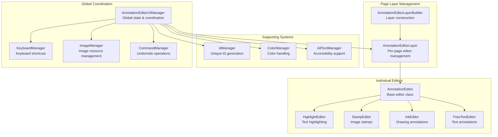
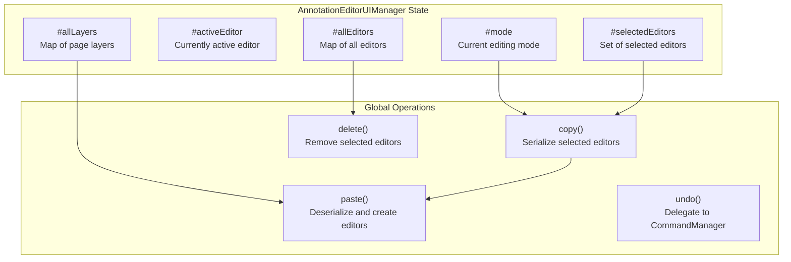
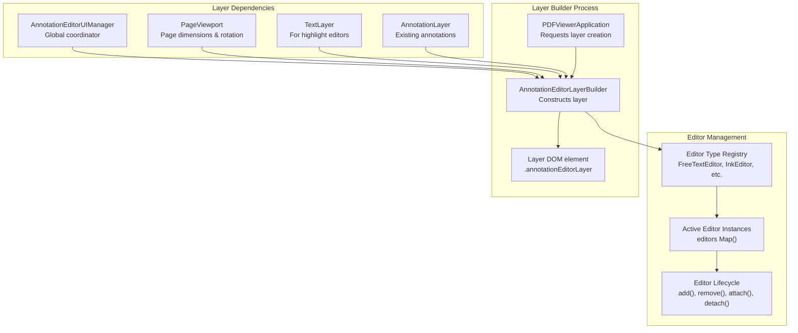
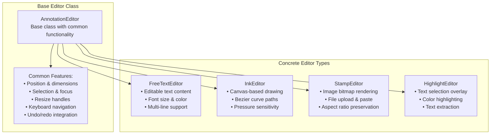
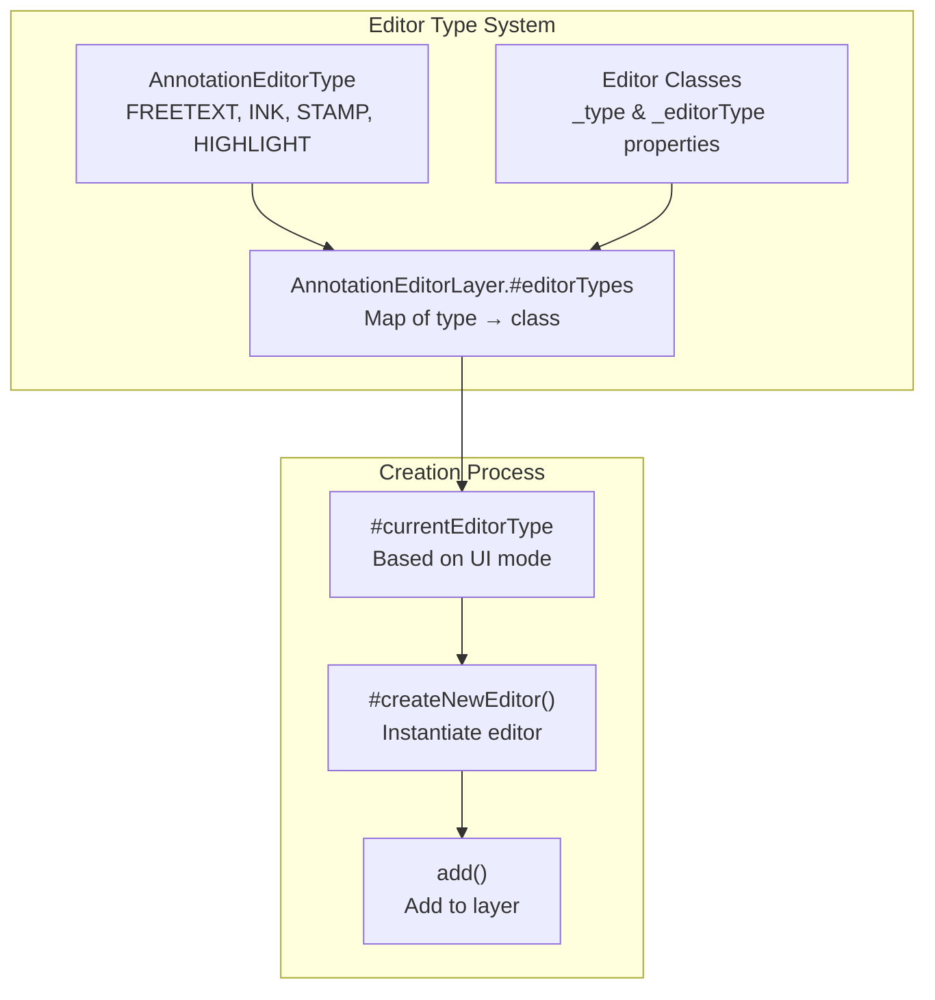
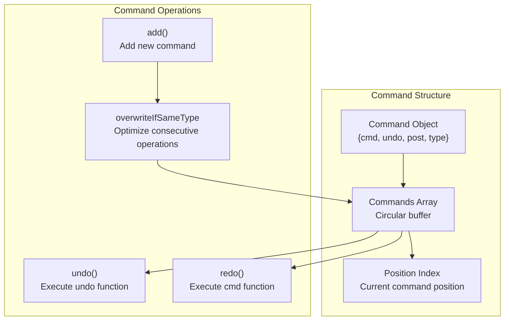
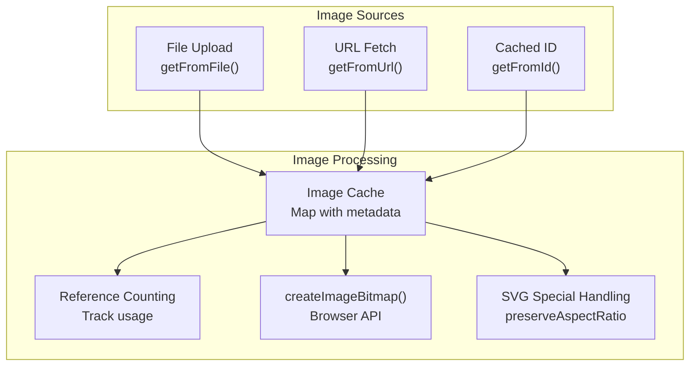

# Editor Architecture

> **Relevant source files**
> * [src/display/editor/annotation_editor_layer.js](https://github.com/Mr-xzq/pdf.js-4.4.168/blob/19fbc899/src/display/editor/annotation_editor_layer.js)
> * [src/display/editor/editor.js](https://github.com/Mr-xzq/pdf.js-4.4.168/blob/19fbc899/src/display/editor/editor.js)
> * [src/display/editor/freetext.js](https://github.com/Mr-xzq/pdf.js-4.4.168/blob/19fbc899/src/display/editor/freetext.js)
> * [src/display/editor/ink.js](https://github.com/Mr-xzq/pdf.js-4.4.168/blob/19fbc899/src/display/editor/ink.js)
> * [src/display/editor/stamp.js](https://github.com/Mr-xzq/pdf.js-4.4.168/blob/19fbc899/src/display/editor/stamp.js)
> * [src/display/editor/tools.js](https://github.com/Mr-xzq/pdf.js-4.4.168/blob/19fbc899/src/display/editor/tools.js)
> * [test/pdfs/issue16278.pdf](https://github.com/Mr-xzq/pdf.js-4.4.168/blob/19fbc899/test/pdfs/issue16278.pdf)
> * [web/alt_text_manager.js](https://github.com/Mr-xzq/pdf.js-4.4.168/blob/19fbc899/web/alt_text_manager.js)
> * [web/annotation_editor_layer_builder.css](https://github.com/Mr-xzq/pdf.js-4.4.168/blob/19fbc899/web/annotation_editor_layer_builder.css)
> * [web/annotation_editor_layer_builder.js](https://github.com/Mr-xzq/pdf.js-4.4.168/blob/19fbc899/web/annotation_editor_layer_builder.js)

## Purpose and Scope

This document covers the annotation editor system architecture in PDF.js, which enables users to create, edit, and manage interactive annotations including freetext, ink drawings, stamps, and highlights directly on PDF pages. The editor system provides a complete annotation authoring experience with undo/redo, keyboard navigation, accessibility support, and platform integration.

For information about the overall web viewer integration, see [Web Viewer Application](/Mr-xzq/pdf.js-4.4.168/3-web-viewer-application). For details about PDF content rendering that editors overlay, see [Page Rendering System](/Mr-xzq/pdf.js-4.4.168/3.3-page-rendering-system).

## Core Architecture Overview

The annotation editor system follows a hierarchical architecture with a global UI manager coordinating page-level layers that contain individual editor instances.



Sources: [src/display/editor/tools.js L536-L1400](https://github.com/Mr-xzq/pdf.js-4.4.168/blob/19fbc899/src/display/editor/tools.js#L536-L1400)

 [src/display/editor/annotation_editor_layer.js L57-L127](https://github.com/Mr-xzq/pdf.js-4.4.168/blob/19fbc899/src/display/editor/annotation_editor_layer.js#L57-L127)

 [src/display/editor/editor.js L42-L178](https://github.com/Mr-xzq/pdf.js-4.4.168/blob/19fbc899/src/display/editor/editor.js#L42-L178)

## UI Management System

The `AnnotationEditorUIManager` serves as the central coordinator for all annotation editing functionality. It maintains global state, handles cross-page operations, and coordinates between different editor types.

### Key Responsibilities

| Component | Purpose | Key Methods |
| --- | --- | --- |
| Mode Management | Controls editing modes (NONE, FREETEXT, INK, STAMP, HIGHLIGHT) | `updateMode()`, `getMode()` |
| Selection Management | Tracks selected editors across pages | `setSelected()`, `selectAll()`, `unselectAll()` |
| Event Coordination | Handles global keyboard shortcuts and events | `keydown()`, `copy()`, `paste()` |
| Layer Registration | Manages `AnnotationEditorLayer` instances | `addLayer()`, `removeLayer()` |



Sources: [src/display/editor/tools.js L536-L817](https://github.com/Mr-xzq/pdf.js-4.4.168/blob/19fbc899/src/display/editor/tools.js#L536-L817)

 [src/display/editor/tools.js L1243-L1336](https://github.com/Mr-xzq/pdf.js-4.4.168/blob/19fbc899/src/display/editor/tools.js#L1243-L1336)

## Layer Management

Each PDF page has an associated `AnnotationEditorLayer` that manages editors specific to that page. The layer handles editor lifecycle, coordinates with the underlying PDF page, and manages editor positioning and rendering.

### Layer Creation and Management



Sources: [web/annotation_editor_layer_builder.js L42-L121](https://github.com/Mr-xzq/pdf.js-4.4.168/blob/19fbc899/web/annotation_editor_layer_builder.js#L42-L121)

 [src/display/editor/annotation_editor_layer.js L96-L126](https://github.com/Mr-xzq/pdf.js-4.4.168/blob/19fbc899/src/display/editor/annotation_editor_layer.js#L96-L126)

 [src/display/editor/annotation_editor_layer.js L506-L525](https://github.com/Mr-xzq/pdf.js-4.4.168/blob/19fbc899/src/display/editor/annotation_editor_layer.js#L506-L525)

## Editor Types and Hierarchy

All editors inherit from the base `AnnotationEditor` class, which provides common functionality for positioning, selection, resizing, and lifecycle management.

### Editor Class Hierarchy



### Editor Type Registration



Sources: [src/display/editor/editor.js L42-L178](https://github.com/Mr-xzq/pdf.js-4.4.168/blob/19fbc899/src/display/editor/editor.js#L42-L178)

 [src/display/editor/annotation_editor_layer.js L86-L91](https://github.com/Mr-xzq/pdf.js-4.4.168/blob/19fbc899/src/display/editor/annotation_editor_layer.js#L86-L91)

 [src/display/editor/annotation_editor_layer.js L599-L614](https://github.com/Mr-xzq/pdf.js-4.4.168/blob/19fbc899/src/display/editor/annotation_editor_layer.js#L599-L614)

## Supporting Systems

The editor architecture includes several specialized manager classes that handle specific concerns across the editing system.

### Command Management

The `CommandManager` implements the Command pattern for undo/redo functionality:



### Image Management

The `ImageManager` handles image resources with caching and reference counting:



Sources: [src/display/editor/tools.js L239-L374](https://github.com/Mr-xzq/pdf.js-4.4.168/blob/19fbc899/src/display/editor/tools.js#L239-L374)

 [src/display/editor/tools.js L86-L231](https://github.com/Mr-xzq/pdf.js-4.4.168/blob/19fbc899/src/display/editor/tools.js#L86-L231)

## Interaction Flow

User interactions flow through multiple layers of the system, from DOM events to editor modifications and persistence.

### Event Flow Architecture

```

```

### Mode Switching Flow

```

```

Sources: [src/display/editor/annotation_editor_layer.js L150-L187](https://github.com/Mr-xzq/pdf.js-4.4.168/blob/19fbc899/src/display/editor/annotation_editor_layer.js#L150-L187)

 [src/display/editor/tools.js L1342-L1464](https://github.com/Mr-xzq/pdf.js-4.4.168/blob/19fbc899/src/display/editor/tools.js#L1342-L1464)