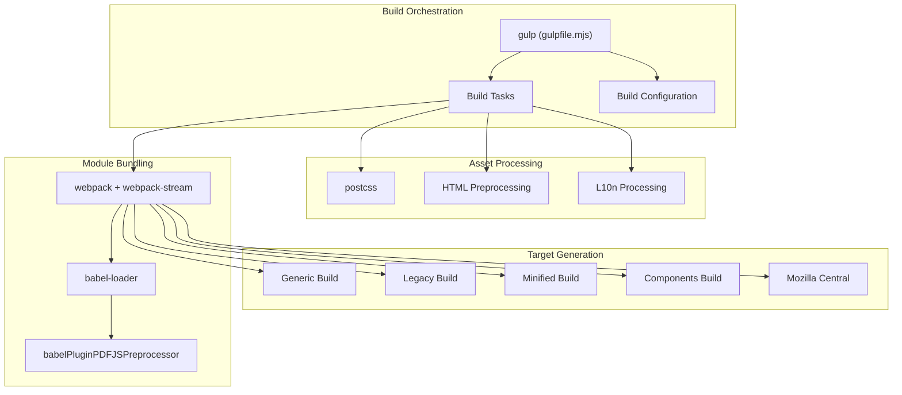
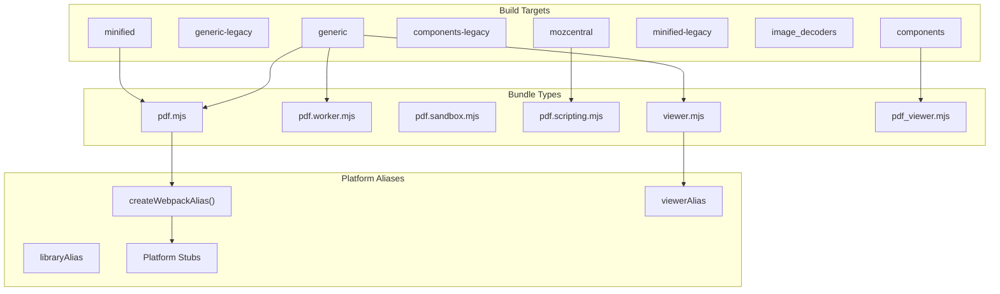
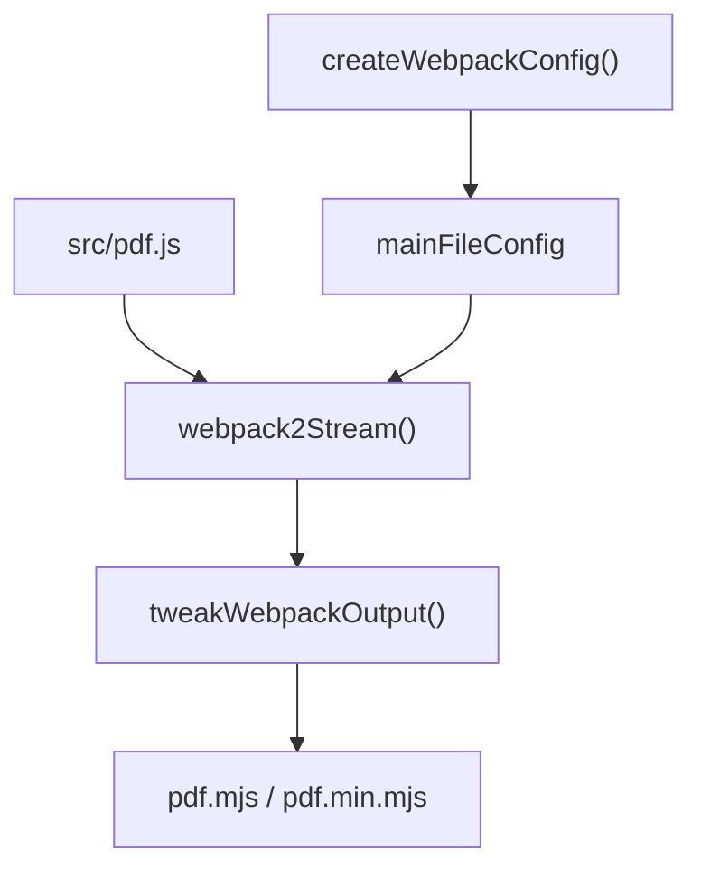
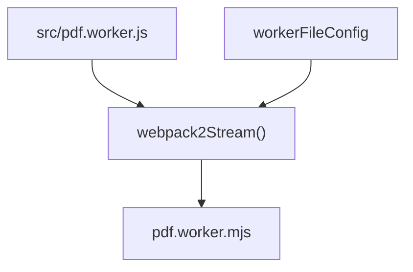
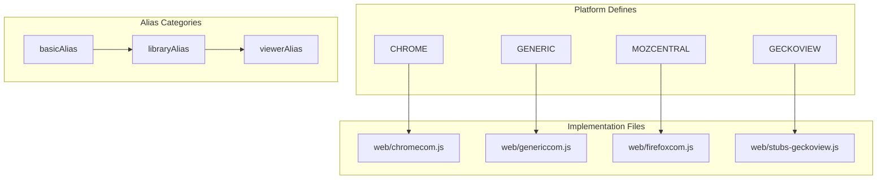
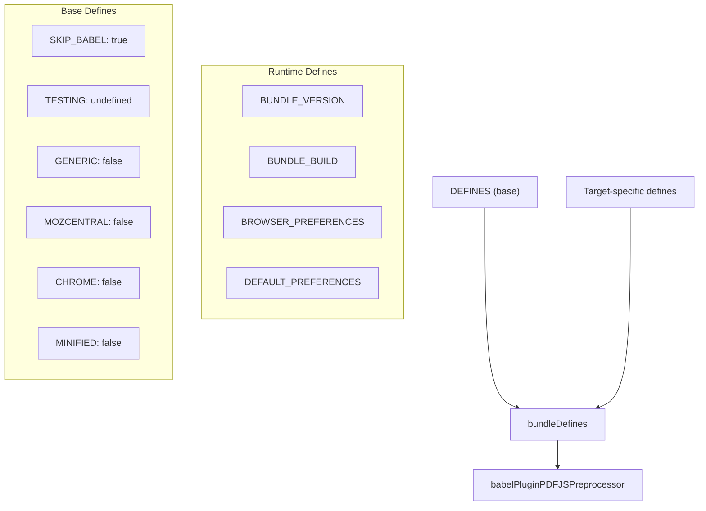
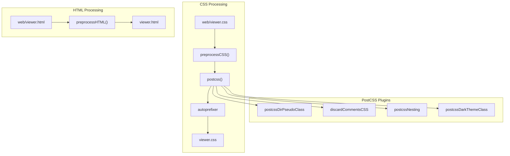
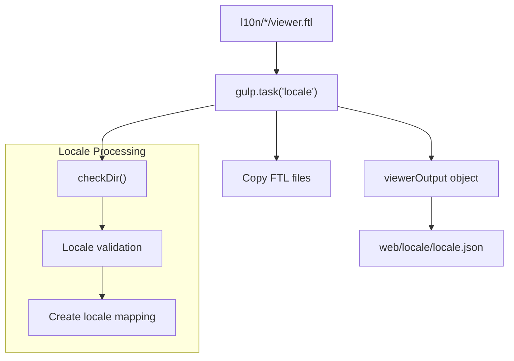
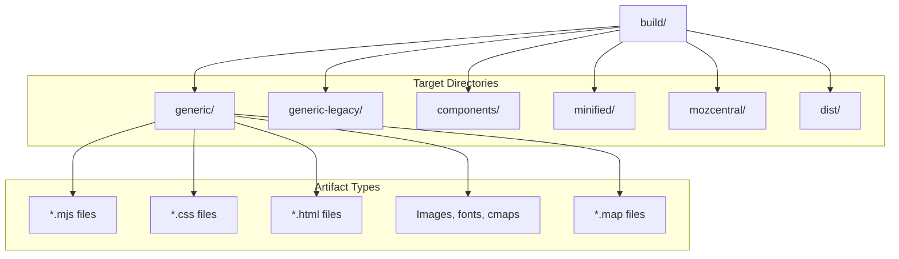
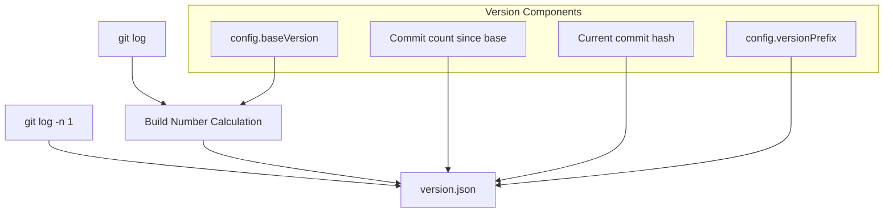

# Build System and Distribution

> **Relevant source files**
> * [.eslintrc](https://github.com/Mr-xzq/pdf.js-4.4.168/blob/19fbc899/.eslintrc)
> * [gulpfile.mjs](https://github.com/Mr-xzq/pdf.js-4.4.168/blob/19fbc899/gulpfile.mjs)
> * [package-lock.json](https://github.com/Mr-xzq/pdf.js-4.4.168/blob/19fbc899/package-lock.json)
> * [package.json](https://github.com/Mr-xzq/pdf.js-4.4.168/blob/19fbc899/package.json)
> * [tsconfig.json](https://github.com/Mr-xzq/pdf.js-4.4.168/blob/19fbc899/tsconfig.json)

This document covers the build system and distribution strategy for PDF.js, including the build pipeline architecture, target platforms, bundling process, and output artifacts. The build system transforms source code into optimized packages for different deployment scenarios, from modern browsers to legacy environments and platform-specific integrations.

For information about testing infrastructure that integrates with the build system, see [Testing Infrastructure](/Mr-xzq/pdf.js-4.4.168/6-testing-infrastructure).

## Build System Architecture

PDF.js uses a sophisticated multi-stage build system orchestrated by Gulp with Webpack for module bundling. The system supports multiple target platforms and optimization levels through a combination of preprocessing, transpilation, and bundling.



**Build System Core Components**

| Component | File | Purpose |
| --- | --- | --- |
| Build Orchestrator | `gulpfile.mjs` | Main build configuration and task definitions |
| Module Bundler | `webpack` + `webpack-stream` | JavaScript module bundling and optimization |
| Transpiler | `@babel/core` + `babel-loader` | ES6+ to ES5 transformation for legacy support |
| CSS Processor | `postcss` + plugins | CSS optimization and vendor prefixing |
| Preprocessor | `external/builder/babel-plugin-pdfjs-preprocessor.mjs` | Conditional compilation and build defines |

Sources: [gulpfile.mjs L1-L50](https://github.com/Mr-xzq/pdf.js-4.4.168/blob/19fbc899/gulpfile.mjs#L1-L50)

 [package.json L4-L77](https://github.com/Mr-xzq/pdf.js-4.4.168/blob/19fbc899/package.json#L4-L77)

## Build Targets and Distribution Matrix

The build system generates multiple optimized bundles for different deployment scenarios, each with specific browser compatibility and feature requirements.



**Target Compatibility Matrix**

| Target | Browser Support | Babel Transpilation | Minification | Use Case |
| --- | --- | --- | --- | --- |
| `generic` | Modern browsers (ES2022) | No (`SKIP_BABEL: true`) | No | Development, modern production |
| `generic-legacy` | Older browsers | Yes (`SKIP_BABEL: false`) | No | Legacy browser support |
| `minified` | Modern browsers | No | Yes | CDN distribution |
| `minified-legacy` | Older browsers | Yes | Yes | Legacy CDN distribution |
| `components` | Modern browsers | No | No | Reusable UI components |
| `mozcentral` | Firefox | No | No | Firefox integration |

Sources: [gulpfile.mjs L86-L103](https://github.com/Mr-xzq/pdf.js-4.4.168/blob/19fbc899/gulpfile.mjs#L86-L103)

 [gulpfile.mjs L1068-L1091](https://github.com/Mr-xzq/pdf.js-4.4.168/blob/19fbc899/gulpfile.mjs#L1068-L1091)

 [gulpfile.mjs L1095-L1118](https://github.com/Mr-xzq/pdf.js-4.4.168/blob/19fbc899/gulpfile.mjs#L1095-L1118)

## Bundle Creation Pipeline

Each bundle type follows a specific creation pipeline with platform-specific configurations and optimizations.

### Main Bundle Creation



The `createMainBundle()` function orchestrates the main PDF.js library bundle creation:

```javascript
// From gulpfile.mjs:459-470
function createMainBundle(defines) {
  const mainFileConfig = createWebpackConfig(defines, {
    filename: defines.MINIFIED ? "pdf.min.mjs" : "pdf.mjs",
    library: { type: "module" },
  });
  return gulp
    .src("./src/pdf.js", { encoding: false })
    .pipe(webpack2Stream(mainFileConfig))
    .pipe(tweakWebpackOutput("pdfjsLib"));
}
```

### Worker Bundle Creation



Sources: [gulpfile.mjs L459-L470](https://github.com/Mr-xzq/pdf.js-4.4.168/blob/19fbc899/gulpfile.mjs#L459-L470)

 [gulpfile.mjs L541-L552](https://github.com/Mr-xzq/pdf.js-4.4.168/blob/19fbc899/gulpfile.mjs#L541-L552)

## Platform-Specific Build Configuration

The build system uses webpack aliases to provide platform-specific implementations through the `createWebpackAlias()` function.



**Platform Alias Resolution**

| Alias Key | Chrome | Generic | Mozilla Central |
| --- | --- | --- | --- |
| `web-external_services` | `web/chromecom.js` | `web/genericcom.js` | `web/firefoxcom.js` |
| `web-preferences` | `web/chromecom.js` | `web/genericcom.js` | `web/firefoxcom.js` |
| `web-null_l10n` | `web/l10n.js` | `web/genericl10n.js` | `web/l10n.js` |
| `display-fetch_stream` | `src/display/fetch_stream.js` | `src/display/fetch_stream.js` | `src/display/stubs.js` |

Sources: [gulpfile.mjs L189-L268](https://github.com/Mr-xzq/pdf.js-4.4.168/blob/19fbc899/gulpfile.mjs#L189-L268)

 [gulpfile.mjs L224-L261](https://github.com/Mr-xzq/pdf.js-4.4.168/blob/19fbc899/gulpfile.mjs#L224-L261)

## Build Defines and Preprocessing

The build system uses conditional compilation through build defines to customize functionality for different targets.

### Build Defines Object



**Core Build Defines**

| Define | Purpose | Values |
| --- | --- | --- |
| `SKIP_BABEL` | Controls Babel transpilation | `true` (modern), `false` (legacy) |
| `GENERIC` | Generic web viewer build | `true`/`false` |
| `MOZCENTRAL` | Mozilla Firefox integration | `true`/`false` |
| `CHROME` | Chrome extension build | `true`/`false` |
| `MINIFIED` | Production minification | `true`/`false` |
| `COMPONENTS` | Reusable components build | `true`/`false` |

Sources: [gulpfile.mjs L111-L123](https://github.com/Mr-xzq/pdf.js-4.4.168/blob/19fbc899/gulpfile.mjs#L111-L123)

 [gulpfile.mjs L283-L295](https://github.com/Mr-xzq/pdf.js-4.4.168/blob/19fbc899/gulpfile.mjs#L283-L295)

## CSS and Asset Processing Pipeline

The build system processes CSS and other assets through multiple transformation stages.



Sources: [gulpfile.mjs L989-L997](https://github.com/Mr-xzq/pdf.js-4.4.168/blob/19fbc899/gulpfile.mjs#L989-L997)

 [gulpfile.mjs L1012-L1020](https://github.com/Mr-xzq/pdf.js-4.4.168/blob/19fbc899/gulpfile.mjs#L1012-L1020)

 [gulpfile.mjs L1048-L1058](https://github.com/Mr-xzq/pdf.js-4.4.168/blob/19fbc899/gulpfile.mjs#L1048-L1058)

## Localization Build Process

The localization system processes FTL (Fluent) files for internationalization support.



The locale task processes localization files:

* Scans `l10n/` directory for locale folders
* Validates locale names against pattern `/^[a-z]<FileRef file-url="https://github.com/Mr-xzq/pdf.js-4.4.168/blob/19fbc899/a-z" undefined  file-path="a-z">Hii</FileRef>?(-[A-Z][A-Z])?$/`
* Creates mapping from lowercase locale codes to FTL file paths
* Copies FTL files to `web/locale/` directory

Sources: [gulpfile.mjs L914-L960](https://github.com/Mr-xzq/pdf.js-4.4.168/blob/19fbc899/gulpfile.mjs#L914-L960)

 [gulpfile.mjs L923-L946](https://github.com/Mr-xzq/pdf.js-4.4.168/blob/19fbc899/gulpfile.mjs#L923-L946)

## Distribution Artifacts

The build system generates structured output directories for different distribution channels.

### Output Directory Structure



**Distribution Artifacts by Target**

| Directory | Contents | Purpose |
| --- | --- | --- |
| `build/generic/` | Complete viewer application | Modern browser deployment |
| `build/components/` | Reusable PDF viewer components | Integration into other applications |
| `build/minified/` | Optimized production builds | CDN distribution |
| `build/dist/` | NPM package structure | Node.js distribution |
| `build/mozcentral/` | Firefox-specific builds | Mozilla Central integration |

Sources: [gulpfile.mjs L53-L82](https://github.com/Mr-xzq/pdf.js-4.4.168/blob/19fbc899/gulpfile.mjs#L53-L82)

 [gulpfile.mjs L1022-L1064](https://github.com/Mr-xzq/pdf.js-4.4.168/blob/19fbc899/gulpfile.mjs#L1022-L1064)

## Version and Build Number Generation

The build system automatically generates version information from Git repository state.



The `createBuildNumber()` function generates version information by:

1. Counting commits since `config.baseVersion` using `git log --format=oneline`
2. Getting current commit hash with `git log --format="%h" -n 1`
3. Creating version string: `config.versionPrefix + buildNumber`
4. Writing `version.json` with version, build number, and commit hash

Sources: [gulpfile.mjs L777-L821](https://github.com/Mr-xzq/pdf.js-4.4.168/blob/19fbc899/gulpfile.mjs#L777-L821)

 [gulpfile.mjs L782-L820](https://github.com/Mr-xzq/pdf.js-4.4.168/blob/19fbc899/gulpfile.mjs#L782-L820)