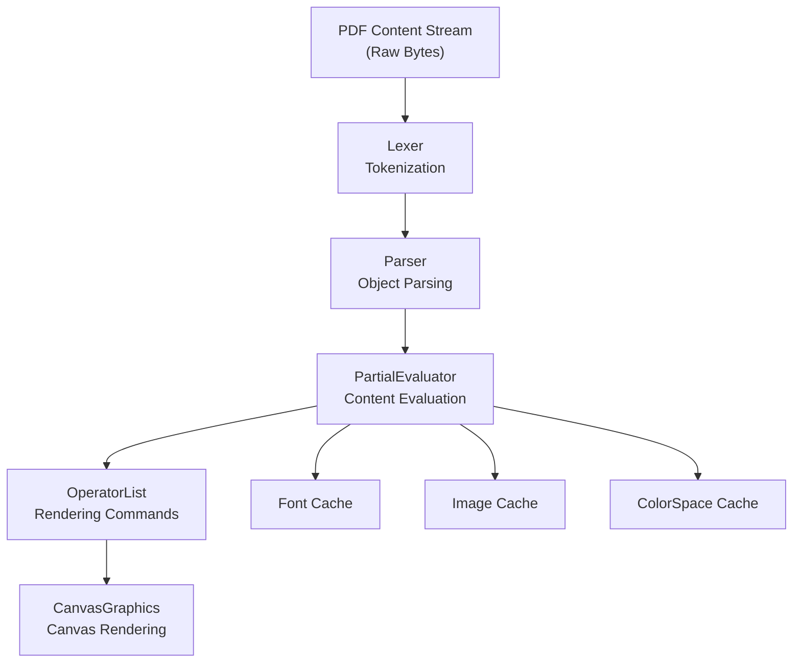
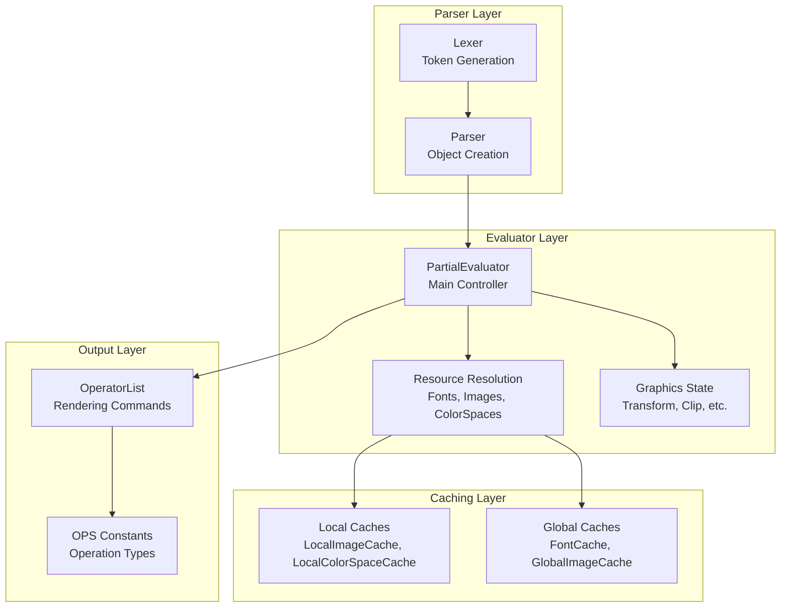
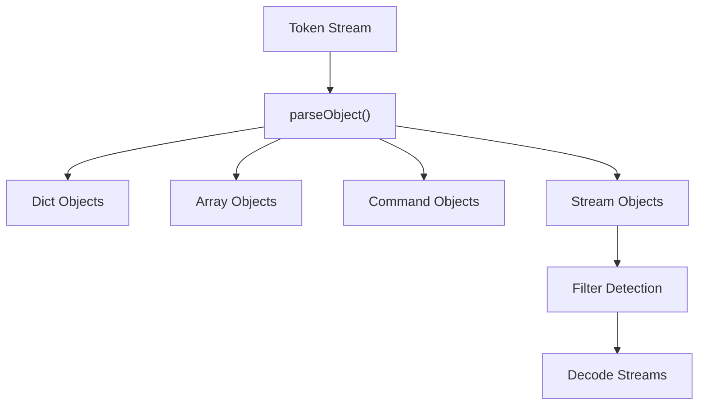
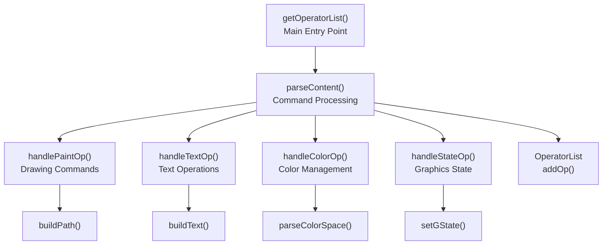
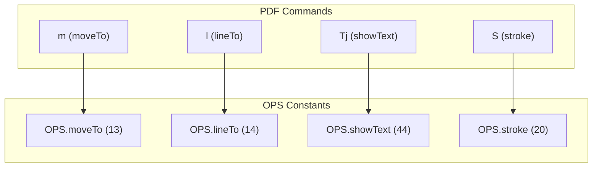
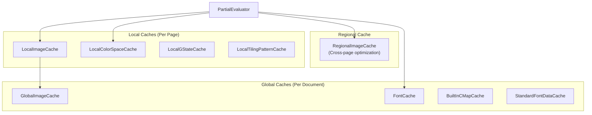
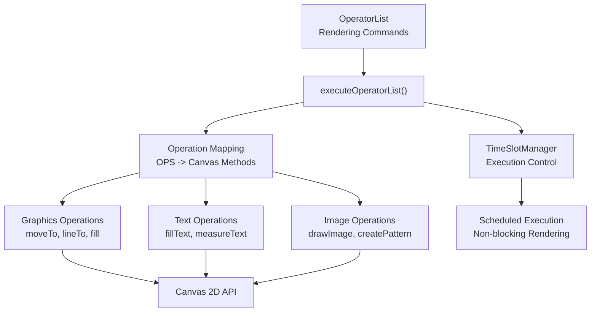

# Content Stream Processing

> **Relevant source files**
> * [src/core/annotation.js](https://github.com/Mr-xzq/pdf.js-4.4.168/blob/19fbc899/src/core/annotation.js)
> * [src/core/catalog.js](https://github.com/Mr-xzq/pdf.js-4.4.168/blob/19fbc899/src/core/catalog.js)
> * [src/core/chunked_stream.js](https://github.com/Mr-xzq/pdf.js-4.4.168/blob/19fbc899/src/core/chunked_stream.js)
> * [src/core/colorspace.js](https://github.com/Mr-xzq/pdf.js-4.4.168/blob/19fbc899/src/core/colorspace.js)
> * [src/core/document.js](https://github.com/Mr-xzq/pdf.js-4.4.168/blob/19fbc899/src/core/document.js)
> * [src/core/evaluator.js](https://github.com/Mr-xzq/pdf.js-4.4.168/blob/19fbc899/src/core/evaluator.js)
> * [src/core/font_renderer.js](https://github.com/Mr-xzq/pdf.js-4.4.168/blob/19fbc899/src/core/font_renderer.js)
> * [src/core/fonts.js](https://github.com/Mr-xzq/pdf.js-4.4.168/blob/19fbc899/src/core/fonts.js)
> * [src/core/function.js](https://github.com/Mr-xzq/pdf.js-4.4.168/blob/19fbc899/src/core/function.js)
> * [src/core/image.js](https://github.com/Mr-xzq/pdf.js-4.4.168/blob/19fbc899/src/core/image.js)
> * [src/core/jbig2.js](https://github.com/Mr-xzq/pdf.js-4.4.168/blob/19fbc899/src/core/jbig2.js)
> * [src/core/jpg.js](https://github.com/Mr-xzq/pdf.js-4.4.168/blob/19fbc899/src/core/jpg.js)
> * [src/core/jpx.js](https://github.com/Mr-xzq/pdf.js-4.4.168/blob/19fbc899/src/core/jpx.js)
> * [src/core/parser.js](https://github.com/Mr-xzq/pdf.js-4.4.168/blob/19fbc899/src/core/parser.js)
> * [src/core/pattern.js](https://github.com/Mr-xzq/pdf.js-4.4.168/blob/19fbc899/src/core/pattern.js)
> * [src/core/pdf_manager.js](https://github.com/Mr-xzq/pdf.js-4.4.168/blob/19fbc899/src/core/pdf_manager.js)
> * [src/core/stream.js](https://github.com/Mr-xzq/pdf.js-4.4.168/blob/19fbc899/src/core/stream.js)
> * [src/core/worker.js](https://github.com/Mr-xzq/pdf.js-4.4.168/blob/19fbc899/src/core/worker.js)
> * [src/display/annotation_layer.js](https://github.com/Mr-xzq/pdf.js-4.4.168/blob/19fbc899/src/display/annotation_layer.js)
> * [src/display/api.js](https://github.com/Mr-xzq/pdf.js-4.4.168/blob/19fbc899/src/display/api.js)
> * [src/display/canvas.js](https://github.com/Mr-xzq/pdf.js-4.4.168/blob/19fbc899/src/display/canvas.js)
> * [src/display/font_loader.js](https://github.com/Mr-xzq/pdf.js-4.4.168/blob/19fbc899/src/display/font_loader.js)
> * [src/display/pattern_helper.js](https://github.com/Mr-xzq/pdf.js-4.4.168/blob/19fbc899/src/display/pattern_helper.js)
> * [src/shared/util.js](https://github.com/Mr-xzq/pdf.js-4.4.168/blob/19fbc899/src/shared/util.js)
> * [test/annotation_layer_builder_overrides.css](https://github.com/Mr-xzq/pdf.js-4.4.168/blob/19fbc899/test/annotation_layer_builder_overrides.css)
> * [test/pdfs/.gitignore](https://github.com/Mr-xzq/pdf.js-4.4.168/blob/19fbc899/test/pdfs/.gitignore)
> * [test/pdfs/issue13999.pdf.link](https://github.com/Mr-xzq/pdf.js-4.4.168/blob/19fbc899/test/pdfs/issue13999.pdf.link)
> * [test/pdfs/issue15604.pdf.link](https://github.com/Mr-xzq/pdf.js-4.4.168/blob/19fbc899/test/pdfs/issue15604.pdf.link)
> * [test/test_manifest.json](https://github.com/Mr-xzq/pdf.js-4.4.168/blob/19fbc899/test/test_manifest.json)
> * [test/unit/annotation_spec.js](https://github.com/Mr-xzq/pdf.js-4.4.168/blob/19fbc899/test/unit/annotation_spec.js)
> * [test/unit/api_spec.js](https://github.com/Mr-xzq/pdf.js-4.4.168/blob/19fbc899/test/unit/api_spec.js)
> * [test/unit/colorspace_spec.js](https://github.com/Mr-xzq/pdf.js-4.4.168/blob/19fbc899/test/unit/colorspace_spec.js)
> * [test/unit/parser_spec.js](https://github.com/Mr-xzq/pdf.js-4.4.168/blob/19fbc899/test/unit/parser_spec.js)
> * [test/unit/util_spec.js](https://github.com/Mr-xzq/pdf.js-4.4.168/blob/19fbc899/test/unit/util_spec.js)
> * [web/annotation_layer_builder.css](https://github.com/Mr-xzq/pdf.js-4.4.168/blob/19fbc899/web/annotation_layer_builder.css)

## Purpose and Scope

This document covers how PDF content streams are parsed, evaluated, and converted to rendering operations in PDF.js. Content streams contain the drawing instructions that define the visual appearance of PDF pages, including text, graphics, images, and paths.

For information about document loading and the getDocument API, see [Document Loading and API](/Mr-xzq/pdf.js-4.4.168/2.1-document-loading-and-api). For details about font processing and character mapping, see [Font and Character Mapping](/Mr-xzq/pdf.js-4.4.168/2.3-font-and-character-mapping). For image and graphics processing specifics, see [Image and Graphics Processing](/Mr-xzq/pdf.js-4.4.168/2.4-image-and-graphics-processing).

## Content Stream Processing Pipeline

The content stream processing pipeline transforms PDF content streams through several stages before final rendering:



**Content Stream Processing Flow**

The pipeline consists of five main stages:

1. **Tokenization** - Breaking the stream into tokens
2. **Parsing** - Converting tokens into PDF objects and commands
3. **Evaluation** - Processing commands and resolving resources
4. **Operator List Generation** - Creating intermediate rendering commands
5. **Canvas Rendering** - Executing commands on the rendering context

Sources: [src/core/evaluator.js L209-L263](https://github.com/Mr-xzq/pdf.js-4.4.168/blob/19fbc899/src/core/evaluator.js#L209-L263)

 [src/core/parser.js L61-L100](https://github.com/Mr-xzq/pdf.js-4.4.168/blob/19fbc899/src/core/parser.js#L61-L100)

 [src/display/canvas.js L1-L50](https://github.com/Mr-xzq/pdf.js-4.4.168/blob/19fbc899/src/display/canvas.js#L1-L50)

## Key Components Architecture



**Content Stream Processing Architecture**

The architecture separates concerns into distinct layers with well-defined responsibilities and caching strategies for performance optimization.

Sources: [src/core/evaluator.js L209-L238](https://github.com/Mr-xzq/pdf.js-4.4.168/blob/19fbc899/src/core/evaluator.js#L209-L238)

 [src/core/parser.js L61-L87](https://github.com/Mr-xzq/pdf.js-4.4.168/blob/19fbc899/src/core/parser.js#L61-L87)

 [src/core/operator_list.js](https://github.com/Mr-xzq/pdf.js-4.4.168/blob/19fbc899/src/core/operator_list.js)

 [src/shared/util.js L246-L342](https://github.com/Mr-xzq/pdf.js-4.4.168/blob/19fbc899/src/shared/util.js#L246-L342)

## Content Stream Parsing

### Lexical Analysis

The `Lexer` class tokenizes PDF content streams by reading the raw byte stream and identifying PDF tokens:

| Token Type | Description | Examples |
| --- | --- | --- |
| Numbers | Integer or real values | `123`, `45.67`, `-.002` |
| Names | Object identifiers | `/Font`, `/Length`, `/Type` |
| Strings | Text literals | `(Hello)`, `<48656C6C6F>` |
| Commands | Drawing operations | `m`, `l`, `S`, `f`, `Tj` |
| Delimiters | Structural markers | `[`, `]`, `<<`, `>>` |

The lexer handles both ASCII and binary content, managing stream positioning and error recovery.

Sources: [src/core/parser.js L500-L800](https://github.com/Mr-xzq/pdf.js-4.4.168/blob/19fbc899/src/core/parser.js#L500-L800)

### Object Parsing

The `Parser` class converts token sequences into PDF objects and command sequences:



**Parser Object Creation Process**

The parser creates structured objects from token sequences, handling complex nested structures and stream decoding.

Sources: [src/core/parser.js L61-L200](https://github.com/Mr-xzq/pdf.js-4.4.168/blob/19fbc899/src/core/parser.js#L61-L200)

 [src/core/primitives.js](https://github.com/Mr-xzq/pdf.js-4.4.168/blob/19fbc899/src/core/primitives.js)

## Content Stream Evaluation

### PartialEvaluator Core

The `PartialEvaluator` class is the central controller for content stream processing:



**PartialEvaluator Processing Flow**

The evaluator processes different command types through specialized handlers, building up the operator list incrementally.

### Graphics State Management

The evaluator maintains graphics state throughout content stream processing:

| State Component | Purpose | PDF Commands |
| --- | --- | --- |
| Current Transform Matrix | Coordinate transformations | `cm`, `q`, `Q` |
| Current Point | Path construction | `m`, `l`, `c` |
| Line Attributes | Stroke properties | `w`, `J`, `j`, `M` |
| Color Spaces | Fill and stroke colors | `cs`, `CS`, `sc`, `SC` |
| Font State | Text rendering | `Tf`, `Tc`, `Tw` |
| Clipping Path | Visible region | `W`, `W*` |

Sources: [src/core/evaluator.js L1500-L2000](https://github.com/Mr-xzq/pdf.js-4.4.168/blob/19fbc899/src/core/evaluator.js#L1500-L2000)

 [src/core/evaluator.js L3000-L3500](https://github.com/Mr-xzq/pdf.js-4.4.168/blob/19fbc899/src/core/evaluator.js#L3000-L3500)

## Operator List Generation

### OPS Constants Mapping

PDF commands are mapped to standardized operation constants defined in the `OPS` object:



**PDF Command to OPS Mapping**

This mapping creates a consistent interface between the PDF specification and the rendering implementation.

### OperatorList Structure

The `OperatorList` class accumulates rendering operations with their arguments:

```yaml
// Example operator list structure
{
  fnArray: [OPS.moveTo, OPS.lineTo, OPS.stroke],
  argsArray: [[100, 200], [300, 400], []],
  dependencies: ['font_1', 'image_2']
}
```

Each operation includes:

* **Function code** - From OPS constants
* **Arguments** - Operation-specific parameters
* **Dependencies** - Required resources (fonts, images, etc.)

Sources: [src/shared/util.js L246-L342](https://github.com/Mr-xzq/pdf.js-4.4.168/blob/19fbc899/src/shared/util.js#L246-L342)

 [src/core/operator_list.js](https://github.com/Mr-xzq/pdf.js-4.4.168/blob/19fbc899/src/core/operator_list.js)

 [src/core/evaluator.js L2500-L3000](https://github.com/Mr-xzq/pdf.js-4.4.168/blob/19fbc899/src/core/evaluator.js#L2500-L3000)

## Resource Resolution and Caching

### Multi-Level Caching Strategy

Content stream processing uses hierarchical caching for performance:



**Caching Hierarchy in Content Stream Processing**

The multi-level cache design optimizes for different access patterns and resource lifetimes.

### Resource Resolution Process

When the evaluator encounters resource references, it follows a resolution and caching workflow:

1. **Check Local Cache** - Page-specific cached resources
2. **Check Global Cache** - Document-wide cached resources
3. **Parse Resource** - Create new resource from PDF objects
4. **Cache Result** - Store in appropriate cache level
5. **Return Resource** - Provide to operation handler

Sources: [src/core/evaluator.js L234-L237](https://github.com/Mr-xzq/pdf.js-4.4.168/blob/19fbc899/src/core/evaluator.js#L234-L237)

 [src/core/image_utils.js L59-L86](https://github.com/Mr-xzq/pdf.js-4.4.168/blob/19fbc899/src/core/image_utils.js#L59-L86)

## Integration with Rendering Pipeline

### Canvas Graphics Interface

The completed operator list is passed to `CanvasGraphics` for execution:



**Operator List Execution in Canvas Graphics**

The execution process maps PDF operations to Canvas 2D API calls while maintaining responsive user interface through time-sliced execution.

### Execution Control

The `TimeSlotManager` prevents blocking the main thread during complex page rendering:

| Parameter | Value | Purpose |
| --- | --- | --- |
| `TIME_SLOT_DURATION_MS` | 20ms | Maximum execution time per slice |
| `CHECK_TIME_EVERY` | 100 | Operations between time checks |
| `EXECUTION_STEPS` | 10 | Steps before scheduling check |

This ensures smooth user interaction even during intensive rendering operations.

Sources: [src/display/canvas.js L186-L207](https://github.com/Mr-xzq/pdf.js-4.4.168/blob/19fbc899/src/display/canvas.js#L186-L207)

 [src/display/canvas.js L3000-L4000](https://github.com/Mr-xzq/pdf.js-4.4.168/blob/19fbc899/src/display/canvas.js#L3000-L4000)

 [src/core/evaluator.js L186-L207](https://github.com/Mr-xzq/pdf.js-4.4.168/blob/19fbc899/src/core/evaluator.js#L186-L207)