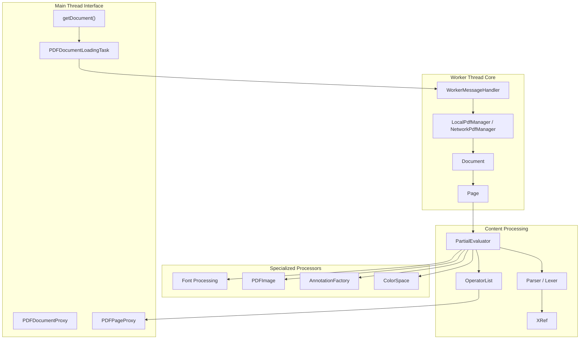
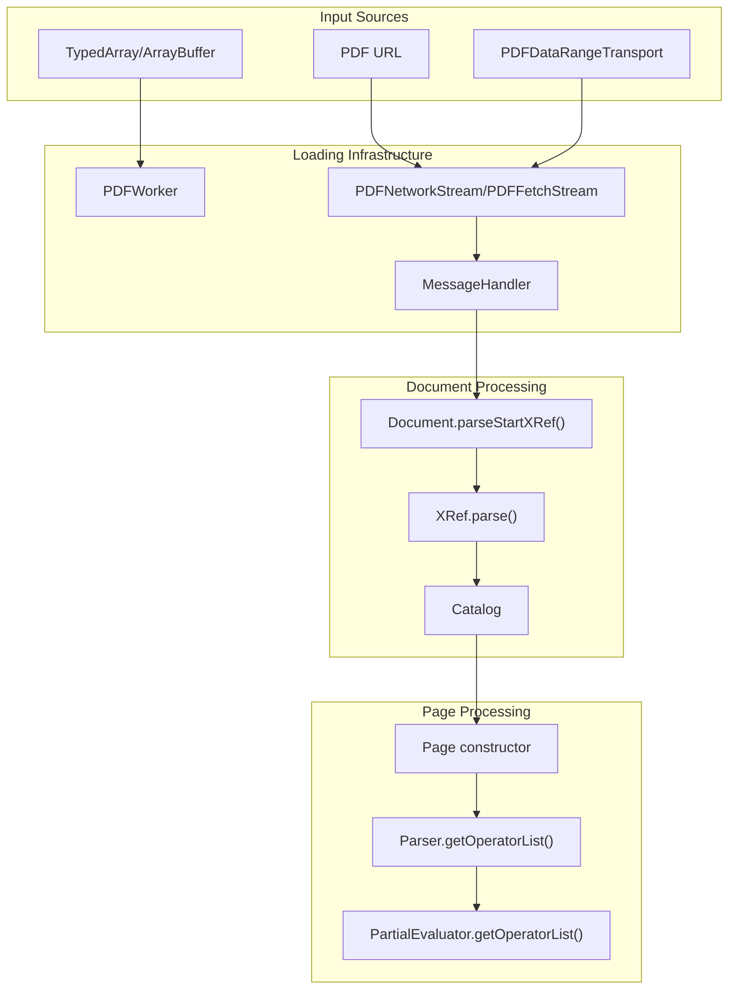
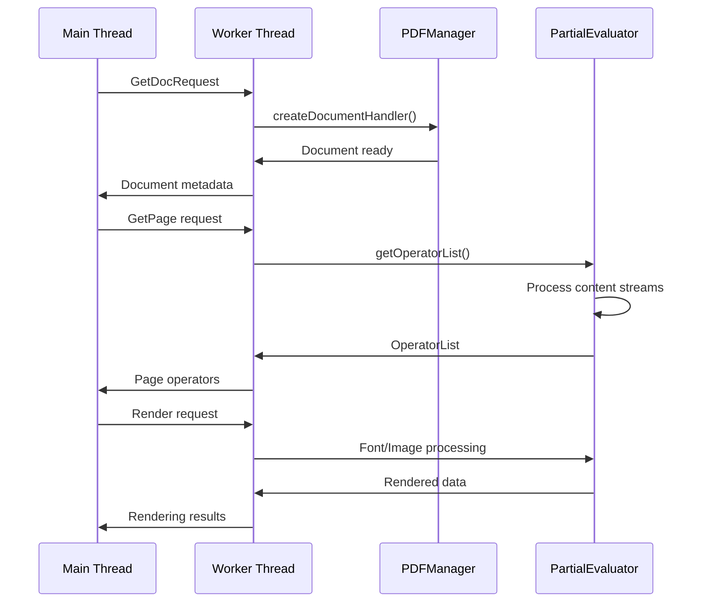

# Core PDF Processing Engine

> **Relevant source files**
> * [src/core/annotation.js](https://github.com/Mr-xzq/pdf.js-4.4.168/blob/19fbc899/src/core/annotation.js)
> * [src/core/catalog.js](https://github.com/Mr-xzq/pdf.js-4.4.168/blob/19fbc899/src/core/catalog.js)
> * [src/core/chunked_stream.js](https://github.com/Mr-xzq/pdf.js-4.4.168/blob/19fbc899/src/core/chunked_stream.js)
> * [src/core/colorspace.js](https://github.com/Mr-xzq/pdf.js-4.4.168/blob/19fbc899/src/core/colorspace.js)
> * [src/core/document.js](https://github.com/Mr-xzq/pdf.js-4.4.168/blob/19fbc899/src/core/document.js)
> * [src/core/evaluator.js](https://github.com/Mr-xzq/pdf.js-4.4.168/blob/19fbc899/src/core/evaluator.js)
> * [src/core/font_renderer.js](https://github.com/Mr-xzq/pdf.js-4.4.168/blob/19fbc899/src/core/font_renderer.js)
> * [src/core/fonts.js](https://github.com/Mr-xzq/pdf.js-4.4.168/blob/19fbc899/src/core/fonts.js)
> * [src/core/function.js](https://github.com/Mr-xzq/pdf.js-4.4.168/blob/19fbc899/src/core/function.js)
> * [src/core/image.js](https://github.com/Mr-xzq/pdf.js-4.4.168/blob/19fbc899/src/core/image.js)
> * [src/core/jbig2.js](https://github.com/Mr-xzq/pdf.js-4.4.168/blob/19fbc899/src/core/jbig2.js)
> * [src/core/jpg.js](https://github.com/Mr-xzq/pdf.js-4.4.168/blob/19fbc899/src/core/jpg.js)
> * [src/core/jpx.js](https://github.com/Mr-xzq/pdf.js-4.4.168/blob/19fbc899/src/core/jpx.js)
> * [src/core/parser.js](https://github.com/Mr-xzq/pdf.js-4.4.168/blob/19fbc899/src/core/parser.js)
> * [src/core/pattern.js](https://github.com/Mr-xzq/pdf.js-4.4.168/blob/19fbc899/src/core/pattern.js)
> * [src/core/pdf_manager.js](https://github.com/Mr-xzq/pdf.js-4.4.168/blob/19fbc899/src/core/pdf_manager.js)
> * [src/core/stream.js](https://github.com/Mr-xzq/pdf.js-4.4.168/blob/19fbc899/src/core/stream.js)
> * [src/core/worker.js](https://github.com/Mr-xzq/pdf.js-4.4.168/blob/19fbc899/src/core/worker.js)
> * [src/display/annotation_layer.js](https://github.com/Mr-xzq/pdf.js-4.4.168/blob/19fbc899/src/display/annotation_layer.js)
> * [src/display/api.js](https://github.com/Mr-xzq/pdf.js-4.4.168/blob/19fbc899/src/display/api.js)
> * [src/display/canvas.js](https://github.com/Mr-xzq/pdf.js-4.4.168/blob/19fbc899/src/display/canvas.js)
> * [src/display/font_loader.js](https://github.com/Mr-xzq/pdf.js-4.4.168/blob/19fbc899/src/display/font_loader.js)
> * [src/display/pattern_helper.js](https://github.com/Mr-xzq/pdf.js-4.4.168/blob/19fbc899/src/display/pattern_helper.js)
> * [src/shared/util.js](https://github.com/Mr-xzq/pdf.js-4.4.168/blob/19fbc899/src/shared/util.js)
> * [test/annotation_layer_builder_overrides.css](https://github.com/Mr-xzq/pdf.js-4.4.168/blob/19fbc899/test/annotation_layer_builder_overrides.css)
> * [test/pdfs/.gitignore](https://github.com/Mr-xzq/pdf.js-4.4.168/blob/19fbc899/test/pdfs/.gitignore)
> * [test/pdfs/issue13999.pdf.link](https://github.com/Mr-xzq/pdf.js-4.4.168/blob/19fbc899/test/pdfs/issue13999.pdf.link)
> * [test/pdfs/issue15604.pdf.link](https://github.com/Mr-xzq/pdf.js-4.4.168/blob/19fbc899/test/pdfs/issue15604.pdf.link)
> * [test/test_manifest.json](https://github.com/Mr-xzq/pdf.js-4.4.168/blob/19fbc899/test/test_manifest.json)
> * [test/unit/annotation_spec.js](https://github.com/Mr-xzq/pdf.js-4.4.168/blob/19fbc899/test/unit/annotation_spec.js)
> * [test/unit/api_spec.js](https://github.com/Mr-xzq/pdf.js-4.4.168/blob/19fbc899/test/unit/api_spec.js)
> * [test/unit/colorspace_spec.js](https://github.com/Mr-xzq/pdf.js-4.4.168/blob/19fbc899/test/unit/colorspace_spec.js)
> * [test/unit/parser_spec.js](https://github.com/Mr-xzq/pdf.js-4.4.168/blob/19fbc899/test/unit/parser_spec.js)
> * [test/unit/util_spec.js](https://github.com/Mr-xzq/pdf.js-4.4.168/blob/19fbc899/test/unit/util_spec.js)
> * [web/annotation_layer_builder.css](https://github.com/Mr-xzq/pdf.js-4.4.168/blob/19fbc899/web/annotation_layer_builder.css)

## Purpose and Scope

The Core PDF Processing Engine forms the foundational layer of PDF.js, responsible for parsing PDF documents, processing content streams, and converting PDF operations into renderable data structures. This system handles the low-level interpretation of PDF format specifications, including document structure parsing, content stream evaluation, font processing, image decoding, and annotation handling.

The engine operates primarily in a web worker thread to maintain UI responsiveness and provides the essential services that higher-level components depend on. For information about the web viewer application that uses this engine, see [Web Viewer Application](/Mr-xzq/pdf.js-4.4.168/3-web-viewer-application). For details about the build system and distribution, see [Build System and Distribution](/Mr-xzq/pdf.js-4.4.168/5-build-system-and-distribution).

## Architecture Overview

The Core PDF Processing Engine consists of several interconnected subsystems that work together to transform PDF data into renderable content:

### Core Engine Components

Sources: [src/display/api.js L232-L477](https://github.com/Mr-xzq/pdf.js-4.4.168/blob/19fbc899/src/display/api.js#L232-L477)

 [src/core/worker.js L72-L520](https://github.com/Mr-xzq/pdf.js-4.4.168/blob/19fbc899/src/core/worker.js#L72-L520)

 [src/core/evaluator.js L209-L237](https://github.com/Mr-xzq/pdf.js-4.4.168/blob/19fbc899/src/core/evaluator.js#L209-L237)

 [src/core/document.js L79-L122](https://github.com/Mr-xzq/pdf.js-4.4.168/blob/19fbc899/src/core/document.js#L79-L122)

### Document Loading and Processing Pipeline

Sources: [src/display/api.js L232-L477](https://github.com/Mr-xzq/pdf.js-4.4.168/blob/19fbc899/src/display/api.js#L232-L477)

 [src/core/document.js L1-L150](https://github.com/Mr-xzq/pdf.js-4.4.168/blob/19fbc899/src/core/document.js#L1-L150)

 [src/core/parser.js L61-L93](https://github.com/Mr-xzq/pdf.js-4.4.168/blob/19fbc899/src/core/parser.js#L61-L93)

 [src/core/evaluator.js L4550-L4650](https://github.com/Mr-xzq/pdf.js-4.4.168/blob/19fbc899/src/core/evaluator.js#L4550-L4650)

## Core Subsystems

### Document Loading and API Layer

The engine exposes its functionality through the `getDocument()` API in [src/display/api.js L232](https://github.com/Mr-xzq/pdf.js-4.4.168/blob/19fbc899/src/display/api.js#L232-L232)

 which creates a `PDFDocumentLoadingTask` that manages the entire loading process. The API supports multiple input formats including URLs, TypedArrays, and custom range transports via `PDFDataRangeTransport`.

Key components:

* **PDFDocumentLoadingTask**: Manages loading state and progress reporting
* **PDFWorker**: Handles worker thread creation and message passing
* **WorkerTransport**: Bridges main thread and worker communication

For detailed information about document loading, see [Document Loading and API](/Mr-xzq/pdf.js-4.4.168/2.1-document-loading-and-api).

### Content Stream Processing

The `PartialEvaluator` class [src/core/evaluator.js L209](https://github.com/Mr-xzq/pdf.js-4.4.168/blob/19fbc899/src/core/evaluator.js#L209-L209)

 serves as the central processing engine that interprets PDF content streams and converts them into operator lists. It handles:

* PDF operator parsing and evaluation
* Resource resolution (fonts, images, patterns)
* Graphics state management
* Coordinate transformations

The evaluator works with the `Parser` class [src/core/parser.js L61](https://github.com/Mr-xzq/pdf.js-4.4.168/blob/19fbc899/src/core/parser.js#L61-L61)

 to tokenize and parse PDF content streams, building `OperatorList` objects that contain rendering instructions.

For detailed information about content processing, see [Content Stream Processing](/Mr-xzq/pdf.js-4.4.168/2.2-content-stream-processing).

### Font and Character Processing

Font handling is managed through the `Font` class hierarchy [src/core/fonts.js L240-L4000](https://github.com/Mr-xzq/pdf.js-4.4.168/blob/19fbc899/src/core/fonts.js#L240-L4000)

 which supports:

* Type1, TrueType, CFF, and composite fonts
* Character encoding and Unicode mapping via `ToUnicodeMap`
* Glyph processing and font metrics
* Font subsetting and OpenType conversion

For detailed information about font processing, see [Font and Character Mapping](/Mr-xzq/pdf.js-4.4.168/2.3-font-and-character-mapping).

### Image and Graphics Processing

Image processing is handled by the `PDFImage` class [src/core/image.js L35-L1000](https://github.com/Mr-xzq/pdf.js-4.4.168/blob/19fbc899/src/core/image.js#L35-L1000)

 and related components:

* Multiple image formats (JPEG, PNG, JBIG2, JPEG2000)
* Color space transformations via `ColorSpace` [src/core/colorspace.js](https://github.com/Mr-xzq/pdf.js-4.4.168/blob/19fbc899/src/core/colorspace.js)
* Image masks and transparency
* Inline image caching

For detailed information about image processing, see [Image and Graphics Processing](/Mr-xzq/pdf.js-4.4.168/2.4-image-and-graphics-processing).

### Annotation Processing

The `AnnotationFactory` [src/core/annotation.js L73](https://github.com/Mr-xzq/pdf.js-4.4.168/blob/19fbc899/src/core/annotation.js#L73-L73)

 creates and processes various annotation types:

* Interactive form fields (text, button, choice)
* Markup annotations (highlight, note, etc.)
* Appearance stream processing
* Widget value handling

For detailed information about annotation processing, see [Annotation and Form Handling](/Mr-xzq/pdf.js-4.4.168/3.4-annotation-and-form-handling).

## Worker Thread Architecture

The engine operates primarily in a web worker to maintain UI responsiveness. The worker architecture centers around the `WorkerMessageHandler` [src/core/worker.js L72](https://github.com/Mr-xzq/pdf.js-4.4.168/blob/19fbc899/src/core/worker.js#L72-L72)

:

### Worker Communication Flow

Sources: [src/core/worker.js L89-L300](https://github.com/Mr-xzq/pdf.js-4.4.168/blob/19fbc899/src/core/worker.js#L89-L300)

 [src/core/evaluator.js L4550-L4650](https://github.com/Mr-xzq/pdf.js-4.4.168/blob/19fbc899/src/core/evaluator.js#L4550-L4650)

### Key Worker Components

* **WorkerTask**: Manages individual processing tasks with cancellation support
* **PDFManager**: Factory for `LocalPdfManager` vs `NetworkPdfManager` based on data source
* **MessageHandler**: Provides structured communication between threads with promise-based APIs

## Data Flow and Integration

The engine processes PDF documents through a well-defined pipeline:

1. **Loading Phase**: Document is loaded via `getDocument()` and basic structure parsed
2. **Page Access**: Individual pages are accessed via `PDFPageProxy.getOperatorList()`
3. **Content Evaluation**: `PartialEvaluator` processes page content streams
4. **Resource Processing**: Fonts, images, and other resources are processed as needed
5. **Operator Generation**: Final `OperatorList` is generated for rendering

The system uses several caching mechanisms to optimize performance:

* Font cache for reused fonts across pages
* Image cache for repeated images
* Built-in CMap cache for character mapping
* Standard font data cache

Error handling is built throughout with fallback mechanisms for corrupted or non-standard PDF files, controlled by the `ignoreErrors` option in `PartialEvaluator`.

Sources: [src/display/api.js L232-L477](https://github.com/Mr-xzq/pdf.js-4.4.168/blob/19fbc899/src/display/api.js#L232-L477)

 [src/core/evaluator.js L81-L92](https://github.com/Mr-xzq/pdf.js-4.4.168/blob/19fbc899/src/core/evaluator.js#L81-L92)

 [src/core/document.js L79-L200](https://github.com/Mr-xzq/pdf.js-4.4.168/blob/19fbc899/src/core/document.js#L79-L200)

 [src/core/worker.js L94-L300](https://github.com/Mr-xzq/pdf.js-4.4.168/blob/19fbc899/src/core/worker.js#L94-L300)