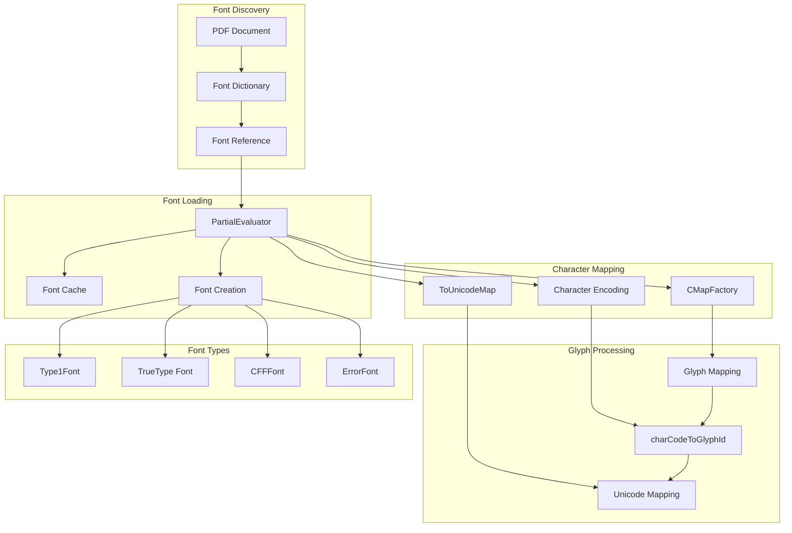
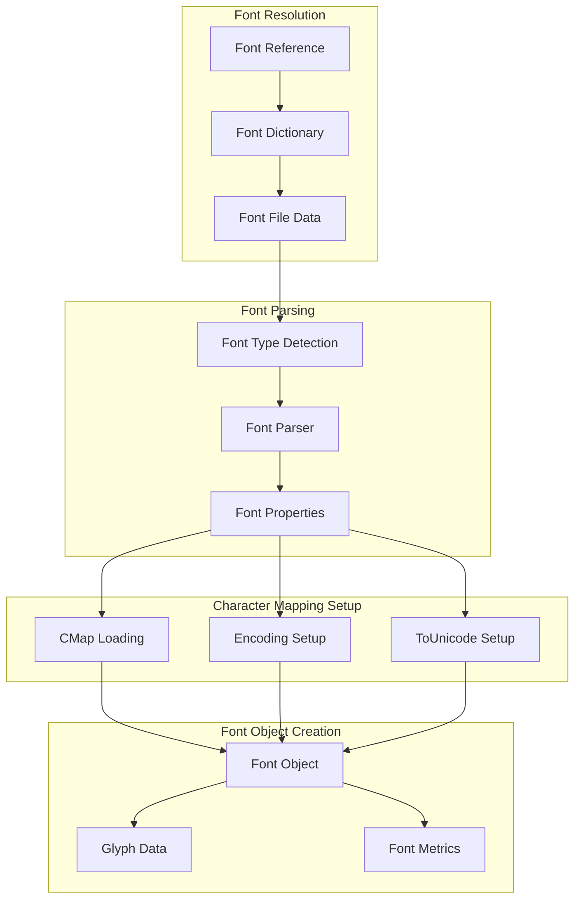
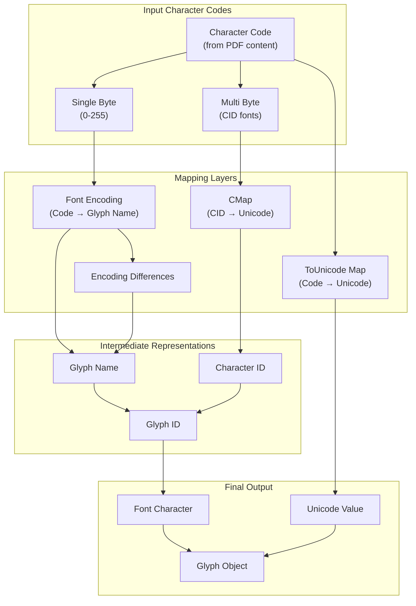
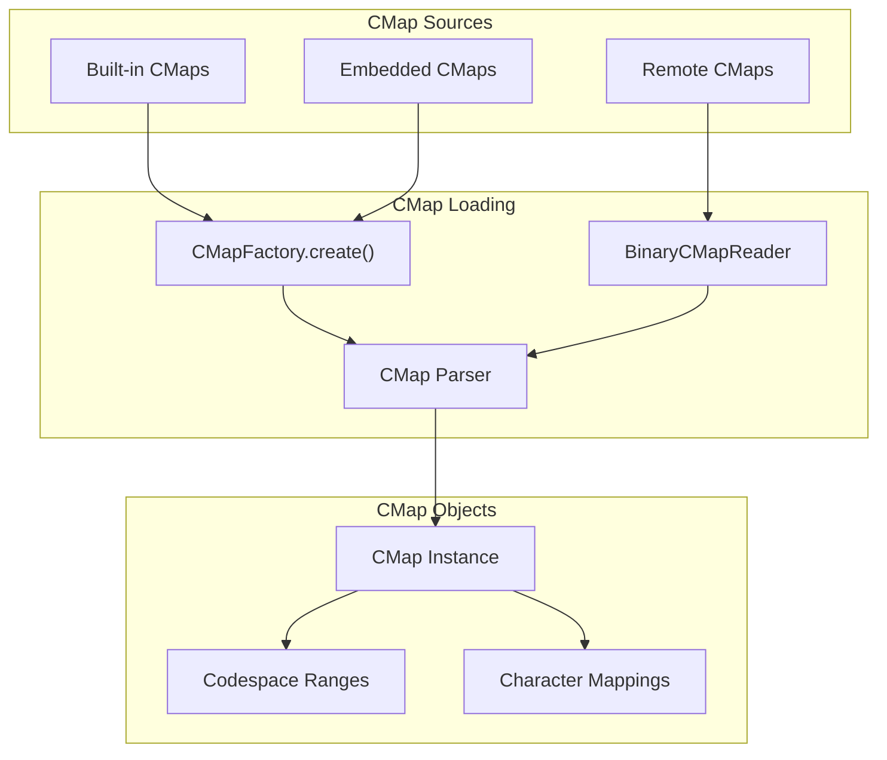
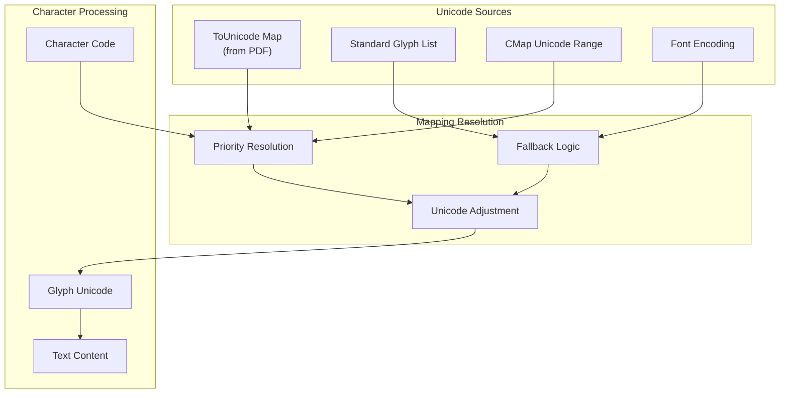
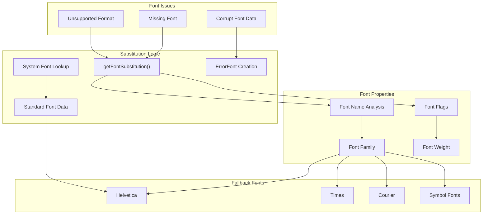
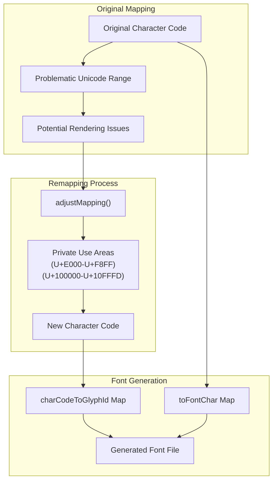

# Font and Character Mapping

> **Relevant source files**
> * [src/core/annotation.js](https://github.com/Mr-xzq/pdf.js-4.4.168/blob/19fbc899/src/core/annotation.js)
> * [src/core/catalog.js](https://github.com/Mr-xzq/pdf.js-4.4.168/blob/19fbc899/src/core/catalog.js)
> * [src/core/cmap.js](https://github.com/Mr-xzq/pdf.js-4.4.168/blob/19fbc899/src/core/cmap.js)
> * [src/core/document.js](https://github.com/Mr-xzq/pdf.js-4.4.168/blob/19fbc899/src/core/document.js)
> * [src/core/evaluator.js](https://github.com/Mr-xzq/pdf.js-4.4.168/blob/19fbc899/src/core/evaluator.js)
> * [src/core/fonts.js](https://github.com/Mr-xzq/pdf.js-4.4.168/blob/19fbc899/src/core/fonts.js)
> * [src/core/primitives.js](https://github.com/Mr-xzq/pdf.js-4.4.168/blob/19fbc899/src/core/primitives.js)
> * [src/core/struct_tree.js](https://github.com/Mr-xzq/pdf.js-4.4.168/blob/19fbc899/src/core/struct_tree.js)
> * [src/core/worker.js](https://github.com/Mr-xzq/pdf.js-4.4.168/blob/19fbc899/src/core/worker.js)
> * [src/display/annotation_layer.js](https://github.com/Mr-xzq/pdf.js-4.4.168/blob/19fbc899/src/display/annotation_layer.js)
> * [src/display/api.js](https://github.com/Mr-xzq/pdf.js-4.4.168/blob/19fbc899/src/display/api.js)
> * [src/display/canvas.js](https://github.com/Mr-xzq/pdf.js-4.4.168/blob/19fbc899/src/display/canvas.js)
> * [src/shared/util.js](https://github.com/Mr-xzq/pdf.js-4.4.168/blob/19fbc899/src/shared/util.js)
> * [test/annotation_layer_builder_overrides.css](https://github.com/Mr-xzq/pdf.js-4.4.168/blob/19fbc899/test/annotation_layer_builder_overrides.css)
> * [test/pdfs/.gitignore](https://github.com/Mr-xzq/pdf.js-4.4.168/blob/19fbc899/test/pdfs/.gitignore)
> * [test/test_manifest.json](https://github.com/Mr-xzq/pdf.js-4.4.168/blob/19fbc899/test/test_manifest.json)
> * [test/unit/annotation_spec.js](https://github.com/Mr-xzq/pdf.js-4.4.168/blob/19fbc899/test/unit/annotation_spec.js)
> * [test/unit/api_spec.js](https://github.com/Mr-xzq/pdf.js-4.4.168/blob/19fbc899/test/unit/api_spec.js)
> * [test/unit/cmap_spec.js](https://github.com/Mr-xzq/pdf.js-4.4.168/blob/19fbc899/test/unit/cmap_spec.js)
> * [test/unit/custom_spec.js](https://github.com/Mr-xzq/pdf.js-4.4.168/blob/19fbc899/test/unit/custom_spec.js)
> * [test/unit/node_stream_spec.js](https://github.com/Mr-xzq/pdf.js-4.4.168/blob/19fbc899/test/unit/node_stream_spec.js)
> * [test/unit/primitives_spec.js](https://github.com/Mr-xzq/pdf.js-4.4.168/blob/19fbc899/test/unit/primitives_spec.js)
> * [test/unit/test_utils.js](https://github.com/Mr-xzq/pdf.js-4.4.168/blob/19fbc899/test/unit/test_utils.js)
> * [test/unit/util_spec.js](https://github.com/Mr-xzq/pdf.js-4.4.168/blob/19fbc899/test/unit/util_spec.js)
> * [web/annotation_layer_builder.css](https://github.com/Mr-xzq/pdf.js-4.4.168/blob/19fbc899/web/annotation_layer_builder.css)

This document covers the font processing and character mapping systems within PDF.js's core PDF processing engine. These systems handle the loading, parsing, and rendering of fonts embedded in PDF documents, as well as the complex mapping between character codes, glyph identifiers, and Unicode values.

For information about the broader content stream processing that uses these font systems, see [Content Stream Processing](/Mr-xzq/pdf.js-4.4.168/2.2-content-stream-processing). For details about text rendering and layout in the display layer, see [Page Rendering System](/Mr-xzq/pdf.js-4.4.168/3.3-page-rendering-system).

## Overview

The font and character mapping system is responsible for:

* Loading and parsing various font formats (Type1, TrueType, CFF, OpenType)
* Establishing mappings between character codes and glyph identifiers
* Converting character codes to Unicode values for text extraction
* Handling font substitution when fonts are missing or corrupted
* Managing character encoding transformations
* Caching font data for performance optimization

## Font Processing Architecture

Sources: [src/core/evaluator.js L209-L262](https://github.com/Mr-xzq/pdf.js-4.4.168/blob/19fbc899/src/core/evaluator.js#L209-L262)

 [src/core/fonts.js L464-L523](https://github.com/Mr-xzq/pdf.js-4.4.168/blob/19fbc899/src/core/fonts.js#L464-L523)

 [src/core/cmap.js L1-L50](https://github.com/Mr-xzq/pdf.js-4.4.168/blob/19fbc899/src/core/cmap.js#L1-L50)

## Font Processing Pipeline

The font processing follows a multi-stage pipeline handled primarily by the `PartialEvaluator` class:

The pipeline involves several key steps:

1. **Font Discovery**: The `PartialEvaluator` encounters font references in PDF content streams
2. **Font Loading**: Font dictionaries and embedded font files are retrieved from the PDF
3. **Type Detection**: The system determines the font format using functions like `isTrueTypeFile`, `isType1File`, `isCFFFile`
4. **Font Parsing**: Appropriate parsers extract font data and properties
5. **Character Mapping**: CMaps, encodings, and ToUnicode maps are established
6. **Font Object Creation**: A `Font` instance is created with all necessary mapping data

Sources: [src/core/evaluator.js L1275-L1400](https://github.com/Mr-xzq/pdf.js-4.4.168/blob/19fbc899/src/core/evaluator.js#L1275-L1400)

 [src/core/fonts.js L382-L410](https://github.com/Mr-xzq/pdf.js-4.4.168/blob/19fbc899/src/core/fonts.js#L382-L410)

 [src/core/fonts.js L1200-L1350](https://github.com/Mr-xzq/pdf.js-4.4.168/blob/19fbc899/src/core/fonts.js#L1200-L1350)

## Character Code Mapping System

The character mapping system handles the complex transformation from PDF character codes to renderable glyphs:

The mapping process involves multiple potential paths depending on the font type and available mapping information:

* **Simple Fonts**: Use encoding dictionaries to map character codes to glyph names
* **CID Fonts**: Use CMaps to map character codes to Character IDs, then to glyphs
* **ToUnicode Maps**: Provide direct character code to Unicode mapping for text extraction
* **Encoding Differences**: Override specific mappings in the base encoding

Sources: [src/core/fonts.js L475-L523](https://github.com/Mr-xzq/pdf.js-4.4.168/blob/19fbc899/src/core/fonts.js#L475-L523)

 [src/core/cmap.js L350-L450](https://github.com/Mr-xzq/pdf.js-4.4.168/blob/19fbc899/src/core/cmap.js#L350-L450)

 [src/core/to_unicode_map.js L1-L100](https://github.com/Mr-xzq/pdf.js-4.4.168/blob/19fbc899/src/core/to_unicode_map.js#L1-L100)

## CMap Processing

CMaps (Character Maps) are crucial for handling CID fonts and complex character encodings:

| CMap Component | Purpose | Implementation |
| --- | --- | --- |
| `CMapFactory` | Creates and caches CMap instances | [src/core/cmap.js L550-L650](https://github.com/Mr-xzq/pdf.js-4.4.168/blob/19fbc899/src/core/cmap.js#L550-L650) |
| `IdentityCMap` | Provides 1:1 character mapping | [src/core/cmap.js L700-L750](https://github.com/Mr-xzq/pdf.js-4.4.168/blob/19fbc899/src/core/cmap.js#L700-L750) |
| `BinaryCMapReader` | Reads compressed binary CMaps | [src/core/binary_cmap.js L1-L50](https://github.com/Mr-xzq/pdf.js-4.4.168/blob/19fbc899/src/core/binary_cmap.js#L1-L50) |
| Built-in CMaps | Standard Adobe CMaps | [src/core/cmap.js L29-L200](https://github.com/Mr-xzq/pdf.js-4.4.168/blob/19fbc899/src/core/cmap.js#L29-L200) |

The CMap system supports both built-in CMaps (like Adobe-GB1-UCS2) and custom CMaps embedded in PDF documents. The `PartialEvaluator` fetches built-in CMaps using the `fetchBuiltInCMap` method, which can load them from either URLs or the main thread.

Sources: [src/core/cmap.js L550-L600](https://github.com/Mr-xzq/pdf.js-4.4.168/blob/19fbc899/src/core/cmap.js#L550-L600)

 [src/core/evaluator.js L377-L406](https://github.com/Mr-xzq/pdf.js-4.4.168/blob/19fbc899/src/core/evaluator.js#L377-L406)

 [src/core/binary_cmap.js L1-L100](https://github.com/Mr-xzq/pdf.js-4.4.168/blob/19fbc899/src/core/binary_cmap.js#L1-L100)

## Unicode Mapping and Text Extraction

The Unicode mapping system enables proper text extraction from PDF content:

The Unicode resolution follows a priority system:

1. **ToUnicode Map**: Highest priority if present in the PDF
2. **CMap Unicode Ranges**: For CID fonts with Unicode CMaps
3. **Standard Glyph List**: Maps glyph names to Unicode values
4. **Encoding Fallbacks**: Uses standard encodings as last resort

Functions like `adjustType1ToUnicode` and `adjustTrueTypeToUnicode` handle font-specific Unicode mapping adjustments.

Sources: [src/core/fonts.js L185-L241](https://github.com/Mr-xzq/pdf.js-4.4.168/blob/19fbc899/src/core/fonts.js#L185-L241)

 [src/core/to_unicode_map.js L50-L150](https://github.com/Mr-xzq/pdf.js-4.4.168/blob/19fbc899/src/core/to_unicode_map.js#L50-L150)

 [src/core/unicode.js L1-L100](https://github.com/Mr-xzq/pdf.js-4.4.168/blob/19fbc899/src/core/unicode.js#L1-L100)

## Font Substitution and Error Handling

When fonts are missing or corrupted, PDF.js employs a robust substitution system:

The substitution system analyzes font properties like:

* Font name and family classification
* Font flags (serif, sans-serif, monospace, symbolic)
* Font weight and style information
* Character set requirements

Sources: [src/core/font_substitutions.js L1-L100](https://github.com/Mr-xzq/pdf.js-4.4.168/blob/19fbc899/src/core/font_substitutions.js#L1-L100)

 [src/core/fonts.js L2800-L3000](https://github.com/Mr-xzq/pdf.js-4.4.168/blob/19fbc899/src/core/fonts.js#L2800-L3000)

 [src/core/standard_fonts.js L1-L200](https://github.com/Mr-xzq/pdf.js-4.4.168/blob/19fbc899/src/core/standard_fonts.js#L1-L200)

## Glyph Processing and Private Use Areas

To avoid rendering issues with problematic Unicode ranges, PDF.js remaps character codes to private use areas:

This remapping process ensures that:

* Characters render correctly across different browsers and platforms
* Font shaping issues are avoided
* Print functionality maintains proper Unicode mappings
* Text extraction continues to work properly

Sources: [src/core/fonts.js L475-L523](https://github.com/Mr-xzq/pdf.js-4.4.168/blob/19fbc899/src/core/fonts.js#L475-L523)

 [src/core/fonts.js L69-L72](https://github.com/Mr-xzq/pdf.js-4.4.168/blob/19fbc899/src/core/fonts.js#L69-L72)