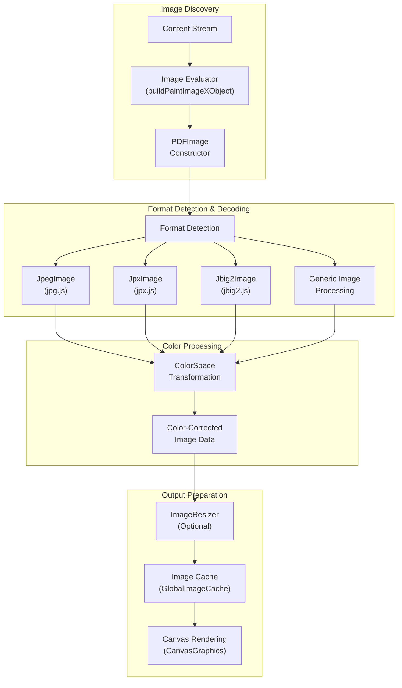
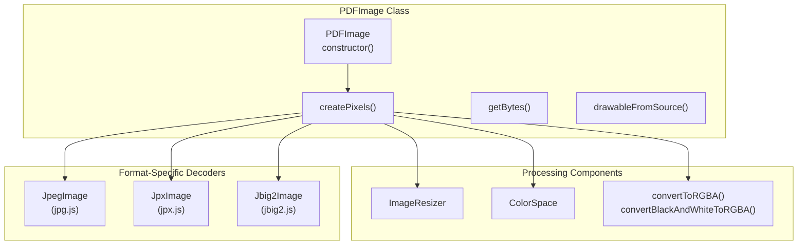
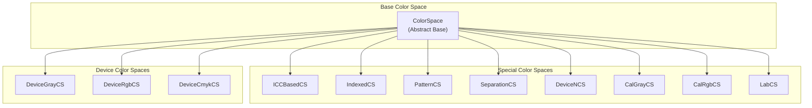
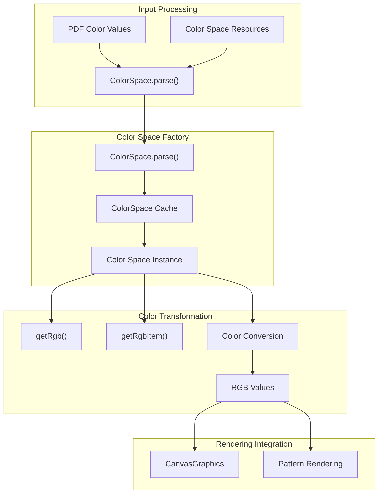
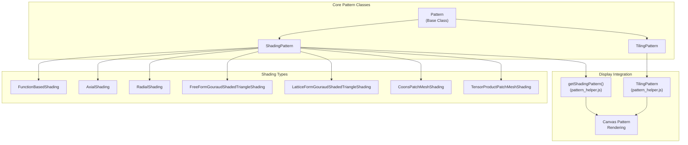
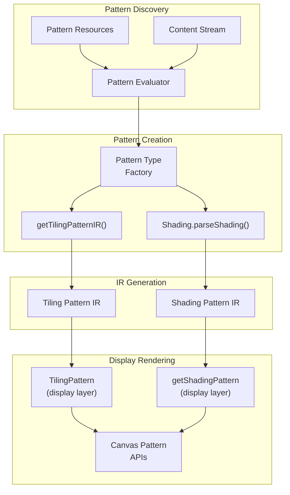
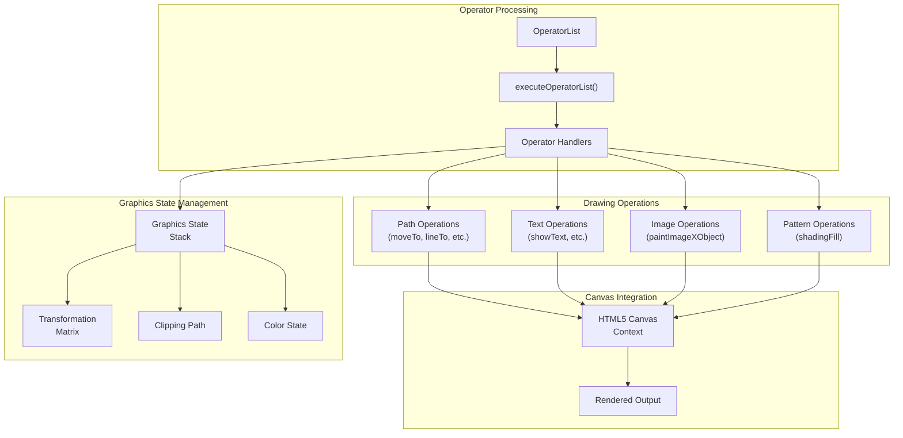
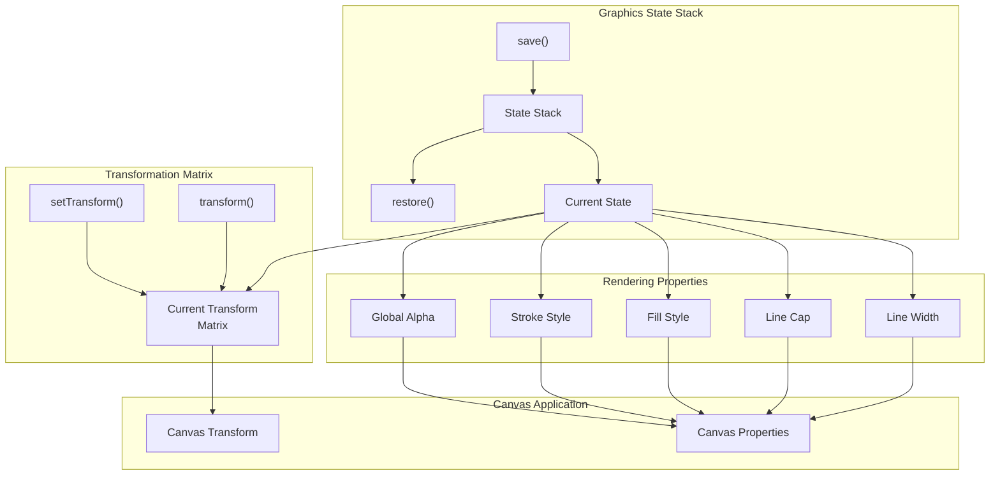

# Image and Graphics Processing

> **Relevant source files**
> * [src/core/annotation.js](https://github.com/Mr-xzq/pdf.js-4.4.168/blob/19fbc899/src/core/annotation.js)
> * [src/core/catalog.js](https://github.com/Mr-xzq/pdf.js-4.4.168/blob/19fbc899/src/core/catalog.js)
> * [src/core/chunked_stream.js](https://github.com/Mr-xzq/pdf.js-4.4.168/blob/19fbc899/src/core/chunked_stream.js)
> * [src/core/colorspace.js](https://github.com/Mr-xzq/pdf.js-4.4.168/blob/19fbc899/src/core/colorspace.js)
> * [src/core/document.js](https://github.com/Mr-xzq/pdf.js-4.4.168/blob/19fbc899/src/core/document.js)
> * [src/core/evaluator.js](https://github.com/Mr-xzq/pdf.js-4.4.168/blob/19fbc899/src/core/evaluator.js)
> * [src/core/font_renderer.js](https://github.com/Mr-xzq/pdf.js-4.4.168/blob/19fbc899/src/core/font_renderer.js)
> * [src/core/fonts.js](https://github.com/Mr-xzq/pdf.js-4.4.168/blob/19fbc899/src/core/fonts.js)
> * [src/core/function.js](https://github.com/Mr-xzq/pdf.js-4.4.168/blob/19fbc899/src/core/function.js)
> * [src/core/image.js](https://github.com/Mr-xzq/pdf.js-4.4.168/blob/19fbc899/src/core/image.js)
> * [src/core/jbig2.js](https://github.com/Mr-xzq/pdf.js-4.4.168/blob/19fbc899/src/core/jbig2.js)
> * [src/core/jpg.js](https://github.com/Mr-xzq/pdf.js-4.4.168/blob/19fbc899/src/core/jpg.js)
> * [src/core/jpx.js](https://github.com/Mr-xzq/pdf.js-4.4.168/blob/19fbc899/src/core/jpx.js)
> * [src/core/parser.js](https://github.com/Mr-xzq/pdf.js-4.4.168/blob/19fbc899/src/core/parser.js)
> * [src/core/pattern.js](https://github.com/Mr-xzq/pdf.js-4.4.168/blob/19fbc899/src/core/pattern.js)
> * [src/core/pdf_manager.js](https://github.com/Mr-xzq/pdf.js-4.4.168/blob/19fbc899/src/core/pdf_manager.js)
> * [src/core/stream.js](https://github.com/Mr-xzq/pdf.js-4.4.168/blob/19fbc899/src/core/stream.js)
> * [src/core/worker.js](https://github.com/Mr-xzq/pdf.js-4.4.168/blob/19fbc899/src/core/worker.js)
> * [src/display/annotation_layer.js](https://github.com/Mr-xzq/pdf.js-4.4.168/blob/19fbc899/src/display/annotation_layer.js)
> * [src/display/api.js](https://github.com/Mr-xzq/pdf.js-4.4.168/blob/19fbc899/src/display/api.js)
> * [src/display/canvas.js](https://github.com/Mr-xzq/pdf.js-4.4.168/blob/19fbc899/src/display/canvas.js)
> * [src/display/font_loader.js](https://github.com/Mr-xzq/pdf.js-4.4.168/blob/19fbc899/src/display/font_loader.js)
> * [src/display/pattern_helper.js](https://github.com/Mr-xzq/pdf.js-4.4.168/blob/19fbc899/src/display/pattern_helper.js)
> * [src/shared/util.js](https://github.com/Mr-xzq/pdf.js-4.4.168/blob/19fbc899/src/shared/util.js)
> * [test/annotation_layer_builder_overrides.css](https://github.com/Mr-xzq/pdf.js-4.4.168/blob/19fbc899/test/annotation_layer_builder_overrides.css)
> * [test/pdfs/.gitignore](https://github.com/Mr-xzq/pdf.js-4.4.168/blob/19fbc899/test/pdfs/.gitignore)
> * [test/pdfs/issue13999.pdf.link](https://github.com/Mr-xzq/pdf.js-4.4.168/blob/19fbc899/test/pdfs/issue13999.pdf.link)
> * [test/pdfs/issue15604.pdf.link](https://github.com/Mr-xzq/pdf.js-4.4.168/blob/19fbc899/test/pdfs/issue15604.pdf.link)
> * [test/test_manifest.json](https://github.com/Mr-xzq/pdf.js-4.4.168/blob/19fbc899/test/test_manifest.json)
> * [test/unit/annotation_spec.js](https://github.com/Mr-xzq/pdf.js-4.4.168/blob/19fbc899/test/unit/annotation_spec.js)
> * [test/unit/api_spec.js](https://github.com/Mr-xzq/pdf.js-4.4.168/blob/19fbc899/test/unit/api_spec.js)
> * [test/unit/colorspace_spec.js](https://github.com/Mr-xzq/pdf.js-4.4.168/blob/19fbc899/test/unit/colorspace_spec.js)
> * [test/unit/parser_spec.js](https://github.com/Mr-xzq/pdf.js-4.4.168/blob/19fbc899/test/unit/parser_spec.js)
> * [test/unit/util_spec.js](https://github.com/Mr-xzq/pdf.js-4.4.168/blob/19fbc899/test/unit/util_spec.js)
> * [web/annotation_layer_builder.css](https://github.com/Mr-xzq/pdf.js-4.4.168/blob/19fbc899/web/annotation_layer_builder.css)

This document covers the image decoding, color space handling, pattern processing, and graphics rendering systems within PDF.js's core PDF processing engine. This includes image format decoders (JPEG, JPEG2000, JBIG2), color space transformations, pattern rendering, and the canvas-based graphics output system.

For content stream parsing and operator processing, see [Content Stream Processing](/Mr-xzq/pdf.js-4.4.168/2.2-content-stream-processing). For font rendering, see [Font and Character Mapping](/Mr-xzq/pdf.js-4.4.168/2.3-font-and-character-mapping).

## Image Processing Pipeline

The image processing pipeline handles decoding of various image formats embedded in PDF documents and prepares them for rendering. The system supports multiple image formats including JPEG, JPEG2000, JBIG2, and inline images.

Sources: [src/core/evaluator.js L575-L650](https://github.com/Mr-xzq/pdf.js-4.4.168/blob/19fbc899/src/core/evaluator.js#L575-L650)

 [src/core/image.js L35-L1007](https://github.com/Mr-xzq/pdf.js-4.4.168/blob/19fbc899/src/core/image.js#L35-L1007)

 [src/core/jpg.js L1-L1500](https://github.com/Mr-xzq/pdf.js-4.4.168/blob/19fbc899/src/core/jpg.js#L1-L1500)

 [src/core/jpx.js L1-L100](https://github.com/Mr-xzq/pdf.js-4.4.168/blob/19fbc899/src/core/jpx.js#L1-L100)

### PDFImage Class Architecture

The `PDFImage` class in [src/core/image.js](https://github.com/Mr-xzq/pdf.js-4.4.168/blob/19fbc899/src/core/image.js)

 serves as the central coordinator for image processing. It handles format detection, delegates to appropriate decoders, and manages color space transformations.

Sources: [src/core/image.js L80-L150](https://github.com/Mr-xzq/pdf.js-4.4.168/blob/19fbc899/src/core/image.js#L80-L150)

 [src/core/image.js L200-L400](https://github.com/Mr-xzq/pdf.js-4.4.168/blob/19fbc899/src/core/image.js#L200-L400)

 [src/core/image_resizer.js](https://github.com/Mr-xzq/pdf.js-4.4.168/blob/19fbc899/src/core/image_resizer.js)

## Color Space System

PDF.js implements a comprehensive color space system supporting DeviceGray, DeviceRGB, DeviceCMYK, ICCBased, Indexed, Pattern, Separation, and DeviceN color spaces. Each color space provides methods for converting colors to RGB for display.

### Color Space Class Hierarchy

Sources: [src/core/colorspace.js L100-L300](https://github.com/Mr-xzq/pdf.js-4.4.168/blob/19fbc899/src/core/colorspace.js#L100-L300)

 [src/core/colorspace.js L400-L800](https://github.com/Mr-xzq/pdf.js-4.4.168/blob/19fbc899/src/core/colorspace.js#L400-L800)

 [src/core/colorspace.js L1000-L1500](https://github.com/Mr-xzq/pdf.js-4.4.168/blob/19fbc899/src/core/colorspace.js#L1000-L1500)

### Color Space Processing Flow

Sources: [src/core/colorspace.js L1-L100](https://github.com/Mr-xzq/pdf.js-4.4.168/blob/19fbc899/src/core/colorspace.js#L1-L100)

 [src/core/colorspace.js L300-L400](https://github.com/Mr-xzq/pdf.js-4.4.168/blob/19fbc899/src/core/colorspace.js#L300-L400)

 [src/display/canvas.js L2000-L2200](https://github.com/Mr-xzq/pdf.js-4.4.168/blob/19fbc899/src/display/canvas.js#L2000-L2200)

## Pattern System

PDF patterns include tiling patterns and shading patterns. The pattern system coordinates between the core pattern definitions and the display layer rendering implementation.

### Pattern Class Structure

Sources: [src/core/pattern.js L50-L200](https://github.com/Mr-xzq/pdf.js-4.4.168/blob/19fbc899/src/core/pattern.js#L50-L200)

 [src/core/pattern.js L400-L800](https://github.com/Mr-xzq/pdf.js-4.4.168/blob/19fbc899/src/core/pattern.js#L400-L800)

 [src/display/pattern_helper.js L1-L500](https://github.com/Mr-xzq/pdf.js-4.4.168/blob/19fbc899/src/display/pattern_helper.js#L1-L500)

### Pattern Processing Pipeline

Sources: [src/core/evaluator.js L1500-L1800](https://github.com/Mr-xzq/pdf.js-4.4.168/blob/19fbc899/src/core/evaluator.js#L1500-L1800)

 [src/core/pattern.js L1000-L1200](https://github.com/Mr-xzq/pdf.js-4.4.168/blob/19fbc899/src/core/pattern.js#L1000-L1200)

 [src/display/pattern_helper.js L200-L400](https://github.com/Mr-xzq/pdf.js-4.4.168/blob/19fbc899/src/display/pattern_helper.js#L200-L400)

## Graphics Rendering System

The `CanvasGraphics` class in [src/display/canvas.js](https://github.com/Mr-xzq/pdf.js-4.4.168/blob/19fbc899/src/display/canvas.js)

 handles the rendering of all graphics operations to HTML5 Canvas. It processes operator lists generated by the core engine and executes drawing commands.

### CanvasGraphics Architecture

Sources: [src/display/canvas.js L1000-L1200](https://github.com/Mr-xzq/pdf.js-4.4.168/blob/19fbc899/src/display/canvas.js#L1000-L1200)

 [src/display/canvas.js L2000-L2500](https://github.com/Mr-xzq/pdf.js-4.4.168/blob/19fbc899/src/display/canvas.js#L2000-L2500)

 [src/display/canvas.js L3000-L3500](https://github.com/Mr-xzq/pdf.js-4.4.168/blob/19fbc899/src/display/canvas.js#L3000-L3500)

### Image Rendering Operations

The graphics system handles multiple types of image rendering operations, each optimized for different use cases:

| Operation | Method | Purpose |
| --- | --- | --- |
| `paintImageXObject` | `paintImageXObject()` | Render standard images |
| `paintImageMaskXObject` | `paintImageMaskXObject()` | Render image masks |
| `paintInlineImageXObject` | `paintInlineImageXObject()` | Render inline images |
| `paintImageXObjectRepeat` | `paintImageXObjectRepeat()` | Optimized repeated images |
| `paintSolidColorImageMask` | `paintSolidColorImageMask()` | Solid color masks |

Sources: [src/display/canvas.js L4000-L4500](https://github.com/Mr-xzq/pdf.js-4.4.168/blob/19fbc899/src/display/canvas.js#L4000-L4500)

 [src/display/canvas.js L4500-L5000](https://github.com/Mr-xzq/pdf.js-4.4.168/blob/19fbc899/src/display/canvas.js#L4500-L5000)

 [src/shared/util.js L245-L342](https://github.com/Mr-xzq/pdf.js-4.4.168/blob/19fbc899/src/shared/util.js#L245-L342)

### Graphics State and Transformation

Sources: [src/display/canvas.js L500-L800](https://github.com/Mr-xzq/pdf.js-4.4.168/blob/19fbc899/src/display/canvas.js#L500-L800)

 [src/display/canvas.js L1500-L1800](https://github.com/Mr-xzq/pdf.js-4.4.168/blob/19fbc899/src/display/canvas.js#L1500-L1800)

 [src/display/display_utils.js L200-L400](https://github.com/Mr-xzq/pdf.js-4.4.168/blob/19fbc899/src/display/display_utils.js#L200-L400)