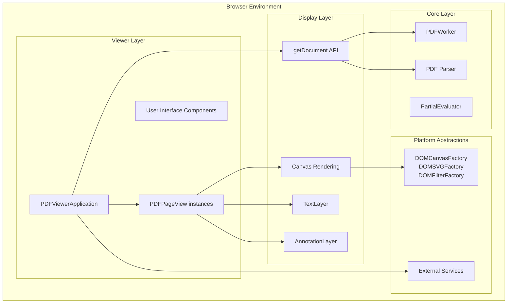
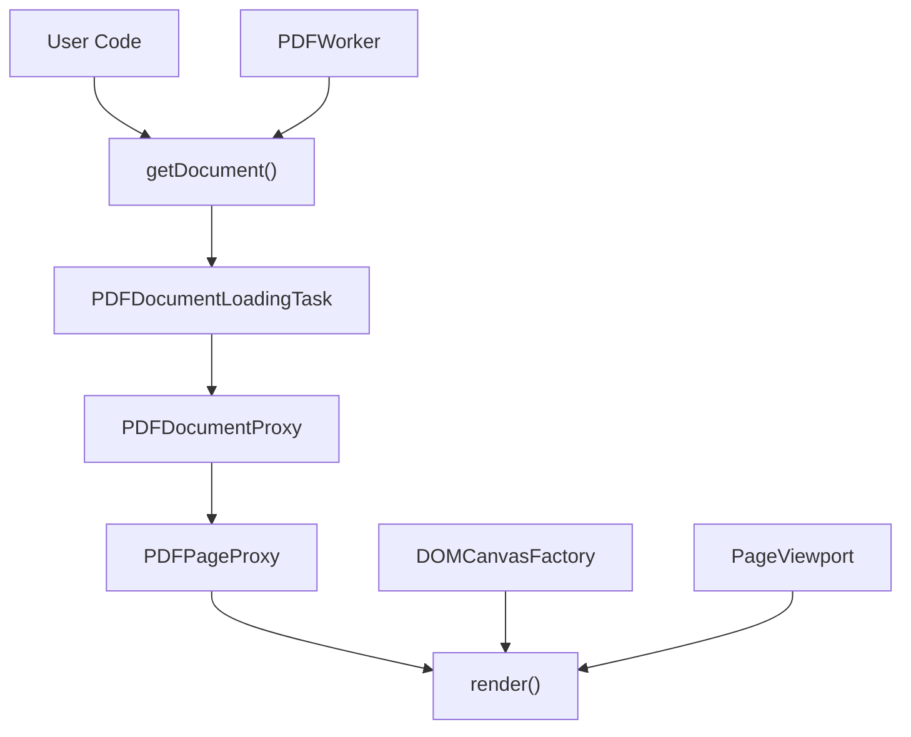
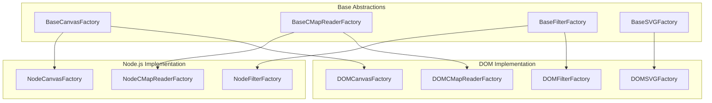
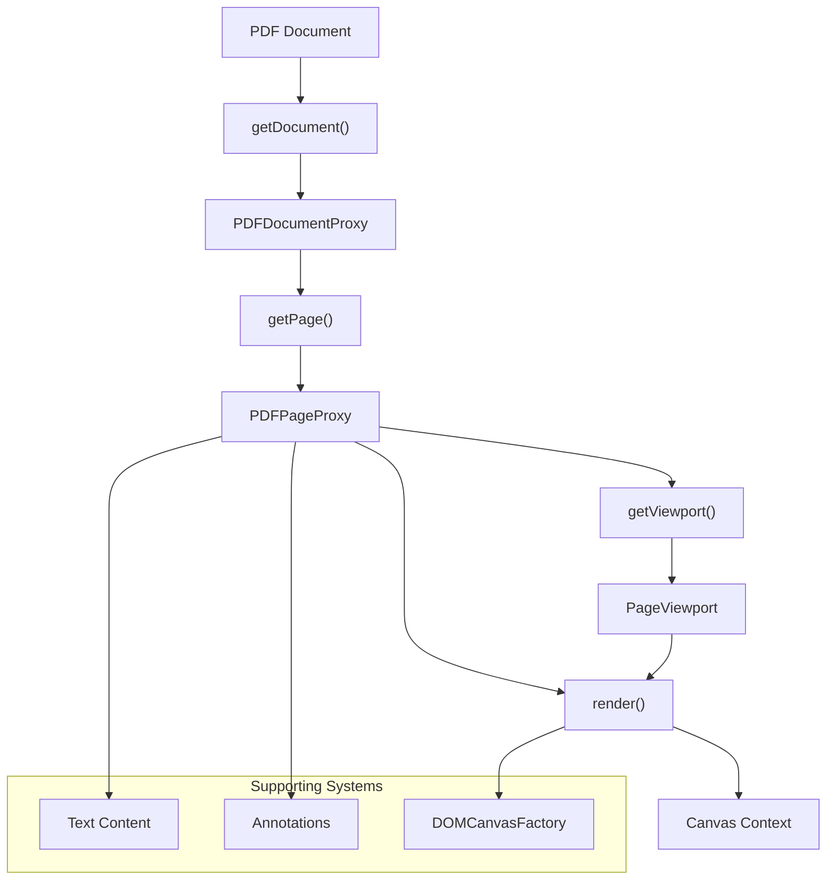

# Overview

> **Relevant source files**
> * [README.md](https://github.com/Mr-xzq/pdf.js-4.4.168/blob/19fbc899/README.md)
> * [docs/contents/api/index.md](https://github.com/Mr-xzq/pdf.js-4.4.168/blob/19fbc899/docs/contents/api/index.md)
> * [docs/contents/css/bootstrap.min.css](https://github.com/Mr-xzq/pdf.js-4.4.168/blob/19fbc899/docs/contents/css/bootstrap.min.css)
> * [docs/contents/css/main.css](https://github.com/Mr-xzq/pdf.js-4.4.168/blob/19fbc899/docs/contents/css/main.css)
> * [docs/contents/examples/index.md](https://github.com/Mr-xzq/pdf.js-4.4.168/blob/19fbc899/docs/contents/examples/index.md)
> * [docs/contents/getting_started/index.md](https://github.com/Mr-xzq/pdf.js-4.4.168/blob/19fbc899/docs/contents/getting_started/index.md)
> * [docs/contents/index.md](https://github.com/Mr-xzq/pdf.js-4.4.168/blob/19fbc899/docs/contents/index.md)
> * [docs/contents/js/bootstrap.min.js](https://github.com/Mr-xzq/pdf.js-4.4.168/blob/19fbc899/docs/contents/js/bootstrap.min.js)
> * [external/dist/README.md](https://github.com/Mr-xzq/pdf.js-4.4.168/blob/19fbc899/external/dist/README.md)
> * [pdfjs.config](https://github.com/Mr-xzq/pdf.js-4.4.168/blob/19fbc899/pdfjs.config)
> * [src/display/base_factory.js](https://github.com/Mr-xzq/pdf.js-4.4.168/blob/19fbc899/src/display/base_factory.js)
> * [src/display/display_utils.js](https://github.com/Mr-xzq/pdf.js-4.4.168/blob/19fbc899/src/display/display_utils.js)
> * [src/display/node_utils.js](https://github.com/Mr-xzq/pdf.js-4.4.168/blob/19fbc899/src/display/node_utils.js)
> * [src/pdf.js](https://github.com/Mr-xzq/pdf.js-4.4.168/blob/19fbc899/src/pdf.js)
> * [test/unit/clitests_helper.js](https://github.com/Mr-xzq/pdf.js-4.4.168/blob/19fbc899/test/unit/clitests_helper.js)
> * [test/unit/display_utils_spec.js](https://github.com/Mr-xzq/pdf.js-4.4.168/blob/19fbc899/test/unit/display_utils_spec.js)

This document provides a high-level introduction to the PDF.js codebase architecture, its main components, and how they interact to provide PDF rendering capabilities in web browsers. PDF.js is a JavaScript-based PDF parser and renderer that operates entirely in the browser without requiring plugins.

For information about specific build processes and distribution targets, see [Build System and Distribution](/Mr-xzq/pdf.js-4.4.168/5-build-system-and-distribution). For details about the web viewer application implementation, see [Web Viewer Application](/Mr-xzq/pdf.js-4.4.168/3-web-viewer-application). For the core PDF processing engine internals, see [Core PDF Processing Engine](/Mr-xzq/pdf.js-4.4.168/2-core-pdf-processing-engine).

## Purpose and Architecture

PDF.js is designed as a multi-layered system that separates PDF parsing, rendering, and user interface concerns into distinct but integrated components. The architecture follows a three-tier approach: Core, Display, and Viewer layers.



**Sources:** [README.md L1-L41](https://github.com/Mr-xzq/pdf.js-4.4.168/blob/19fbc899/README.md#L1-L41)

 [src/pdf.js L25-L134](https://github.com/Mr-xzq/pdf.js-4.4.168/blob/19fbc899/src/pdf.js#L25-L134)

 [src/display/display_utils.js L1-L1130](https://github.com/Mr-xzq/pdf.js-4.4.168/blob/19fbc899/src/display/display_utils.js#L1-L1130)

## Core System Components

The system is organized around several key JavaScript modules that provide different aspects of PDF functionality:

### Main Entry Points

| Component | File Location | Primary Classes/Functions |
| --- | --- | --- |
| Main Library | [src/pdf.js](https://github.com/Mr-xzq/pdf.js-4.4.168/blob/19fbc899/src/pdf.js) | `getDocument`, `PDFWorker`, `version` |
| Display Utilities | [src/display/display_utils.js](https://github.com/Mr-xzq/pdf.js-4.4.168/blob/19fbc899/src/display/display_utils.js) | `DOMCanvasFactory`, `PageViewport`, `PDFDateString` |
| Node.js Support | [src/display/node_utils.js](https://github.com/Mr-xzq/pdf.js-4.4.168/blob/19fbc899/src/display/node_utils.js) | `NodeCanvasFactory`, `NodePackages` |

The primary entry point is the `getDocument` function exported from [src/pdf.js L47](https://github.com/Mr-xzq/pdf.js-4.4.168/blob/19fbc899/src/pdf.js#L47-L47)

 which returns a `PDFDocumentLoadingTask` that resolves to a `PDFDocumentProxy` for accessing PDF content.



**Sources:** [src/pdf.js L25-L51](https://github.com/Mr-xzq/pdf.js-4.4.168/blob/19fbc899/src/pdf.js#L25-L51)

 [docs/contents/examples/index.md L16-L40](https://github.com/Mr-xzq/pdf.js-4.4.168/blob/19fbc899/docs/contents/examples/index.md#L16-L40)

### Platform Abstraction Layer

PDF.js provides platform-specific implementations through factory classes that abstract canvas creation, font loading, and other browser-specific operations:



**Sources:** [src/display/base_factory.js L18-L220](https://github.com/Mr-xzq/pdf.js-4.4.168/blob/19fbc899/src/display/base_factory.js#L18-L220)

 [src/display/display_utils.js L479-L580](https://github.com/Mr-xzq/pdf.js-4.4.168/blob/19fbc899/src/display/display_utils.js#L479-L580)

 [src/display/node_utils.js L117-L153](https://github.com/Mr-xzq/pdf.js-4.4.168/blob/19fbc899/src/display/node_utils.js#L117-L153)

### Rendering Pipeline

The rendering system transforms PDF content into visual output through a multi-stage pipeline:



**Sources:** [docs/contents/examples/index.md L42-L79](https://github.com/Mr-xzq/pdf.js-4.4.168/blob/19fbc899/docs/contents/examples/index.md#L42-L79)

 [src/display/display_utils.js L613-L781](https://github.com/Mr-xzq/pdf.js-4.4.168/blob/19fbc899/src/display/display_utils.js#L613-L781)

## Key Configuration and Utilities

The system provides several utility classes for common PDF operations:

### Viewport and Coordinate Systems

The `PageViewport` class handles coordinate transformations between PDF space and canvas space, including scaling, rotation, and offset calculations:

```javascript
// Example from the codebase structure
const viewport = page.getViewport({ scale: 1.5, rotation: 90 });
```

**Sources:** [src/display/display_utils.js L613-L781](https://github.com/Mr-xzq/pdf.js-4.4.168/blob/19fbc899/src/display/display_utils.js#L613-L781)

### Date and String Processing

PDF.js includes utilities for handling PDF-specific data formats like date strings through the `PDFDateString` class, which converts PDF date formats to JavaScript `Date` objects.

**Sources:** [src/display/display_utils.js L921-L1000](https://github.com/Mr-xzq/pdf.js-4.4.168/blob/19fbc899/src/display/display_utils.js#L921-L1000)

### Factory Pattern Implementation

The codebase extensively uses the factory pattern to provide platform-specific implementations. Base factory classes define interfaces while concrete implementations handle browser-specific or Node.js-specific functionality.

**Sources:** [src/display/base_factory.js L48-L100](https://github.com/Mr-xzq/pdf.js-4.4.168/blob/19fbc899/src/display/base_factory.js#L48-L100)

 [src/display/display_utils.js L479-L494](https://github.com/Mr-xzq/pdf.js-4.4.168/blob/19fbc899/src/display/display_utils.js#L479-L494)

## Distribution and Build Targets

PDF.js supports multiple distribution targets through its build system:

| Target | Description | Key Features |
| --- | --- | --- |
| Generic | Modern browsers | ES6+ features, smaller bundle |
| Legacy | Older browsers | Transpiled for compatibility |
| Firefox | Built-in viewer | Mozilla-specific integrations |
| Chrome Extension | Browser extension | Chrome API integration |

The build system generates different bundles optimized for each target platform while maintaining a shared core codebase.

**Sources:** [README.md L78-L98](https://github.com/Mr-xzq/pdf.js-4.4.168/blob/19fbc899/README.md#L78-L98)

 [external/dist/README.md L10-L12](https://github.com/Mr-xzq/pdf.js-4.4.168/blob/19fbc899/external/dist/README.md#L10-L12)

 [docs/contents/getting_started/index.md L39-L96](https://github.com/Mr-xzq/pdf.js-4.4.168/blob/19fbc899/docs/contents/getting_started/index.md#L39-L96)