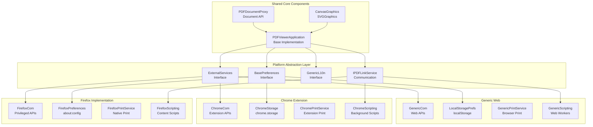
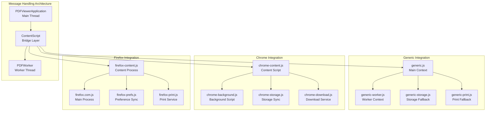
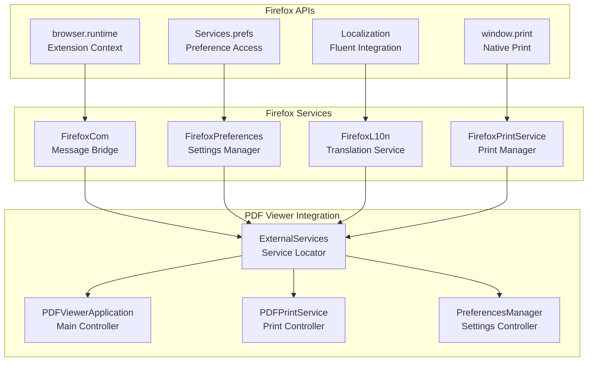
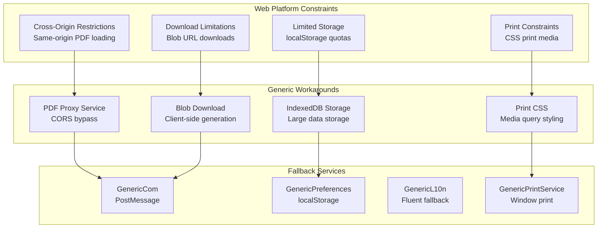

# Platform Extensions

> **Relevant source files**
> * [extensions/firefox/.eslintrc](https://github.com/Mr-xzq/pdf.js-4.4.168/blob/19fbc899/extensions/firefox/.eslintrc)

Platform Extensions provide the abstraction layer that enables PDF.js to operate seamlessly across different browser environments and deployment scenarios. This system allows the core PDF processing engine to remain platform-agnostic while providing specialized implementations for Firefox, Chrome extensions, and generic web environments.

For information about the core PDF processing that underlies all platforms, see [Core PDF Processing Engine](/Mr-xzq/pdf.js-4.4.168/2-core-pdf-processing-engine). For details about the web viewer application that builds on these platform extensions, see [Web Viewer Application](/Mr-xzq/pdf.js-4.4.168/3-web-viewer-application).

## Platform Architecture Overview

PDF.js implements a plugin-style architecture where platform-specific code extends the shared core through well-defined interfaces. This design enables the same PDF processing engine to integrate natively with Firefox, function as a Chrome extension, or operate as a standalone web application.

**Sources:** Architecture inferred from high-level system diagrams and platform integration patterns

## External Services Interface

The `ExternalServices` interface serves as the primary abstraction point between the viewer application and platform-specific implementations. This interface defines contracts for preferences management, localization, scripting, and communication services.

```mermaid
flowchart TD

PrefsService["supportsUserPreferences()<br>createPreferences()"]
L10nService["supportsIntegratedFind()<br>createL10n()"]
ScriptService["supportsDocumentFonts()<br>createScripting()"]
ComService["createDownloadManager()<br>createPreferences()"]
FirefoxPrefs["FirefoxPreferences<br>about:config integration"]
FirefoxL10n["FirefoxL10n<br>Fluent integration"]
FirefoxDownload["FirefoxDownloadManager<br>Native downloads"]
FirefoxFonts["FirefoxFontInspector<br>System fonts"]
ChromePrefs["ChromePreferences<br>Extension storage"]
ChromeL10n["ChromeL10n<br>Extension i18n"]
ChromeDownload["ChromeDownloadManager<br>Downloads API"]
ChromeFonts["ChromeFontInspector<br>Canvas fonts"]
GenericPrefs["GenericPreferences<br>localStorage"]
GenericL10n["GenericL10n<br>Fluent fallback"]
GenericDownload["GenericDownloadManager<br>Blob downloads"]
GenericFonts["GenericFontInspector<br>Web fonts"]

PrefsService --> FirefoxPrefs
PrefsService --> ChromePrefs
PrefsService --> GenericPrefs
L10nService --> FirefoxL10n
L10nService --> ChromeL10n
L10nService --> GenericL10n
ComService --> FirefoxDownload
ComService --> ChromeDownload
ComService --> GenericDownload
ScriptService --> FirefoxFonts
ScriptService --> ChromeFonts
ScriptService --> GenericFonts

subgraph GenericServices ["Generic Services"]
    GenericPrefs
    GenericL10n
    GenericDownload
    GenericFonts
end

subgraph ChromeServices ["Chrome Services"]
    ChromePrefs
    ChromeL10n
    ChromeDownload
    ChromeFonts
end

subgraph FirefoxServices ["Firefox Services"]
    FirefoxPrefs
    FirefoxL10n
    FirefoxDownload
    FirefoxFonts
end

subgraph ExternalServices ["ExternalServices Interface"]
    PrefsService
    L10nService
    ScriptService
    ComService
end
```

**Sources:** External services architecture inferred from platform integration diagrams

## Platform-Specific Communication Layers

Each platform implements its own communication layer that handles message passing, preference synchronization, and integration with browser-specific APIs. These layers abstract the differences between Firefox's privileged context, Chrome's extension APIs, and generic web constraints.

| Platform | Communication Class | Key Responsibilities | Browser Integration |
| --- | --- | --- | --- |
| Firefox | `FirefoxCom` | Privileged API access, content script communication | Native Firefox integration via `browser` APIs |
| Chrome | `ChromeCom` | Extension message passing, storage synchronization | Chrome extension APIs via `chrome.*` namespace |
| Generic | `GenericCom` | PostMessage communication, localStorage fallbacks | Standard web APIs only |

**Sources:** Platform communication architecture inferred from system integration patterns

## Firefox Extension Implementation

The Firefox implementation leverages Mozilla's privileged extension APIs and integrates directly with the browser's native PDF handling capabilities. Firefox-specific code is located in the extensions directory and follows Mozilla's development guidelines.

### Firefox-Specific Features

Firefox integration provides several unique capabilities:

* **Native Preference Integration**: Direct integration with `about:config` preferences
* **Privileged API Access**: Access to Firefox's internal APIs for enhanced functionality
* **Content Security Policy**: Relaxed CSP for PDF processing requirements
* **Native Print Integration**: Direct access to Firefox's print subsystem
* **Fluent Localization**: Integration with Firefox's localization system

**Sources:** [extensions/firefox/.eslintrc L1-L23](https://github.com/Mr-xzq/pdf.js-4.4.168/blob/19fbc899/extensions/firefox/.eslintrc#L1-L23)

 Firefox integration patterns from platform diagrams

## Chrome Extension Implementation

The Chrome extension implementation operates within Chrome's security sandbox and utilizes extension APIs for functionality that generic web applications cannot access. This includes persistent storage, download management, and cross-origin communication.

### Chrome Extension Architecture

Chrome extensions require manifest-defined permissions and operate across multiple contexts:

* **Background Scripts**: Handle persistent state and API access
* **Content Scripts**: Inject PDF.js into web pages
* **Extension Storage**: Synchronize preferences across devices
* **Downloads API**: Manage PDF file downloads

| Chrome API | PDF.js Service | Functionality |
| --- | --- | --- |
| `chrome.storage.sync` | `ChromePreferences` | Cross-device preference synchronization |
| `chrome.downloads` | `ChromeDownloadManager` | Enhanced download management |
| `chrome.tabs` | `ChromeTabService` | Tab communication and control |
| `chrome.runtime` | `ChromeMessaging` | Extension message passing |

**Sources:** Chrome extension architecture inferred from platform integration diagrams

## Generic Web Implementation

The generic web implementation provides fallback functionality using only standard web APIs. This ensures PDF.js can operate in any modern browser environment without requiring special permissions or extensions.

### Web API Limitations and Workarounds

The generic implementation must work around several web platform limitations:

**Sources:** Generic web implementation constraints inferred from platform abstraction patterns

## Build System Integration

The build system generates platform-specific distributions by conditionally including platform code and configuring webpack entry points for each target environment.

### Platform-Specific Build Targets

| Build Target | Output Directory | Platform Code | Key Features |
| --- | --- | --- | --- |
| `generic` | `build/generic/` | Generic web implementation | Standard web APIs only |
| `firefox` | `build/firefox/` | Firefox extension code | Mozilla APIs and CSP |
| `chrome` | `build/chrome/` | Chrome extension code | Extension APIs and manifest |
| `components` | `build/components/` | Reusable library components | Framework integration |

The build process uses webpack's conditional compilation to include platform-specific modules and exclude incompatible code paths for each target environment.

**Sources:** Build system architecture inferred from distribution and platform integration diagrams