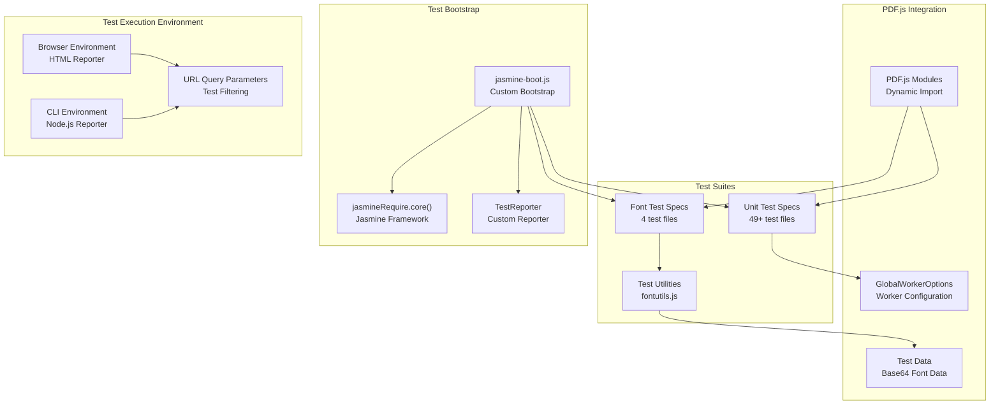
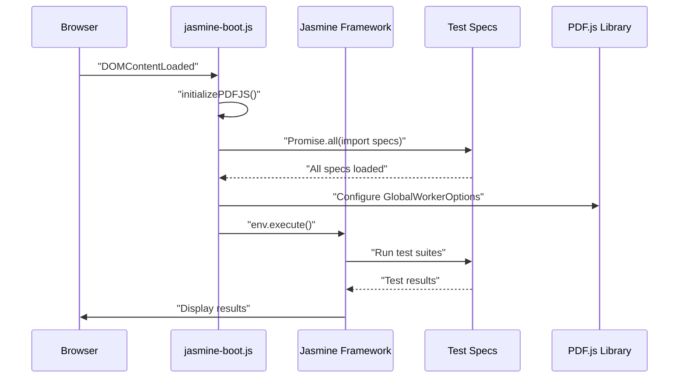
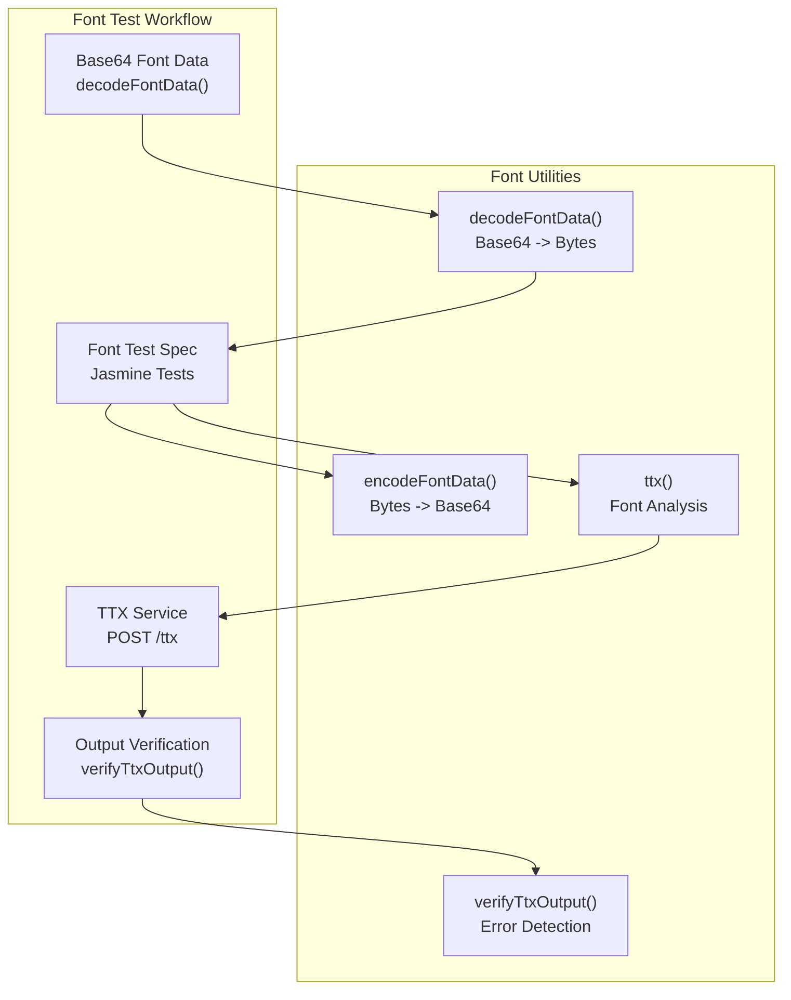
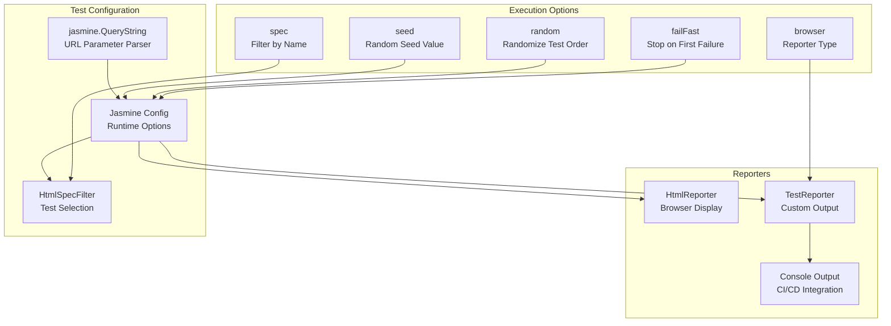

# Unit Testing

> **Relevant source files**
> * [test/font/font_core_spec.js](https://github.com/Mr-xzq/pdf.js-4.4.168/blob/19fbc899/test/font/font_core_spec.js)
> * [test/font/font_fpgm_spec.js](https://github.com/Mr-xzq/pdf.js-4.4.168/blob/19fbc899/test/font/font_fpgm_spec.js)
> * [test/font/font_os2_spec.js](https://github.com/Mr-xzq/pdf.js-4.4.168/blob/19fbc899/test/font/font_os2_spec.js)
> * [test/font/font_post_spec.js](https://github.com/Mr-xzq/pdf.js-4.4.168/blob/19fbc899/test/font/font_post_spec.js)
> * [test/font/fontutils.js](https://github.com/Mr-xzq/pdf.js-4.4.168/blob/19fbc899/test/font/fontutils.js)
> * [test/font/jasmine-boot.js](https://github.com/Mr-xzq/pdf.js-4.4.168/blob/19fbc899/test/font/jasmine-boot.js)
> * [test/unit/clitests.json](https://github.com/Mr-xzq/pdf.js-4.4.168/blob/19fbc899/test/unit/clitests.json)
> * [test/unit/jasmine-boot.js](https://github.com/Mr-xzq/pdf.js-4.4.168/blob/19fbc899/test/unit/jasmine-boot.js)

This document covers the Jasmine-based unit testing infrastructure in PDF.js, including test organization, execution environments, and specialized font testing capabilities. For information about integration testing with Puppeteer, see [Integration Testing](/Mr-xzq/pdf.js-4.4.168/6.2-integration-testing). For visual regression testing of PDF rendering, see [Visual Regression Testing](/Mr-xzq/pdf.js-4.4.168/6.3-visual-regression-testing).

## Test Framework Architecture

PDF.js uses Jasmine as its core testing framework with custom bootstrapping to handle asynchronous module loading. The testing system supports both browser-based and CLI-based test execution with specialized infrastructure for font processing tests.

## Test Infrastructure Overview



**Sources:** [test/unit/jasmine-boot.js L1-L217](https://github.com/Mr-xzq/pdf.js-4.4.168/blob/19fbc899/test/unit/jasmine-boot.js#L1-L217)

 [test/font/jasmine-boot.js L1-L161](https://github.com/Mr-xzq/pdf.js-4.4.168/blob/19fbc899/test/font/jasmine-boot.js#L1-L161)

## Test Bootstrap Process

The test bootstrap process handles asynchronous loading of PDF.js modules and test specifications:



**Sources:** [test/unit/jasmine-boot.js L47-L115](https://github.com/Mr-xzq/pdf.js-4.4.168/blob/19fbc899/test/unit/jasmine-boot.js#L47-L115)

 [test/unit/jasmine-boot.js L202-L217](https://github.com/Mr-xzq/pdf.js-4.4.168/blob/19fbc899/test/unit/jasmine-boot.js#L202-L217)

The `initializePDFJS` function loads all test specifications using dynamic imports and configures the PDF.js worker before executing tests. The bootstrap sets a 30-second timeout for test execution and configures various Jasmine options based on URL query parameters.

## Test Organization and Discovery

Unit tests are organized into separate specification files covering different PDF.js components:

| Test Category | File Pattern | Examples |
| --- | --- | --- |
| Core PDF Processing | `*_spec.js` | `parser_spec.js`, `evaluator_spec.js` |
| Display Layer | `*_spec.js` | `display_utils_spec.js`, `pdf_viewer_spec.js` |
| Font Processing | `font_*_spec.js` | `font_core_spec.js`, `font_post_spec.js` |
| Utility Functions | `*_utils_spec.js` | `core_utils_spec.js`, `ui_utils_spec.js` |
| API Testing | `api_spec.js`, `pdf_spec.js` | Main API and document tests |

**Sources:** [test/unit/jasmine-boot.js L50-L99](https://github.com/Mr-xzq/pdf.js-4.4.168/blob/19fbc899/test/unit/jasmine-boot.js#L50-L99)

 [test/unit/clitests.json L6-L56](https://github.com/Mr-xzq/pdf.js-4.4.168/blob/19fbc899/test/unit/clitests.json#L6-L56)

The CLI test configuration in `clitests.json` defines which specification files are executed in headless environments, ensuring consistent test coverage across different execution contexts.

## Font Testing Infrastructure

Font tests use specialized utilities for processing and validating font data:



**Sources:** [test/font/fontutils.js L19-L48](https://github.com/Mr-xzq/pdf.js-4.4.168/blob/19fbc899/test/font/fontutils.js#L19-L48)

 [test/font/font_post_spec.js L1-L218](https://github.com/Mr-xzq/pdf.js-4.4.168/blob/19fbc899/test/font/font_post_spec.js#L1-L218)

The font testing utilities provide functions for:

* `decodeFontData()`: Converting base64-encoded font data to byte arrays
* `encodeFontData()`: Converting byte arrays back to base64 for transmission
* `ttx()`: Calling external TTX service for font analysis
* `verifyTtxOutput()`: Parsing TTX output for error conditions

## Test Configuration and Execution

Test execution is controlled through URL query parameters and Jasmine configuration:



**Sources:** [test/unit/jasmine-boot.js L128-L190](https://github.com/Mr-xzq/pdf.js-4.4.168/blob/19fbc899/test/unit/jasmine-boot.js#L128-L190)

 [test/unit/testreporter.js](https://github.com/Mr-xzq/pdf.js-4.4.168/blob/19fbc899/test/unit/testreporter.js)

The test system supports various execution modes:

* **Filtered execution**: Using `spec` parameter to run specific tests
* **Randomized order**: Using `random` and `seed` parameters for non-deterministic execution
* **Fail-fast mode**: Stopping execution on first test failure
* **Browser reporting**: Custom reporter for automated test environments

## Worker Configuration

Unit tests configure the PDF.js worker for proper operation in test environments:

```
// Configure the worker for unit tests
GlobalWorkerOptions.workerSrc = "../../build/generic/build/pdf.worker.mjs";
```

**Sources:** [test/unit/jasmine-boot.js L111-L112](https://github.com/Mr-xzq/pdf.js-4.4.168/blob/19fbc899/test/unit/jasmine-boot.js#L111-L112)

The worker configuration ensures that PDF processing operations in tests use the correct worker script location relative to the test files. This is essential for tests that involve PDF parsing and rendering operations.

## Test Data Management

Font tests use embedded test data encoded as base64 strings to ensure consistent test inputs:

```javascript
const font2109 = decodeFontData(
  "AAEAAAAMAIAAAwBAT1MvMgVKk3wAAADMAAAATmN2dCBsduxjAAABGgAAADpm..."
);
```

**Sources:** [test/font/font_post_spec.js L9-L12](https://github.com/Mr-xzq/pdf.js-4.4.168/blob/19fbc899/test/font/font_post_spec.js#L9-L12)

 [test/font/font_os2_spec.js L9-L16](https://github.com/Mr-xzq/pdf.js-4.4.168/blob/19fbc899/test/font/font_os2_spec.js#L9-L16)

This approach allows tests to run with known font data without requiring external font files, ensuring test reliability and portability across different environments.