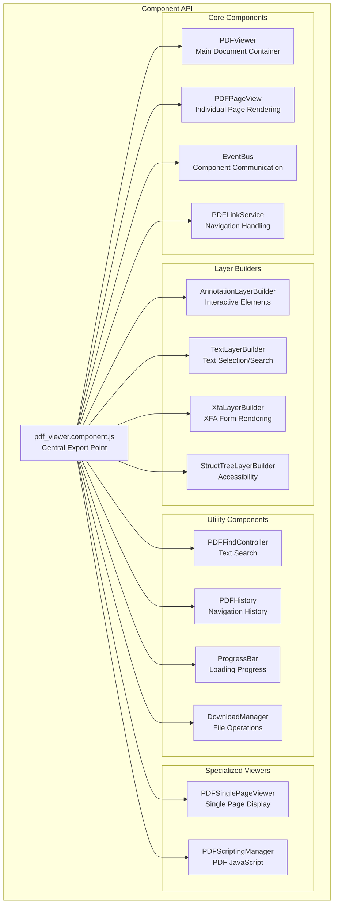
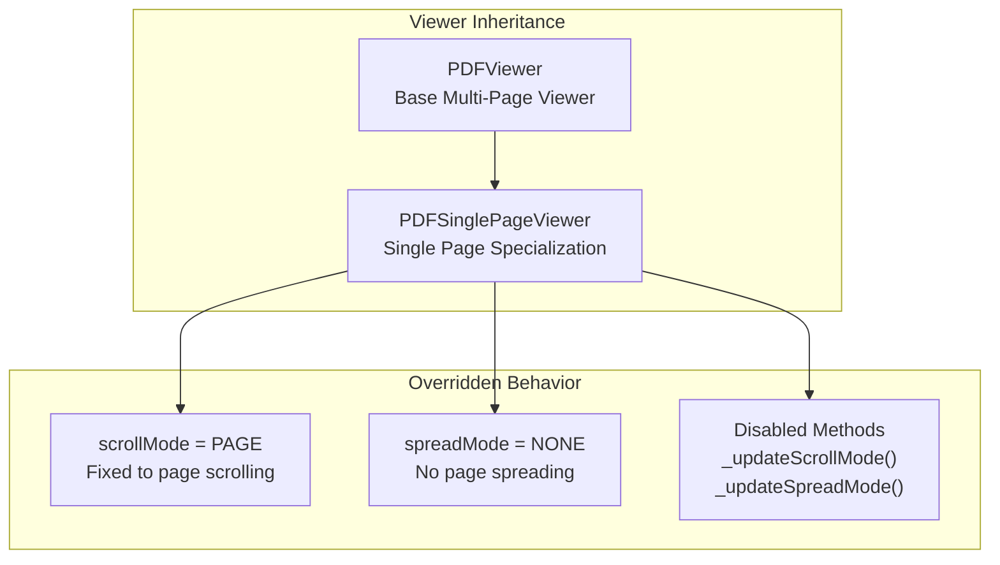
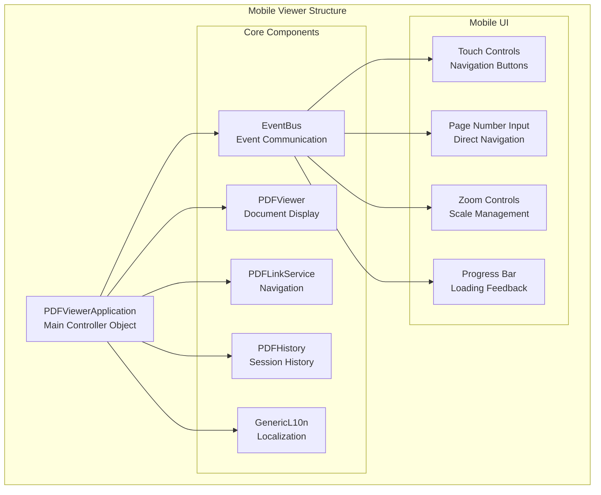
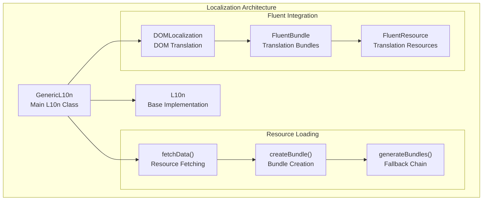
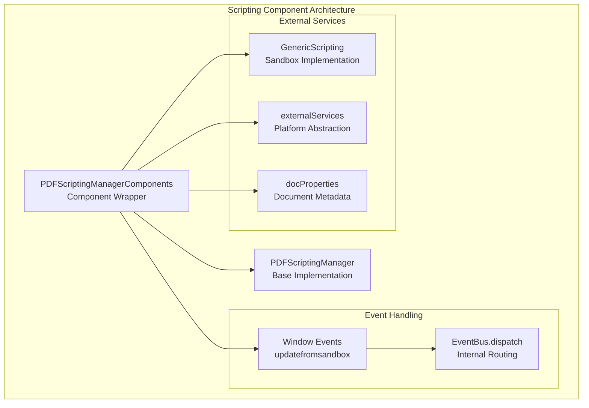
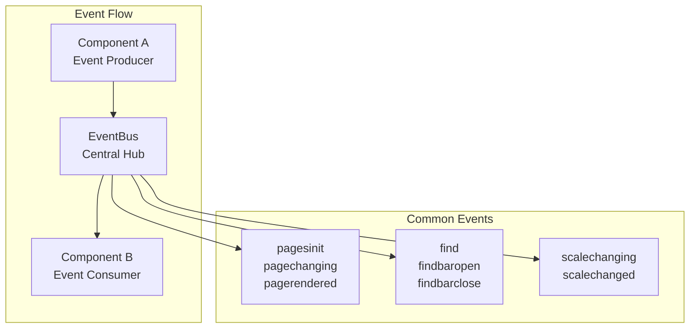

# Component System

> **Relevant source files**
> * [.stylelintrc](https://github.com/Mr-xzq/pdf.js-4.4.168/blob/19fbc899/.stylelintrc)
> * [examples/mobile-viewer/README.md](https://github.com/Mr-xzq/pdf.js-4.4.168/blob/19fbc899/examples/mobile-viewer/README.md)
> * [examples/mobile-viewer/viewer.css](https://github.com/Mr-xzq/pdf.js-4.4.168/blob/19fbc899/examples/mobile-viewer/viewer.css)
> * [examples/mobile-viewer/viewer.html](https://github.com/Mr-xzq/pdf.js-4.4.168/blob/19fbc899/examples/mobile-viewer/viewer.html)
> * [examples/mobile-viewer/viewer.mjs](https://github.com/Mr-xzq/pdf.js-4.4.168/blob/19fbc899/examples/mobile-viewer/viewer.mjs)
> * [test/unit/pdf_viewer.component_spec.js](https://github.com/Mr-xzq/pdf.js-4.4.168/blob/19fbc899/test/unit/pdf_viewer.component_spec.js)
> * [test/xfa_layer_builder_overrides.css](https://github.com/Mr-xzq/pdf.js-4.4.168/blob/19fbc899/test/xfa_layer_builder_overrides.css)
> * [web/debugger.css](https://github.com/Mr-xzq/pdf.js-4.4.168/blob/19fbc899/web/debugger.css)
> * [web/genericl10n.js](https://github.com/Mr-xzq/pdf.js-4.4.168/blob/19fbc899/web/genericl10n.js)
> * [web/l10n.js](https://github.com/Mr-xzq/pdf.js-4.4.168/blob/19fbc899/web/l10n.js)
> * [web/pdf_scripting_manager.component.js](https://github.com/Mr-xzq/pdf.js-4.4.168/blob/19fbc899/web/pdf_scripting_manager.component.js)
> * [web/pdf_single_page_viewer.js](https://github.com/Mr-xzq/pdf.js-4.4.168/blob/19fbc899/web/pdf_single_page_viewer.js)
> * [web/pdf_viewer.component.js](https://github.com/Mr-xzq/pdf.js-4.4.168/blob/19fbc899/web/pdf_viewer.component.js)

The Component System provides modular, reusable PDF.js building blocks that can be composed into custom viewers and integrated into third-party applications. This system enables developers to use specific PDF.js functionality without requiring the full web viewer application.

For information about the complete web viewer application, see [Web Viewer Application](/Mr-xzq/pdf.js-4.4.168/3-web-viewer-application). For details about platform-specific integrations, see [Platform Extensions](/Mr-xzq/pdf.js-4.4.168/7-platform-extensions).

## Purpose and Architecture

The Component System serves three primary purposes:

1. **Modular Integration**: Enables embedding specific PDF.js functionality into existing applications
2. **Mobile Optimization**: Provides streamlined components optimized for mobile and touch interfaces
3. **Platform Abstraction**: Offers generic implementations that work across different JavaScript environments

The system is built around composable components that can be used independently or combined to create custom PDF viewing experiences.

### Component Export Structure



Sources: [web/pdf_viewer.component.js L49-L72](https://github.com/Mr-xzq/pdf.js-4.4.168/blob/19fbc899/web/pdf_viewer.component.js#L49-L72)

 [test/unit/pdf_viewer.component_spec.js L48-L71](https://github.com/Mr-xzq/pdf.js-4.4.168/blob/19fbc899/test/unit/pdf_viewer.component_spec.js#L48-L71)

## Core Component Classes

The component system provides several categories of reusable classes:

| Component Category | Classes | Purpose |
| --- | --- | --- |
| **Viewer Components** | `PDFViewer`, `PDFSinglePageViewer`, `PDFPageView` | Document display and page rendering |
| **Layer Builders** | `AnnotationLayerBuilder`, `TextLayerBuilder`, `XfaLayerBuilder`, `StructTreeLayerBuilder` | Content layer management |
| **Navigation** | `PDFLinkService`, `SimpleLinkService`, `PDFHistory` | Document navigation and history |
| **Search & Interaction** | `PDFFindController`, `PDFScriptingManager` | Text search and JavaScript execution |
| **Utilities** | `EventBus`, `ProgressBar`, `DownloadManager` | Communication and file operations |
| **Localization** | `GenericL10n` | Internationalization support |

### PDFSinglePageViewer Implementation

The `PDFSinglePageViewer` demonstrates component specialization by extending the base `PDFViewer` class:



Sources: [web/pdf_single_page_viewer.js L19-L35](https://github.com/Mr-xzq/pdf.js-4.4.168/blob/19fbc899/web/pdf_single_page_viewer.js#L19-L35)

## Mobile Viewer Implementation

The mobile viewer example demonstrates how components can be composed into a touch-optimized PDF viewer:

### Mobile Architecture



Sources: [examples/mobile-viewer/viewer.mjs L36-L348](https://github.com/Mr-xzq/pdf.js-4.4.168/blob/19fbc899/examples/mobile-viewer/viewer.mjs#L36-L348)

 [examples/mobile-viewer/viewer.html L31-L53](https://github.com/Mr-xzq/pdf.js-4.4.168/blob/19fbc899/examples/mobile-viewer/viewer.html#L31-L53)

### Mobile Configuration

The mobile viewer uses specific configurations optimized for mobile devices:

| Configuration | Value | Purpose |
| --- | --- | --- |
| `MAX_CANVAS_PIXELS` | 0 | CSS-only zooming for performance |
| `TEXT_LAYER_MODE` | 0 (DISABLE) | Simplified text handling |
| `MAX_IMAGE_SIZE` | 1024 * 1024 | Memory optimization |

Sources: [examples/mobile-viewer/viewer.mjs L21-L23](https://github.com/Mr-xzq/pdf.js-4.4.168/blob/19fbc899/examples/mobile-viewer/viewer.mjs#L21-L23)

## Platform Abstraction Components

### Localization Component

The `GenericL10n` class provides platform-independent internationalization:



Sources: [web/genericl10n.js L36-L122](https://github.com/Mr-xzq/pdf.js-4.4.168/blob/19fbc899/web/genericl10n.js#L36-L122)

 [web/l10n.js L23-L131](https://github.com/Mr-xzq/pdf.js-4.4.168/blob/19fbc899/web/l10n.js#L23-L131)

### Scripting Manager Component

The component version of `PDFScriptingManager` provides platform abstraction for PDF JavaScript execution:



Sources: [web/pdf_scripting_manager.component.js L19-L38](https://github.com/Mr-xzq/pdf.js-4.4.168/blob/19fbc899/web/pdf_scripting_manager.component.js#L19-L38)

## Component Integration Patterns

### Event-Driven Communication

Components communicate through the `EventBus` system, enabling loose coupling:



Sources: [examples/mobile-viewer/viewer.mjs L267-L346](https://github.com/Mr-xzq/pdf.js-4.4.168/blob/19fbc899/examples/mobile-viewer/viewer.mjs#L267-L346)

 [web/event_utils.js](https://github.com/Mr-xzq/pdf.js-4.4.168/blob/19fbc899/web/event_utils.js)

### Service Injection

Components accept service dependencies through constructor injection, enabling platform customization:

| Service Interface | Default Implementation | Purpose |
| --- | --- | --- |
| `linkService` | `PDFLinkService` | Navigation handling |
| `l10n` | `GenericL10n` | Localization |
| `externalServices` | Platform-specific | External integrations |
| `eventBus` | `EventBus` | Component communication |

Sources: [examples/mobile-viewer/viewer.mjs L270-L286](https://github.com/Mr-xzq/pdf.js-4.4.168/blob/19fbc899/examples/mobile-viewer/viewer.mjs#L270-L286)

## Usage Examples

### Basic Component Usage

```javascript
// Initialize core components
const eventBus = new pdfjsViewer.EventBus();
const linkService = new pdfjsViewer.PDFLinkService({ eventBus });
const l10n = new pdfjsViewer.GenericL10n();

// Create viewer with components
const pdfViewer = new pdfjsViewer.PDFViewer({
  container: document.getElementById('viewerContainer'),
  eventBus,
  linkService,
  l10n
});
```

### Mobile-Optimized Configuration

```javascript
const pdfViewer = new pdfjsViewer.PDFViewer({
  container,
  eventBus,
  linkService,
  l10n,
  maxCanvasPixels: 0,        // CSS-only zooming
  textLayerMode: 0,          // Disable text layer
});
```

Sources: [examples/mobile-viewer/viewer.mjs L278-L285](https://github.com/Mr-xzq/pdf.js-4.4.168/blob/19fbc899/examples/mobile-viewer/viewer.mjs#L278-L285)

The Component System enables flexible PDF.js integration by providing modular, platform-independent building blocks that can be composed into custom viewing experiences optimized for specific use cases and platforms.