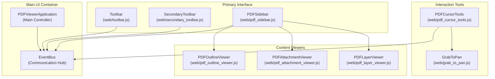
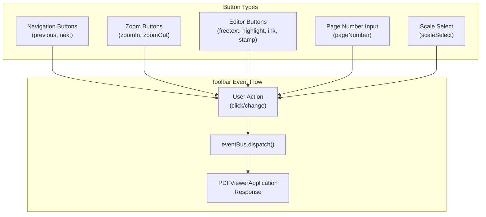
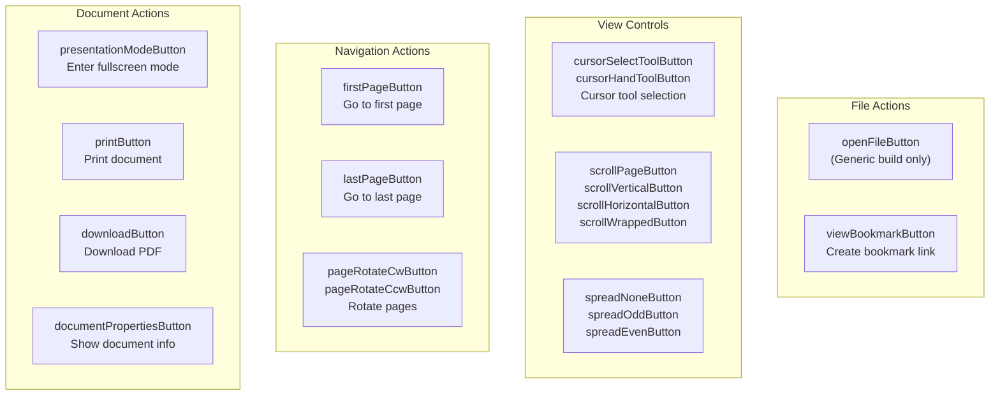

# User Interface Components

> **Relevant source files**
> * [test/text_layer_test.css](https://github.com/Mr-xzq/pdf.js-4.4.168/blob/19fbc899/test/text_layer_test.css)
> * [web/base_tree_viewer.js](https://github.com/Mr-xzq/pdf.js-4.4.168/blob/19fbc899/web/base_tree_viewer.js)
> * [web/images/gv-toolbarButton-download.svg](https://github.com/Mr-xzq/pdf.js-4.4.168/blob/19fbc899/web/images/gv-toolbarButton-download.svg)
> * [web/pdf_attachment_viewer.js](https://github.com/Mr-xzq/pdf.js-4.4.168/blob/19fbc899/web/pdf_attachment_viewer.js)
> * [web/pdf_cursor_tools.js](https://github.com/Mr-xzq/pdf.js-4.4.168/blob/19fbc899/web/pdf_cursor_tools.js)
> * [web/pdf_layer_viewer.js](https://github.com/Mr-xzq/pdf.js-4.4.168/blob/19fbc899/web/pdf_layer_viewer.js)
> * [web/pdf_outline_viewer.js](https://github.com/Mr-xzq/pdf.js-4.4.168/blob/19fbc899/web/pdf_outline_viewer.js)
> * [web/pdf_sidebar.js](https://github.com/Mr-xzq/pdf.js-4.4.168/blob/19fbc899/web/pdf_sidebar.js)
> * [web/pdf_viewer.css](https://github.com/Mr-xzq/pdf.js-4.4.168/blob/19fbc899/web/pdf_viewer.css)
> * [web/secondary_toolbar.js](https://github.com/Mr-xzq/pdf.js-4.4.168/blob/19fbc899/web/secondary_toolbar.js)
> * [web/text_layer_builder.css](https://github.com/Mr-xzq/pdf.js-4.4.168/blob/19fbc899/web/text_layer_builder.css)
> * [web/toolbar-geckoview.js](https://github.com/Mr-xzq/pdf.js-4.4.168/blob/19fbc899/web/toolbar-geckoview.js)
> * [web/toolbar.js](https://github.com/Mr-xzq/pdf.js-4.4.168/blob/19fbc899/web/toolbar.js)
> * [web/viewer-geckoview.css](https://github.com/Mr-xzq/pdf.js-4.4.168/blob/19fbc899/web/viewer-geckoview.css)
> * [web/viewer-geckoview.html](https://github.com/Mr-xzq/pdf.js-4.4.168/blob/19fbc899/web/viewer-geckoview.html)
> * [web/viewer-geckoview.js](https://github.com/Mr-xzq/pdf.js-4.4.168/blob/19fbc899/web/viewer-geckoview.js)

This section covers the user interface components that make up the PDF.js web viewer application. These components provide the interactive controls, navigation elements, and content viewers that users interact with when viewing PDF documents in a web browser.

For information about the core PDF rendering and page display system, see [Page Rendering System](/Mr-xzq/pdf.js-4.4.168/3.3-page-rendering-system). For details about annotation editing interfaces, see [Annotation and Form Handling](/Mr-xzq/pdf.js-4.4.168/3.4-annotation-and-form-handling).

## UI Architecture Overview

The PDF.js viewer UI is built around a modular component system where each major interface element is implemented as a separate class with well-defined responsibilities. The components communicate through the centralized `EventBus` system and are orchestrated by the main `PDFViewerApplication`.



Sources: [web/toolbar.js L47-L343](https://github.com/Mr-xzq/pdf.js-4.4.168/blob/19fbc899/web/toolbar.js#L47-L343)

 [web/secondary_toolbar.js L56-L313](https://github.com/Mr-xzq/pdf.js-4.4.168/blob/19fbc899/web/secondary_toolbar.js#L56-L313)

 [web/pdf_sidebar.js L69-L510](https://github.com/Mr-xzq/pdf.js-4.4.168/blob/19fbc899/web/pdf_sidebar.js#L69-L510)

 [web/pdf_cursor_tools.js L31-L178](https://github.com/Mr-xzq/pdf.js-4.4.168/blob/19fbc899/web/pdf_cursor_tools.js#L31-L178)

## Primary Toolbar

The `Toolbar` class provides the main interface controls including navigation, zoom, and annotation editing tools. It manages page numbers, scale selection, and various action buttons.

### Toolbar Structure

| Component | Type | Purpose |
| --- | --- | --- |
| `pageNumber` | HTMLInputElement | Current page input field |
| `numPages` | HTMLSpanElement | Total page count display |
| `scaleSelect` | HTMLSelectElement | Zoom level selector |
| `previous/next` | HTMLButtonElement | Page navigation buttons |
| `zoomIn/zoomOut` | HTMLButtonElement | Zoom control buttons |
| `editorFreeTextButton` | HTMLButtonElement | FreeText annotation mode |
| `editorHighlightButton` | HTMLButtonElement | Highlight annotation mode |
| `editorInkButton` | HTMLButtonElement | Ink annotation mode |
| `editorStampButton` | HTMLButtonElement | Stamp annotation mode |



Sources: [web/toolbar.js L47-L343](https://github.com/Mr-xzq/pdf.js-4.4.168/blob/19fbc899/web/toolbar.js#L47-L343)

 [web/toolbar.js L180-L237](https://github.com/Mr-xzq/pdf.js-4.4.168/blob/19fbc899/web/toolbar.js#L180-L237)

### Event Handling and State Management

The toolbar uses a declarative approach where button configurations include event names and details. The `#bindListeners` method sets up event handlers that dispatch standardized events through the EventBus.

Key methods:

* `setPageNumber(pageNumber, pageLabel)` - Updates page display
* `setPagesCount(pagesCount, hasPageLabels)` - Sets total page count
* `setPageScale(pageScaleValue, pageScale)` - Updates zoom level
* `#updateUIState(resetNumPages)` - Synchronizes UI with application state

Sources: [web/toolbar.js L148-L174](https://github.com/Mr-xzq/pdf.js-4.4.168/blob/19fbc899/web/toolbar.js#L148-L174)

 [web/toolbar.js L279-L335](https://github.com/Mr-xzq/pdf.js-4.4.168/blob/19fbc899/web/toolbar.js#L279-L335)

## Secondary Toolbar

The `SecondaryToolbar` provides additional functionality that is typically hidden by default and accessed through a toggle button. It includes presentation mode, printing, downloading, and view mode controls.

### Secondary Toolbar Features



Sources: [web/secondary_toolbar.js L65-L152](https://github.com/Mr-xzq/pdf.js-4.4.168/blob/19fbc899/web/secondary_toolbar.js#L65-L152)

 [web/secondary_toolbar.js L243-L282](https://github.com/Mr-xzq/pdf.js-4.4.168/blob/19fbc899/web/secondary_toolbar.js#L243-L282)

The secondary toolbar implements smart state management that disables certain controls based on document conditions, such as disabling scroll mode buttons for very large documents.

Sources: [web/secondary_toolbar.js L260-L274](https://github.com/Mr-xzq/pdf.js-4.4.168/blob/19fbc899/web/secondary_toolbar.js#L260-L274)

## Sidebar System

The `PDFSidebar` class manages a collapsible sidebar that contains multiple view modes for different types of document content. It supports thumbnails, outline/bookmarks, attachments, and optional content layers.

### Sidebar View Management

```

```

The sidebar implements view state management through the `SidebarView` enumeration:

* `NONE` - Sidebar closed
* `THUMBS` - Thumbnail view
* `OUTLINE` - Document outline/bookmarks
* `ATTACHMENTS` - File attachments
* `LAYERS` - Optional content layers

Sources: [web/pdf_sidebar.js L135-L241](https://github.com/Mr-xzq/pdf.js-4.4.168/blob/19fbc899/web/pdf_sidebar.js#L135-L241)

 [web/ui_utils.js](https://github.com/Mr-xzq/pdf.js-4.4.168/blob/19fbc899/web/ui_utils.js)

 (SidebarView constants)

### Sidebar Resizing

The sidebar supports user-controlled resizing through a drag handle. The resize system includes:

* Mouse event handling for drag operations
* Width constraints (minimum 200px, maximum 50% of container width)
* RTL text direction support
* Transition animations that are disabled during resize operations

Sources: [web/pdf_sidebar.js L415-L507](https://github.com/Mr-xzq/pdf.js-4.4.168/blob/19fbc899/web/pdf_sidebar.js#L415-L507)

 [web/pdf_sidebar.js L470-L507](https://github.com/Mr-xzq/pdf.js-4.4.168/blob/19fbc899/web/pdf_sidebar.js#L470-L507)

## Tree-based Content Viewers

Three specialized viewers extend the `BaseTreeViewer` abstract class to display hierarchical content in the sidebar.

### Base Tree Viewer Architecture

```

```

Sources: [web/base_tree_viewer.js L21-L189](https://github.com/Mr-xzq/pdf.js-4.4.168/blob/19fbc899/web/base_tree_viewer.js#L21-L189)

 [web/pdf_outline_viewer.js L40-L360](https://github.com/Mr-xzq/pdf.js-4.4.168/blob/19fbc899/web/pdf_outline_viewer.js#L40-L360)

 [web/pdf_attachment_viewer.js L36-L168](https://github.com/Mr-xzq/pdf.js-4.4.168/blob/19fbc899/web/pdf_attachment_viewer.js#L36-L168)

 [web/pdf_layer_viewer.js L37-L215](https://github.com/Mr-xzq/pdf.js-4.4.168/blob/19fbc899/web/pdf_layer_viewer.js#L37-L215)

### Outline Viewer

The `PDFOutlineViewer` displays document bookmarks/outline in a hierarchical tree structure. It supports:

* Nested outline items with expand/collapse toggles
* Navigation to bookmark destinations
* Current outline item highlighting based on page position
* Text styling (bold/italic) preservation from PDF outline

Key features:

* Automatic current item detection via `_currentOutlineItem()` method
* Destination hash mapping for page-to-outline correlation
* Support for various destination types (pages, URLs, named actions)

Sources: [web/pdf_outline_viewer.js L208-L357](https://github.com/Mr-xzq/pdf.js-4.4.168/blob/19fbc899/web/pdf_outline_viewer.js#L208-L357)

 [web/pdf_outline_viewer.js L260-L293](https://github.com/Mr-xzq/pdf.js-4.4.168/blob/19fbc899/web/pdf_outline_viewer.js#L260-L293)

### Attachment Viewer

The `PDFAttachmentViewer` handles file attachments embedded in PDF documents. It automatically detects both:

1. Document-level attachments from the PDF attachment dictionary
2. FileAttachment annotations discovered during page rendering

The viewer implements deferred event dispatching to allow time for FileAttachment annotations to be processed during initial page load.

Sources: [web/pdf_attachment_viewer.js L65-L91](https://github.com/Mr-xzq/pdf.js-4.4.168/blob/19fbc899/web/pdf_attachment_viewer.js#L65-L91)

 [web/pdf_attachment_viewer.js L144-L165](https://github.com/Mr-xzq/pdf.js-4.4.168/blob/19fbc899/web/pdf_attachment_viewer.js#L144-L165)

### Layer Viewer

The `PDFLayerViewer` manages PDF Optional Content Groups (layers), allowing users to toggle visibility of different content layers within the document.

Features:

* Checkbox controls for each layer group
* Nested layer group support
* Real-time visibility updates through `optionalContentConfig`
* Integration with the PDF's optional content system

Sources: [web/pdf_layer_viewer.js L125-L183](https://github.com/Mr-xzq/pdf.js-4.4.168/blob/19fbc899/web/pdf_layer_viewer.js#L125-L183)

 [web/pdf_layer_viewer.js L69-L91](https://github.com/Mr-xzq/pdf.js-4.4.168/blob/19fbc899/web/pdf_layer_viewer.js#L69-L91)

## Cursor Tools and Interaction Management

The `PDFCursorTools` class manages different interaction modes for the PDF viewer, coordinating between selection, hand tool, and zoom modes.

### Cursor Tool State Management

```

```

The cursor tools system implements a state machine that automatically disables cursor tool switching when the viewer enters certain modes like presentation mode or annotation editing.

Key methods:

* `switchTool(tool)` - Changes active cursor tool
* `#addEventListeners()` - Sets up mode change detection
* Private state tracking via `#active` and `#prevActive` properties

Sources: [web/pdf_cursor_tools.js L63-L107](https://github.com/Mr-xzq/pdf.js-4.4.168/blob/19fbc899/web/pdf_cursor_tools.js#L63-L107)

 [web/pdf_cursor_tools.js L109-L162](https://github.com/Mr-xzq/pdf.js-4.4.168/blob/19fbc899/web/pdf_cursor_tools.js#L109-L162)

## Styling and Layout System

The UI components use a CSS custom property system for theming and responsive design. The styling is organized across multiple files:

### Style Architecture

| File | Purpose |
| --- | --- |
| `pdf_viewer.css` | Core viewer layout and page styling |
| `text_layer_builder.css` | Text layer and highlighting styles |
| `annotation_layer_builder.css` | Annotation display styles |
| `viewer-geckoview.css` | GeckoView-specific styling |

### CSS Custom Properties

The theming system uses CSS custom properties for consistent styling:

```css
:root {
  --scale-factor: 1;
  --page-margin: 1px auto -8px;
  --page-border: 9px solid transparent;
  --loading-icon-delay: 400ms;
}
```

The system includes responsive breakpoints and high contrast mode support through `@media` queries for `forced-colors: active` and `prefers-color-scheme: dark`.

Sources: [web/pdf_viewer.css L22-L29](https://github.com/Mr-xzq/pdf.js-4.4.168/blob/19fbc899/web/pdf_viewer.css#L22-L29)

 [web/pdf_viewer.css L31-L38](https://github.com/Mr-xzq/pdf.js-4.4.168/blob/19fbc899/web/pdf_viewer.css#L31-L38)

 [web/viewer-geckoview.css L18-L75](https://github.com/Mr-xzq/pdf.js-4.4.168/blob/19fbc899/web/viewer-geckoview.css#L18-L75)

### Component-specific Styling

Each UI component has specific styling considerations:

* **Toolbar buttons**: Icon-based with CSS mask properties for scalable icons
* **Sidebar**: Flexible width with drag-resize capability and transition animations
* **Tree viewers**: Indentation-based hierarchy with toggle button styling
* **Text layer**: Transparent overlay with selection highlighting support

Sources: [web/viewer-geckoview.css L197-L232](https://github.com/Mr-xzq/pdf.js-4.4.168/blob/19fbc899/web/viewer-geckoview.css#L197-L232)

 [web/text_layer_builder.css L55-L96](https://github.com/Mr-xzq/pdf.js-4.4.168/blob/19fbc899/web/text_layer_builder.css#L55-L96)

 [web/pdf_sidebar.js L27-L30](https://github.com/Mr-xzq/pdf.js-4.4.168/blob/19fbc899/web/pdf_sidebar.js#L27-L30)