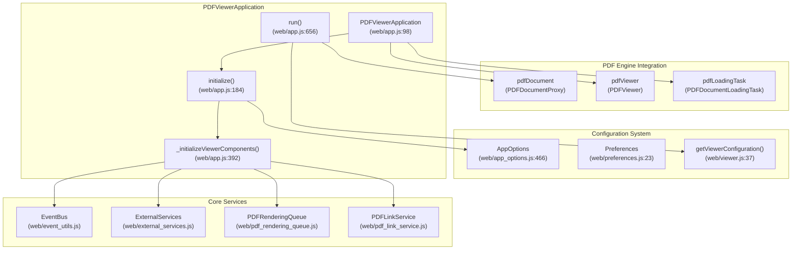
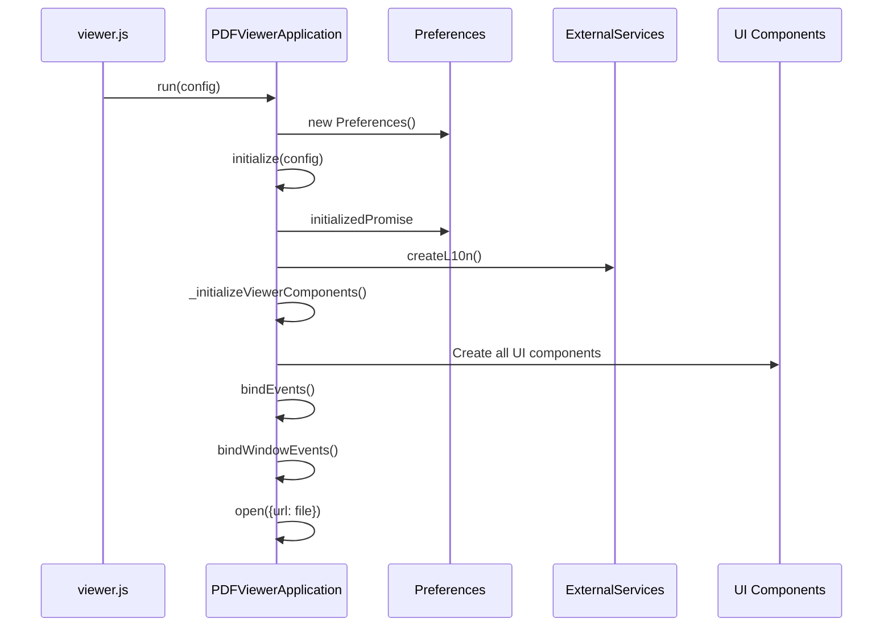
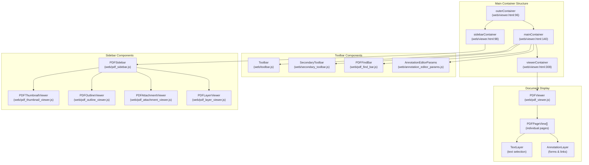
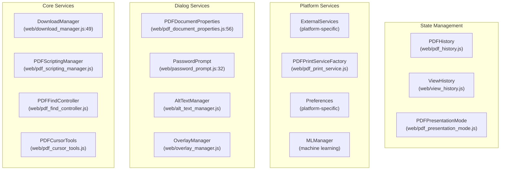
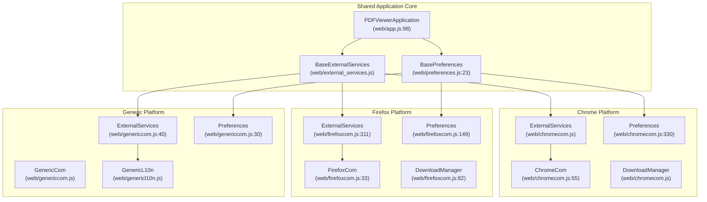
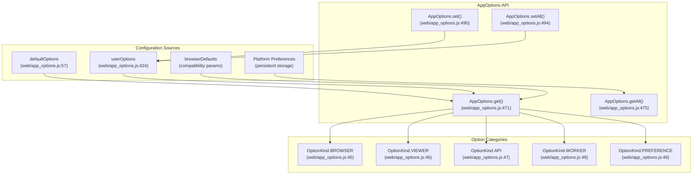
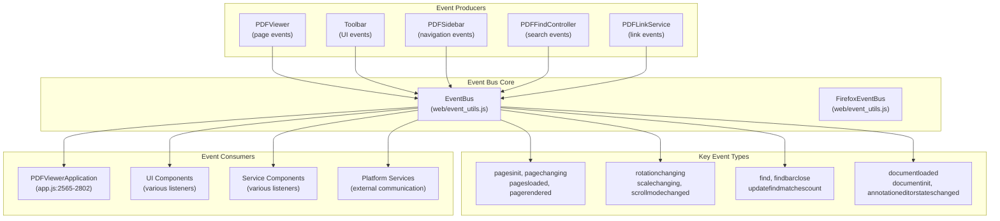
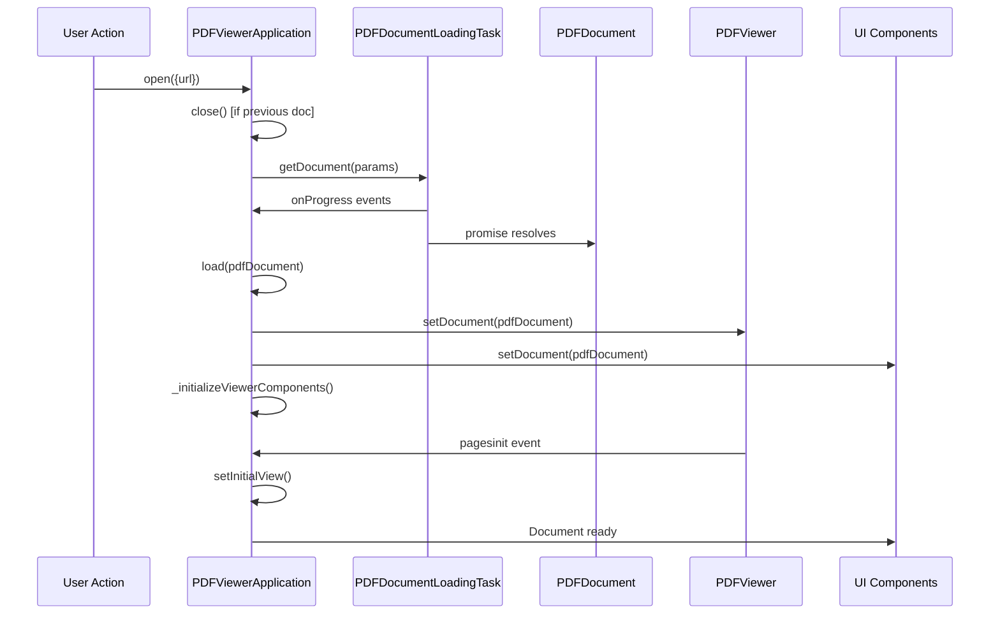
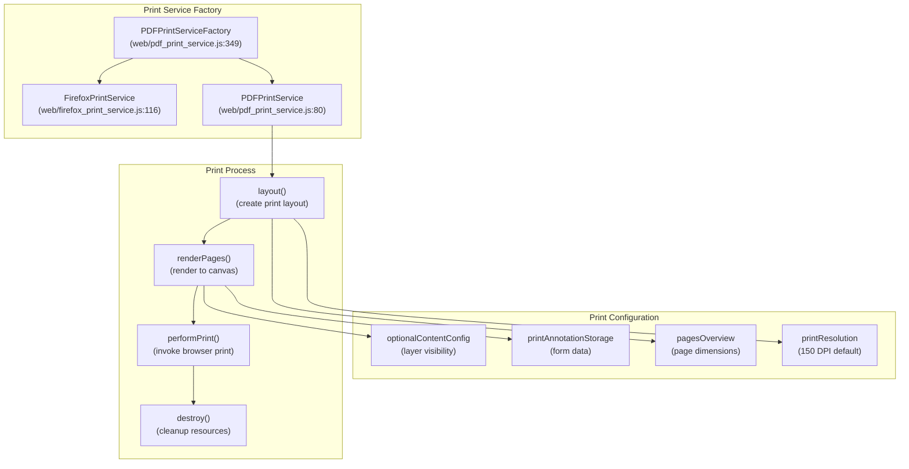

# Web Viewer Application

> **Relevant source files**
> * [extensions/chromium/preferences_schema.json](https://github.com/Mr-xzq/pdf.js-4.4.168/blob/19fbc899/extensions/chromium/preferences_schema.json)
> * [web/app.js](https://github.com/Mr-xzq/pdf.js-4.4.168/blob/19fbc899/web/app.js)
> * [web/app_options.js](https://github.com/Mr-xzq/pdf.js-4.4.168/blob/19fbc899/web/app_options.js)
> * [web/chromecom.js](https://github.com/Mr-xzq/pdf.js-4.4.168/blob/19fbc899/web/chromecom.js)
> * [web/download_manager.js](https://github.com/Mr-xzq/pdf.js-4.4.168/blob/19fbc899/web/download_manager.js)
> * [web/firefox_print_service.js](https://github.com/Mr-xzq/pdf.js-4.4.168/blob/19fbc899/web/firefox_print_service.js)
> * [web/firefoxcom.js](https://github.com/Mr-xzq/pdf.js-4.4.168/blob/19fbc899/web/firefoxcom.js)
> * [web/genericcom.js](https://github.com/Mr-xzq/pdf.js-4.4.168/blob/19fbc899/web/genericcom.js)
> * [web/password_prompt.js](https://github.com/Mr-xzq/pdf.js-4.4.168/blob/19fbc899/web/password_prompt.js)
> * [web/pdf_document_properties.js](https://github.com/Mr-xzq/pdf.js-4.4.168/blob/19fbc899/web/pdf_document_properties.js)
> * [web/pdf_print_service.js](https://github.com/Mr-xzq/pdf.js-4.4.168/blob/19fbc899/web/pdf_print_service.js)
> * [web/preferences.js](https://github.com/Mr-xzq/pdf.js-4.4.168/blob/19fbc899/web/preferences.js)
> * [web/viewer.css](https://github.com/Mr-xzq/pdf.js-4.4.168/blob/19fbc899/web/viewer.css)
> * [web/viewer.html](https://github.com/Mr-xzq/pdf.js-4.4.168/blob/19fbc899/web/viewer.html)
> * [web/viewer.js](https://github.com/Mr-xzq/pdf.js-4.4.168/blob/19fbc899/web/viewer.js)

## Purpose and Scope

The Web Viewer Application provides a complete, browser-based PDF viewing experience built on top of the Core PDF Processing Engine. It includes the user interface, application orchestration, platform abstraction, and all the interactive features that end users interact with when viewing PDFs in browsers.

This document covers the application-level architecture, component system, and platform integration. For information about the underlying PDF parsing and rendering systems, see [Core PDF Processing Engine](/Mr-xzq/pdf.js-4.4.168/2-core-pdf-processing-engine). For details about interactive annotation editing, see [Annotation Editor System](/Mr-xzq/pdf.js-4.4.168/4-annotation-editor-system).

## Application Architecture

The Web Viewer Application is orchestrated by the `PDFViewerApplication` object, which serves as the central coordinator for all viewer components, services, and lifecycle management.

### Core Application Object

The `PDFViewerApplication` object maintains references to all major components and handles the application lifecycle from initialization through document loading and cleanup.

Sources: [web/app.js L98-L182](https://github.com/Mr-xzq/pdf.js-4.4.168/blob/19fbc899/web/app.js#L98-L182)

 [web/viewer.js L37-L180](https://github.com/Mr-xzq/pdf.js-4.4.168/blob/19fbc899/web/viewer.js#L37-L180)

 [web/app_options.js L466-L532](https://github.com/Mr-xzq/pdf.js-4.4.168/blob/19fbc899/web/app_options.js#L466-L532)

### Component Initialization Flow

The initialization process follows a strict sequence to ensure all dependencies are properly set up before the viewer becomes interactive.

Sources: [web/app.js L656-L752](https://github.com/Mr-xzq/pdf.js-4.4.168/blob/19fbc899/web/app.js#L656-L752)

 [web/app.js L184-L260](https://github.com/Mr-xzq/pdf.js-4.4.168/blob/19fbc899/web/app.js#L184-L260)

 [web/app.js L392-L654](https://github.com/Mr-xzq/pdf.js-4.4.168/blob/19fbc899/web/app.js#L392-L654)

## Component System

The Web Viewer Application consists of several major component categories that work together to provide the complete viewing experience.

### UI Component Architecture

Each UI component is instantiated and managed by the `PDFViewerApplication` during the `_initializeViewerComponents()` phase.

Sources: [web/app.js L392-L654](https://github.com/Mr-xzq/pdf.js-4.4.168/blob/19fbc899/web/app.js#L392-L654)

 [web/viewer.html L96-L411](https://github.com/Mr-xzq/pdf.js-4.4.168/blob/19fbc899/web/viewer.html#L96-L411)

 [web/toolbar.js](https://github.com/Mr-xzq/pdf.js-4.4.168/blob/19fbc899/web/toolbar.js)

 [web/pdf_sidebar.js](https://github.com/Mr-xzq/pdf.js-4.4.168/blob/19fbc899/web/pdf_sidebar.js)

### Service Component Architecture

Service components provide specialized functionality and are typically instantiated as singletons within the application context.

Sources: [web/app.js L421-L653](https://github.com/Mr-xzq/pdf.js-4.4.168/blob/19fbc899/web/app.js#L421-L653)

 [web/download_manager.js L49-L126](https://github.com/Mr-xzq/pdf.js-4.4.168/blob/19fbc899/web/download_manager.js#L49-L126)

 [web/pdf_document_properties.js L56-L327](https://github.com/Mr-xzq/pdf.js-4.4.168/blob/19fbc899/web/pdf_document_properties.js#L56-L327)

## Platform Integration Strategy

The Web Viewer Application uses a platform abstraction layer to support different deployment targets while maintaining a unified codebase.

### Platform Abstraction Layer

Platform-specific implementations are selected at build time through conditional compilation directives.

Sources: [web/external_services.js](https://github.com/Mr-xzq/pdf.js-4.4.168/blob/19fbc899/web/external_services.js)

 [web/firefoxcom.js L311-L419](https://github.com/Mr-xzq/pdf.js-4.4.168/blob/19fbc899/web/firefoxcom.js#L311-L419)

 [web/chromecom.js L330-L428](https://github.com/Mr-xzq/pdf.js-4.4.168/blob/19fbc899/web/chromecom.js#L330-L428)

 [web/genericcom.js L40-L57](https://github.com/Mr-xzq/pdf.js-4.4.168/blob/19fbc899/web/genericcom.js#L40-L57)

### Configuration Management

The configuration system provides a hierarchical approach where user preferences override defaults, and platform-specific values are applied as needed.

Sources: [web/app_options.js L57-L532](https://github.com/Mr-xzq/pdf.js-4.4.168/blob/19fbc899/web/app_options.js#L57-L532)

 [web/preferences.js L23-L210](https://github.com/Mr-xzq/pdf.js-4.4.168/blob/19fbc899/web/preferences.js#L23-L210)

## Event System and Communication

The Web Viewer Application uses a centralized event system to coordinate communication between components.

### EventBus Architecture

The event system enables loose coupling between components while maintaining coordinated behavior across the application.

Sources: [web/event_utils.js](https://github.com/Mr-xzq/pdf.js-4.4.168/blob/19fbc899/web/event_utils.js)

 [web/app.js L2565-L2802](https://github.com/Mr-xzq/pdf.js-4.4.168/blob/19fbc899/web/app.js#L2565-L2802)

 [web/pdf_viewer.js](https://github.com/Mr-xzq/pdf.js-4.4.168/blob/19fbc899/web/pdf_viewer.js)

### Document Lifecycle Management

The document lifecycle is carefully managed to ensure proper cleanup and initialization when switching between PDF documents.

Sources: [web/app.js L1005-L1093](https://github.com/Mr-xzq/pdf.js-4.4.168/blob/19fbc899/web/app.js#L1005-L1093)

 [web/app.js L1139-L1254](https://github.com/Mr-xzq/pdf.js-4.4.168/blob/19fbc899/web/app.js#L1139-L1254)

 [web/app.js L932-L997](https://github.com/Mr-xzq/pdf.js-4.4.168/blob/19fbc899/web/app.js#L932-L997)

## Printing and Export Services

The application provides comprehensive printing capabilities through a platform-aware printing service system.

### Print Service Architecture

The printing system adapts to browser capabilities, using native Firefox printing APIs when available or falling back to generic canvas-based printing.

Sources: [web/pdf_print_service.js L80-L241](https://github.com/Mr-xzq/pdf.js-4.4.168/blob/19fbc899/web/pdf_print_service.js#L80-L241)

 [web/firefox_print_service.js L116-L194](https://github.com/Mr-xzq/pdf.js-4.4.168/blob/19fbc899/web/firefox_print_service.js#L116-L194)

 [web/pdf_print_service.js L349-L374](https://github.com/Mr-xzq/pdf.js-4.4.168/blob/19fbc899/web/pdf_print_service.js#L349-L374)